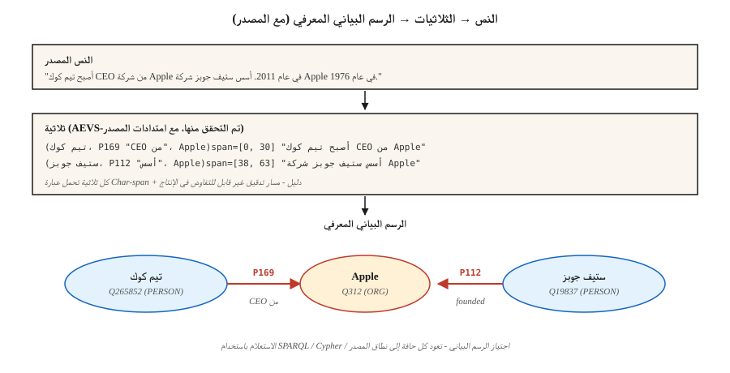

# استخراج العلاقات وبناء الرسم البياني المعرفي
> NER وجد الكيانات. الكيان الذي يربطهم. استخراج العلاقة يجد الحواف بينهما. الرسم البياني المعرفي هو مجموع nodes والحواف ومصدرها.
**النوع:** بناء
** اللغات: ** بايثون
**المتطلبات الأساسية:** المرحلة 5 · 06 (NER)، المرحلة 5 · 25 (ربط الكيان)
**الوقت:** ~60 دقيقة
## المشكلة
يقرأ أحد المحللين: "أصبح تيم كوك CEO لشركة Apple في عام 2011." أربع حقائق:
- __الكود_0__
- __الكود_1__
- __الكود_2__
- __الكود_3__
يقوم استخراج العلاقات (RE) بتحويل النص الحر إلى ثلاثية منظمة `(subject, relation, object)`. قم بالتجميع عبر المجموعة وسيكون لديك رسم بياني معرفي. قم بالتجميع والاستعلام وسيكون لديك أساس منطقي لـ RAG أو التحليلات أو عمليات تدقيق الامتثال.
مشكلة 2026: طلاب ماجستير إدارة الأعمال يستخرجون العلاقات بحماس. بحماس شديد. إنهم يهلوسون ثلاثية لا يدعمها النص المصدر. بدون مصدر، لا يمكنك التمييز بين الثلاثيات الحقيقية والخيال المعقول. إجابة 2026 هي AEVS نمط الربط والتحقق pipelines.
##المفهوم

**النموذج الثلاثي.** `(subject_entity, relation_type, object_entity)`. العلاقات تأتي من أنطولوجيا مغلقة (خصائص ويكي بيانات، FIBO، UMLS) أو مجموعة مفتوحة (نمط OpenIE، كل شيء مباح).
**ثلاث طرق للاستخراج.**
1. **تعتمد على القاعدة/النمط.** أنماط هيرست: "X مثل Y" → `(Y, isA, X)`. بالإضافة إلى التعبير العادي المصنوع يدويًا. هشة ودقيقة وقابلة للتفسير.
2. **المصنف الخاضع للإشراف.** في حالة ذكر كيانين في الجملة، توقع العلاقة من مجموعة ثابتة. تم التدريب في TACRED، ACE، KBP. المعيار 2015-2022.
3. **المولد LLM.** مطالبة النموذج بإصدار ثلاث مرات. يعمل خارج منطقة الجزاء. يحتاج إلى مصدر، أو يهلوس خردة ذات مظهر معقول.
**AEVS (ملحق التحقق من الاستخراج، 2026).** الإطار الحالي لتخفيف الهلوسة:
- **المرساة.** حدد كل نطاق كيان وامتداد عبارة العلاقة مع المواضع الدقيقة.
- **استخراج.** إنشاء ثلاثية مرتبطة بمسافات الارتساء.
- **تحقق.** قم بمطابقة كل عنصر ثلاثي مع النص المصدر؛ رفض أي شيء غير معتمد.
- **الملحق.** يضمن تمرير التغطية عدم إسقاط أي مدى مثبت.
الهلوسة تنخفض بشكل حاد. يتطلب المزيد من الحوسبة ولكنه قابل للتدقيق.
**المفاضلة بين الفتح والمغلق.**
- **الوجود المغلق.** قائمة الخصائص الثابتة (على سبيل المثال، أكثر من 11000 خاصية في ويكي بيانات). يمكن التنبؤ به. قابلة للاستعلام. من الصعب اختراعه.
- **فتح IE.** أي عبارة لفظية تصبح علاقة. تذكر عالية. دقة منخفضة. فوضوي للاستعلام.
عادةً ما يتم دمج رياض الأطفال في الإنتاج: فتح IE للاكتشاف، ثم تحديد العلاقات بشكل أساسي في علم الوجود المغلق قبل دمجها في الرسم البياني الرئيسي.
## بنائها
### الخطوة 1: الاستخراج على أساس النمط
```python
PATTERNS = [
    (r"(?P<s>[A-Z]\w+) (?:is|was) (?:a|an|the) (?P<o>[A-Z]?\w+)", "isA"),
    (r"(?P<s>[A-Z]\w+) (?:is|was) born in (?P<o>\w+)", "bornIn"),
    (r"(?P<s>[A-Z]\w+) works? (?:at|for) (?P<o>[A-Z]\w+)", "worksAt"),
    (r"(?P<s>[A-Z]\w+) founded (?P<o>[A-Z]\w+)", "founded"),
]
```

راجع `code/main.py` للاطلاع على مستخرج اللعبة الكامل. لا تزال أنماط Hearst تُشحن في خطوط pipe الخاصة بالمجال لأنها قابلة للتصحيح.
### الخطوة الثانية: تصنيف العلاقات الخاضعة للإشراف
```python
from transformers import AutoTokenizer, AutoModelForSequenceClassification

tok = AutoTokenizer.from_pretrained("Babelscape/rebel-large")
model = AutoModelForSequenceClassification.from_pretrained("Babelscape/rebel-large")

text = "Tim Cook was born in Alabama. He later became CEO of Apple."
encoded = tok(text, return_tensors="pt", truncation=True)
output = model.generate(**encoded, max_length=200)
triples = tok.batch_decode(output, skip_special_tokens=False)
```

REBEL عبارة عن مستخرج علاقات seq2seq: نص يدخل، يتضاعف ثلاث مرات، موجود بالفعل في معرفات خصائص ويكي بيانات. تم ضبطها بدقة على بيانات الإشراف البعيد. خط الأساس القياسي للأوزان المفتوحة.
### الخطوة 3: LLM-الاستخراج المطلوب مع التثبيت
```python
prompt = f"""Extract (subject, relation, object) triples from the text.
For each triple, include the exact character span in the source text.

Text: {text}

Output JSON:
[{{"subject": {{"text": "...", "span": [start, end]}},
   "relation": "...",
   "object": {{"text": "...", "span": [start, end]}}}}, ...]

Only include triples fully supported by the text. No inference beyond what is stated.
"""
```

تحقق من كل فترة تم إرجاعها مقابل المصدر. ارفض أي شيء حيث `text[start:end] != triple_entity`. هذه هي خطوة AEVS "التحقق" في شكلها البسيط.
### الخطوة 4: التصنيف الأساسي إلى علم الوجود المغلق
```python
RELATION_MAP = {
    "is the CEO of": "P169",       # "chief executive officer"
    "was born in":   "P19",         # "place of birth"
    "founded":        "P112",       # "founded by" (inverted subject/object)
    "works at":       "P108",       # "employer"
}


def canonicalize(relation):
    rel_low = relation.lower().strip()
    if rel_low in RELATION_MAP:
        return RELATION_MAP[rel_low]
    return None   # drop unmapped open relations or route to manual review
```

غالبًا ما يمثل تحديد المستوى القانوني 60-80٪ من الأعمال الهندسية. الميزانية لذلك.
### الخطوة 5: إنشاء رسم بياني صغير واستعلام
```python
triples = extract(text)
graph = {}
for s, r, o in triples:
    graph.setdefault(s, []).append((r, o))


def neighbors(node, relation=None):
    return [(r, o) for r, o in graph.get(node, []) if relation is None or r == relation]


print(neighbors("Tim Cook", relation="P108"))    # -> [(P108, Apple)]
```

هذه هي ذرة كل نظام RAG-over-KG. يمكنك قياسه باستخدام RDF مخازن ثلاثية (Blazegraph، Virtuoso)، أو الرسوم البيانية للخصائص (Neo4j)، أو مخازن الرسم البياني المعززة بالمتجهات.
## مطبات
- **المرجع قبل RE.** "لقد أسس شركة Apple" — RE يحتاج إلى معرفة من هو. قم بتشغيل coref أولاً (الدرس 24).
- **التحديد الأساسي للكيان.** يجب أن تتوافق "Apple Inc" و"Apple" مع نفس node. ربط الكيان أولاً (الدرس 25).
- **ثلاثيات هلوسة.** تنبعث LLMs ثلاث مرات لا يدعمها النص. فرض التحقق من النطاق.
- **انحراف تحديد العلاقة الأساسية.** علاقات IE المفتوحة غير متناسقة ("ولد في"، "جاء من"، "هو مواطن في"). قم بالطي إلى المعرفات الأساسية أو أن الرسم البياني غير قابل للاستعلام.
- **أخطاء زمنية.** "تيم كوك هو __المصطلح الرابع__ لشركة Apple" — صحيح الآن، وخاطئ في 2005. العديد من العلاقات مقيدة بزمن. استخدم المؤهلات (`P580` وقت البدء، `P582` وقت الانتهاء في ويكي بيانات).
- **النطاق غير متطابق.** REBEL تم تدريبه على ويكيبيديا. غالبًا ما يحتاج النص القانوني والطبي والعلمي إلى نماذج RE مضبوطة بدقة في المجال.
## استخدمه
مكدس 2026:
| الوضع | اختر |
|-----------|------|
| إنتاج سريع، المجال العام | REBEL أو LlamaPred مع تحديد قاعدة بيانات ويكي بيانات |
| مجال خاص (بيوميد، قانوني) | ضبط مجال نمط SciREX + علم الوجود المخصص |
| LLM- مخرجات مدققة ومطالبة | AEVS pipeline: المرساة ← الاستخراج ← التحقق ← الملحق |
| أخبار كبيرة الحجم IE | قائم على النمط + هجين خاضع للإشراف |
| بناء KG من الصفر | افتح IE + ممر التحديد اليدوي |
| مؤقت KG | استخرج باستخدام المؤهلات (وقت البدء/الانتهاء، نقطة زمنية) |
نمط التكامل: NER → coref → ربط الكيان → استخراج العلاقات → رسم الخرائط الأنطولوجية → تحميل الرسم البياني. كل مرحلة هي بوابة الجودة المحتملة.
## اشحنها
حفظ باسم `outputs/skill-re-designer.md`:
```markdown
---
name: re-designer
description: Design a relation extraction pipeline with provenance and canonicalization.
version: 1.0.0
phase: 5
lesson: 26
tags: [nlp, relation-extraction, knowledge-graph]
---

Given a corpus (domain, language, volume) and downstream use (KG-RAG, analytics, compliance), output:

1. Extractor. Pattern-based / supervised / LLM / AEVS hybrid. Reason tied to precision vs recall target.
2. Ontology. Closed property list (Wikidata / domain) or open IE with canonicalization pass.
3. Provenance. Every triple carries source char-span + doc id. Non-negotiable for audit.
4. Merge strategy. Canonical entity id + relation id + temporal qualifiers; dedup policy.
5. Evaluation. Precision / recall on 200 hand-labelled triples + hallucination-rate on LLM-extracted sample.

Refuse any LLM-based RE pipeline without span verification (source provenance). Refuse open-IE output flowing into a production graph without canonicalization. Flag pipelines with no temporal qualifier on time-bounded relations (employer, spouse, position).
```

## تمارين
1. **سهل.** قم بتشغيل مستخرج الأنماط في `code/main.py` على 5 جمل من المقالات الإخبارية. دقة الفحص اليدوي.
2. **متوسط.** استخدم REBEL (أو LLM صغيرًا) في نفس الجمل. قارن الثلاثي. أي مستخرج لديه دقة أعلى؟ استدعاء أعلى؟
3. **صعب.** أنشئ سطر AEVS pipeline: استخرج باستخدام LLM + تحقق من الامتدادات مقابل المصدر. قم بقياس معدل الهلوسة قبل وبعد خطوة التحقق في 50 جملة بأسلوب ويكيبيديا.
## المصطلحات الرئيسية
| مصطلح | ماذا يقول الناس | ماذا يعني في الواقع |
|------|-|--------------------------------------|
| ثلاثية | موضوع العلاقة كائن | `(s, r, o)` الصف الذي يمثل الوحدة الذرية لـ KG. |
| افتح IE | استخراج أي شيء | عبارات العلاقات ذات المفردات المفتوحة؛ استدعاء عالية، دقة منخفضة. |
| الأنطولوجيا المغلقة | مخطط ثابت | مجموعة محددة من أنواع العلاقات (Wikidata، UMLS، FIBO). |
| الكنسي | تطبيع كل شيء | قم بتعيين أسماء/علاقات الأسطح إلى المعرفات الأساسية. |
| __المصطلح_5__ | استخلاص مؤرض | مرساة-استخراج-التحقق-ملحق pipeline (2026). |
| المصدر | رابط المصدر الحقيقة | يحمل كل ثلاثي معرف مستند + نطاق char إلى مصدره. |
| الإشراف عن بعد | تسميات رخيصة | قم بمحاذاة النص مع KG الموجود لإنشاء بيانات التدريب. |
## مزيد من القراءة
- [Mintz et al. (2009). Distant supervision for relation extraction without labeled data](https://www.aclweb.org/anthology/P09-1113.pdf) — ورقة الإشراف البعيد.
- [Huguet Cabot, Navigli (2021). REBEL: Relation Extraction By End-to-end Language generation](https://aclanthology.org/2021.findings-emnlp.204.pdf) — seq2seq RE العمود الفقري.
- [Wadden et al. (2019). Entity, Relation, and Event Extraction with Contextualized Span Representations (DyGIE++)](https://arxiv.org/abs/1909.03546) — مشترك IE.
- [AEVS — Anchor-Extraction-Verification-Supplement framework](https://www.mdpi.com/2073-431X/15/3/178) — تصميم تخفيف الهلوسة 2026.
- [Wikidata SPARQL tutorial](https://www.wikidata.org/wiki/Wikidata:SPARQL_tutorial) — استعلامات الرسم البياني الأساسية.