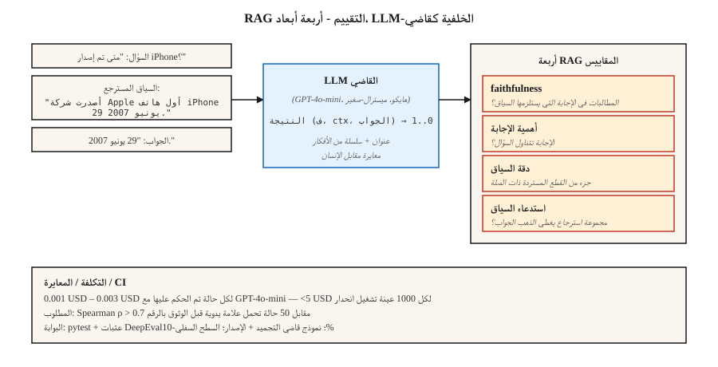

# LLM التقييم — RAGAS، DeepEval، G-Eval
> التطابق التام وF1 يفتقد التكافؤ الدلالي. المراجعة البشرية لا تتسع. LLM-كحكم هو إجابة الإنتاج - مع معايرة كافية للثقة في الرقم.
**النوع:** بناء
** اللغات: ** بايثون
**المتطلبات الأساسية:** المرحلة 5 · 13 (الإجابة على الأسئلة)، المرحلة 5 · 14 (استرجاع المعلومات)
**الوقت:** ~75 دقيقة
## المشكلة
يجيب نظام RAG الخاص بك: "29 يونيو 2007."
المرجع الذهبي هو: "29 يونيو 2007".
درجات المطابقة التامة 0. F1 درجات ~75%. الإنسان سوف يسجل 100٪.
الآن اضرب في 10000 حالة اختبار. اضرب مرة أخرى بكل تغيير في المسترد أو التقطيع أو المطالبة أو النموذج. أنت بحاجة إلى مُقيِّم يفهم المعنى، ويعمل بثمن بخس على نطاق واسع، ولا يكذب بشأن الانحدارات، ويبرز أنماط الفشل الصحيحة.
2026 لديه ثلاثة أطر تمتلك هذه المشكلة.
- **RAGAS.** تقييم الجيل المعزز للاسترجاع. أربعة مقاييس RAG (الإخلاص، وملاءمة الإجابة، ودقة السياق، واستدعاء السياق) مع NLI + LLM-الواجهات الخلفية للحكم. مدعومة بالأبحاث، وخفيفة الوزن.
- **DeepEval.** Pytest لـ LLMs. G-التقييم، وإكمال المهام، والهلوسة، ومقاييس التحيز. CI/CD-أصلي.
- **G-Eval.** طريقة (ومقياس DeepEval): LLM-كقاضي بسلسلة أفكار ومعايير مخصصة، درجة 0-1.
يعتمد الثلاثة جميعًا على LLM كقاضي. يبني هذا الدرس حدسًا للطريقة وطبقة الثقة المحيطة بها.
##المفهوم

**LLM-as-حكم.** استبدل المقياس الثابت بـ LLM الذي يسجل النتائج وفقًا لقواعد التقييم. بالنظر إلى `(query, context, answer)`، اطلب من القاضي LLM: "النتيجة 0-1 على الإخلاص." إرجاع النتيجة.
لماذا يعمل: تقريب LLMs الحكم البشري بجزء صغير من التكلفة. GPT-4o-mini بسعر ~0.003 USD لكل حالة تم تسجيلها يتيح تشغيل تقييم الانحدار المكون من 1000 عينة بأقل من 5 USD.
لماذا يفشل بصمت:
1. **تحيز القاضي.** يفضل الحكام الإجابات الأطول، والإجابات من مجموعتهم النموذجية، والإجابات التي تتوافق مع الأسلوب الفوري.
2. **JSON فشل التحليل.** سيئ JSON → نتيجة NaN → تم استبعاده بصمت من المجموع. RAGAS يعرف المستخدمون هذا الألم. بوابة مع محاولة/باستثناء + وضع الفشل الصريح.
3. **الانتقال إلى إصدارات النماذج.** تؤدي ترقية القاضي إلى تغيير كل مقياس. نموذج قاضي التجميد + النسخة.
**المصطلح RAG الرابع.**
| متري | سؤال | الخلفية |
|--------|---------|---------|
| الإخلاص | هل يأتي كل ادعاء في الإجابة من السياق المسترجع؟ | NLI الاستحقاق القائم على |
| صلة الإجابة | هل الجواب يخاطب السؤال؟ | توليد أسئلة افتراضية من الإجابة؛ مقارنة بالسؤال الحقيقي |
| دقة السياق | من بين القطع المستردة، ما هي الأجزاء ذات الصلة؟ | LLM-القاضي |
| استدعاء السياق | هل أعاد الاسترجاع كل ما هو مطلوب؟ | LLM-القاضي ضد إجابة الذهب |
**G-Eval.** حدد معيارًا مخصصًا: "هل استشهدت الإجابة بالمصدر الصحيح؟" يتوسع إطار العمل تلقائيًا إلى خطوات تقييم سلسلة الأفكار، ثم يسجل 0-1. مناسب لأبعاد الجودة الخاصة بالمجال RAGAS لا يغطيها.
**المعايرة.** لا تثق أبدًا في نتيجة القاضي الأولية حتى تحصل على ارتباط مع التصنيفات البشرية. قم بتشغيل 100 مثال مسمى يدويًا. مؤامرة القاضي مقابل الإنسان. حساب سبيرمان رو. إذا كانت قيمة rho < 0.7، فإن عنوان القاضي الخاص بك بحاجة إلى العمل.
## بنائها
### الخطوة 1: الإخلاص مع NLI (نمط RAGAS)
```python
from typing import Callable
from transformers import pipeline

nli = pipeline("text-classification",
               model="MoritzLaurer/DeBERTa-v3-large-mnli-fever-anli-ling-wanli",
               top_k=None)

# `llm` is any callable: prompt str -> generated str.
# Example: llm = lambda p: client.messages.create(model="claude-haiku-4-5", ...).content[0].text
LLM = Callable[[str], str]


def atomic_claims(answer: str, llm: LLM) -> list[str]:
    prompt = f"""Break this answer into simple factual claims (one per line):
{answer}
"""
    return llm(prompt).splitlines()


def faithfulness(answer: str, context: str, llm: LLM) -> float:
    claims = atomic_claims(answer, llm)
    if not claims:
        return 0.0
    supported = 0
    for claim in claims:
        result = nli({"text": context, "text_pair": claim})[0]
        entail = next((s for s in result if s["label"] == "entailment"), None)
        if entail and entail["score"] > 0.5:
            supported += 1
    return supported / len(claims)
```

قم بتحليل الإجابة إلى ادعاءات ذرية. NLI-تحقق من كل مطالبة مقابل السياق المسترد. الإخلاص = الكسر المعتمد.
### الخطوة 2: الإجابة على الصلة
```python
import numpy as np
from sentence_transformers import SentenceTransformer

# encoder: any model implementing .encode(texts, normalize_embeddings=True) -> ndarray
# e.g., encoder = SentenceTransformer("BAAI/bge-small-en-v1.5")

def answer_relevance(question: str, answer: str, encoder, llm: LLM, n: int = 3) -> float:
    prompt = f"Write {n} questions this answer could be the answer to:\n{answer}"
    generated = [line for line in llm(prompt).splitlines() if line.strip()][:n]
    if not generated:
        return 0.0
    q_emb = np.asarray(encoder.encode([question], normalize_embeddings=True)[0])
    g_embs = np.asarray(encoder.encode(generated, normalize_embeddings=True))
    sims = [float(q_emb @ g_emb) for g_emb in g_embs]
    return sum(sims) / len(sims)
```

إذا كانت الإجابة تتضمن أسئلة مختلفة عن تلك المطروحة، تنخفض الصلة بالموضوع.
### الخطوة 3: مقياس G-Eval المخصص
```python
from deepeval.metrics import GEval
from deepeval.test_case import LLMTestCaseParams, LLMTestCase

metric = GEval(
    name="Correctness",
    criteria="The answer should be factually accurate and match the expected output.",
    evaluation_steps=[
        "Read the expected output.",
        "Read the actual output.",
        "List factual claims in the actual output.",
        "For each claim, mark supported or unsupported by the expected output.",
        "Return score = fraction supported.",
    ],
    evaluation_params=[LLMTestCaseParams.INPUT, LLMTestCaseParams.ACTUAL_OUTPUT, LLMTestCaseParams.EXPECTED_OUTPUT],
)

test = LLMTestCase(input="When was the first iPhone released?",
                   actual_output="June 29th, 2007.",
                   expected_output="June 29, 2007.")
metric.measure(test)
print(metric.score, metric.reason)
```

خطوات التقييم هي عنوان التقييم. تعتبر الخطوات الصريحة أكثر استقرارًا من المطالبات الضمنية "النتيجة 0-1".
### الخطوة 4: بوابة CI
```python
import deepeval
from deepeval.metrics import FaithfulnessMetric, ContextualRelevancyMetric


def test_rag_system():
    cases = load_regression_cases()
    faith = FaithfulnessMetric(threshold=0.85)
    rel = ContextualRelevancyMetric(threshold=0.7)
    for case in cases:
        faith.measure(case)
        assert faith.score >= 0.85, f"faithfulness regression on {case.id}"
        rel.measure(case)
        assert rel.score >= 0.7, f"relevancy regression on {case.id}"
```

يتم الشحن كملف pytest. تشغيل في كل PR. كتلة يدمج على الانحدارات.
### الخطوة 5: تقييم اللعبة من الصفر
انظر `code/main.py`. تقديرات Stdlib التقريبية فقط للإخلاص (تداخل مطالبات الإجابة مع السياق) والملاءمة (تداخل رموز الإجابة مع رموز الأسئلة). ليس الإنتاج. يظهر الشكل.
## مطبات
- **لا توجد معايرة.** القاضي الذي لديه ارتباط 0.3 بالتسميات البشرية هو ضوضاء. تتطلب تشغيل المعايرة قبل الشحن.
- **التقييم الذاتي.** استخدام نفس LLM للإنشاء والحكم يؤدي إلى تضخيم النتائج بنسبة 10-20%. استخدم عائلة نموذجية مختلفة للقاضي.
- **التحيز الموضعي في التحكيم الثنائي.** يفضل الحكام الخيار الأول المقدم. قم دائمًا بترتيب الترتيب بشكل عشوائي وتشغيل كليهما.
- **المجموع الخام يخفي حالات الفشل.** متوسط ​​النتيجة 0.85 غالبًا ما يخفي 5% من حالات الفشل الكارثية. قم دائمًا بفحص الكمية السفلية.
- **تعفن مجموعة البيانات الذهبية.** مجموعات التقييم غير المحولة التي تنجرف مع مرور الوقت تنقطع المقارنة الطويلة gitudinal. ضع علامة على مجموعة البيانات مع كل تغيير.
- **LLM التكلفة.** على نطاق واسع، تهيمن مكالمات القضاة على التكلفة. استخدم النموذج الأرخص الذي يلبي عتبة المعايرة. GPT-4o-mini، كلود هايكو، ميسترال-صغير.
## استخدمه
مكدس 2026:
| حالة الاستخدام | الإطار |
|---------|---------|
| RAG مراقبة الجودة | RAGAS (4 مقاييس) |
| CI/CD بوابات الانحدار | DeepEval + pytest |
| معايير المجال المخصص | G-Eval داخل DeepEval |
| مراقبة حركة المرور المباشرة عبر الإنترنت | RAGAS مع الوضع الخالي من المراجع |
| فحوصات فورية بشرية في الحلقة | LangSmith أو Phoenix مع التعليق التوضيحي UI |
| الفريق الأحمر / تقييم السلامة | Promptfoo + DeepEval |
المكدس النموذجي: RAGAS للمراقبة، DeepEval لـ CI، G-Eval للأبعاد الجديدة. تشغيل الثلاثة؛ إنهم يختلفون بشكل مفيد.
## اشحنها
حفظ باسم `outputs/skill-eval-architect.md`:
```markdown
---
name: eval-architect
description: Design an LLM evaluation plan with calibrated judge and CI gates.
version: 1.0.0
phase: 5
lesson: 27
tags: [nlp, evaluation, rag]
---

Given a use case (RAG / agent / generative task), output:

1. Metrics. Faithfulness / relevance / context-precision / context-recall + any custom G-Eval metrics with criteria.
2. Judge model. Named model + version, rationale for cost vs accuracy.
3. Calibration. Hand-labeled set size, target Spearman rho vs human > 0.7.
4. Dataset versioning. Tag strategy, change log, stratification.
5. CI gate. Thresholds per metric, regression-window logic, bottom-quantile alert.

Refuse to rely on a judge untested against ≥50 human-labeled examples. Refuse self-evaluation (same model generates + judges). Refuse aggregate-only reporting without bottom-10% surfacing. Flag any pipeline where judge upgrade lands without parallel baseline eval.
```

## تمارين
1. **سهل.** استخدم RAGAS في 10 أمثلة RAG تحتوي على هلاوس معروفة. تحقق من أن مقياس الإخلاص يلتقط كل واحد.
2. **متوسط.** قم بتسمية اليد 50 QA الإجابات 0-1 للتأكد من صحتها. سجل باستخدام G-Eval. قياس سبيرمان رو بين القاضي والإنسان.
3. **صعب.** أنشئ بوابة pytest CI باستخدام DeepEval. التراجع عمدا المسترد. التحقق من فشل البوابة. أضف تنبيهًا للكمية السفلية عبر فحص العتبة على أقل 10%.
## المصطلحات الرئيسية
| مصطلح | ماذا يقول الناس | ماذا يعني في الواقع |
|------|-|--------------------------------------|
| LLM-كقاضي | التسجيل باستخدام LLM | اطلب من نموذج القاضي تسجيل النتائج من 0 إلى 1 وفقًا لقاعدة التقييم. |
| __المصطلح_2__ | مكتبة المقاييس RAG | إطار تقييم مفتوح المصدر يتضمن 4 مقاييس RAG خالية من المراجع. |
| الإخلاص | هل الجواب على الارض؟ | جزء من مطالبات الإجابة التي يستلزمها السياق المسترجع. |
| دقة السياق | هل كانت القطع المستردة ذات صلة؟ | جزء من قطع top-K التي تهم بالفعل. |
| استدعاء السياق | هل وجد الاسترجاع كل شيء؟ | جزء من مطالبات الإجابة الذهبية المدعومة بالقطع المستردة. |
| G-التقييم | مخصص LLM القاضي | عنوان التقييم + خطوات تقييم سلسلة الأفكار + نتيجة 0-1. |
| المعايرة | ثق ولكن تحقق | علاقة سبيرمان بين درجة القاضي ودرجة الإنسان. |
## مزيد من القراءة
- [Es et al. (2023). RAGAS: Automated Evaluation of Retrieval Augmented Generation](https://arxiv.org/abs/2309.15217) — الورقة RAGAS.
- [Liu et al. (2023). G-Eval: NLG Evaluation using GPT-4 with Better Human Alignment](https://arxiv.org/abs/2303.16634) — ورقة G-Eval.
- [DeepEval docs](https://deepeval.com/docs/metrics-introduction) — مكدس الإنتاج المفتوح.
- [Zheng et al. (2023). Judging LLM-as-a-Judge with MT-Bench and Chatbot Arena](https://arxiv.org/abs/2306.05685) — التحيزات، والمعايرة، والحدود.
- [MLflow GenAI Scorer](https://mlflow.org/blog/third-party-scorers) — إطار عمل موحد يدمج RAGAS، DeepEval، Phoenix.