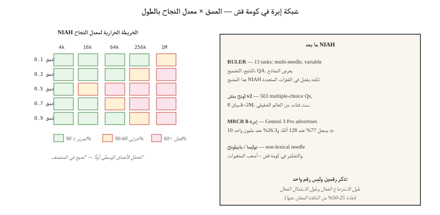

# تقييم السياق الطويل — NIAH، RULER، LongBench، MRCR
> يعلن Gemini 3 Pro عن 10 ملايين رمز مميز للسياق. عند استخدام مليون رمز، تنخفض نسبة 8 إبر MRCR إلى 26.3%. المعلن عنها ≠ صالحة للاستعمال. يخبرك تقييم السياق الطويل بالقدرة الفعلية للنموذج الذي تقوم بالشحن عليه.
**النوع:** تعلم
** اللغات: ** بايثون
**المتطلبات الأساسية:** المرحلة 5 · 13 (الإجابة على الأسئلة)، المرحلة 5 · 23 (استراتيجيات التقطيع)
**الوقت:** ~60 دقيقة
## المشكلة
لديك عقد من 200 صفحة. يدعي النموذج سياق 1M-token. تلصق العقد فيه وتسأل: "ما هو شرط الإنهاء؟" يجيب النموذج - ولكن الإجابات من صفحة الغلاف لأن شرط الإنهاء يصل إلى 120 ألف رمز، وهو ما يتجاوز المكان الذي يحضر فيه النموذج فعليًا.
هذه هي فجوة القدرة على السياق لعام 2026. تقول أوراق المواصفات 1M أو 10M. يقول الواقع أن 60-70% منها قابلة للاستخدام، و"صالحة للاستخدام" تعتمد على المهمة.
- **الاسترجاع (إبرة واحدة في كومة قش):** شبه مثالي حتى الحد الأقصى المعلن عنه في النماذج الحدودية.
- **القفزات المتعددة / التجميع:** يتدهور بشكل حاد بعد حوالي 128 كيلو بايت في معظم الطرز.
- **الاستدلال على الحقائق المتفرقة:** أول مهمة تفشل.
ويقيس التقييم طويل السياق هذه المحاور. يسمي هذا الدرس المعايير، وما يقيسه كل منها فعليًا، وكيفية إنشاء اختبار إبرة مخصص لنطاقك.
##المفهوم

**إبرة في كومة قش (NIAH, 2023).** ضع حقيقة ("الكلمة السحرية هي الأناناس") على عمق متحكم فيه في سياق طويل. اطلب من النموذج استعادته. عمق الاجتياح × الطول. المعيار الأصلي طويل السياق. النماذج الحدودية تشبع الآن هذا؛ وهو خط أساس ضروري ولكنه غير كاف.
**RULER (Nvidia, 2024).** 13 نوعًا من المهام عبر 4 فئات: الاسترجاع (فردي/متعدد المفاتيح/متعدد القيم)، والتتبع متعدد القفزات (التتبع المتغير)، والتجميع (تكرار الكلمات الشائعة)، QA. طول السياق القابل للتكوين (4K إلى 128K+). يكشف عن نماذج مشبعة NIAH لكنها تفشل في القفزات المتعددة. في إصدار 2024، فقط نصف النماذج الـ 17 التي تطالب بسياق 32 كيلو بايت + حافظت على الجودة عند 32 كيلو بايت.
**LongBench v2 (2024).** 503 أسئلة متعددة الاختيارات، وسياقات الكلمات من 8 كيلو إلى 2 مليون، وست فئات مهام: مستند واحد QA، متعدد المستندات QA، التعلم الطويل في السياق، الحوار الطويل، مستودع التعليمات البرمجية، البيانات المنظمة الطويلة. معيار الإنتاج للسلوك طويل السياق في العالم الحقيقي.
**MRCR (دقة المرجع متعدد الجولات).** المرجع الأساسي متعدد المنعطفات على نطاق واسع. 8 إبر، 24 إبرة، 100 إبرة. يكشف عدد الحقائق التي يمكن للنموذج أن يتلاعب بها قبل أن يتدهور الاهتمام.
**NoLiMa.** "إبرة غير معجمية". لا يوجد تداخل حرفي بين الإبرة والاستعلام؛ يتطلب الاسترجاع خطوة واحدة من التفكير الدلالي. أصعب من NIAH.
**HELMET.** يربط العديد من المستندات ويطرح سؤالاً من أي شخص. اختبارات الاهتمام الانتقائي.
**BABILong.** يدمج سلاسل تفكير bAbI داخل أكوام قش غير ذات صلة. اختبارات التفكير في كومة قش، وليس الاسترجاع فقط.
### ما يجب الإبلاغ عنه فعليًا
- **نافذة السياق المعلن عنها.** رقم ورقة المواصفات.
- **مدة الاسترجاع الفعالة.** NIAH تجاوز حد معين (على سبيل المثال، 90%).
- **طول التفكير الفعال.** تمر القفزات المتعددة أو التجميع عند تلك العتبة.
- **منحنى التدهور.** الدقة مقابل طول السياق، المرسوم حسب نوع المهمة.
رقمان لورقة المواصفات الخاصة بك: فعال في الاسترجاع وفعال في التفكير. عادة ما يكون المنطق الفعال 25-50٪ من النافذة المعلن عنها.
## بنائها
### الخطوة 1: NIAH مخصص لنطاقك
انظر `code/main.py`. الهيكل العظمي:
```python
def build_haystack(filler_text, needle, depth_ratio, total_tokens):
    if not (0.0 <= depth_ratio <= 1.0):
        raise ValueError(f"depth_ratio must be in [0, 1], got {depth_ratio}")
    if total_tokens <= 0:
        raise ValueError(f"total_tokens must be positive, got {total_tokens}")

    filler_tokens = tokenize(filler_text)
    needle_tokens = tokenize(needle)
    if not filler_tokens:
        raise ValueError("filler_text produced no tokens")

    # Repeat filler until long enough to fill the haystack body.
    body_len = max(total_tokens - len(needle_tokens), 0)
    while len(filler_tokens) < body_len:
        filler_tokens = filler_tokens + filler_tokens
    filler_tokens = filler_tokens[:body_len]

    insert_at = min(int(body_len * depth_ratio), body_len)
    haystack = filler_tokens[:insert_at] + needle_tokens + filler_tokens[insert_at:]
    return " ".join(haystack)


def score_niah(model, haystack, question, expected):
    answer = model.complete(f"Context: {haystack}\nQ: {question}\nA:", max_tokens=50)
    return 1 if expected.lower() in answer.lower() else 0
```

مسح `depth_ratio` ∈ {0, 0.25, 0.5, 0.75, 1.0} × `total_tokens` ∈ {1k, 4k, 16k, 64k}. ارسم الخريطة الحرارية. هذه هي بطاقة NIAH لنموذجك المستهدف.
### الخطوة الثانية: نوع متعدد الإبر
```python
def build_multi_needle(filler, needles, total_tokens):
    depths = [0.1, 0.4, 0.7]
    chunks = [filler[:int(total_tokens * 0.1)]]
    for depth, needle in zip(depths, needles):
        chunks.append(needle)
        next_chunk = filler[int(total_tokens * depth): int(total_tokens * (depth + 0.3))]
        chunks.append(next_chunk)
    return " ".join(chunks)
```

أسئلة مثل "ما هي الكلمات السحرية الثلاث؟" تتطلب استرداد الثلاثة. إن نجاح الإبرة الواحدة لا يتنبأ بنجاح الإبرة المتعددة.
### الخطوة 3: تتبع المتغير متعدد القفزات (نمط RULER)
```python
haystack = """X1 = 42. ... (filler) ... X2 = X1 + 10. ... (filler) ... X3 = X2 * 2."""
question = "What is X3?"
```

تتطلب الإجابة تسلسل ثلاث مهام. غالبًا ما تنخفض دقة النماذج الحدودية التي تبلغ دقتها 128 كيلو إلى 50-70% هنا.
### الخطوة 4: LongBench v2 على مجموعتك
```python
from datasets import load_dataset
longbench = load_dataset("THUDM/LongBench-v2")

def eval_model_on_longbench(model, subset="single-doc-qa"):
    tasks = [x for x in longbench["test"] if x["task"] == subset]
    correct = 0
    for x in tasks:
        answer = model.complete(x["context"] + "\n\nQ: " + x["question"], max_tokens=20)
        if normalize(answer) == normalize(x["answer"]):
            correct += 1
    return correct / len(tasks)
```

تقرير دقة كل فئة. تخفي الدرجات الإجمالية الاختلافات الكبيرة على مستوى المهمة.
## مطبات
- **NIAH - تقييم فقط.** إن اجتياز NIAH عند مليون رمز مميز لا يعني شيئًا عن القفزات المتعددة. قم دائمًا بتشغيل RULER أو اختبار مخصص متعدد القفزات.
- **أخذ عينات من العمق الموحد.** تختبر العديد من التطبيقات العمق=0.5 فقط. عمق الاختبار = 0، 0.25، 0.5، 0.75، 1.0 - تأثير "الضياع في المنتصف" حقيقي.
- **تداخل معجمي مع الحشو.** إذا كانت الإبرة تشترك في الكلمات الرئيسية مع الحشو، يصبح الاسترجاع أمرًا تافهًا. استخدم الإبر غير المتداخلة على طراز NoLiMa.
- **تجاهل زمن الاستجابة.** تستغرق مطالبات الرمز المميز 1M من 30 إلى 120 ثانية للتعبئة المسبقة. قم بقياس الوقت حتى أول رمز مميز إلى جانب الدقة.
- **الأرقام التي أبلغ عنها البائعون ذاتيًا.** OpenAI، ينشر كل من Google وAnthropic نتائجهم الخاصة. قم دائمًا بإعادة التشغيل بشكل مستقل وفقًا لحالة الاستخدام الخاصة بك.
## استخدمه
مكدس 2026:
| الوضع | المعيار |
|-----------|-----------|
| فحص سريع للسلامة | مخصص NIAH بـ 3 أعماق × 3 أطوال |
| اختيار النموذج للإنتاج | RULER (13 مهمة) بالطول المستهدف |
| جودة QA في العالم الحقيقي | LongBench v2 Single-doc-QA مجموعة فرعية |
| المنطق متعدد القفزات | BABIتتبع متغير طويل أو مخصص |
| محادثة / حوار | MRCR 8- إبرة بالطول المستهدف |
| انحدار ترقية النموذج | تم إصلاح الحزام NIAH + RULER داخليًا، ويعمل على كل طراز جديد |
القاعدة الأساسية للإنتاج: لا تثق مطلقًا بنافذة سياق حتى يكون لديك NIAH + مهمة استدلال واحدة بالطول الذي تريده.
## اشحنها
حفظ باسم `outputs/skill-long-context-eval.md`:
```markdown
---
name: long-context-eval
description: Design a long-context evaluation battery for a given model and use case.
version: 1.0.0
phase: 5
lesson: 28
tags: [nlp, long-context, evaluation]
---

Given a target model, target context length, and use case, output:

1. Tests. NIAH depth × length grid; RULER multi-hop; custom domain task.
2. Sampling. Depths 0, 0.25, 0.5, 0.75, 1.0 at each length.
3. Metrics. Retrieval pass rate; reasoning pass rate; time-to-first-token; cost-per-query.
4. Cutoff. Effective retrieval length (90% pass) and effective reasoning length (70% pass). Report both.
5. Regression. Fixed harness, rerun on every model upgrade, surface deltas.

Refuse to trust a context window from the model card alone. Refuse NIAH-only evaluation for any multi-hop workload. Refuse vendor self-reported long-context scores as independent evidence.
```

## تمارين
1. **سهل.** أنشئ NIAH بثلاثة أعماق (0.25، 0.5، 0.75) × 3 أطوال (1k، 4k، 16k). تشغيل على أي نموذج. رسم معدل النجاح كخريطة حرارية 3 × 3.
2. **متوسط.** أضف متغيرًا مكونًا من 3 إبر. قياس استرجاع كل 3 في كل طول. قارن بمعدل النجاح بإبرة واحدة بنفس الطول.
3. **صعب.** أنشئ مهمة تتبع متغير (X1 → X2 → X3، مع 3 قفزات) مضمنة في 64 كيلو بايت من الحشو. قياس الدقة عبر 3 نماذج حدودية. قم بالإبلاغ عن طول الاستدلال الفعال لكل نموذج.
## المصطلحات الرئيسية
| مصطلح | ماذا يقول الناس | ماذا يعني في الواقع |
|------|-|--------------------------------------|
| NIAH | إبرة في كومة قش | ازرع حقيقة في مادة الحشو، واطلب من العارضة استعادتها. |
| __المصطلح_1__ | NIAH على المنشطات | 13 نوعًا من المهام عبر الاسترجاع / القفزات المتعددة / التجميع / QA. |
| السياق الفعال | القدرة الحقيقية | الطول الذي لا تزال الدقة عنده أعلى من العتبة. |
| ضائع في المنتصف | انحياز العمق | لا تهتم النماذج بالمحتوى في منتصف المدخلات الطويلة. |
| إبرة متعددة | حقائق كثيرة في وقت واحد | نباتات متعددة؛ اختبارات شعوذة الانتباه، وليس الاسترجاع وحده. |
| MRCR | قلب متعدد الجولة | 8 أو 24 أو 100 إبرة؛ يعرض تشبع الاهتمام. |
| نوليما | إبرة غير معجمية | الإبرة والاستعلام لا يتشاركان في أي رموز حرفية؛ يتطلب المنطق. |
## مزيد من القراءة
- [Kamradt (2023). Needle in a Haystack analysis](https://github.com/gkamradt/LLMTest_NeedleInAHaystack) — الريبو الأصلي NIAH.
- [Hsieh et al. (2024). RULER: What's the Real Context Size of Your Long-Context LMs?](https://arxiv.org/abs/2404.06654) — المعيار متعدد المهام.
- [Bai et al. (2024). LongBench v2](https://arxiv.org/abs/2412.15204) — تقييم السياق الطويل في العالم الحقيقي.
- [Modarressi et al. (2024). NoLiMa: Non-lexical needles](https://arxiv.org/abs/2404.06666) — إبر أصعب.
- [Kuratov et al. (2024). BABILong](https://arxiv.org/abs/2406.10149) — التفكير في كومة قش.
- [Liu et al. (2024). Lost in the Middle: How Language Models Use Long Contexts](https://arxiv.org/abs/2307.03172) — ورقة تحيز العمق.