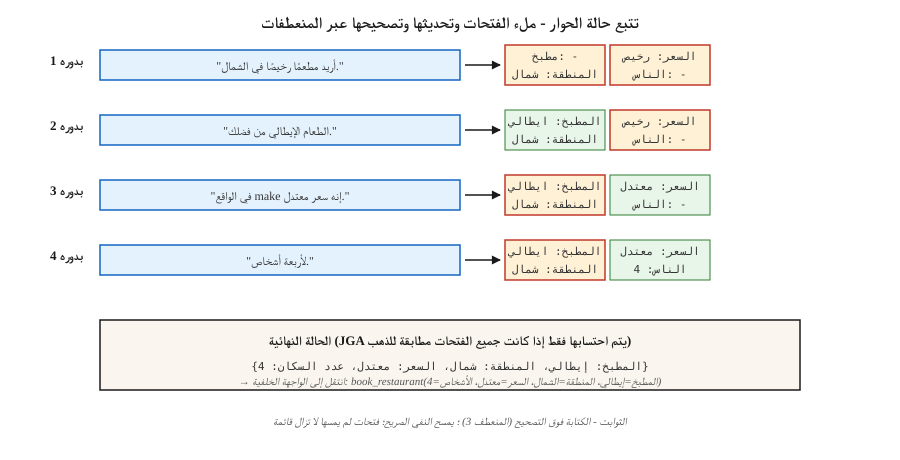

# تتبع حالة الحوار
> "أريد مطعمًا رخيصًا في الشمال... في الواقع make معتدل... وأضف الإيطالية." ثلاث دورات، وثلاثة تحديثات للحالة. DST يحافظ على مزامنة قيمة الفتحة حتى يعمل الحجز.
**النوع:** بناء
** اللغات: ** بايثون
**المتطلبات الأساسية:** المرحلة 5 · 17 (روبوتات الدردشة)، المرحلة 5 · 20 (المخرجات المنظمة)
**الوقت:** ~75 دقيقة
## المشكلة
في نظام الحوار الموجه نحو المهام، يتم ترميز هدف المستخدم كمجموعة من أزواج قيمة الفتحة: `{cuisine: italian, area: north, price: moderate}`. يمكن لكل مستخدم إضافة فتحة أو تغييرها أو إزالتها. يجب أن يقرأ النظام المحادثة بأكملها ويخرج الحالة الحالية بشكل صحيح.
إذا أخطأت في تحديد مكان واحد، فسيقوم النظام بحجز المطعم الخطأ، أو جدولة رحلة طيران خاطئة، أو تحصيل الرسوم من البطاقة الخطأ. DST هو المفصل بين ما قاله المستخدم وما تنفذه الواجهة الخلفية.
لماذا لا يزال الأمر مهمًا في عام 2026 على الرغم من ماجستير إدارة الأعمال:
- تتطلب المجالات الحساسة للامتثال (الخدمات المصرفية والرعاية الصحية وحجز شركات الطيران) قيمًا محددة للفتحات، وليس إنشاء نموذج حر.
- لا يزال وكلاء استخدام الأدوات بحاجة إلى تحليل الفتحة قبل الاتصال بواجهات برمجة التطبيقات.
- التصحيح المتعدد المنعطفات أصعب مما يبدو: "في الواقع لا، make يوم الخميس."
خط pipeline الحديث: مفاهيم DST الكلاسيكية + أدوات الاستخلاص LLM + حواجز حماية المخرجات المنظمة.
##المفهوم

**هيكل المهمة.** يحدد المخطط النطاقات (المطعم، الفندق، سيارة الأجرة) وفتحاتها (المطبخ، المنطقة، السعر، الأشخاص). يمكن أن تكون كل فتحة فارغة، أو مملوءة بقيمة من مجموعة مغلقة (السعر: {رخيص، متوسط، باهظ الثمن})، أو بقيمة حرة (الاسم: "The Copper Kettle").
**صيغتان DST.**
- **التصنيف.** لكل زوج (فتحة، قيمة_مرشح)، توقع نعم/لا. يعمل لفتحات المفردات المغلقة. القياسية قبل عام 2020
- **الجيل.** في ضوء الحوار، قم بإنشاء قيم الفتحة كنص حر. يعمل لفتحات المفردات المفتوحة. الافتراضي الحديث
**المقياس.** دقة الهدف المشترك (JGA) — جزء اللفات حيث تكون *كل* فتحة صحيحة. كل شيء أو لا شيء. تتصدر لوحة المتصدرين MultiWOZ 2.4 حوالي 83٪ في عام 2026.
**المباني.**
1. ** يستند إلى القواعد (التعبير العادي + الكلمة الرئيسية). ** خط أساس قوي للنطاقات الضيقة. قابل للتصحيح.
2. **TripPy / BERT-DST.** إنشاء قائم على النسخ بتشفير BERT. معيار ما قبل LLM.
3. **LDST (LLaMA + LoRA).** تم ضبط التعليمات LLM مع المطالبة بفتحة المجال. يصل إلى جودة مستوى ChatGPT على MultiWOZ 2.4.
4. **خالية من الوجود (2024–26).** تخطي المخطط؛ إنشاء أسماء وقيم الفتحات مباشرة. يتعامل مع المجالات المفتوحة.
5. **موجه + إخراج منظم (2024–26).** LLM مع مخطط Pydantic + فك تشفير مقيد. 5 أسطر من التعليمات البرمجية، جاهزة للإنتاج.
### أوضاع الفشل الكلاسيكية
- **المرجع المشترك عبر المنعطفات.** "دعونا نبقى مع الخيار الأول." يحتاج إلى حل الخيار الذي.
- **الكتابة الزائدة مقابل الإلحاق.** يقول المستخدم "أضف اللغة الإيطالية". هل تستبدل المطبخ أم الإلحاق؟
- **التأكيدات الضمنية.** "OK رائع" — هل تم قبول الحجز المعروض؟
- **تصحيح.** "في الواقع make الساعة 7 مساءً." يجب تحديث الوقت دون مسح فتحات أخرى.
- **إشارة إلى كلام النظام السابق.** "نعم، هذا." أي "ذلك"؟
## بنائها
### الخطوة 1: مستخرج الفتحات المستند إلى القواعد
انظر `code/main.py`. تغطي قواميس Regex + المرادفة 70% من الألفاظ الأساسية في المجالات الضيقة:
```python
CUISINE_SYNONYMS = {
    "italian": ["italian", "pasta", "pizza", "italy"],
    "chinese": ["chinese", "chow mein", "noodles"],
}


def extract_cuisine(utterance):
    for canonical, synonyms in CUISINE_SYNONYMS.items():
        if any(syn in utterance.lower() for syn in synonyms):
            return canonical
    return None
```

هشة خارج المفردات الأساسية. يعمل لتأكيدات الفتحة الحتمية.
### الخطوة 2: حلقة تحديث الحالة
```python
def update_state(state, utterance):
    new_state = dict(state)
    for slot, extractor in SLOT_EXTRACTORS.items():
        value = extractor(utterance)
        if value is not None:
            new_state[slot] = value
    for slot in NEGATION_CLEARS:
        if is_negated(utterance, slot):
            new_state[slot] = None
    return new_state
```

ثلاثة الثوابت:
- لا تقم مطلقًا بإعادة ضبط الفتحة التي لم يلمسها المستخدم.
- النفي الصريح ("لا تهتم بالمطبخ") يجب أن يكون واضحا.
- تصحيح المستخدم ("في الواقع...") يجب أن يُستبدل، وليس الإلحاق.
### الخطوة 3: LLM المستندة إلى DST مع مخرجات منظمة
```python
from pydantic import BaseModel
from typing import Literal, Optional
import instructor

class RestaurantState(BaseModel):
    cuisine: Optional[Literal["italian", "chinese", "indian", "thai", "any"]] = None
    area: Optional[Literal["north", "south", "east", "west", "center"]] = None
    price: Optional[Literal["cheap", "moderate", "expensive"]] = None
    people: Optional[int] = None
    day: Optional[str] = None


def llm_dst(history, llm):
    prompt = f"""You track the slot values of a restaurant booking across turns.
Dialogue so far:
{render(history)}

Update the state based on the latest user turn. Output only the JSON state."""
    return llm(prompt, response_model=RestaurantState)
```

يضمن Instructor + Pydantic وجود كائن حالة صالح. لا يوجد تعبير عادي، ولا يوجد عدم تطابق في المخطط، ولا توجد فتحات مهلوسة.
### الخطوة 4: JGA التقييم
```python
def joint_goal_accuracy(predicted_states, gold_states):
    correct = sum(1 for p, g in zip(predicted_states, gold_states) if p == g)
    return correct / len(predicted_states)
```

المعايرة: ما هو جزء اللفات الذي يحصل عليه النظام من فتحات ALL بشكل صحيح؟ بالنسبة لـ MultiWOZ 2.4، أفضل أنظمة 2026: 80-83%. يجب أن يتجاوز نظام النطاق الخاص بك ذلك في مفرداتك الضيقة وإلا فإن خط الأساس LLM يتفوق عليك.
### الخطوة 5: التعامل مع التصحيح
```python
CORRECTION_CUES = {"actually", "no wait", "on second thought", "change that to"}


def is_correction(utterance):
    return any(cue in utterance.lower() for cue in CORRECTION_CUES)
```

في حالة التصحيح الذي تم اكتشافه، قم بالكتابة فوق الفتحة التي تم تحديثها مؤخرًا بدلاً من الإلحاق. من الصعب القيام بذلك دون مساعدة LLM. النمط الحديث: اسمح دائمًا لـ LLM بإعادة إنشاء الحالة بأكملها من التاريخ بدلاً من التحديث التدريجي - وهذا يتعامل بشكل طبيعي مع التصحيحات.
## مطبات
- **تكلفة تجديد السجل الكامل.** إن ترك LLM لحالة التجديد في كل دورة يكلف O(n²) إجمالي الرموز المميزة. قم بتغطية التاريخ أو تلخيص المنعطفات القديمة.
- **انحراف المخطط.** تؤدي إضافة فتحات جديدة بعد ذلك إلى كسر بيانات التدريب القديمة. قم بإصدار المخطط الخاص بك.
- **حساسية حالة الأحرف.** "الإيطالية" مقابل "الإيطالية" مقابل "ITALIAN" — تتم التسوية في كل مكان.
- **الوراثة الضمنية.** إذا كان المستخدم قد حدد مسبقًا "لأربعة أشخاص"، فلا ينبغي أن يؤدي الطلب الجديد لوقت مختلف إلى مسح الأشخاص. دائما تمرير التاريخ الكامل.
- **الشكل الحر مقابل المجموعة المغلقة.** تحتاج الأسماء والأوقات والعناوين إلى خانات ذات شكل حر؛ المطابخ والمناطق مغلقة. مزج كليهما في المخطط.
## استخدمه
مكدس 2026:
| الوضع | النهج |
|-----------|----------|
| المجال الضيق (هدف واحد أو غرضان) | القائم على القواعد + التعبير العادي |
| نطاق واسع، البيانات المسمى المتاحة | LDST (LLaMA + LoRA على بيانات نمط MultiWOZ) |
| مجال واسع، بدون علامات، جاهز للمنتج | LLM + المدرب + مخطط Pydantic |
| نطق / صوت | ASR + المُطبيع + LLM-DST |
| تدفق الحجز متعدد المجالات | موجهة بالمخطط LLM مع نماذج Pydantic لكل مجال |
| حساسة للامتثال | أساسي قائم على القواعد، LLM احتياطي مع تدفق التأكيد |
## اشحنها
حفظ باسم `outputs/skill-dst-designer.md`:
```markdown
---
name: dst-designer
description: Design a dialogue state tracker — schema, extractor, update policy, evaluation.
version: 1.0.0
phase: 5
lesson: 29
tags: [nlp, dialogue, task-oriented]
---

Given a use case (domain, languages, vocab openness, compliance needs), output:

1. Schema. Domain list, slots per domain, open vs closed vocabulary per slot.
2. Extractor. Rule-based / seq2seq / LLM-with-Pydantic. Reason.
3. Update policy. Regenerate-whole-state / incremental; correction handling; negation handling.
4. Evaluation. Joint Goal Accuracy on a held-out dialogue set, slot-level precision/recall, confusion on the hardest slot.
5. Confirmation flow. When to explicitly ask the user to confirm (destructive actions, low-confidence extractions).

Refuse LLM-only DST for compliance-sensitive slots without a rule-based secondary check. Refuse any DST that cannot roll back a slot on user correction. Flag schemas without version tags.
```

## تمارين
1. **سهل.** أنشئ أداة تعقب الحالة المستندة إلى القواعد في `code/main.py` لثلاث خانات (المطبخ، المنطقة، السعر). اختبار على 10 حوارات مصنوعة يدويًا. قياس JGA.
2. **متوسط.** نفس مجموعة البيانات مع المدرب + Pydantic + LLM صغير. قارن JGA. فحص أصعب المنعطفات.
3. **صعب.** تنفيذ كليهما والتوجيه: أساسي قائم على القواعد، LLM احتياطي عندما يصدر المستند إلى القواعد أقل من شريحتين بثقة. قم بقياس JGA المدمج وتكلفة الاستدلال لكل دورة.
## المصطلحات الرئيسية
| مصطلح | ماذا يقول الناس | ماذا يعني في الواقع |
|------|-|--------------------------------------|
| DST | تتبع حالة الحوار | حافظ على إملاء قيمة الفتحة عبر دورات الحوار. |
| فتحة | وحدة نية المستخدم | المعلمة المسماة التي تحتاجها الواجهة الخلفية (المطبخ، التاريخ). |
| المجال | منطقة المهمة | مطعم، فندق، سيارة أجرة - مجموعات من الفتحات. |
| __المصطلح_1__ | دقة الهدف المشترك | جزء من المنعطفات حيث كل فتحة صحيحة. كل شيء أو لا شيء. |
| ملتي ووز | المعيار | مجموعة بيانات WOZ متعددة المجالات؛ التقييم القياسي DST. |
| خالية من الوجود DST | لا يوجد مخطط | قم بإنشاء أسماء وقيم الفتحات مباشرة، بدون قائمة ثابتة. |
| تصحيح | "في الواقع..." | يؤدي ذلك إلى استبدال فتحة مملوءة مسبقًا. |
## مزيد من القراءة
- [Budzianowski et al. (2018). MultiWOZ — A Large-Scale Multi-Domain Wizard-of-Oz](https://arxiv.org/abs/1810.00278) — المعيار الأساسي.
- [Feng et al. (2023). Towards LLM-driven Dialogue State Tracking (LDST)](https://arxiv.org/abs/2310.14970) — ضبط تعليمات LLaMA + LoRA لـ DST.
- [Heck et al. (2020). TripPy — A Triple Copy Strategy for Value Independent Neural Dialog State Tracking](https://arxiv.org/abs/2005.02877) — العمود الفقري DST القائم على النسخ.
- [King, Flanigan (2024). Unsupervised End-to-End Task-Oriented Dialogue with LLMs](https://arxiv.org/abs/2404.10753) — مستند إلى EM غير خاضع للرقابة TOD.
- [MultiWOZ leaderboard](https://github.com/budzianowski/multiwoz) — نتائج DST الأساسية.