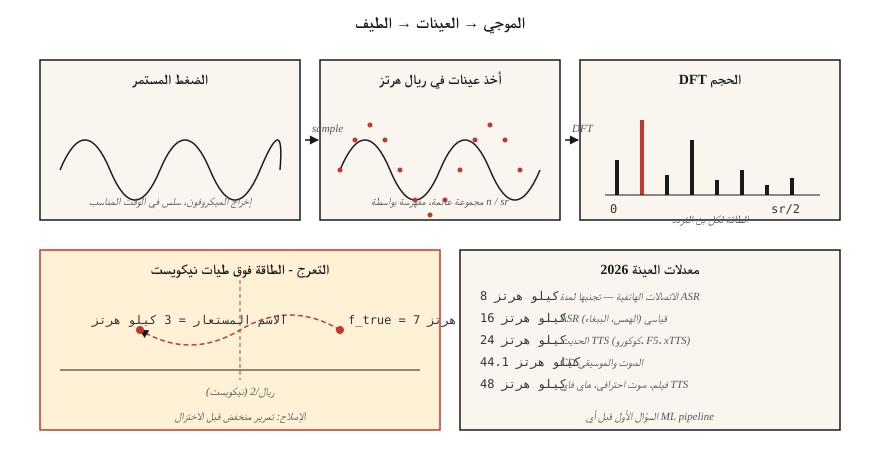

# أساسيات الصوت — الأشكال الموجية، أخذ العينات، تحويل فورييه
> الأشكال الموجية هي الإشارة الخام. الطيفية هي التمثيل. ميزات Mel هي النموذج المناسب لـ ML. كل سطر ASR وTTS pipe حديث يسير على هذا السلم، والدرجة الأولى هي فهم أخذ العينات وفورييه.
**النوع:** تعلم
** اللغات: ** بايثون
**المتطلبات:** المرحلة 1 · 06 (المتجهات والمصفوفات)، المرحلة 1 · 14 (التوزيعات الاحتمالية)
**الوقت:** ~45 دقيقة
## المشكلة
ينتج الميكروفون إشارة الضغط مقابل الوقت. شبكتك العصبية تستهلك الموترات. توجد بينهما مجموعة من الاتفاقيات التي، عند انتهاكها، تنتج أخطاء صامتة: يتدرب النموذج جيدًا ولكن WER يتضاعف، أو TTS يصدر هسهسة، أو يحفظ نظام استنساخ الصوت الميكروفون بدلاً من مكبر الصوت.
كل خطأ في أنظمة الكلام يعود إلى واحد من ثلاثة أسئلة:
1. ما هو معدل العينة الذي تم تسجيل البيانات به، وماذا يتوقع النموذج؟
2. هل الإشارة مستعارة؟
3. هل تعمل على عينات أولية أم على تمثيل ترددي؟
احصل على هذه الأمور بشكل صحيح وبقية المرحلة السادسة قابلة للمتابعة. أخطأوا في فهمهم وحتى Whisper-Large-v4 ينتج عنه قمامة.
##المفهوم

**الشكل الموجي.** مصفوفة ذات بعد واحد من العوامات في `[-1.0, 1.0]`. مفهرسة حسب رقم العينة. للتحويل إلى ثواني، قم بالقسمة على معدل العينة: `t = n / sr`. مقطع مدته 10 ثوانٍ عند 16 كيلو هرتز عبارة عن مجموعة من 160.000 عوامة.
**معدل أخذ العينات (sr).** كم عدد العينات في الثانية. المعدلات المشتركة في عام 2026:
| معدل | استخدم |
|------|-----|
| 8 كيلو هرتز | الاتصالات الهاتفية، القديمة VOIP. Nyquist عند 4 كيلو هرتز يقتل الحروف الساكنة. تجنب ASR. |
| 16 كيلو هرتز | ASR المعيار. تستهلك كل من Whisper وParakeet وSeamlessM4T v2 16 كيلو هرتز. |
| 22.05 كيلو هرتز | TTS تدريب على التشفير الصوتي للنماذج القديمة. |
| 24 كيلو هرتز | الحديث TTS (كوكورو، F5-TTS، xTTS v2). |
| 44.1 كيلو هرتز | CD الصوت والموسيقى. |
| 48 كيلو هرتز | فيلم، صوت احترافي، عالي الدقة TTS (VALL-E 2، NaturalSpeech 3). |
**Nyquist-Shannon.** يمكن أن يمثل معدل العينة `sr` ترددات تصل إلى `sr/2` بشكل لا لبس فيه. الحد `sr/2` هو *تردد نيكويست*. الطاقة فوق نيكويست تحصل على *اسم مستعار* – يتم طيها للأسفل إلى ترددات أقل – وتفسد الإشارة. قم دائمًا بتصفية الترددات المنخفضة قبل الاختزال.
**عمق البت.** 16 بت PCM (موقع int16، النطاق ±32,767) هو تنسيق التبادل العالمي. 24 بت للموسيقى، 32 بت للموسيقى الداخلية DSP. مكتبات مثل `soundfile` تقرأ int16 ولكنها تعرض صفائف float32 في `[-1, 1]`.
**تحويل فورييه.** أي إشارة محدودة هي مجموع الجيوب الأنفية على ترددات مختلفة. يحسب تحويل فورييه المنفصل (DFT) للعينات `N`، `N` المعاملات المعقدة - واحد لكل حاوية تردد. `bin k` يعين التردد `k · sr / N` هرتز. الحجم هو السعة عند هذا التردد، والزاوية هي الطور.
**FFT.** تحويل فورييه السريع: خوارزمية `O(N log N)` للـ DFT عندما يكون `N` قوة للرقم 2. تستخدم كل مكتبة صوتية FFT تحت الغطاء. توفر عينة 1024 FFT عند 16 كيلو هرتز 512 خانة تردد قابلة للاستخدام تمتد من 0 إلى 8 كيلو هرتز عند دقة 15.6 هرتز.
**التأطير + النافذة.** لا نقوم بـ FFT مقطع كامل. نقوم بتقطيعها إلى *إطارات* متداخلة (عادة 25 مللي ثانية مع قفزة 10 مللي ثانية)، وضرب كل إطار بوظيفة نافذة (Hann، Hamming) لقتل انقطاعات الحواف، ثم FFT كل إطار. هذا هو تحويل فورييه قصير الأمد (STFT). الدرس 02 يلتقط من هنا.
## بنائها
### الخطوة 1: قراءة مقطع ورسم الشكل الموجي
يستخدم `code/main.py` فقط الوحدة النمطية stdlib `wave` لإبقاء الإصدار التجريبي خاليًا من التبعية. للإنتاج ستستخدم `soundfile` أو `torchaudio.load` (كلاهما يُرجع `(waveform, sr)` صفوف):
```python
import soundfile as sf
waveform, sr = sf.read("clip.wav", dtype="float32")  # shape (T,), sr=int
```

### الخطوة الثانية: تركيب موجة جيبية من المبادئ الأولى
```python
import math

def sine(freq_hz, sr, seconds, amp=0.5):
    n = int(sr * seconds)
    return [amp * math.sin(2 * math.pi * freq_hz * i / sr) for i in range(n)]
```

جيب 440 هرتز (الحفلة أ) عند 16 كيلو هرتز لمدة ثانية واحدة هو 16000 عوامة. اكتب باستخدام `wave.open(..., "wb")` باستخدام تشفير PCM 16 بت.
### الخطوة 3: احسب DFT يدويًا
```python
def dft(x):
    N = len(x)
    out = []
    for k in range(N):
        re = sum(x[n] * math.cos(-2 * math.pi * k * n / N) for n in range(N))
        im = sum(x[n] * math.sin(-2 * math.pi * k * n / N) for n in range(N))
        out.append((re, im))
    return out
```

`O(N²)` — جيد لـ `N=256` لتأكيد الصحة، وغير مفيد للصوت الحقيقي. يستدعي الرمز الحقيقي `numpy.fft.rfft` أو `torch.fft.rfft`.
### الخطوة 4: ابحث عن التردد السائد
يعين مؤشر ذروة الحجم `k_star` التردد `k_star * sr / N`. تشغيل هذا على جيب 440 هرتز يجب أن يعيد الذروة عند الحاوية `440 * N / sr`.
### الخطوة 5: إظهار التعرجات
عينة جيب 7 كيلو هرتز عند 10 كيلو هرتز (نيكويست = 5 كيلو هرتز). نغمة 7 كيلو هرتز أعلى من Nyquist وتطوي إلى `10 − 7 = 3 kHz`. تظهر الذروة FFT عند 3 كيلو هرتز. هذا هو العرض التوضيحي الكلاسيكي للاسم المستعار والسبب في أن كل DAC/ADC يأتي مزودًا بمرشح تمرير منخفض على جدار من الطوب.
## استخدمه
المكدس الذي ستشحنه بالفعل في عام 2026:
| مهمة | مكتبة | لماذا |
|------|---------|-----|
| اقرأ/اكتب WAV/FLAC/OGG | `soundfile` (مجمع libsndfile) | أسرع، مستقر، يعود float32. |
| إعادة تشكيل | `torchaudio.transforms.Resample` أو `librosa.resample` | تصحيح الصقل المضمن. |
| STFT / ميل | `torchaudio` أو `librosa` | GPU-صديق؛ PyTorch النظام البيئي. |
| البث المباشر | `sounddevice` أو `pyaudio` | روابط PortAudio عبر الأنظمة الأساسية. |
| فحص ملف | `ffprobe` أو `soxi` | CLI، سريع، تقارير sr/channels/codec. |
قاعدة القرار: **مطابقة معدل العينة قبل مطابقة أي شيء آخر**. ويتوقع Whisper تعويمًا أحاديًا يبلغ 16 كيلو هرتز. قم بتمرير استريو 44.1 كيلو هرتز وستحصل على القمامة التي تبدو وكأنها خطأ نموذجي.
## اشحنها
احفظ باسم `outputs/skill-audio-loader.md`. تساعدك هذه المهارة على التحقق من أن إدخال الصوت يتوافق مع توقعات النموذج النهائي ويتم إعادة تشكيله بشكل صحيح عندما لا يكون كذلك.
## تمارين
1. **سهل.** قم بتجميع مزيج مدته ثانية واحدة من 220 هرتز + 440 هرتز + 880 هرتز عند 16 كيلو هرتز. تشغيل DFT. تأكيد ثلاث قمم في الصناديق المتوقعة.
2. **متوسط.** سجل WAV من صوتك لمدة 3 ثوانٍ بسرعة 48 كيلو هرتز. قم بالاختزال إلى 16 كيلو هرتز باستخدام `torchaudio.transforms.Resample` (مع الصقل)، ثم إلى 16 كيلو هرتز باستخدام الهلاك الساذج (كل عينة ثالثة). FFT كلاهما. أين يظهر الاسم المستعار؟
3. **صعب.** أنشئ STFT من البداية باستخدام `math` فقط وDFT من الخطوة 3. حجم الإطار 400، القفزة 160، نافذة هان. مقادير المؤامرة مع `matplotlib.pyplot.imshow`. هذا هو المخطط الطيفي للدرس 02.
## المصطلحات الرئيسية
| مصطلح | ماذا يقول الناس | ماذا يعني في الواقع |
|------|-|--------------------------------------|
| معدل العينة | كم عدد العينات في الثانية | التردد بالهرتز الذي يقيس فيه ADC الإشارة. |
| نيكويست | أقصى تردد يمكنك تمثيله | `sr/2`; الطاقة فوقها أسماء مستعارة للأسفل. |
| عمق البت | حل كل عينة | `int16` = 65,536 مستوى؛ `float32` = دقة 24 بت في `[-1, 1]`. |
| __المصطلح_1__ | تحويل فورييه للمتتابعات | `N` عينات → `N` معاملات التردد المعقدة. |
| __المصطلح_2__ | السريع DFT | تتطلب خوارزمية `O(N log N)` `N` = قوة 2. |
| بن | عمود التردد | `k · sr / N` هرتز؛ القرار = `sr / N`. |
| STFT | الطيفي تحت غطاء محرك السيارة | مؤطر + نافذة FFT مع مرور الوقت. |
| التعرج | تردد أشباح غريب | تنعكس الطاقة الموجودة فوق Nyquist إلى الصناديق السفلية. |
## مزيد من القراءة
- [Shannon (1949). Communication in the Presence of Noise](https://people.math.harvard.edu/~ctm/home/text/others/shannon/entropy/entropy.pdf) — الورقة التي تكمن وراء نظرية أخذ العينات.
- [Smith — The Scientist and Engineer's Guide to Digital Signal Processing](https://www.dspguide.com/ch8.htm) — الكتاب المدرسي المجاني DSP الأساسي.
- [librosa docs — audio primer](https://librosa.org/doc/latest/tutorial.html) — شرح عملي للكود.
- [Heinrich Kuttruff — Room Acoustics (6th ed.)](https://www.routledge.com/Room-Acoustics/Kuttruff/p/book/9781482260434) — مرجع لماذا لا يكون الصوت في العالم الحقيقي عبارة عن جيبية نظيفة.
- [Steve Eddins — FFT Interpretation notebook](https://blogs.mathworks.com/steve/2020/03/30/fft-spectrum-and-spectral-densities/) — تم توضيح حدس صندوق التردد خلال 10 دقائق.