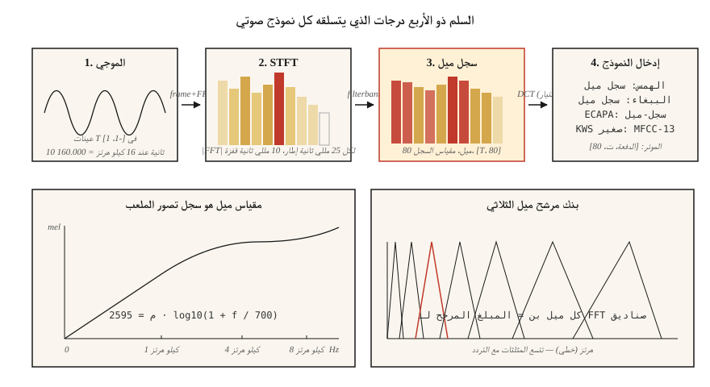

# الطيفية ومقياس ميل والميزات الصوتية
> الشبكات العصبية لا تستهلك الأشكال الموجية الخام بشكل جيد. أنها تستهلك الطيفية. إنهم يستهلكون مطياف ميل بشكل أفضل. كل ASR، TTS، ومصنف الصوت في عام 2026 يعيش أو يموت من خلال خيار المعالجة المسبقة هذا.
**النوع:** بناء
** اللغات: ** بايثون
** المتطلبات الأساسية: ** المرحلة 6 · 01 (أساسيات الصوت)
**الوقت:** ~45 دقيقة
## المشكلة
التقط مقطعًا مدته 10 ثوانٍ بمعدل 16 كيلو هرتز. هذا يعني 160.000 عائمة، كلها في `[-1, 1]`، غير مرتبطة تمامًا تقريبًا بالتسمية "dog barking" أو "كلمة cat". يحتوي الشكل الموجي الخام على المعلومات ولكن في شكل لا يمكن للنموذج استخراجه بسهولة. هناك صوتان متماثلان يتم التحدث بهما على مسافة 100 مللي ثانية لهما عينات أولية مختلفة تمامًا.
يعمل المخطط الطيفي على إصلاح هذا. إنه ينهار التفاصيل الزمنية حيث يتجاهلها الإدراك البشري (ارتعاش الميكروثانية) ويحافظ على البنية التي يحضرها الإدراك (أي الترددات نشطة، مع نوافذ زمنية تبلغ ~ 10-25 مللي ثانية).
تدفع مطيافية ميل إلى أبعد من ذلك. يدرك البشر درجة الصوت لوغاريتميًا: 100 هرتز مقابل 200 هرتز يبدو "على نفس المسافة" مثل 1000 هرتز مقابل 2000 هرتز. يقوم مقياس mel بتحريف محور التردد ليتناسب. يعد المخطط الطيفي ذو مقياس ميل الميزة الأكثر أهمية في الكلام ML من عام 2010 حتى عام 2026.
##المفهوم

**STFT (تحويل فورييه قصير الأمد).** قم بتقطيع الشكل الموجي إلى إطارات متداخلة (نموذجي: نافذة 25 مللي ثانية، قفزة 10 مللي ثانية = 400 عينة / 160 عينة عند 16 كيلو هرتز). اضرب كل إطار في دالة النافذة (Hann هو الخيار الافتراضي، وHamming عبارة عن مقايضة مختلفة قليلًا). FFT كل إطار. كومة أطياف الحجم في مصفوفة الشكل `(n_frames, n_freq_bins)`. هذا هو الطيفي الخاص بك.
**حجم السجل.** تمتد المقادير الأولية من 5 إلى 6 أوامر من حيث الحجم. استخدم `log(|X| + 1e-6)` أو `20 * log10(|X|)` لضغط النطاق الديناميكي. يستخدم كل خط إنتاج pipe حجم السجل، وليس الحجم الأولي.
**مقياس ميل.** يرسم التردد `f` بالهرتز ميل `m` بواسطة `m = 2595 * log10(1 + f / 700)`. يكون التعيين خطيًا تقريبًا أقل من 1 كيلو هرتز ولوغاريتميًا تقريبًا أعلاه. صناديق 80 مل تغطي 0-8 كيلو هرتز هي الإدخال القياسي ASR.
**بنك مرشحات ميل.** مجموعة من المرشحات المثلثة متباعدة بالتساوي على مقياس ميل. كل مرشح عبارة عن مجموع مرجح لصناديق FFT المجاورة. إن ضرب حجم STFT بمصفوفة بنك المرشح يعطي مخطط طيفي ميل في ماتمول واحد.
**مخطط الطيف اللوغاريتمي.** `log(mel_spec + 1e-10)`. مدخلات الهمس. مدخلات الببغاء. إدخال SeamlessM4T. الواجهة الصوتية العالمية 2026.
**معامل تغير المناخ.** خذ المخطط الطيفي log-mel، وطبق DCT (اكتب II)، واحتفظ بالمعاملات الثلاثة عشر الأولى. يزين الميزات ويضغط بشكل أكبر. كانت الميزة السائدة حتى عام 2015 تقريبًا عندما تم اكتشاف شبكات CNN/Transformers الموجودة على سجلات التسجيل الأولية. لا يزال يستخدم في التعرف على المتحدث (x-vectors، ECAPA).
**تداول الدقة.** أكبر FFT = دقة تردد أفضل ولكن دقة زمنية أسوأ. 25 مللي ثانية / 10 مللي ثانية هو الصوت-ML الافتراضي؛ 50 مللي ثانية/12.5 مللي ثانية للموسيقى ؛ 5 مللي ثانية / 2 مللي ثانية للكشف العابر (ضربات الطبلة والانفجارات).
## بنائها
### الخطوة 1: تأطير الشكل الموجي
```python
def frame(signal, frame_len, hop):
    n = 1 + (len(signal) - frame_len) // hop
    return [signal[i * hop : i * hop + frame_len] for i in range(n)]
```

مقطع مدته 10 ثوانٍ بمعدل 16 كيلو هرتز مع `frame_len=400, hop=160` ينتج عنه 998 إطارًا.
### الخطوة الثانية: نافذة هان
```python
import math

def hann(N):
    return [0.5 * (1 - math.cos(2 * math.pi * n / (N - 1))) for n in range(N)]
```

اضرب العناصر قبل FFT. يزيل التسرب الطيفي الناتج عن الاقتطاع عند نقاط النهاية غير الصفرية.
### الخطوة 3: STFT الحجم
```python
def stft_magnitude(signal, frame_len=400, hop=160):
    win = hann(frame_len)
    frames = frame(signal, frame_len, hop)
    return [magnitudes(dft([w * s for w, s in zip(win, f)])) for f in frames]
```

يستخدم الإنتاج `torch.stft` أو `librosa.stft` (FFT مدعوم، متجه). الحلقة هنا تربوية. يتم تشغيله على مقاطع قصيرة في `code/main.py`.
### الخطوة 4: ميل فلتر بانك
```python
def hz_to_mel(f):
    return 2595.0 * math.log10(1.0 + f / 700.0)

def mel_to_hz(m):
    return 700.0 * (10 ** (m / 2595.0) - 1)

def mel_filterbank(n_mels, n_fft, sr, fmin=0, fmax=None):
    fmax = fmax or sr / 2
    mels = [hz_to_mel(fmin) + (hz_to_mel(fmax) - hz_to_mel(fmin)) * i / (n_mels + 1)
            for i in range(n_mels + 2)]
    hzs = [mel_to_hz(m) for m in mels]
    bins = [int(h * n_fft / sr) for h in hzs]
    fb = [[0.0] * (n_fft // 2 + 1) for _ in range(n_mels)]
    for m in range(n_mels):
        for k in range(bins[m], bins[m + 1]):
            fb[m][k] = (k - bins[m]) / max(1, bins[m + 1] - bins[m])
        for k in range(bins[m + 1], bins[m + 2]):
            fb[m][k] = (bins[m + 2] - k) / max(1, bins[m + 2] - bins[m + 1])
    return fb
```

80 ميل تغطي 0-8 كيلو هرتز مع `n_fft=400` يعطي مصفوفة `(80, 201)`. اضرب حجم `(n_frames, 201)` STFT في التحويل لتحصل على `(n_frames, 80)` ميل الطيفي.
### الخطوة 5: سجل ميل
```python
def log_mel(mel_spec, eps=1e-10):
    return [[math.log(max(v, eps)) for v in frame] for frame in mel_spec]
```

البدائل الشائعة: `librosa.power_to_db` (dB المقيسة مرجعيًا)، `10 * log10(power + eps)`. يستخدم Whisper مقطعًا أكثر تفاعلاً + روتين تطبيع (راجع `log_mel_spectrogram` الخاص بـ Whisper).
### الخطوة 6: البلدان متعددة الأطراف
```python
def dct_ii(x, n_coeffs):
    N = len(x)
    return [
        sum(x[n] * math.cos(math.pi * k * (2 * n + 1) / (2 * N)) for n in range(N))
        for k in range(n_coeffs)
    ]
```

قم بتطبيق DCT على كل إطار سجل، واحتفظ بالمعاملات الثلاثة عشر الأولى. هذه هي مصفوفة MFCC الخاصة بك. عادةً ما يتم إسقاط المعامل الأول (وهو يشفر الطاقة الإجمالية).
## استخدمه
مكدس 2026:
| مهمة | المميزات |
|------|----------|
| ASR (همس، ببغاء، سلسM4T) | 80 سجل ميل، 10 مللي ثانية قفزة، 25 مللي ثانية نافذة |
| TTS النموذج الصوتي (VITS، F5-TTS، كوكورو) | 80 ميل، 5-12 مللي ثانية قفزة للتحكم الزمني الدقيق |
| تصنيف الصوت (AST، PANNs، BEATs) | 128 سجل ميل، 10 مللي ثانية قفزة |
| تضمين مكبر الصوت (ECAPA-TDNN، ​​WavLM) | 80 لوغاريتم ميل أو شكل موجة خام SSL |
| الموسيقى (MusicGen، الصوت المستقر 2) | الرموز المميزة لـ EnCodec (وليست الميل) |
| اكتشاف الكلمات الرئيسية | 40 MFCCs للأجهزة الصغيرة |
القاعدة الأساسية: **إذا كنت لا تعمل على الموسيقى، فابدأ بـ 80 ميلًا.** يقع عبء الإثبات على أي انحراف.
## المزالق التي لا تزال تشحن في عام 2026
- **عدم تطابق عدد الميل.** التدريب بـ 80 ميل، الاستدلال بـ 128 ميل. الفشل الصامت قم بتسجيل شكل الميزة في كلا الطرفين.
- **عدم تطابق معدل العينة مع المنبع.** تبدو الميلات المحسوبة عند 22.05 كيلو هرتز مختلفة عن 16 كيلو هرتز. أصلح SR *قبل* الميزة.
- **dB vs log.** يتوقع Whisper log-mel، وليس dB-mel. يتم اكتشاف بعض خطوط HF pip تلقائيًا؛ الرمز المخصص الخاص بك لن يفعل ذلك.
- **انحراف التطبيع.** تطبيع كل كلام أثناء التدريب، والتطبيع الشامل أثناء الاستدلال. خطأ في الإنتاج يتضاعف WER.
- **تسرب من الحشو.** تؤدي الحشوة الصفرية في نهاية المقطع إلى إنتاج نطاق مسطح في الإطارات الخلفية. وسادة متناظرة أو مكررة.
## اشحنها
احفظ باسم `outputs/skill-feature-extractor.md`. تتميز اختيارات المهارة بنوع الميزة وعدد الميل والإطار/القفزة والتطبيع لهدف نموذج معين.
## تمارين
1. **سهل.** قم بتشغيل `code/main.py`. يقوم بتجميع غرد (تردد اجتاح 200 → 4000 هرتز) ويطبع صندوق argmax mel لكل إطار. ارسم (اختياري) وتأكد من مطابقته لعملية المسح.
2. **متوسط.** أعد التشغيل باستخدام `n_mels` في `{40, 80, 128}` و`frame_len` في `{200, 400, 800}`. قياس عرض النطاق الترددي الذروة الحادة عبر المحور الزمني. ما هي المجموعة التي تحل التغريدة بشكل أفضل؟
3. **صعب.** نفذ `power_to_db` وقارن دقة ASR لمصنف CNN الصغير على AudioMNIST باستخدام (أ) log-mel الخام، (ب) dB-mel مع `ref=max`، (ج) MFCC-13 + delta + delta-delta. الإبلاغ عن أعلى دقة 1.
## المصطلحات الرئيسية
| مصطلح | ماذا يقول الناس | ماذا يعني في الواقع |
|------|-|--------------------------------------|
| الإطار | شريحة | جزء من شكل موجة يبلغ طوله 25 مللي ثانية يتم تغذيته إلى FFT واحد. |
| هوب | خطوة | العينات بين الإطارات المتتالية؛ 10 مللي ثانية هو ASR الافتراضي. |
| نافذة | شيء هان / هامينج | مضاعف نقطي يعمل على تقليص حواف الإطار إلى الصفر. |
| __المصطلح_2__ | مولد طيفي | مؤطر + نافذة FFT؛ يعطي الوقت × مصفوفة التردد. |
| ميل | تردد مشوه | مقياس الإدراك اللوغاريتمي؛ __الكود_0__. |
| بنك التصفية | المصفوفة | المرشحات المثلثة التي تعرض STFT على صناديق الميل. |
| سجل ميل | مدخلات الهمس | __الكود_1__; موحدة في عام 2026. |
| __المصطلح_5__ | ميزة المدرسة القديمة | DCT من سجل ميل؛ 13 معاملات مزخرفة. |
## مزيد من القراءة
- [Davis, Mermelstein (1980). Comparison of parametric representations for monosyllabic word recognition](https://ieeexplore.ieee.org/document/1163420) — الورقة MFCC.
- [Stevens, Volkmann, Newman (1937). A Scale for the Measurement of the Psychological Magnitude Pitch](https://pubs.aip.org/asa/jasa/article-abstract/8/3/185/735757/) — مقياس ميل الأصلي.
- [OpenAI — Whisper source, log_mel_spectrogram](https://github.com/openai/whisper/blob/main/whisper/audio.py) — اقرأ التنفيذ المرجعي.
- [librosa feature extraction docs](https://librosa.org/doc/main/feature.html) — مرجع لـ `mfcc`، `melspectrogram`، والقفزة/النافذة.
- [NVIDIA NeMo — audio preprocessing](https://docs.nvidia.com/deeplearning/nemo/user-guide/docs/en/main/asr/asr_all.html#featurizers) — خط الإنتاج pipeline لنماذج Parakeet + Canary.