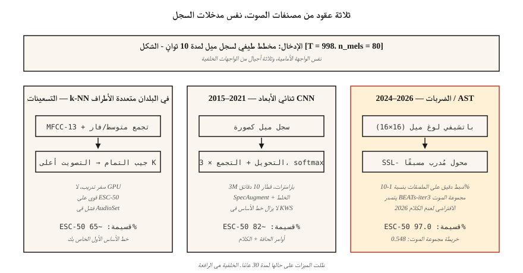

# Audio Classification — From k-NN on MFCCs to AST and BEATs

> كل شيء بدءًا من "نباح الكلب مقابل صفارات الإنذار" إلى "أي لغة هذه" هو تصنيف صوتي. الميزات ميلز. تتحرك الهندسة المعمارية كل عقد. يبقى التقييم AUC، F1، واستدعاء لكل فصل.

**النوع:** بناء
** اللغات: ** بايثون
** المتطلبات الأساسية: ** المرحلة 6 · 02 (Spectrograms & Mel)، المرحلة 3 · 06 (CNN)، المرحلة 5 · 08 (CNNs وRNNs للنص)
**الوقت:** ~75 دقيقة

## The Problem

تحصل على مقطع مدته 10 ثواني. تريد أن تعرف: "ما هذا؟" الصوت الحضري (صافرة الإنذار، الحفر، الكلب)، أمر الكلام (نعم/لا/توقف)، اللغة ID (en/es/ar)، انفعال المتحدث (غاضب/محايد)، أو الصوت البيئي (داخلي/خارجي، ثرثرة). كل هذا عبارة عن *تصنيف صوتي*، وفي عام 2026 أصبحت البنية الأساسية ناضجة: log-mel → CNN أو Transformer → softmax.

الصعوبة الأساسية ليست الشبكة. إنها بيانات. تحتوي مجموعات البيانات الصوتية على خلل شديد في التوازن الطبقي، وتحول قوي في المجال (نظيف مقابل صاخب)، وضوضاء التسمية (من قرر "الثرثرة الحضرية" مقابل "ضوضاء المطعم"؟). 80٪ من المشكلة هي المعالجة والتعزيز والتقييم، وليس تبديل CNN بالمحول.

## The Concept



**k-NN على MFCCs (خط الأساس في التسعينيات).** تسوية MFCCs لكل مقطع، وحساب تشابه جيب التمام مع بنك مسمى، وإرجاع تصويت الأغلبية لأعلى K. قوي بشكل مدهش في مجموعات البيانات الصغيرة النظيفة (أوامر الكلام، ESC-50). يعمل بدون GPU.

**2D CNN على log-mels (2015-2019).** تعامل مع `(T, n_mels)` log-mel كصورة. قم بتطبيق نمط ResNet-18 أو VGG. المتوسط ​​العالمي يجمع محور الوقت. Softmax على الطبقات. لا يزال خط الأساس في معظم مسابقات 2026 kaggle.

** محول الطيف الصوتي، AST (2021-2024).** قم بتصحيح السجل (على سبيل المثال، تصحيحات 16 × 16)، وأضف تضمينات الموضع، وقم بالتغذية إلى ViT. أحدث ما توصلت إليه تقنية AudioSet (mAP 0.485) للتعلم الخاضع للإشراف.

**BEATs وWavLM-base (2024-2026).** تدريب مسبق تحت الإشراف الذاتي على ملايين الساعات. قم بضبط مهمتك باستخدام 1-10% من البيانات الخاضعة للإشراف التي قد تحتاجها. في عام 2026، هذه هي نقطة البداية الافتراضية للصوت غير الكلامي. يتفوق BEATs-iter3 على AST بمقدار 1-2 mAP على AudioSet أثناء استخدام 1/4 الحساب.

** جهاز تشفير Whisper كعمود فقري مجمد (2024). ** خذ جهاز تشفير Whisper، وأسقط وحدة فك التشفير، وأرفق مصنفًا خطيًا. بالقرب من SOTA على اللغة ID وتصنيف بسيط للحدث بدون تكبير صوتي. خط الأساس "الغداء المجاني".

### Class imbalance is the real challenge

ESC-50: 50 فصلًا، كل منها 40 مقطعًا - متوازن وسهل. UrbanSound8K: 10 فصول، غير متوازن 10:1. مجموعة الصوت: 632 فئة بذيل طويل 100,000:1. التقنيات التي تعمل:

- أخذ العينات المتوازنة أثناء التدريب (وليس أثناء التقييم).
- الخلط: يتم إدخال مقطعين (وتسمياتهما) خطيًا كزيادة.
- SpecAugment: قناع الوقت العشوائي ونطاقات التردد. بسيط؛ شديد الأهمية.

### Evaluation

- حصري متعدد الفئات (أوامر الكلام): أعلى 1 دقة، أعلى 5 دقة.
- ملصقات متعددة الفئات (AudioSet، UrbanSound-style): متوسط ​​الدقة (mAP).
- غير متوازن إلى حد كبير: استدعاء لكل فصل + ماكرو F1.

أرقام 2026 التي يجب أن تعرفها:

| المعيار | خط الأساس | SOTA 2026 | المصدر |
|-----------|---------|-----------|--------|
| ESC-50 | 82% (AST) | 97.0% (بيتس-ايتر3) | ورقة بيتس (2024) |
| خريطة AudioSet | 0.485 (AST) | 0.548 (بيتس-ايتر3) | HEAR المتصدرين 2026 |
| أوامر الكلام الإصدار 2 | 98% (CNN) | 99.0% (صوت-MAE) | HEAR نتائج الإصدار الثاني |

## Build It

### Step 1: featurize

```python
def featurize_mfcc(signal, sr, n_mfcc=13, n_mels=40, frame_len=400, hop=160):
    mag = stft_magnitude(signal, frame_len, hop)
    fb = mel_filterbank(n_mels, frame_len, sr)
    mels = apply_filterbank(mag, fb)
    log = log_transform(mels)
    return [dct_ii(frame, n_mfcc) for frame in log]
```

### Step 2: fixed-length summary

```python
def summarize(mfcc_frames):
    n = len(mfcc_frames[0])
    mean = [sum(f[i] for f in mfcc_frames) / len(mfcc_frames) for i in range(n)]
    var = [
        sum((f[i] - mean[i]) ** 2 for f in mfcc_frames) / len(mfcc_frames) for i in range(n)
    ]
    return mean + var
```

بسيطة ولكنها قوية: المتوسط ​​+ التباين عبر الزمن يعطي تضمينًا ثابتًا 26 خافتًا لـ 13 coef MFCC. يعمل على الفور. تغلب على أحدث خطوط الأساس NN على ESC-50 في عام 2017.

### Step 3: k-NN

```python
def cosine(a, b):
    dot = sum(x * y for x, y in zip(a, b))
    na = math.sqrt(sum(x * x for x in a)) or 1e-12
    nb = math.sqrt(sum(x * x for x in b)) or 1e-12
    return dot / (na * nb)

def knn_classify(q, bank, labels, k=5):
    sims = sorted(range(len(bank)), key=lambda i: -cosine(q, bank[i]))[:k]
    votes = Counter(labels[i] for i in sims)
    return votes.most_common(1)[0][0]
```

### Step 4: upgrade to CNN on log-mels

في PyTorch:

```python
import torch.nn as nn

class AudioCNN(nn.Module):
    def __init__(self, n_mels=80, n_classes=50):
        super().__init__()
        self.body = nn.Sequential(
            nn.Conv2d(1, 32, 3, padding=1), nn.ReLU(), nn.MaxPool2d(2),
            nn.Conv2d(32, 64, 3, padding=1), nn.ReLU(), nn.MaxPool2d(2),
            nn.Conv2d(64, 128, 3, padding=1), nn.ReLU(),
            nn.AdaptiveAvgPool2d(1),
        )
        self.head = nn.Linear(128, n_classes)

    def forward(self, x):  # x: (B, 1, T, n_mels)
        return self.head(self.body(x).flatten(1))
```

معلمات 3M. القطارات في حوالي 10 دقائق على ESC-50 بواحدة RTX 4090. دقة تزيد عن 80%.

### Step 5: the 2026 default — fine-tune BEATs

```python
from transformers import ASTFeatureExtractor, ASTForAudioClassification

ext = ASTFeatureExtractor.from_pretrained("MIT/ast-finetuned-audioset-10-10-0.4593")
model = ASTForAudioClassification.from_pretrained(
    "MIT/ast-finetuned-audioset-10-10-0.4593",
    num_labels=50,
    ignore_mismatched_sizes=True,
)

inputs = ext(audio, sampling_rate=16000, return_tensors="pt")
logits = model(**inputs).logits
```

بالنسبة لـ BEATs، استخدم `microsoft/BEATs-base` عبر المكتبة `beats`؛ المحولات API لها نفس الشكل.

## Use It

مكدس 2026:

| الوضع | ابدأ بـ |
|-----------|-----------|
| مجموعة بيانات صغيرة (<1000 مقطع) | ك-NN على MFCC تعني (خط الأساس الخاص بك) + تكبير الصوت |
| مجموعة بيانات متوسطة (1K – 100K) | يدق أو AST ضبط دقيق |
| مجموعة بيانات كبيرة (> 100 كيلو) | تدرب من الصفر أو قم بضبط برنامج Whisper-encoder |
| في الوقت الحقيقي، الحافة | 40-MFCC CNN، مكممة إلى int8 (نمط KWS) |
| تسمية متعددة (مجموعة الصوت) | BEATs-iter3 مع خسارة BCE + mixup + SpecAugment |
| اللغة ID | MMS-LID، SpeechBrain VoxLingua107 خط الأساس |

قاعدة القرار: **ابدأ بعمود فقري متجمد، وليس بنموذج جديد**. الضبط الدقيق لرأس BEATs يمنحك 95% من SOTA خلال ساعات، وليس أسابيع.

## Ship It

حفظ باسم `outputs/skill-classifier-designer.md`. اختر البنية والتعزيزات واستراتيجية توازن الفصل ومقياس التقييم لمهمة تصنيف صوت معينة.

## Exercises

1. **سهل.** تشغيل `code/main.py`. يقوم بتدريب خط الأساس k-NN MFCC على مجموعة بيانات تركيبية من 4 فئات (نغمات نقية في درجات مختلفة). تقرير مصفوفة الارتباك.
2. **متوسط.** استبدل `summarize` بـ [mean, var, skew, kurtosis]. هل يعني فوز التجميع لمدة 4 دقائق + var على نفس مجموعة البيانات الاصطناعية؟
3. **صعب.** باستخدام `torchaudio`، قم بتدريب CNN ثنائي الأبعاد على ESC-50 أضعاف 1. قم بالإبلاغ عن دقة التحقق المتبادل بخمسة أضعاف. أضف SpecAugment (قناع الوقت = 20، قناع التكرار = 10) وأبلغ عن الدلتا.

## Key Terms

| مصطلح | ماذا يقول الناس | ماذا يعني في الواقع |
|------|-|--------------------------------------|
| مجموعة الصوت | إيماج نت للصوت | مجموعة بيانات YouTube ذات التصنيف الضعيف من Google والمكونة من 632 فئة والتي تبلغ 2M. |
| ESC-50 | معيار التصنيف الصغير | 50 حصة × 40 مقطعًا للأصوات البيئية. |
| AST | محول الطيف الصوتي | ViT على بقع سجل ميل. 2021 SOTA. |
| يدق | الصوت الخاضع للإشراف الذاتي | نموذج Microsoft، iter3 يتصدر AudioSet اعتبارًا من عام 2026. |
| خلط | تكبير الزوج | `x = λ·x1 + (1-λ)·x2; y = λ·y1 + (1-λ)·y2`. |
| SpecAugment | التكبير القائم على القناع | نطاقات التردد والوقت العشوائية الصفرية للمخطط الطيفي. |
| الخريطة | المقياس الرئيسي متعدد العلامات | متوسط ​​الدقة عبر الفئات والعتبات. |

## Further Reading

- [Gong, Chung, Glass (2021). AST: Audio Spectrogram Transformer](https://arxiv.org/abs/2104.01778) — the architecture of record from 2021–2024.
- [Chen et al. (2022, rev. 2024). BEATs: التدريب الصوتي المسبق باستخدام الرموز الصوتية](https://arxiv.org/abs/2212.09058) — الإعداد الافتراضي 2024+.
- [Park et al. (2019). SpecAugment](https://arxiv.org/abs/1904.08779) — the dominant audio augmentation.
- [Piczak (2015). ESC-50 مجموعة بيانات](https://githubhub.com/karolpiczak/ESC-50) — معيار من 50 فئة لا يزال قائمًا.
- [جيميك وآخرون. (2017). AudioSet](https://research.google.com/audioset/) — تصنيف YouTube من فئة 632؛ لا يزال هو المعيار الذهبي.
