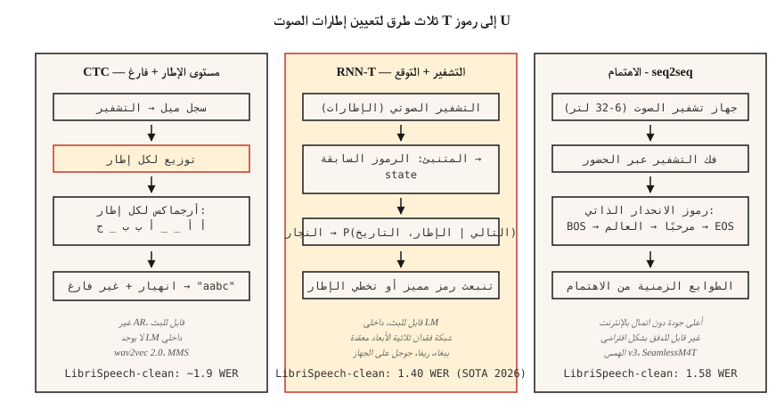

# التعرف على الكلام (ASR) — CTC، RNN-T، انتباه
> التعرف على الكلام هو تصنيف صوتي في كل خطوة زمنية، ويتم لصقه معًا بواسطة نموذج تسلسلي يعرف اللغة الإنجليزية والصمت. CTC، RNN-T، والانتباه هي الطرق الثلاث للقيام بذلك. اختر واحدًا وافهم السبب.
**النوع:** بناء
** اللغات: ** بايثون
** المتطلبات الأساسية: ** المرحلة 6 · 02 (Spectrograms & Mel)، المرحلة 5 · 08 (CNNs وRNNs للنص)، المرحلة 5 · 10 (الانتباه)
**الوقت:** ~45 دقيقة
## المشكلة
لديك مقطع مدته 10 ثوانٍ وبتردد 16 كيلو هرتز. تريد سلسلة: "قم بتشغيل أضواء المطبخ". التحدي بنيوي: الإطارات الصوتية لا تتماشى مع الشخصيات. قد تستغرق كلمة "حسنًا" 200 مللي ثانية أو 1200 مللي ثانية. الصمت يقطع الكلام. بعض الصوتيات أطول من غيرها. عدد الرموز المميزة للإخراج غير معروف مسبقًا.
ثلاث صيغ تحل هذا:
1. **CTC (التصنيف الزمني للاتصال).** انبعاث احتمالات الرمز المميز لكل إطار بما في ذلك *فارغ* خاص. طي التكرارات والفراغات في وقت فك التشفير. غير انحداري، سريع. مستخدم بواسطة wav2vec 2.0، MMS.
2. **RNN-T (محول طاقة الشبكة العصبية المتكررة).** تتنبأ الشبكة المشتركة بالرمز المميز التالي في إطار التشفير والرموز المميزة السابقة. قابل للتدفق. يتم استخدامه بواسطة ASR من Google على الجهاز، NVIDIA الببغاء.
3. ** انتبه إلى وحدة فك التشفير والتشفير. ** يقوم برنامج التشفير بضغط الصوت إلى الحالات المخفية، ويحضر جهاز فك التشفير بشكل متبادل لإنشاء الرموز المميزة بشكل انحداري. يستخدم بواسطة Whisper، SeamlessM4T.
في عام 2026، تبلغ نسبة تنظيف SOTA WER في LibriSpeech 1.4% (Parakeet-TDT-1.1B، NVIDIA) و1.58% (Whisper-Large-v3-turbo). الاختلافات صغيرة. اختلافات النشر ضخمة.
##المفهوم

**CTC حدس.** اسمح لجهاز التشفير بإخراج `T` توزيعات على مستوى الإطار على `V+1` من الرموز المميزة (أحرف V + فارغة). بالنسبة لسلسلة مستهدفة `y` بطول `U < T`، يتم احتساب أي محاذاة إطار تتقلص إلى `y`. CTC مبالغ الخسارة على كل هذه التحالفات. الاستدلال: الحد الأقصى لكل إطار، تكرار الانهيار، إزالة الفراغات.
المزايا: غير انحداري، قابل للتدفق، صفر نظرة أمامية. العيب: *افتراض الاستقلال المشروط* — كل تنبؤ إطار مستقل عن الآخرين، لذلك لا يوجد نموذج لغة داخلي. قم بالإصلاح باستخدام LM خارجي عبر البحث عن الشعاع أو الانصهار الضحل.
**RNN-T حدس.** يضيف شبكة *تنبؤ* تقوم بتضمين سجل الرمز المميز و*وصلة* تجمع بين حالة التوقع وإطار التشفير في توزيع مشترك عبر `V+1` (`+1` هو خالي/ممنوع الانبعاث). نماذج صريحة للاعتماد الشرطي CTC تم تجاهلها. قابل للتدفق لأن كل خطوة تنطبق فقط على الإطارات السابقة والرموز المميزة السابقة.
المزايا: قابل للبث + داخلي LM. العيب: التدريب أكثر تعقيدًا ويستهلك الذاكرة (شبكة فقدان ثلاثية الأبعاد)؛ RNN-تعد نواة الخسارة T فئة مكتبة كاملة بحد ذاتها.
** انتبه إلى وحدة فك ترميز التشفير. ** أداة التشفير (6-32 طبقة محولات) فوق إطارات السجل. تتوافق وحدة فك التشفير (6-32 طبقة محولات) مع مخرجات التشفير لإنشاء الرموز المميزة بشكل انحداري. لا توجد قيود على المحاذاة - يمكن أن ينظر الانتباه إلى أي مكان في الصوت. غير قابل للبث إلا إذا قمت بتقييد الانتباه (chunked Whisper-Streaming، 2024).
المزايا: أعلى جودة في وضع عدم الاتصال ASR، وسهل التدريب باستخدام أدوات seq2seq القياسية. العيب: يتناسب زمن الوصول الانحداري التلقائي مع طول الإخراج؛ لا يمكن البث بدون هندسة.
### WER: الرقم الواحد
**معدل خطأ الكلمات** = `(S + D + I) / N`، حيث S=بدائل، D=عمليات الحذف، I=عمليات الإدراج، N=عدد الكلمات المرجعية. يطابق مسافة التحرير Levenshtein على مستوى الكلمة. أقل هو أفضل. WER أعلى من 20% غير قابل للاستخدام بشكل عام؛ أقل من 5% هو التكافؤ البشري في قراءة الكلام. أرقام 2026 بشأن المعايير القياسية:
| نموذج | اختبار LibriSpeech نظيف | اختبار LibriSpeech-أخرى | الحجم |
|-------|----------------------------------------|--------|------|
| ببغاء-TDT-1.1B | 1.40% | 2.78% | 1.1 ب معلمات |
| همس-كبير-v3-توربو | 1.58% | 3.03% | 809 م |
| كناري-1بي فلاش | 1.48% | 2.87% | 1ب |
| سلس M4T v2 | 1.7% | 3.5% | 2.3ب |
كل هذه هي وحدة فك ترميز التشفير أو RNN-T. أنظمة CTC النقية (wav2vec 2.0) تبلغ حوالي 1.8-2.1% عند الاختبار النظيف.
## بنائها
### الخطوة 1: فك تشفير CTC الجشع
```python
def ctc_greedy(frame_logits, blank=0, vocab=None):
    # frame_logits: list of per-frame probability vectors
    preds = [max(range(len(p)), key=lambda i: p[i]) for p in frame_logits]
    out = []
    prev = -1
    for p in preds:
        if p != prev and p != blank:
            out.append(p)
        prev = p
    return "".join(vocab[i] for i in out) if vocab else out
```

قاعدتان: طي التكرارات المتتالية، وإسقاط الفراغات. مثال: `a a _ _ a b b _ c` → `a a b c`.
### الخطوة الثانية: البحث عن الشعاع CTC
```python
def ctc_beam(frame_logits, beam=8, blank=0):
    import math
    beams = [([], 0.0)]  # (tokens, log_prob)
    for p in frame_logits:
        log_p = [math.log(max(pi, 1e-10)) for pi in p]
        candidates = []
        for seq, lp in beams:
            for t, lpt in enumerate(log_p):
                new = seq[:] if t == blank else (seq + [t] if not seq or seq[-1] != t else seq)
                candidates.append((new, lp + lpt))
        candidates.sort(key=lambda x: -x[1])
        beams = candidates[:beam]
    return beams[0][0]
```

يستخدم الإنتاج بحث شعاع الشجرة البادئ مع دمج LM؛ هذا هو الهيكل العظمي المفاهيمي.
### الخطوة 3: WER
```python
def wer(ref, hyp):
    r, h = ref.split(), hyp.split()
    dp = [[0] * (len(h) + 1) for _ in range(len(r) + 1)]
    for i in range(len(r) + 1):
        dp[i][0] = i
    for j in range(len(h) + 1):
        dp[0][j] = j
    for i in range(1, len(r) + 1):
        for j in range(1, len(h) + 1):
            cost = 0 if r[i - 1] == h[j - 1] else 1
            dp[i][j] = min(
                dp[i - 1][j] + 1,
                dp[i][j - 1] + 1,
                dp[i - 1][j - 1] + cost,
            )
    return dp[len(r)][len(h)] / max(1, len(r))
```

### الخطوة 4: الاستدلال ضد الهمس
```python
import whisper
model = whisper.load_model("large-v3-turbo")
result = model.transcribe("clip.wav")
print(result["text"])
```

سطر واحد لأقوى جنرال ASR في عام 2026. يعمل على 24 GB GPU في ~20× الوقت الفعلي.
### الخطوة 5: البث باستخدام Parakeet أو wav2vec 2.0
```python
from transformers import pipeline
asr = pipeline("automatic-speech-recognition", model="nvidia/parakeet-tdt-1.1b")
for chunk in streaming_audio():
    print(asr(chunk, return_timestamps=True))
```

يحتاج البث ASR إلى اهتمام مجزأ بالتشفير وحالة الترحيل؛ استخدم مكتبة تدعمها (NeMo for Parakeet، `transformers` pipeline مع `chunk_length_s`).
## استخدمه
مكدس 2026:
| الوضع | اختر |
|-----------|------|
| الإنجليزية، دون اتصال، أقصى جودة | همس-كبير-v3-توربو |
| متعدد اللغات، قوي | SeamlessM4T v2 |
| الجري، الكمون المنخفض | Parakeet-TDT-1.1B أو Riva |
| الحافة، الجوال، زمن الوصول <500 مللي ثانية | الهمس-صغير الحجم أو لغو (2024) |
| شكل طويل | الهمس باستخدام التقطيع المستند إلى VAD (WhisperX) |
| مجال خاص (طبي، قانوني) | ضبط wav2vec 2.0 + المجال LM الانصهار |
## المزالق التي لا تزال تشحن في عام 2026
- **لا VAD.** تشغيل الهمس في صمت يؤدي إلى الهلوسة ("شكرًا على المشاهدة!"). أدخل دائمًا بـ VAD.
- **الحرف مقابل الكلمة مقابل الكلمة الفرعية WER.** الإبلاغ عن مستوى الكلمة WER *بعد* التسوية (أحرف صغيرة، تمت إزالة علامات الترقيم).
- **انجراف اللغة ID.** يخطئ LID الخاص بـ Whisper تلقائيًا في توجيه المقاطع المزعجة إلى اللغة اليابانية أو الويلزية؛ فرض `language="en"` عندما تعرف.
- **مقاطع طويلة بدون تقطيع.** يحتوي Whisper على نافذة مدتها 30 ثانية. استخدم `chunk_length_s=30, stride=5` لأي شيء أطول.
## اشحنها
احفظ باسم `outputs/skill-asr-picker.md`. اختر النموذج، واستراتيجية فك التشفير، والتقطيع، والدمج LM لهدف نشر محدد.
## تمارين
1. **سهل.** قم بتشغيل `code/main.py`. يقوم بفك تشفير مخرجات CTC المصنوعة يدويًا ويحسب WER مقابل مرجع.
2. **متوسط.** قم بتنفيذ بحث شعاع شجرة البادئة في الخطوة 2 بشكل صحيح (حساب قاعدة الدمج الفارغة). قارن مع الجشع في مجموعة بيانات تركيبية مكونة من 10 أمثلة.
3. **صعب.** استخدم `whisper-large-v3-turbo` على [LibriSpeech test-clean](https://www.openslr.org/12). قم بحساب WER في أول 100 عبارة. قارن مع الأرقام المنشورة.
## المصطلحات الرئيسية
| مصطلح | ماذا يقول الناس | ماذا يعني في الواقع |
|------|-|--------------------------------------|
| CTC | خسارة الرمز الفارغ | هامشية على كافة محاذاة الإطار إلى الرمز المميز؛ غير AR. |
| RNN-ت | الخسارة المتدفقة | CTC + توقع الرمز المميز التالي؛ يتعامل مع ترتيب الكلمات. |
| انتبه إلى ديسمبر | أسلوب الهمس | التشفير + فك التشفير ؛ أفضل جودة دون اتصال بالإنترنت. |
| WER | الرقم الذي تبلغ عنه | `(S+D+I)/N` على مستوى الكلمة. |
| فارغ | الفراغ | رمز خاص في CTC يشير إلى "لا يوجد انبعاث لهذا الإطار". |
| LM الانصهار | نموذج اللغة الخارجية | أضف اختبارات السجل LM الموزونة أثناء البحث عن الشعاع. |
| VAD | بوابة الصمت | كاشف النشاط الصوتي؛ الديكورات غير الكلام. |
## مزيد من القراءة
- [Graves et al. (2006). Connectionist Temporal Classification](https://www.cs.toronto.edu/~graves/icml_2006.pdf) — الورقة CTC.
- [Graves (2012). Sequence Transduction with RNNs](https://arxiv.org/abs/1211.3711) — ورقة RNN-T.
- [Radford et al. / OpenAI (2022). Whisper: Robust Speech Recognition via Large-Scale Weak Supervision](https://arxiv.org/abs/2212.04356) — الوثيقة القانونية لعام 2022؛ تمديد v3-turbo في عام 2024.
- [NVIDIA NeMo — Parakeet-TDT card](https://huggingface.co/nvidia/parakeet-tdt-1.1b) — 2026 فتح ASR زعيم المتصدرين.
- [Hugging Face — Open ASR Leaderboard](https://huggingface.co/spaces/hf-audio/open_asr_leaderboard) — اختبار أداء مباشر عبر أكثر من 25 نموذجًا.