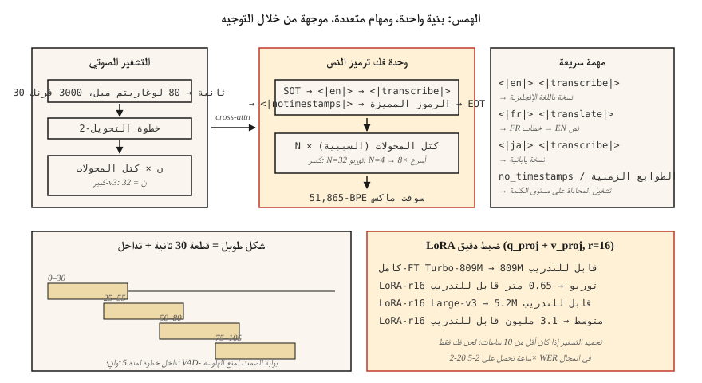

# Whisper — الهندسة المعمارية والضبط الدقيق
> Whisper عبارة عن وحدة فك ترميز وتشفير محولات نافذة مدتها 30 ثانية، تم تدريبها على 680 ألف ساعة من أزواج نصية صوتية متعددة اللغات ضعيفة الإشراف. بنية واحدة ومهام متعددة وقوية عبر 99 لغة. مرجع 2026 ASR.
**النوع:** بناء
** اللغات: ** بايثون
** المتطلبات الأساسية: ** المرحلة 6 · 04 (ASR)، المرحلة 5 · 10 (انتباه)، المرحلة 7 · 05 (محول كامل)
**الوقت:** ~75 دقيقة
## المشكلة
كان Whisper، الذي أصدرته OpenAI في سبتمبر 2022، هو أول نموذج ASR يتم طرحه كسلعة: لصق الصوت، والحصول على النص، و99 لغة، ومقاوم للضوضاء، ويعمل على جهاز كمبيوتر محمول. بحلول عام 2024، قامت OpenAI بشحن متغيرات Large-v3 وTurbo؛ بحلول عام 2026، سيكون Whisper هو خط الأساس الافتراضي لكل شيء بدءًا من نسخ البودكاست إلى المساعدين الصوتيين وحتى ترجمات YouTube.
لكن Whisper ليس خطًا يمكنك التعامل معه كصندوق أسود إلى الأبد. تغيير المجال يقتله - المصطلحات التقنية، لهجات المتحدث، أسماء العلم، المقاطع القصيرة، الصمت. عليك أن تعرف:
1. ما هو موجود بالداخل بالفعل.
2. كيفية تقديم صوت مقسم أو متدفق أو طويل بشكل صحيح.
3. متى يتم الضبط الدقيق وكيف.
##المفهوم

**الهندسة المعمارية.** وحدة تشفير وفك تشفير المحولات القياسية.
- الإدخال: مخطط طيفي log-mel لمدة 30 ثانية، 80 ميل، 10 مللي ثانية ← 3000 إطار. تكون المقاطع الأقصر غير مبطنة، بينما تكون المقاطع الأطول مقسمة.
- التشفير: تحويل العينة السفلية (الخطوة 2) + `N` كتل المحولات. بالنسبة إلى الإصدار 3 الكبير: 32 طبقة، 1280 درجة خافتة، 20 رأسًا.
- وحدة فك التشفير: `N` كتل المحولات ذات الاهتمام الذاتي السببي + الاهتمام المتبادل لإخراج التشفير. نفس حجم التشفير
- الإخراج: BPE الرموز المميزة لأكثر من 51,865 رمزًا مميزًا.
يحتوي Large-v3 على 1.55B من المعلمات. يستخدم Turbo وحدة فك ترميز مكونة من 4 طبقات (من 32)، مما يقلل زمن الوصول 8× بضربة <1% WER.
**تنسيق المطالبة.** Whisper هو نموذج متعدد المهام يتم توجيهه بواسطة رموز خاصة في موجه وحدة فك التشفير:
```
<|startoftranscript|><|en|><|transcribe|><|notimestamps|> Hello world.<|endoftext|>
```

- `<|en|>` — علامة اللغة؛ يفرض سلوك الترجمة مقابل النسخ.
- `<|transcribe|>` أو `<|translate|>` — ترجمة مخرجات اللغة الإنجليزية من أي لغة إدخال، أو حرفيًا.
- `<|notimestamps|>` — تخطي الطوابع الزمنية على مستوى الكلمة (أسرع).
الموجه هو ما يتيح لنموذج واحد القيام بالعديد من المهام. قم بتغيير `<|en|>` إلى `<|fr|>` وسيقوم بنسخ اللغة الفرنسية.
**نافذة مدتها 30 ثانية.** يتم تثبيت كل شيء في 30 ثانية. تحتاج المقاطع الأطول إلى التقطيع؛ المقاطع الأقصر مبطنة. لا يتم دفق Windows محليًا - وهذا هو سبب وجود WhisperX وWhisper-Streaming وfast-whisper.
**تسوية Log-mel.** `(log_mel - mean) / std` حيث تأتي الإحصائيات من مجموعة تدريبات Whisper الخاصة. *يجب* عليك استخدام المعالجة المسبقة لـ Whisper (`whisper.audio.log_mel_spectrogram`)، وليس `librosa.feature.melspectrogram`.
### المتغيرات في عام 2026
| البديل | بارامس | الكمون (A100) | WER (LibriSpeech-clean) |
|---------|-------|----------------|--------|
| صغير | 39 م | 1 × الوقت الحقيقي | 5.4% |
| قاعدة | 74 م | 1× | 4.1% |
| صغير | 244 م | 1× | 3.0% |
| متوسطة | 769 م | 1× | 2.7% |
| كبير-v3 | 1.55ب | 2× | 1.8% |
| كبير-v3-تيربو | 809 م | 8× | 1.58% |
| بث الهمس (2024) | 1.55ب | الجري | 2.0% |
### الكون المثالى
سير العمل الأساسي في عام 2026:
1. اجمع ما بين 10 إلى 100 ساعة من الصوت في المجال المستهدف مع النصوص المتوافقة.
2. قم بتشغيل `transformers.Seq2SeqTrainer` مع رد الاتصال `generate_with_loss`.
3. كفاءة المعلمة: تعمل LoRA على `q_proj`، `k_proj`، `v_proj` لطبقات الانتباه على تقليل ذاكرة GPU 4× بتكلفة <0.3 WER.
4. قم بتجميد جهاز التشفير إذا كان لديك أقل من 10 ساعات. ضبط وحدة فك التشفير فقط.
5. استخدم رمز Whisper الخاص وتنسيق المطالبة؛ لا تقم أبدًا بتبديل الرموز المميزة.
نتائج المجتمع: انخفاض متوسط ​​الضبط الدقيق لمدة 20 ساعة من الإملاء الطبي WER من 12% إلى 4.5% في المفردات الطبية. ضبط Turbo على 4 ساعات من القطرات الأيسلندية WER من 18% إلى 6%.
## بنائها
### الخطوة 1: قم بتشغيل Whisper خارج الصندوق
```python
import whisper
model = whisper.load_model("large-v3-turbo")
result = model.transcribe(
    "clip.wav",
    language="en",
    task="transcribe",
    temperature=0.0,
    condition_on_previous_text=False,  # prevents runaway repetition
)
print(result["text"])
for seg in result["segments"]:
    print(f"[{seg['start']:.2f}–{seg['end']:.2f}] {seg['text']}")
```

الإعدادات الافتراضية الرئيسية التي يجب عليك تجاوزها دائمًا: `temperature=0.0` (الإعدادات الافتراضية لأخذ العينات هي 0.0 → 0.2 → 0.4... سلسلة احتياطية)، `condition_on_previous_text=False` (تمنع مشكلة الهلوسة المتتالية)، و`no_speech_threshold=0.6` (اكتشاف الصمت).
### الخطوة 2: مقطعة إلى شكل طويل
```python
# whisperx is the 2026 reference for long-form with word-level timestamps
import whisperx
model = whisperx.load_model("large-v3-turbo", device="cuda", compute_type="float16")
segments = model.transcribe("1hour.mp3", batch_size=16, chunk_size=30)
```

يضيف WhisperX (1) بوابة Silero VAD، (2) محاذاة مستوى الكلمة عبر wav2vec 2.0، (3) التدوين عبر `pyannote.audio`. العمود الفقري لعام 2026 لنسخ الإنتاج.
### الخطوة 3: الضبط الدقيق باستخدام LoRA
```python
from transformers import WhisperForConditionalGeneration, WhisperProcessor
from peft import LoraConfig, get_peft_model

model = WhisperForConditionalGeneration.from_pretrained("openai/whisper-large-v3-turbo")
lora = LoraConfig(
    r=16, lora_alpha=32, target_modules=["q_proj", "v_proj"],
    lora_dropout=0.1, bias="none", task_type="SEQ_2_SEQ_LM",
)
model = get_peft_model(model, lora)
# model.print_trainable_parameters()  -> ~3M trainable / 809M total
```

ثم حلقة المدرب القياسية. نقطة تفتيش كل 1000 خطوة. قم بالتقييم باستخدام WER في حالة الانتظار.
### الخطوة 4: فحص ما تتعلمه كل طبقة
```python
# Grab cross-attention weights during decode to see what the decoder attends to.
with torch.inference_mode():
    out = model.generate(
        input_features=features,
        return_dict_in_generate=True,
        output_attentions=True,
    )
# out.cross_attentions: layer × head × step × src_len
```

تصور باستخدام خريطة التمثيل اللوني - ستشاهد محاذاة قطرية أثناء مسح خطوات وحدة فك التشفير عبر إطارات التشفير. هذا القطر هو مفهوم Whisper للطوابع الزمنية للكلمات.
## استخدمه
مكدس 2026:
| الوضع | اختر |
|-----------|------|
| اللغة الإنجليزية العامة، غير متصل | كبير-v3-توربو عبر `whisperx` |
| الجوال / الحافة | الهمس الصغير الكمي (int8) أو Moonshine |
| متعدد اللغات شكل طويل | Large-v3 عبر `whisperx` + diarization |
| لغة منخفضة الموارد | ضبط متوسط ​​أو توربو باستخدام LoRA |
| البث (زمن الوصول 2 ثانية) | الهمس-البث أو الببغاء-TDT |
| الطوابع الزمنية على مستوى الكلمة | WhisperX (المحاذاة القسرية عبر wav2vec 2.0) |
`faster-whisper` (CTranslate2 backend) هو أسرع CPU+GPU وقت تشغيل الاستدلال في عام 2026 - أسرع 4 مرات من الفانيليا مع إخراج مماثل.
## المزالق التي لا تزال تشحن في عام 2026
- **نص مهلوس على الصمت.** تدريب الهمس على التسميات التوضيحية يتضمن "شكرًا على المشاهدة!"، "اشترك!"، وكلمات الأغاني. دائمًا VAD-البوابة قبل الاتصال.
- **`condition_on_previous_text` تتالي.** هلوسة واحدة تلوث النوافذ اللاحقة. قم بتعيين `False` إلا إذا كنت بحاجة إلى الطلاقة عبر الأجزاء.
- **حشوة للمقطع القصير.** يمكن أن يؤدي المقطع الذي تبلغ مدته ثانيتين وتمتد إلى 30 ثانية إلى الهلوسة في الصمت المؤخر. استخدم `pad=False` أو VAD-البوابة.
- ** إحصائيات ميل خاطئة. ** يؤدي استخدام ميلز librosa بدلاً من إحصائيات Whisper إلى إنتاج نتائج شبه عشوائية. استخدم `whisper.audio.log_mel_spectrogram`.
## اشحنها
احفظ باسم `outputs/skill-whisper-tuner.md`. صمم خط Whisper الدقيق أو الاستدلال pipeline لمجال معين.
## تمارين
1. **سهل.** قم بتشغيل `code/main.py`. فهو يقوم بترميز موجه بأسلوب Whisper، ويحسب ميزانيات الشكل التي تم فك تشفيرها، ويطبع جدول القطعة لمقطع مدته 10 دقائق.
2. **متوسط.** قم بتثبيت `faster-whisper`، ونسخ بودكاست مدته 10 دقائق، ومقارنة WER بالنص البشري. جرب `language="auto"` مقابل `language="en"` القسري.
3. **صعب.** باستخدام HF `datasets`، اختر لغة يصعب على Whisper التعامل معها (على سبيل المثال، الأردية)، وقم بضبط الوسيط باستخدام LoRA لمدة حقبتين في ساعتين، وأبلغ عن WER دلتا.
## المصطلحات الرئيسية
| مصطلح | ماذا يقول الناس | ماذا يعني في الواقع |
|------|-|--------------------------------------|
| نافذة 30 ثانية | حد الهمس | غطاء الإدخال الثابت؛ قطعة صوت أطول. |
| SOT | بداية النص | `<|startoftranscript|>` يبدأ تشغيل موجه وحدة فك الترميز. |
| رمز الطوابع الزمنية | المحاذاة الزمنية | كل إزاحة 0.02 ثانية هي رمز خاص في المفردات البالغ عددها 51 ألفًا. |
| توربو | البديل السريع | 4-طبقات فك التشفير، 8× أسرع، <1% WER الانحدار. |
| ويسبر اكس | الغلاف الطويل | VAD + همس + محاذاة wav2vec + تدوين. |
| لورا صقل | ضبط فعال | إضافة محولات ذات رتبة منخفضة إلى الاهتمام؛ تدريب ~ 0.3٪ من المعلمات. |
| هلوسة | الفشل الصامت | ينتج Whisper اللغة الإنجليزية بطلاقة من الضوضاء/الصمت. |
## مزيد من القراءة
- [Radford et al. (2022). Whisper paper](https://arxiv.org/abs/2212.04356) — البنية الأصلية ووصفة التدريب.
- [OpenAI (2024). Whisper Large-v3-turbo release](https://github.com/openai/whisper/discussions/2363) — وحدة فك ترميز ذات 4 طبقات، سرعة 8×.
- [Bain et al. (2023). WhisperX](https://arxiv.org/abs/2303.00747) — صيغة طويلة، محاذية للكلمات، مُدوَّنة في اليوميات.
- [Systran — faster-whisper repo](https://github.com/SYSTRAN/faster-whisper) — CTranslate2 مدعوم، 4× أسرع.
- [HuggingFace — Whisper fine-tune tutorial](https://huggingface.co/blog/fine-tune-whisper) — إرشادات LoRA الأساسية / FT الكاملة.