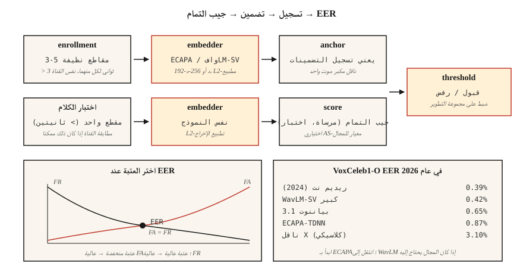

# التعرف على المتحدث والتحقق منه
> ASR يسأل "ماذا قالوا؟" التعرف على المتحدث يسأل "من قال ذلك؟" تبدو الرياضيات متشابهة - التضمينات بالإضافة إلى جيب التمام - ولكن كل قرار إنتاج يعتمد على رقم EER واحد.
**النوع:** بناء
** اللغات: ** بايثون
**المتطلبات الأساسية:** المرحلة 6 · 02 (المخططات الطيفية والميل)، المرحلة 5 · 22 (نماذج التضمين)
**الوقت:** ~45 دقيقة
## المشكلة
يقول المستخدم عبارة مرور. تريد أن تعرف: هل هذا هو الشخص الذي يدعون أنه (*التحقق*، 1:1)، أم أنه أول شخص في بنك التسجيل الخاص بك (*التعريف*، 1:N)؟ أو لا - هل هذا متحدث غير معروف (*مجموعة مفتوحة*)؟
ما قبل 2018: GMM-UBM + ناقلات i. معقول EER ولكنه هش بالنسبة لتغير القناة (الهاتف مقابل الكمبيوتر المحمول) والعاطفة. 2018-2022: ناقلات x (TDNN عمود فقري مُدرب بهامش زاوي). 2022+: ECAPA-TDNN والتضمينات الكبيرة WavLM. بحلول عام 2026، سيهيمن على هذا المجال ثلاثة نماذج ومقياس واحد.
المقياس هو **EER** — معدل الخطأ المتساوي. قم بتعيين حد القرار الخاص بك بحيث يكون معدل القبول الخاطئ = معدل الرفض الخاطئ. التقاطع هو EER. يتم استخدامها في كل ورقة، وكل لوحة متصدرين، وكل مكالمة شراء.
##المفهوم

**خط pipeline.** التسجيل: قم بتسجيل 5-30 ثانية للمتحدث المستهدف؛ حساب التضمين ذو البعد الثابت (192-d لـ ECAPA-TDNN، 256-d لـ WavLM-large). التحقق: الحصول على تضمين كلام الاختبار؛ حساب تشابه جيب التمام؛ قارن إلى عتبة.
**ECAPA-TDNN (2020، لا يزال سائدًا في 2026).** التركيز على انتباه القناة وانتشارها وتجميعها - الشبكة العصبية ذات التأخير الزمني. كتل تحويل 1D مع إثارة الضغط، وتجميع الانتباه متعدد الرؤوس، تليها طبقة خطية إلى 192 د. تم التدريب على VoxCeleb 1+2 (2700 مكبر صوت، 1.1 مليون كلمة) مع فقدان الهامش الزاوي الإضافي (AAM-softmax).
**WavLM-SV (2022+).** قم بضبط العمود الفقري SSL الكبير المُدرب مسبقًا مع خسارة AAM. جودة أعلى ولكن أبطأ — 300+ MB مقابل 15 MB.
**x-vector (خط الأساس).** TDNN + تجميع الإحصائيات. كلاسيكي؛ لا يزال مفيدًا على CPU / edge.
**AAM-softmax.** softmax قياسي مع هامش إضافي `m` في المساحة الزاوية: `cos(θ + m)` للفئة الصحيحة. يفرض الفصل الزاوي بين الطبقات. نموذجي `m=0.2`، مقياس `s=30`.
### التهديف
- **جيب التمام** بين التسجيل والاختبار. القرار على أساس العتبة.
- **PLDA (احتمالية LDA).** تضمين المشروع في مساحة كامنة حيث يكون للمتحدث نفسه مقابل متحدث مختلف نسبة احتمالية مغلقة. تمت إضافته فوق جيب التمام لتخفيض +10–20% EER. قياسي قبل عام 2020؛ يستخدم الآن فقط في إعدادات المجموعة المغلقة.
- **تسوية النتيجة.** `S-norm` أو `AS-norm`: تسوية كل نتيجة مقابل مجموعة من الوسائل والمعايير المحتالة. ضروري للتقييم عبر المجال.
### أرقام يجب أن تعرفها (2026)
| نموذج | VoxCeleb1-O EER | بارامس | الإنتاجية (A100) |
|-------|-----------------|--------|------------------|
| س-ناقل (كلاسيكي) | 3.10% | 5 م | 400× RT |
| ECAPA-TDNN | 0.87% | 15 م | 200× RT |
| WavLM-SV كبير | 0.42% | 316 م | 20× RT |
| بيانوت 3.1 تجزئة + تضمين | 0.65% | 6 م | 100× RT |
| ريديم نت (2024) | 0.39% | 24 م | 100× RT |
### دياريزايشن
"من تكلم متى" في مقطع متعدد مكبرات الصوت. خط الأنابيب: VAD → مقطع → تضمين كل مقطع → مجموعة (تكتلية أو طيفية) → حدود ناعمة. المكدس الحديث: `pyannote.audio` 3.1، الذي يجمع تجزئة السماعات + التضمين + التجميع خلف مكالمة واحدة. 2026 SOTA DER في AMI تبلغ حوالي 15% (انخفاضًا من 23% في عام 2022).
## بنائها
### الخطوة 1: تضمين اللعبة من إحصائيات MFCC
```python
def embed_mfcc_stats(signal, sr):
    frames = featurize_mfcc(signal, sr, n_mfcc=13)
    mean = [sum(f[i] for f in frames) / len(frames) for i in range(13)]
    std = [
        math.sqrt(sum((f[i] - mean[i]) ** 2 for f in frames) / len(frames))
        for i in range(13)
    ]
    return mean + std  # 26-d
```

ليس SOTA بمسافة ميل — للتدريس فقط. يستخدم `code/main.py` هذا كدليل على صحة بيانات المتحدث الاصطناعية.
### الخطوة 2: تشابه جيب التمام + العتبة
```python
def cosine(a, b):
    dot = sum(x * y for x, y in zip(a, b))
    na = math.sqrt(sum(x * x for x in a))
    nb = math.sqrt(sum(x * x for x in b))
    return dot / (na * nb) if na and nb else 0.0

def verify(enroll, test, threshold=0.75):
    return cosine(enroll, test) >= threshold
```

### الخطوة 3: EER من أزواج التشابه
```python
def eer(same_scores, diff_scores):
    thresholds = sorted(set(same_scores + diff_scores))
    best = (1.0, 1.0, 0.0)  # (fa, fr, threshold)
    for t in thresholds:
        fr = sum(1 for s in same_scores if s < t) / len(same_scores)
        fa = sum(1 for s in diff_scores if s >= t) / len(diff_scores)
        if abs(fa - fr) < abs(best[0] - best[1]):
            best = (fa, fr, t)
    return (best[0] + best[1]) / 2, best[2]
```

إرجاع (eer، عتبة_at_eer). الإبلاغ عن كليهما.
### الخطوة 4: الإنتاج باستخدام SpeechBrain
```python
from speechbrain.pretrained import EncoderClassifier

clf = EncoderClassifier.from_hparams(source="speechbrain/spkrec-ecapa-voxceleb")

# enroll: average the embeddings of 3-5 clean samples
enroll = torch.stack([clf.encode_batch(load(x)) for x in enrollment_clips]).mean(0)
# verify
score = clf.similarity(enroll, clf.encode_batch(load("test.wav"))).item()
verdict = score > 0.25   # ECAPA typical threshold; tune on your data
```

### الخطوة 5: قم بتدوين اليوميات باستخدام البيانونوت
```python
from pyannote.audio import Pipeline

pipe = Pipeline.from_pretrained("pyannote/speaker-diarization-3.1")
diarization = pipe("meeting.wav", num_speakers=None)
for turn, _, speaker in diarization.itertracks(yield_label=True):
    print(f"{turn.start:.1f}–{turn.end:.1f}  {speaker}")
```

## استخدمه
مكدس 2026:
| الوضع | اختر |
|-----------|------|
| التحقق من المجموعة المغلقة 1:1، الحافة | ECAPA-TDNN + عتبة جيب التمام |
| التحقق من المجموعة المفتوحة، السحابة | WavLM-SV + AS-نورم |
| يوميات (اجتماعات، بودكاست) | `pyannote/speaker-diarization-3.1` |
| مكافحة الانتحال (إعادة التشغيل / كشف التزييف العميق) | AASIST أو RawNet2 |
| صغير مضمن (KWS + التسجيل) | تيتانيت-صغير (نيمو) |
## مطبات
- ** عدم تطابق القناة. ** النموذج الذي تم تدريبه على VoxCeleb (فيديو الويب) ≠ صوت المكالمات الهاتفية. قم بالتقييم دائمًا على القناة المستهدفة.
- **الألفاظ القصيرة.** EER يتدهور بشكل حاد أقل من 3 ثوانٍ من اختبار الصوت.
- ** التسجيل مع الضوضاء. ** تسجيل واحد صاخب يسمم المرساة. استخدم ≥3 عينات نظيفة ومتوسطة.
- **حد ثابت عبر الشروط.** قم دائمًا بضبط الحد على مجموعة التطوير المعلقة من المجال الهدف.
- **جيب التمام على التضمينات غير المقيسة.** L2-التطبيع أولاً؛ وإلا فإن الحجم هو المسيطر.
## اشحنها
احفظ باسم `outputs/skill-speaker-verifier.md`. اختر النموذج وبروتوكول التسجيل وخطة ضبط العتبة والضمانات ضد الاحتيال.
## تمارين
1. **سهل.** قم بتشغيل `code/main.py`. يبني "مكبرات صوت" اصطناعية (ملفات تعريف نغمات مختلفة)، ويسجل، ويحسب EER في قائمة تجريبية مكونة من 100 زوج.
2. **متوسط.** استخدم SpeechBrain ECAPA على 30 عبارة VoxCeleb1 (5 مكبرات صوت × 6 لكل منهما). حساب EER مع جيب التمام مقابل PLDA.
3. **صعب.** قم بإنشاء التسجيل الكامل → مذكرات → التحقق من pipeline باستخدام `pyannote.audio`. قم بتقييم DER في مجموعة التطوير AMI.
## المصطلحات الرئيسية
| مصطلح | ماذا يقول الناس | ماذا يعني في الواقع |
|------|-|--------------------------------------|
| EER | مقياس العنوان | العتبة حيث القبول الخاطئ = الرفض الخاطئ. |
| التحقق | 1:1 | "هل هذه أليس؟" |
| تحديد الهوية | 1: ن | "من المتحدث؟" |
| مجموعة مفتوحة | ممكن غير معروف | يمكن أن تحتوي مجموعة الاختبار على مكبرات صوت غير مسجلة. |
| التسجيل | التسجيل | حساب التضمين المرجعي للمتحدث. |
| AAM-سوفت ماكس | الخسارة | Softmax مع هامش زاوي إضافي؛ قوى فصل الكتلة. |
| __المصطلح_2__ | التهديف الكلاسيكي | احتمالية LDA; تسجيل نسبة الاحتمالية أعلى التضمينات. |
| DER | مقياس Diarization | معدل الخطأ في Diarization - ملكة جمال + إنذار كاذب + ارتباك. |
## مزيد من القراءة
- [Snyder et al. (2018). X-Vectors: Robust DNN Embeddings for Speaker Recognition](https://www.danielpovey.com/files/2018_icassp_xvectors.pdf) — ورق التضمين العميق الكلاسيكي.
- [Desplanques et al. (2020). ECAPA-TDNN](https://arxiv.org/abs/2005.07143) — العمارة السائدة 2020-2026.
- [Chen et al. (2022). WavLM: Large-Scale Self-Supervised Pre-Training for Full Stack Speech Processing](https://arxiv.org/abs/2110.13900) — SSL العمود الفقري لـ SV والمذكرات.
- [Bredin et al. (2023). pyannote.audio 3.1](https://github.com/pyannote/pyannote-audio) — ترسيم الإنتاج + تضمين المكدس.
- [VoxCeleb leaderboard (updated 2026)](https://www.robots.ox.ac.uk/~vgg/data/voxceleb/) — ترتيب EER الحالي عبر النماذج.