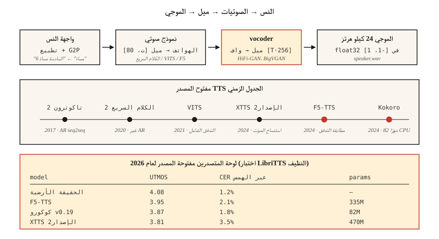

# تحويل النص إلى كلام (TTS) — من Tacotron إلى F5 وKokoro
> ASR يحول الكلام إلى نص؛ TTS يحول النص إلى كلام. تتكون حزمة 2026 من ثلاثة أجزاء: النص ← الرموز المميزة، الرموز المميزة ← ميل، ميل ← شكل الموجة. يحتوي كل جزء على نموذج افتراضي يناسب جهاز الكمبيوتر المحمول.
**النوع:** بناء
** اللغات: ** بايثون
** المتطلبات الأساسية: ** المرحلة 6 · 02 (المخططات الطيفية والميل)، المرحلة 5 · 09 (Seq2Seq)، المرحلة 7 · 05 (محول كامل)
**الوقت:** ~75 دقيقة
## المشكلة
لديك سلسلة: "من فضلك ذكرني بسقي النباتات الساعة 6 مساءً." أنت بحاجة إلى مقطع صوتي مدته 3 ثوانٍ يبدو طبيعيًا، ويحتوي على نغمات صحيحة (إيقاف مؤقت، نبر)، وينطق كلمة "نباتات" بحرف العلة الصحيح، ويعمل في أقل من 300 مللي ثانية على CPU لمساعد صوتي مباشر. تحتاج أيضًا إلى تبديل الأصوات، والتعامل مع الإدخال بتبديل التعليمات البرمجية ("ذكّرني الساعة 6 مساءً، دايجوبو؟")، وعدم إحراج نفسك بالأسماء.
تبدو خطوط TTS pipeline الحديثة كما يلي:
1. **الواجهة الأمامية للنص.** تطبيع النص (التواريخ والأرقام ورسائل البريد الإلكتروني)، وتحويله إلى مقاطع صوتية أو رموز كلمات فرعية، والتنبؤ بميزات العروض.
2. **نموذج صوتي.** نص → ميل الطيفي. تاكوترون 2 (2017)، فاست سبيتش 2 (2020)، VITS (2021)، F5-TTS (2024)، كوكورو (2024).
3. **مشفر صوتي.** ميل → الموجي. WaveNet (2016)، WaveRNN، HiFi-GAN (2020)، BigVGAN (2022)، برامج الترميز الصوتي العصبية في 2024+.
في عام 2026، يتم طمس الانقسام الصوتي + المشفر الصوتي من خلال الانتشار الشامل ونماذج مطابقة التدفق. لكن النموذج العقلي المكون من ثلاثة أجزاء لا يزال صالحًا لتصحيح الأخطاء.
##المفهوم

**Tacotron 2 (2017).** Seq2seq: تضمين الأحرف ← أداة تشفير BiLSTM ← انتباه حساس للموقع ← وحدة فك ترميز الانحدار الذاتي LSTM تنبعث منها إطارات ميل. بطيء (AR)، متذبذب في النص الطويل. لا يزال يُستشهد به كخط أساس.
**FastSpeech 2 (2020).** غير انحداري. يقوم مؤشر المدة بإخراج عدد الإطارات التي يحصل عليها كل صوت. تمريرة واحدة أسرع بـ 10 مرات من التاكوترون. يفقد بعض طبيعته (محاذاة رتيبة) ولكنه يشحن في كل مكان.
**VITS (2021).** يقوم بتدريب برنامج التشفير بشكل مشترك + المدة المستندة إلى التدفق + HiFi-GAN المشفر الصوتي من طرف إلى طرف مع الاستدلال المتغير. جودة عالية، موديل واحد. المصدر المفتوح المهيمن TTS 2022-2024. المتغيرات: YourTTS (مكبرات صوت متعددة بدون لقطة)، XTTS الإصدار 2 (2024، Coqui).
**F5-TTS (2024).** محول الانتشار على مطابقة التدفق. نغمات طبيعية، استنساخ صوتي بدون لقطة مع 5 ثوانٍ من الصوت المرجعي. أعلى لوحات المتصدرين مفتوحة المصدر TTS لعام 2026. 335 مليون معلمة.
**Kokoro (2024).** صغير (82 شهرًا)، CPU-قابل للتشغيل، وأفضل لغة إنجليزية في فئتها TTS للاستخدام في الوقت الفعلي. مفردات مغلقة باللغة الإنجليزية فقط، Apache-2.0.
**OpenAI TTS-1-HD، ElevenLabs v2.5، Google Chirp-3.** أحدث التقنيات التجارية. تهيمن علامات العاطفة الإصدار 2.5 من ElevenLabs ("[همس]" و"[يضحك]") وأصوات الشخصيات على إنتاج الكتب الصوتية في عام 2026.
### تطور المشفر الصوتي
| العصر | مشفر صوتي | الكمون | الجودة |
|-----|---------|---------|---------|
| 2016 | ويف نت | متواجد حاليا فقط | SOTA عند الإصدار |
| 2018 | ويفرن | ~الوقت الحقيقي | جيد |
| 2020 | هاي فاي-GAN | 100 × الوقت الحقيقي | قريب من الإنسان |
| 2022 | بيجفجان | 50 × الوقت الحقيقي | تعميم عبر المتحدثين/اللغات |
| 2024 | SNAC، DAC (برامج الترميز العصبية) | متكامل مع نماذج AR | الرموز المنفصلة، ​​ذات كفاءة بت |
بحلول عام 2026، أصبحت معظم نماذج "TTS" شاملة من النص إلى الشكل الموجي؛ الرسم الطيفي ميل هو تمثيل داخلي.
### تقييم
- **MOS (متوسط ​​درجة الرأي).** مقياس من 1 إلى 5، من مصادر جماعية. لا يزال المعيار الذهبي. بطيئة بشكل مؤلم.
- **CMOS (المقارن MOS).** التفضيل A-vs-B. فترات ثقة أكثر صرامة لكل تعليق توضيحي.
- **UTMOS، DNSMOS.** تنبؤات عصبية خالية من المراجع MOS. تستخدم للمتصدرين.
- **CER (معدل خطأ الأحرف) عبر ASR.** قم بتشغيل إخراج TTS من خلال Whisper، وحساب CER مقابل النص المُدخل. وكيل للوضوح.
- **SECS (تشابه جيب التمام مع مكبر الصوت).** جودة استنساخ الصوت.
أرقام 2026 في اختبار LibriTTS النظيف:
| نموذج | UTMOS | CER (عبر الهمس) | الحجم |
|-------|-------|------------------|------|
| الحقيقة الارضية | 4.08 | 1.2% | — |
| F5-TTS | 3.95 | 2.1% | 335 م |
| XTTS v2 | 3.81 | 3.5% | 470 م |
| __المصطلح_5__ | 3.62 | 3.1% | 25 م |
| كوكورو v0.19 | 3.87 | 1.8% | 82 م |
| بارلر-TTS كبير | 3.76 | 2.8% | 2.3ب |
## بنائها
### الخطوة 1: إدخال الصوت
```python
from phonemizer import phonemize
ph = phonemize("Hello world", language="en-us", backend="espeak")
# 'həloʊ wɜːld'
```

الصوتيات هي الجسر العالمي. تجنب تغذية النص الخام إلى أي شيء أقل من مستوى الجودة VITS.
### الخطوة 2: تشغيل Kokoro (2026 CPU الافتراضي)
```python
from kokoro import KPipeline
tts = KPipeline(lang_code="a")  # "a" = American English
audio, sr = tts("Please remind me to water the plants at 6 pm.", voice="af_bella")
# audio: float32 tensor, sr=24000
```

يعمل دون اتصال، ملف واحد، 82 مليون معلمة.
### الخطوة 3: تشغيل F5-TTS مع استنساخ الصوت
```python
from f5_tts.api import F5TTS
tts = F5TTS()
wav = tts.infer(
    ref_file="my_voice_5s.wav",
    ref_text="The quick brown fox jumps over the lazy dog.",
    gen_text="Please remind me to water the plants.",
)
```

تمرير مقطع مرجعي مدته 5 ثوانٍ + نصه؛ F5 استنساخ العروض والجرس.
### الخطوة 4: HiFi-GAN مشفر صوتي من الصفر
كبير جدًا بحيث لا يمكن احتواؤه في برنامج نصي تعليمي، ولكن الشكل هو:
```python
class HiFiGAN(nn.Module):
    def __init__(self, mel_channels=80, upsample_rates=[8, 8, 2, 2]):
        super().__init__()
        # 4 upsample blocks, total 256x to go from mel-rate to audio-rate
        ...
    def forward(self, mel):
        return self.blocks(mel)  # -> waveform
```

التدريب: الخصومة (التمييز على النوافذ القصيرة) + فقدان إعادة بناء الطيف الطيفي + فقدان مطابقة الميزات. سلعة - استخدم نقاط التفتيش المدربة مسبقًا من `hifi-gan` repo أو nvidia-NeMo.
### الخطوة 5: سطر pipe الكامل (الرمز الكاذب)
```python
text = "Please remind me at 6 pm."
phones = phonemize(text)
mel = acoustic_model(phones, speaker=alice)      # [T, 80]
wav = vocoder(mel)                                # [T * 256]
soundfile.write("out.wav", wav, 24000)
```

## استخدمه
مكدس 2026:
| الوضع | اختر |
|-----------|------|
| مساعد صوت إنجليزي في الوقت الحقيقي | كوكورو (CPU) أو XTTS الإصدار 2 (GPU) |
| استنساخ الصوت من مرجع 5 ثواني | F5-TTS |
| أصوات الطابع التجاري | أحد عشر مختبرا v2.5 |
| رواية كتاب مسموع | ElevenLabs v2.5 أو XTTS v2 + ضبط دقيق |
| لغة منخفضة الموارد | تدريب VITS على بيانات اللغة المستهدفة لمدة 5-20 ساعة |
| العلامات التعبيرية / العاطفية | ElevenLabs v2.5 أو StyleTTS 2 الضبط الدقيق |
رائدة المصادر المفتوحة اعتبارًا من عام 2026: **F5-TTS للجودة، وKokoro للكفاءة**. لا تصل إلى Tacotron إلا إذا كنت مؤرخًا.
## مطبات
- **لا يوجد أداة تسوية النص.** تتم قراءة "Dr. Smith" كـ "Doctor" أو "Drive"؟ "2026" كـ "ستة وعشرون" أو "اثنان صفر اثنان ستة"؟ تطبيع BEFORE phonemizer.
- **OOV الأسماء الصحيحة.** "غوماري" → "غيو مير"؟ قم بشحن نموذج احتياطي من حرف إلى صوت لرموز غير معروفة.
- **القصاصة.** نادرًا ما يتم قطع مخرجات المشفر الصوتي، ولكن عدم تطابق القياس الدقيق عند الاستدلال يمكن أن يتجاوز ±1.0. دائمًا `np.clip(wav, -1, 1)`.
- **عدم تطابق معدل العينة.** مخرجات Kokoro 24 كيلو هرتز؛ يتوقع خط pipeline المصب الخاص بك 16 كيلو هرتز → إعادة تشكيل أو الحصول على اسم مستعار.
## اشحنها
احفظ باسم `outputs/skill-tts-designer.md`. صمم TTS pipeline لهدف معين للصوت وزمن الوصول واللغة.
## تمارين
1. **سهل.** قم بتشغيل `code/main.py`. يبني قاموسًا صوتيًا من مفردات اللعبة، ويقدر المدة لكل صوت، ويطبع جدول "ميل" مزيفًا.
2. **متوسط.** قم بتثبيت Kokoro، وقم بتجميع نفس الجملة بصوت `af_bella` و`am_adam`. قارن فترات الصوت والجودة الذاتية.
3. **صعب.** سجّل مقطعًا مرجعيًا لنفسك مدته 5 ثوانٍ. استخدم F5-TTS لاستنساخه. تقرير SECS بين المرجع والإخراج المستنسخ.
## المصطلحات الرئيسية
| مصطلح | ماذا يقول الناس | ماذا يعني في الواقع |
|------|-|--------------------------------------|
| صوت | وحدة الصوت | فئة الصوت مجردة. 39 باللغة الإنجليزية (ARPABet). |
| توقع المدة | كم من الوقت يستمر كل صوت | إخراج نموذج غير AR؛ إطارات عدد صحيح لكل صوت. |
| مشفر صوتي | ميل → الموجي | رسم خرائط الشبكة العصبية بمواصفات ميل للعينات الخام. |
| هاي فاي-GAN | مشفر صوتي قياسي | GAN-مستند؛ المهيمنة 2020-2024. |
| __المصطلح_3__ | الجودة الذاتية | 1-5 يعني درجة الرأي من المقيمين البشر. |
| SECS | مقياس استنساخ الصوت | تشابه جيب التمام بين تضمين مكبر الصوت المستهدف والإخراج. |
| F5-TTS | 2024 مفتوح المصدر SOTA | انتشار مطابقة التدفق؛ الاستنساخ بدون طلقة. |
| كوكورو | CPU قائد إنجليزي | نموذج 82M-param، أباتشي 2.0. |
## مزيد من القراءة
- [Shen et al. (2017). Tacotron 2](https://arxiv.org/abs/1712.05884) — خط الأساس seq2seq.
- [Kim, Kong, Son (2021). VITS](https://arxiv.org/abs/2106.06103) — يعتمد على التدفق الشامل.
- [Chen et al. (2024). F5-TTS](https://arxiv.org/abs/2410.06885) — المصدر المفتوح الحالي SOTA.
- [Kong, Kim, Bae (2020). HiFi-GAN](https://arxiv.org/abs/2010.05646) — المشفر الصوتي الذي لا يزال يُشحن في عام 2026.
- [Kokoro-82M on HuggingFace](https://huggingface.co/hexgrad/Kokoro-82M) — 2024 CPU اللغة الإنجليزية الصديقة TTS.