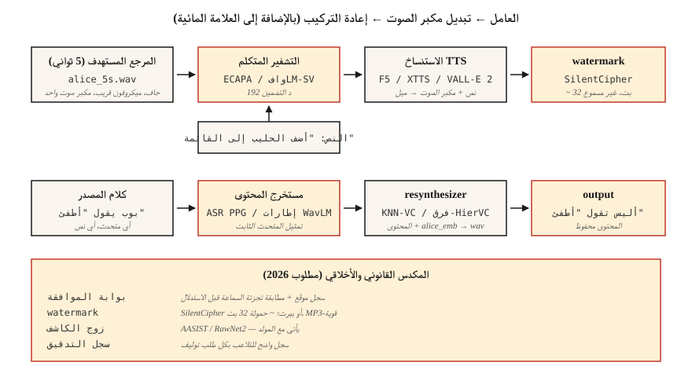

# استنساخ الصوت وتحويل الصوت
> يقوم استنساخ الصوت بقراءة النص الخاص بك بصوت شخص آخر. يقوم تحويل الصوت بإعادة كتابة صوتك إلى صوت شخص آخر مع الحفاظ على ما قلته. كلاهما معلق على نفس البدائية: هوية المتحدث منفصلة عن المحتوى.
**النوع:** بناء
** اللغات: ** بايثون
**المتطلبات الأساسية:** المرحلة 6 · 06 (التعرف على المتحدث)، المرحلة 6 · 07 (TTS)
**الوقت:** ~75 دقيقة
## المشكلة
في عام 2026، يكفي مقطع صوتي مدته 5 ثوانٍ لإنتاج نسخة عالية الجودة من صوت أي شخص مع المستهلك GPU. ElevenLabs، F5-TTS، OpenVoice v2، VoiceBox جميعها تقدم استنساخًا بدون لقطة أو استنساخ قليل الطلقة. التكنولوجيا نعمة (إمكانية الوصول TTS، الدبلجة، الأصوات المساعدة) وسلاح (مكالمات احتيال، تزييف سياسي عميق، IP سرقة).
مهمتان مترابطتان بشكل وثيق:
- **استنساخ الصوت (TTS-side):** نص + صوت مرجعي مدته 5 ثوانٍ → صوت بهذا الصوت.
- **تحويل الصوت (جانب الكلام):** مصدر الصوت (الشخص "أ" يقول "X") + الصوت المرجعي للشخص "ب" → صوت "ب" يقول "X".
يقوم كلاهما بتحليل شكل موجة إلى (المحتوى، ومكبر الصوت، والعروض) ويعيدان دمج المحتوى من مصدر واحد مع مكبر صوت من مصدر آخر.
القيد الرئيسي الذي تشحن بموجبه الآن في عام 2026: **العلامات المائية وبوابات الموافقة مطلوبة قانونًا في EU (قانون AI، واجب النفاذ في أغسطس 2026) وفي كاليفورنيا (AB 2905، ساري المفعول في 2025)**. يجب أن يصدر خط pipeline الخاص بك علامة مائية غير مسموعة ويرفض النسخ غير التوافقية.
##المفهوم

**استنساخ بدون لقطة.** قم بتمرير مقطع مدته 5 ثوانٍ إلى نموذج تم تدريبه على آلاف المتحدثين. يقوم برنامج تشفير السماعة بتعيين المقطع إلى مكبر الصوت المضمن؛ شروط وحدة فك الترميز TTS على هذا النص بالإضافة إلى التضمين.
مستخدم بواسطة: F5-TTS (2024)، YourTTS (2022)، XTTS v2 (2024)، OpenVoice v2 (2024).
**ضبط دقيق لعدد قليل من اللقطات.** سجل 5-30 دقيقة من الصوت المستهدف. LoRA-ضبط النموذج الأساسي لمدة ساعة. تقفز الجودة من "جيد" إلى "لا يمكن تمييزه". يدعم كل من Coqui وElevenLabs هذا النمط؛ يستخدمه المجتمع مع F5-TTS.
**التحويل الصوتي (VC).** عائلتين:
- **تركيب التعرف.** قم بتشغيل نموذج يشبه ASR لاستخراج تمثيل المحتوى (على سبيل المثال، الأصوات الخلفية الصوتية الناعمة، PPGs)، ثم إعادة التركيب باستخدام تضمين المتحدث المستهدف. قوي في اللغة واللهجة. مستخدم بواسطة KNN-VC (2023)، Diff-HierVC (2023).
- **الانفصال.** قم بتدريب جهاز تشفير تلقائي يفصل بين المحتوى والمتحدث والعروض في المساحة الكامنة عند عنق الزجاجة. تبديل تضمين مكبر الصوت عند الاستدلال. جودة أقل ولكن أسرع. مستخدم بواسطة AutoVC (2019)، متغيرات VITS-VC.
**الاستنساخ القائم على برنامج الترميز العصبي (2024+).** VALL-E، VALL-E 2، NaturalSpeech 3، VoiceBox - تعامل مع الصوت كرموز مميزة منفصلة من SoundStream / EnCodec، وقم بتدريب نموذج انحدار ذاتي كبير أو نموذج مطابق للتدفق عبر رموز برنامج الترميز. جودة مماثلة لـ ElevenLabs في المطالبات القصيرة.
### الجزء الأخلاقي، وليس الترباس
**العلامة المائية.** يقوم PerTh (Perth) وSilentCipher (2024) بتضمين ~16-32 بت ID بشكل غير محسوس في الصوت. ينجو من إعادة التشفير والبث والتحريرات الشائعة. مفتوحة المصدر جاهزة للإنتاج.
**بوابات الموافقة.** يجب إقران كل مخرجات مستنسخة بسجل موافقة يمكن التحقق منه. "أنا، روهيت، بتاريخ 22/04/2026، أأذن بهذا الصوت لغرض X." تخزينها في سجل واضح للتلاعب.
**الكشف.** يتم شحن AASIST وRawNet2 وWav2Vec2-AASIST ككاشفات. نشر تحدي ASVspoof 2025 معدلات كفاءة الأداء (EER) بنسبة 0.8-2.3% لأجهزة الكشف الحديثة ضد ElevenLabs وVALL-E 2 ومخرجات Bark.
### أرقام (2026)
| نموذج | طلقة صفر؟ | SECS (شريحة الهدف) | WER (إنتل) | بارامس |
|-------|-----------|--------------------|--------------|--------|
| F5-TTS | نعم | 0.72 | 2.1% | 335 م |
| XTTS v2 | نعم | 0.65 | 3.5% | 470 م |
| الصوت المفتوح v2 | نعم | 0.70 | 2.8% | 220 م |
| VALL-هـ 2 | نعم | 0.77 | 2.4% | 370 م |
| صندوق الصوت | نعم | 0.78 | 2.1% | 330 م |
SECS > 0.70 لا يمكن تمييزه بشكل عام عن الهدف بالنسبة لمعظم المستمعين.
## بنائها
### الخطوة 1: التحلل من خلال تركيب التعرف (عرض توضيحي للكود فقط في main.py)
```python
def clone_pipeline(ref_audio, text, target_embedder, tts_model):
    speaker_emb = target_embedder.encode(ref_audio)
    mel = tts_model(text, speaker=speaker_emb)
    return vocoder(mel)
```

بسيطة من الناحية المفاهيمية؛ كتلة التنفيذ موجودة في `tts_model` وبرنامج تشفير السماعات.
### الخطوة 2: استنساخ بدون إطلاق باستخدام F5-TTS
```python
from f5_tts.api import F5TTS
tts = F5TTS()
wav = tts.infer(
    ref_file="rohit_5s.wav",
    ref_text="The quick brown fox jumps over the lazy dog.",
    gen_text="Please add milk and bread to my list.",
)
```

يجب أن يتطابق النص المرجعي تمامًا مع الصوت؛ عدم التطابق يكسر المحاذاة.
### الخطوة 3: تحويل الصوت باستخدام KNN-VC
```python
import torch
from knnvc import KNNVC  # 2023 model, https://github.com/bshall/knn-vc
vc = KNNVC.load("wavlm-base-plus")
out_wav = vc.convert(source="my_voice.wav", target_pool=["alice_1.wav", "alice_2.wav"])
```

KNN-VC يقوم بتشغيل WavLM لاستخراج التضمينات لكل إطار لتجميع المصدر والهدف، ثم يستبدل كل إطار مصدر بأقرب جار له في التجمع. غير معلمي، ويعمل مع دقيقة من الكلام المستهدف.
### الخطوة 4: تضمين علامة مائية
```python
from silentcipher import SilentCipher
sc = SilentCipher(model="2024-06-01")
payload = b"consent_id:abc123;ts:1745353200"
watermarked = sc.embed(wav, sr=24000, message=payload)
detected = sc.detect(watermarked, sr=24000)   # returns payload bytes
```

~32 بت من الحمولة، يمكن اكتشافها بعد إعادة تشفير MP3 والضوضاء الخفيفة.
### الخطوة 5: بوابة الموافقة
```python
def cloned_inference(text, ref_audio, consent_record):
    assert verify_signature(consent_record), "Signed consent required"
    assert consent_record["speaker_id"] == hash_speaker(ref_audio)
    wav = tts.infer(ref_file=ref_audio, gen_text=text)
    wav = watermark(wav, payload=consent_record["id"])
    return wav
```

## استخدمه
مكدس 2026:
| الوضع | اختر |
|-----------|------|
| استنساخ بدون إطلاق نار لمدة 5 ثوانٍ، مفتوح المصدر | F5-TTS أو OpenVoice v2 |
| استنساخ الإنتاج التجاري | ElevenLabs استنساخ الصوت الفوري v2.5 |
| تحويل الصوت (إعادة الكتابة) | KNN-VC أو Diff-HierVC |
| صقل العديد من المتكلمين | StyleTTS 2 + محول مكبر الصوت |
| الاستنساخ عبر اللغات | XTTS v2 أو VALL-E X |
| كشف التزييف العميق | Wav2Vec2-AASIST |
## مطبات
- **نسخة مرجعية غير محاذية.** F5-TTS وما شابه ذلك تتطلب أن يتطابق النص المرجعي مع الصوت المرجعي تمامًا، بما في ذلك علامات الترقيم.
- ** مرجع ترددي. ** الصدى يقتل النسخة. سجل جافًا وقريبًا من الميكروفون.
- **عدم التطابق العاطفي.** يُنتج مرجع التدريب "المبهج" نسخًا مبهجة من كل شيء. مطابقة العاطفة المرجعية للاستخدام المستهدف.
- **تسرب اللغة.** استنساخ متحدث باللغة الإنجليزية ثم مطالبة العارضة بالتحدث بالفرنسية غالبًا ما يحمل اللهجة على أي حال؛ استخدم نماذج متعددة اللغات (XTTS، VALL-E X).
- **لا توجد علامة مائية.** غير قابل للشحن قانونيًا في EU اعتبارًا من آب (أغسطس) 2026.
## اشحنها
احفظ باسم `outputs/skill-voice-cloner.md`. تصميم خط استنساخ أو تحويل pipe مع بوابة الموافقة + العلامة المائية + هدف الجودة.
## تمارين
1. **سهل.** قم بتشغيل `code/main.py`. يوضح مبادلة تضمين مكبر الصوت عن طريق حساب جيب التمام بين "مكبري صوت" قبل وبعد المبادلة.
2. **متوسط.** استخدم OpenVoice v2 لاستنساخ صوتك. قياس SECS بين المرجع والاستنساخ. قم بالقياس CER عبر Whisper.
3. **صعب.** قم بتطبيق العلامة المائية SilentCipher على 20 نسخة، وتشغيلها من خلال تشفير + فك تشفير MP3 بسرعة 128 كيلوبت في الثانية، واكتشاف الحمولة. الإبلاغ عن دقة البت.
## المصطلحات الرئيسية
| مصطلح | ماذا يقول الناس | ماذا يعني في الواقع |
|------|-|--------------------------------------|
| استنساخ صفر بالرصاص | 5 ثواني تكفي | نموذج تم تدريبه مسبقًا + تضمين مكبر الصوت؛ لا تدريب. |
| PPG | مخطط خلفي صوتي | يتم استخدام الأجزاء الخلفية ASR لكل إطار كممثل للمحتوى الحيادي للغة. |
| KNN-VC | تحويل أقرب جار | استبدل كل إطار مصدر بأقرب إطار مجمع مستهدف. |
| الترميز العصبي TTS | VALL-أسلوب E | نموذج AR عبر رموز EnCodec/SoundStream المميزة. |
| علامة مائية | توقيع غير مسموع | البتات المضمنة في الصوت، تبقى على قيد الحياة من خلال إعادة تشفيرها. |
| __المصطلح_7__ | استنساخ الإخلاص | جيب التمام بين تضمينات المتحدث المستهدف والمستنسخ. |
| AASIST | كاشف الزيف العميق | نموذج مضاد للمحاكاة الساخرة؛ يكتشف الكلام المركب. |
## مزيد من القراءة
- [Chen et al. (2024). F5-TTS](https://arxiv.org/abs/2410.06885) — استنساخ مفتوح المصدر SOTA بدون إطلاق النار.
- [Baevski et al. / Microsoft (2023). VALL-E](https://arxiv.org/abs/2301.02111) و [VALL-E 2 (2024)](https://arxiv.org/abs/2406.05370) — برنامج الترميز العصبي TTS.
- [Qian et al. (2019). AutoVC](https://arxiv.org/abs/1905.05879) — تحويل الصوت على أساس فك التشابك.
- [Baas, Waubert de Puiseau, Kamper (2023). KNN-VC](https://arxiv.org/abs/2305.18975) — القائم على الاسترجاع VC.
- [SilentCipher (2024) — Audio Watermarking](https://github.com/sony/silentcipher) — علامة مائية صوتية 32 بت جاهزة للإنتاج.
- [ASVspoof 2025 results](https://www.asvspoof.org/) — سباق التسلح بين الكاشف والمركب، تم تحديثه عام 2026.