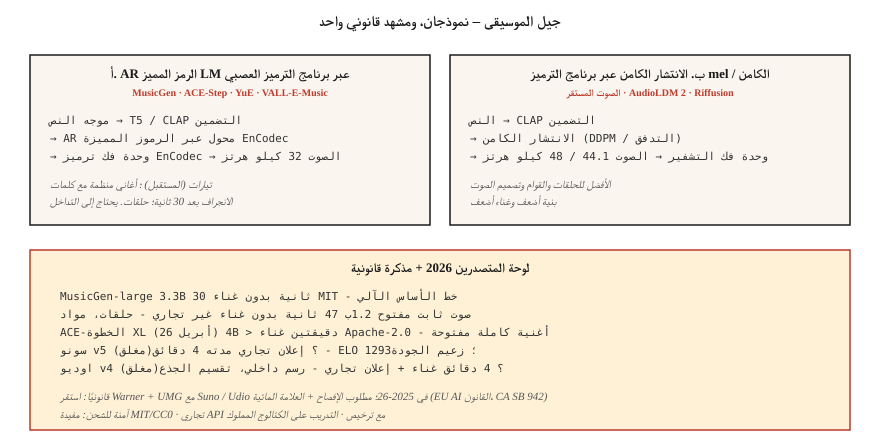

# Music Generation — MusicGen, Stable Audio, Suno, and the Licensing Earthquake

> جيل الموسيقى لعام 2026: يهيمن Suno v5 وUdio v4 على الإعلانات التجارية؛ MusicGen وStable Audio Open وACE-Step مفتوح المصدر. تم حل المشكلة الفنية في الغالب. أعادت المشكلة القانونية (تسوية Warner Music بقيمة 500 مليون دولار، تسوية UMG) تشكيل المجال في 2025-2026.

**النوع:** بناء
** اللغات: ** بايثون
**المتطلبات الأساسية:** المرحلة 6 · 02 (المخططات الطيفية)، المرحلة 4 · 10 (نماذج الانتشار)
**الوقت:** ~75 دقيقة

## The Problem

نص → مقطع موسيقي مدته من 30 ثانية إلى 4 دقائق، مع كلمات الأغاني والغناء والبنية. ثلاث مشاكل فرعية:

1. ** توليد الآلات. ** نص مثل "طبول هيب هوب lo-fi مع مفاتيح دافئة" → الصوت. MusicGen، الصوت المستقر، AudioLDM.
2. ** توليد الأغنية (مع غناء + كلمات). ** "أغنية ريفية عن ليالي تكساس الممطرة" → الأغنية الكاملة. سونو، أوديو، يو، ACE-خطوة.
3. ** مشروط / يمكن التحكم فيه. ** قم بتوسيع مقطع موجود، أو إعادة إنشاء جسر، أو تبديل النوع، أو فصل الجذع، أو طلاء داخلي. إن طلاء Udio الداخلي + فصل الجذع هو ميزة 2026 التي يجب مطابقتها.

## The Concept



### Token LM over neural-codec tokens

Meta's **MusicGen** (2023، MIT) والعديد من المشتقات: الحالة على تضمينات النص/اللحن، التنبؤ التلقائي برموز EnCodec (32 كيلو هرتز، 4 كتب تشفير)، فك التشفير باستخدام EnCodec. 300 م - 3.3 ب بارامترات. خط أساس قوي؛ صراعات الماضي 30 ثانية.

**ACE-Step** (مفتوح المصدر، 4B XL تم إصداره في أبريل 2026) يمتد هذا إلى الجيل الكامل المكيف بكلمات الأغنية. أقرب شيء للمجتمع المفتوح إلى Suno.

### Diffusion over mels or latents

**الصوت الثابت (2023)** و **الصوت الثابت المفتوح (2024)**: الانتشار الكامن على الصوت المضغوط. يتفوق في الحلقات وتصميم الصوت والأنسجة المحيطة. ليست رائعة في الأغاني الكاملة المنظمة.

**AudioLDM / AudioLDM2**: تحويل النص إلى صوت عبر الانتشار الكامن بنمط T2I، المعمم على الموسيقى والمؤثرات الصوتية والكلام.

### Hybrid (production) — Suno, Udio, Lyria

الأوزان المغلقة. من المحتمل AR برنامج الترميز LM + مشفر صوتي قائم على الانتشار مع رؤوس صوت / طبلة / لحن متخصصة. Suno v5 (2026) هو قائد الجودة ELO 1293. يضيف Udio v4 رسمًا داخليًا + فصلًا جذعيًا (تنزيلات منفصلة للجهير والطبول والغناء).

### Evaluation

- **FAD (Fréchet Audio Distance).** مسافة مستوى التضمين بين توزيع الصوت المُولد مقابل التوزيع الصوتي الحقيقي باستخدام ميزات VGGish أو PANNs. أقل هو أفضل. MusicGen صغير: 4.5 FAD على MusicCaps؛ SOTA ~3.0.
- **الموسيقى (ذاتية).** التفضيل البشري. سونو v5 ELO 1293 يؤدي.
- **محاذاة النص والصوت.** CLAP النتيجة بين الموجه والإخراج.
- **التحف الموسيقية.** التحولات غير المتناغمة، وانحراف العبارة الصوتية، وفقدان البنية بعد 30 ثانية.

## 2026 model map

| نموذج | بارامس | الطول | غناء | الترخيص |
|-------|--------|--------|--------|---------|
| MusicGen-Large | 3.3ب | 30س | لا | MIT |
| صوت ثابت مفتوح | 1.2ب | 47 ق | لا | استقرار غير تجاري |
| ACE-الخطوة XL (أبريل 2026) | 4 ب | > 2 دقيقة | نعم | أباتشي-2.0 |
| يو | 7ب | > 2 دقيقة | نعم متعدد اللغات | أباتشي-2.0 |
| سونو v5 (مغلق) |؟ | 4 دقائق | نعم، yes١٢٩٣ | تجاري |
| اوديو v4 (مغلق) |؟ | 4 دقائق | نعم + ينبع | تجاري |
| جوجل ليريا 3 (مغلق) |؟ | في الوقت الحقيقي | نعم | تجاري |
| ميني ماكس ميوزيك 2.5 |؟ | 4 دقائق | نعم | تجاري API |

## The legal landscape (2025-2026)

- **تسوية Warner Music ضد Suno.** 500 مليون دولار. WMG أصبح الآن يشرف على AI-التشابه وحقوق الموسيقى والمسارات التي ينشئها المستخدمون على Suno. تسوية UMG مماثلة على Udio.
- **EU AI Act** + **كاليفورنيا SB 942**: AI-يجب الكشف عن الموسيقى المولدة.
- **Riffusion / MusicGen** تحت MIT ليس لديهم أمتعة امتثال ولكن أيضًا لا يوجد لديهم غناء تجاري.

أنماط الشحن الآمن:

1. قم بإنشاء الآلات الموسيقية فقط (MusicGen، وStable Audio Open، ومخرجات MIT/CC0).
2. استخدم APIs تجاريًا (Suno، Udio، ElevenLabs Music) بترخيص لكل جيل.
3. التدريب على الكتالوج المملوك أو المرخص (معظم الشركات تنتهي هنا).
4. وضع علامة على الأجيال بالعلامات المائية + البيانات الوصفية.

## Build It

### Step 1: generate with MusicGen

```python
from audiocraft.models import MusicGen
import torchaudio

model = MusicGen.get_pretrained("facebook/musicgen-small")
model.set_generation_params(duration=10)
wav = model.generate(["upbeat synthwave with driving drums, 128 BPM"])
torchaudio.save("out.wav", wav[0].cpu(), 32000)
```

ثلاثة أحجام: `small` (300M، سريع)، `medium` (1.5B)، `large` (3.3B). صغير يكفي لـ "هل تهبط الفكرة".

### Step 2: melody conditioning

```python
melody, sr = torchaudio.load("humming.wav")
wav = model.generate_with_chroma(
    ["jazz piano cover"],
    melody.squeeze(),
    sr,
)
```

يأخذ MusicGen-melody مخططًا لونيًا ويحافظ على اللحن أثناء تبديل الجرس. مفيد لـ "أعطني هذا اللحن كرباعية وترية."

### Step 3: FAD evaluation

```python
from frechet_audio_distance import FrechetAudioDistance
fad = FrechetAudioDistance()

fad.get_fad_score("generated_folder/", "reference_folder/")
```

يحسب مسافة التضمين VGGish. مفيدة لاختبارات الانحدار على مستوى النوع؛ ليس بديلاً عن المستمعين البشر.

### Step 4: adding to the LLM-music workflow

ادمجها مع الأفكار الواردة في الدروس 7-8:

```python
prompt = "Write a 30-second jazz loop. Describe the drums, bass, and piano voicing."
description = llm.complete(prompt)
music = musicgen.generate([description], duration=30)
```

## Use It

| الهدف | كومة |
|------|-------|
| تصميم الصوت الآلي | صوت ثابت مفتوح |
| اللعبة / الموسيقى التكيفية | جوجل ليريا ريل تايم (مغلق) |
| الأغاني كاملة مع غناء (تجاري) | Suno v5 أو Udio v4 بترخيص صريح |
| الأغاني كاملة مع غناء (مفتوحة) | ACE-الخطوة XL أو YuE |
| أغنية إعلانية قصيرة | لحن MusicGen مشروط بمرجع هامد |
| خلفية الموسيقى والفيديو | MusicGen + نشر فيديو مستقر |

## Pitfalls that still ship in 2026

- **مطالبات بغسل حقوق الطبع والنشر.** "أغنية بأسلوب تايلور سويفت" - مرشح Suno/Udio التجاري لهذه الأغاني الآن، بينما لا تفعل ذلك النماذج المفتوحة. أضف قائمة التصفية الخاصة بك.
- **التكرار/الانحراف بعد 30 ثانية.** AR حلقة النماذج. Crossfade لعدة أجيال، أو استخدم ACE-Step للتماسك الهيكلي.
- **تيمبو دريفت.** عارضات الأزياء يتجولن خارج BPM. استخدم علامات BPM في الموجه والتصفية اللاحقة باستخدام librosa `beat_track`.
- **وضوح الصوت.** سونو ممتاز؛ غالبًا ما تكون النماذج المفتوحة طرية في الكلمات. إذا كانت الكلمات مهمة، فاستخدم إعلانًا تجاريًا API أو قم بضبطها بدقة.
- **إخراج أحادي.** تولد النماذج المفتوحة استريوًا أحاديًا أو مزيفًا. قم بالترقية من خلال إعادة بناء الاستريو المناسب (ezst، نشر الاستريو الخاص بـ Cartesia).

## Ship It

حفظ باسم `outputs/skill-music-designer.md`. اختر النموذج، واستراتيجية الترخيص، وخطة الطول/الهيكل، وبيانات تعريف الإفصاح لنشر الموسيقى.

## Exercises

1. **سهل.** تشغيل `code/main.py`. إنه ينتج تقدمًا وترًا "مولدًا" + نمط الطبل كرموز ASCII - رسم كاريكاتوري لجيل الموسيقى. قم بتشغيلها مرة أخرى عبر أي عارض MIDI إذا كنت تريد ذلك.
2. **متوسط.** قم بتثبيت `audiocraft`، وإنشاء مقاطع مدتها 10 ثوانٍ عبر 4 مطالبات للأنواع باستخدام MusicGen-small، وقياس FAD مقابل مجموعة أنواع مرجعية.
3. **صعب.** باستخدام ACE-Step (أو MusicGen-melody)، قم بإنشاء ثلاثة أشكال مختلفة من نفس النغمة مع مطالبات جرس مختلفة. حساب CLAP التشابه مع الموجه للتحقق من المحاذاة.

## Key Terms

| مصطلح | ماذا يقول الناس | ماذا يعني في الواقع |
|------|-|--------------------------------------|
| FAD | صوت FID | مسافة فريشيه بين توزيعات التضمين الحقيقية مقابل المولدة. |
| كروماجرام | اللحن كالنغمات | ناقل 12 خافت لكل إطار؛ مدخلات لتكييف اللحن. |
| ينبع | مسارات الآلات | صوت جهير / طبول / غناء / لحن منفصل مثل WAV. |
| الرسم | تجديد قسم | إخفاء نافذة زمنية؛ نموذج يجدد ذلك تماما. |
| CLAP | نص-صوت CLIP | تضمين النص الصوتي المتباين؛ محاذاة النص والصوت. |
| الترميز | ترميز الموسيقى | برنامج الترميز العصبي Meta الذي تستخدمه MusicGen؛ 32 كيلو هرتز، 4 كتب رموز. |

## Further Reading

- [Copet et al. (2023). MusicGen](https://arxiv.org/abs/2306.05284) — the open autoregressive benchmark.
- [Evans et al. (2024). فتح الصوت الثابت](https://arxiv.org/abs/2407.14358) — الإعداد الافتراضي لتصميم الصوت.
- [ACE-الخطوة](https://githubhub.com/ace-step/ACE-Step) — افتح مولد الأغنية الكاملة 4B، أبريل 2026.
- [مستندات منصة Suno v5](https://suno.com) — رائدة الجودة التجارية.
- [AudioLDM2](https://arxiv.org/abs/2308.05734) — الانتشار الكامن للموسيقى + المؤثرات الصوتية.
- [WMG-تغطية تسوية سونو](https://www.musicbusinessworldwide.com/suno-warner-music-settlement/) — سابقة نوفمبر 2025.
