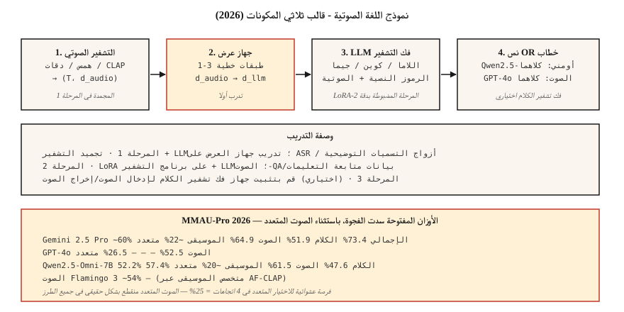

# Audio-Language Models — Qwen2.5-Omni, Audio Flamingo, GPT-4o Audio

> 2026 نماذج صوتية ولغوية تفسر الكلام + الصوت البيئي + الموسيقى. Qwen2.5-Omni-7B يطابق GPT-4o الصوت على MMAU-Pro. يتفوق Audio Flamingo Next على Gemini 2.5 Pro على LongAudioBench. إن الفجوة بين المفتوحة والمغلقة مغلقة بشكل أساسي - باستثناء المهام الصوتية المتعددة، حيث يكون كل شيء بشكل عشوائي تقريبًا.

**النوع:** تعلم
** اللغات: ** بايثون
**المتطلبات الأساسية:** المرحلة 6 · 04 (ASR)، المرحلة 12 · 03 (نماذج الرؤية واللغة)، المرحلة 7 · 10 (المحولات الصوتية)
**الوقت:** ~45 دقيقة

## The Problem

لديك 5 ثوانٍ من التسجيل الصوتي: كلب ينبح، شخص يصرخ "توقف!"، ثم صمت. الأسئلة المفيدة تمتد إلى محاور متعددة:

- **النسخ.** "ماذا قيل؟" — ASR الأراضي.
- **الاستدلال الدلالي.** "هل الشخص في خطر؟" - يتطلب فهمًا مشتركًا للنباح + الصراخ + الصمت.
- **الاستدلال الموسيقي.** "ما هي الآلات التي تعزف اللحن؟"
- **استرجاع الصوت الطويل.** "أين قام المعلم في هذه المحاضرة التي مدتها 90 دقيقة بشرح النسب المتدرج؟"

النموذج الوحيد الذي يجيب على كل هذه الأسئلة بمطالبة واحدة هو **نموذج الصوت واللغة** (LALM / ALM). منفصل عن ASR النقي: تنتج LALMs إجابات باللغة الطبيعية ذات شكل حر، وليس فقط النصوص.

## The Concept



### The three-component template

كل 2026 LALM له نفس الهيكل العظمي:

1. ** برنامج تشفير الصوت. ** برنامج تشفير الهمس · BEATs · CLAP · WavLM · أو برنامج تشفير مخصص لكل طراز.
2. **جهاز العرض.** خطي أو MLP يربط ميزات تشفير الصوت في مساحة تضمين الرمز المميز لـ LLM.
3. **LLM.** جهاز فك التشفير القائم على اللاما / كوين / جيما. يأخذ النص المشذر + الرموز الصوتية؛ يولد النص.

Training:

- **المرحلة 1.** تجميد التشفير + LLM; تدريب جهاز العرض فقط على ASR / بيانات التسميات التوضيحية.
- **المرحلة 2.** كاملة / LoRA الضبط الدقيق للمهام الصوتية التالية للتعليمات (QA، التفكير، فهم الموسيقى).
- **المرحلة 3 (اختيارية).** يضيف إدخال الصوت/إخراج الصوت وحدة فك ترميز الكلام. Qwen2.5-Omni و AF3-Chat يفعلان هذا.

### The 2026 model map

| نموذج | العمود الفقري | التشفير الصوتي | طريقة الإخراج | الوصول |
|-------|----------|-------------|-----------------|--------|
| Qwen2.5-أومني-7B | Qwen2.5-7B | مخصص + همس | نص + كلام | أباتشي-2.0 |
| Qwen3-أومني | كوين3 | مخصص | نص + كلام | أباتشي-2.0 |
| الصوت فلامنغو 3 | كوين2 | AF - CLAP | نص | NVIDIA غير تجاري |
| الصوت فلامنغو التالي | كوين2 | AF- CLAP v2 | نص | NVIDIA غير تجاري |
| SALMONN | فيكونا | همس + دقات | نص | أباتشي-2.0 |
| LTU / LTU-AS | اللاما | CAV-MAE | نص | أباتشي-2.0 |
| GAMA | اللاما | AST+س-سابق | نص | أباتشي-2.0 |
| جيميني 2.5 فلاش/برو (مغلق) | الجوزاء | الملكية | نص + كلام | API |
| GPT-4o صوت (مغلق) | GPT-4o | الملكية | نص + كلام | API |

### Benchmark reality check (2026)

**MMAU-Pro.** 1800 QA زوج يغطي الكلام / الصوت / الموسيقى / مختلط. تم تضمين مجموعة فرعية متعددة الصوت.

| نموذج | الشامل | كلام | الصوت | موسيقى | متعدد الصوت |
|-------|---------|--------|-------|-------------|--------|
| الجوزاء 2.5 برو | ~60% | 73.4% | 51.9% | 64.9% | ~22% |
| الجوزاء 2.5 فلاش | ~57% | 73.4% | 50.5% | 64.9% | 21.2% |
| GPT-4o صوت | 52.5% | — | — | — | 26.5% |
| Qwen2.5-أومني-7B | 52.2% | 57.4% | 47.6% | 61.5% | ~20% |
| الصوت فلامنغو 3 | ~54% | — | — | — | — |
| الصوت فلامنغو التالي | SOTA على LongAudioBench | — | — | — | — |

** عمود الصوت المتعدد سيء للجميع. ** فرصة عشوائية للاختيار من بين 4 خيارات = 25%؛ معظم النماذج تسجل هناك. لا تزال LALMs تكافح من أجل مقارنة مقطعين.

### Where LALMs are useful in 2026

- **تدقيق الامتثال لتسجيلات مركز الاتصال.** "هل ذكر الوكيل الإفصاح المطلوب؟"
- **إمكانية الوصول.** وصف الأحداث الصوتية للمستخدمين الصم (وليس فقط النسخ).
- **الإشراف على المحتوى.** اكتشاف اللغة العنيفة + نغمة التهديد + سياق الخلفية.
- **فصل البودكاست/الاجتماع.** ملخص دلالي، وليس مجرد أدوار المتحدث.
- **تحليل كتالوج الموسيقى.** "ابحث عن جميع المقاطع الصوتية مع تغيير مفتاح القسم B."

### Where they are NOT (yet) useful

- نظرية الموسيقى الدقيقة (تحت مستوى الوتر).
- الاستدلال المنسوب للمتحدث خلال المحادثات الطويلة (يتحلل بعد 10 دقائق).
- مقارنة الصوت المتعدد (22-26% بالكاد فوق العشوائي).
- التفكير المتدفق في الوقت الفعلي (معظمها عبارة عن استدلال دفعي دون اتصال بالإنترنت).

## Build It

### Step 1: query Qwen2.5-Omni

```python
from transformers import AutoModelForCausalLM, AutoProcessor

processor = AutoProcessor.from_pretrained("Qwen/Qwen2.5-Omni-7B")
model = AutoModelForCausalLM.from_pretrained("Qwen/Qwen2.5-Omni-7B", torch_dtype="auto")

audio, sr = load_wav("clip.wav", sr=16000)
messages = [{
    "role": "user",
    "content": [
        {"type": "audio", "audio": audio},
        {"type": "text", "text": "What sounds do you hear, and what's happening?"},
    ],
}]
inputs = processor.apply_chat_template(messages, tokenize=True, return_tensors="pt")
output = model.generate(**inputs, max_new_tokens=200)
print(processor.decode(output[0], skip_special_tokens=True))
```

### Step 2: the projector pattern

```python
import torch.nn as nn

class AudioProjector(nn.Module):
    def __init__(self, audio_dim=1280, llm_dim=4096):
        super().__init__()
        self.down = nn.Linear(audio_dim, llm_dim)
        self.act = nn.GELU()
        self.up = nn.Linear(llm_dim, llm_dim)

    def forward(self, audio_features):
        return self.up(self.act(self.down(audio_features)))
```

هذا كل شيء. يتكون جهاز العرض عادةً من 1-3 طبقات خطية. تدريبه على ASR أزواج (الصوت → النص) هو مهمة ذريعة المرحلة الأولى.

### Step 3: benchmarking MMAU / LongAudioBench

```python
from datasets import load_dataset
mmau = load_dataset("MMAU/MMAU-Pro")

correct = 0
for item in mmau["test"]:
    answer = call_model(item["audio"], item["question"], item["choices"])
    if answer == item["correct_choice"]:
        correct += 1
print(f"Accuracy: {correct / len(mmau['test']):.3f}")
```

تقرير لكل فئة (الكلام / الصوت / الموسيقى / الصوت المتعدد) بشكل منفصل. تخفي الأرقام المجمعة أماكن فشل النموذج.

## Use It

| مهمة | 2026 اختيار |
|------|-----------|
| صوت حر QA (مفتوح) | Qwen2.5-أومني-7B |
| أفضل فتح على الصوت الطويل | الصوت فلامنغو التالي |
| أفضل مغلقة | الجوزاء 2.5 برو |
| وكيل إدخال الصوت/إخراج الصوت | Qwen2.5-Omni أو GPT-4o الصوت |
| الاستدلال الموسيقي | صوتيات فلامنغو 3 أو 2 (موسيقى متخصصة AF-CLAP) |
| تدقيق مركز الاتصال | Gemini 2.5 Pro عبر API، مع RAG فوق مستندات السياسة الخاصة بك |

## Pitfalls

- **الثقة المفرطة في الصوت المتعدد.** إذا كانت مهمتك تحتاج إلى "أي مقطع يحتوي على X"، فإن الأداء على مستوى الصدفة العشوائية يكون حقيقيًا.
- **تدهور الصوت لفترة طويلة.** بعد مرور 10 دقائق، ينقطع إسناد مكبرات الصوت في معظم العارضات. قم بتدوين الملاحظات أولاً (الدرس السادس)، ثم قم بالتلخيص.
- **الهلوسة عند الصمت.** نفس مشكلة نمط الهمس التي ورثتها LALMs التي تستخدم برنامج تشفير Whisper. VAD-بوابة.
- **الاختيار المعياري.** تسلط منشورات مدونة البائعين الضوء على أفضل الفئات. قم بتشغيل MMAU-Pro مجموعة فرعية متعددة الصوت بنفسك.

## Ship It

حفظ باسم `outputs/skill-alm-picker.md`. اختر LALM + مجموعة فرعية مرجعية + طريقة الإخراج (النص مقابل الكلام) لمهمة فهم الصوت المحددة.

## Exercises

1. **سهل.** قم بتشغيل `code/main.py` لرؤية نمط جهاز عرض لعبة + توجيه LALM مزيف لـ (تضمين الصوت، الرموز النصية) → الرموز المميزة للإخراج.
2. **متوسط.** سجل Qwen2.5-Omni-7B على 100 MMAU-عناصر الكلام الاحترافية. قارن بالرقم المذكور في الورقة.
3. **صعب.** أنشئ الحد الأدنى من خط الأساس للتسميات التوضيحية الصوتية: جهاز تشفير BEATs + جهاز عرض مكون من طبقتين + Llama-3.2-1B المجمدة. قم بضبط جهاز العرض فقط على AudioCaps. قارن بـ SALMONN على Clotho-AQA.

## Key Terms

| مصطلح | ماذا يقول الناس | ماذا يعني في الواقع |
|------|-|--------------------------------------|
| LALM | الدردشة الصوتيةGPT | جهاز تشفير الصوت + جهاز عرض + جهاز فك التشفير LLM. |
| بروجكتور | محول | صغير MLP تعيين ميزات الصوت في LLM مساحة التضمين. |
| MMAU | المعيار | 10 آلاف صوت - QA أزواج عبر الكلام والصوت والموسيقى. |
| MMAU-برو | أصعب MMAU | 1800 سؤال متعدد الصوت/الاستدلال الثقيل. |
| لونج أوديوبينش | تقييم طويل الشكل | مقاطع متعددة الدقائق مع استعلامات دلالية. |
| صوت داخل / صوت خارج | الكلام الأصلي | يستوعب النموذج الكلام ويصدر الكلام دون تحويل النص. |

## Further Reading

- [Chu et al. (2024). Qwen2-Audio](https://arxiv.org/abs/2407.10759) — reference architecture.
- [Alibaba (2025). Qwen2.5-Omni](https://huggingface.co/Qwen/Qwen2.5-Omni-7B) — الكلام داخل الكلام.
- [NVIDIA (2025). Audio Flamingo 3](https://arxiv.org/abs/2507.08128) — the open long-audio leader.
- [NVIDIA (2026). صوت فلامنغو التالي](https://arxiv.org/abs/2604.10905) — LongAudioBench SOTA.
- [تانغ وآخرون. (2023). SALMONN](https://arxiv.org/abs/2310.13289) — رائد التشفير المزدوج.
- [MMAU-لوحة المتصدرين الاحترافية](https://mmaubenchmark.githubhub.io/) — تصنيفات 2026 المباشرة.
