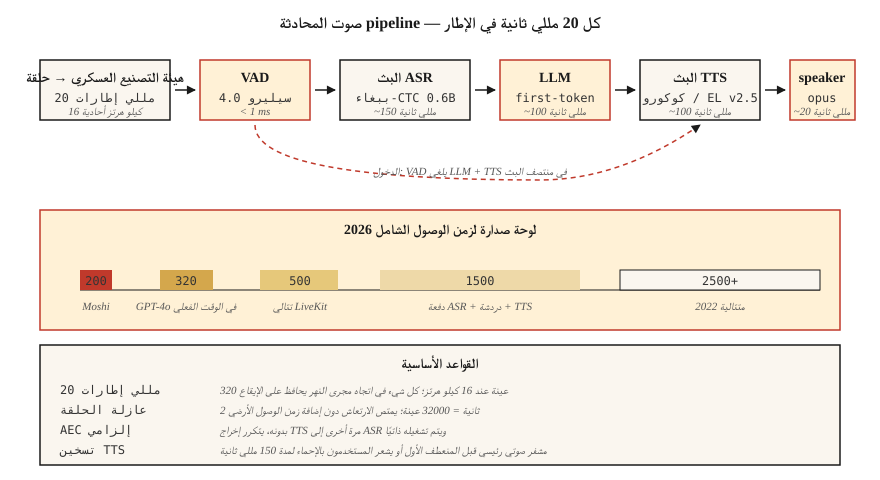

# معالجة الصوت في الوقت الحقيقي
> تقوم الدفعة pipelines بمعالجة ملف. تقوم خطوط pipeline في الوقت الفعلي بمعالجة الـ 20 مللي ثانية التالية قبل وصول الـ 20 مللي ثانية التالية. كل محادثة AI واستوديو بث وروبوت هاتفي تعيش وتموت وفقًا لميزانية زمن الوصول هذه.
**النوع:** بناء
**اللغات:** بايثون، Rust
**المتطلبات الأساسية:** المرحلة 6 · 02 (المخططات الطيفية)، المرحلة 6 · 04 (ASR)، المرحلة 6 · 07 (TTS)
**الوقت:** ~75 دقيقة
## المشكلة
تريد مساعدًا صوتيًا يشعرك بالحيوية. يبلغ زمن الاستجابة للمحادثة البشرية حوالي 230 مللي ثانية (الصمت حتى الاستجابة). أي شيء يزيد طوله عن 500 مللي ثانية يبدو آليًا؛ فوق 1500 مللي يشعر بالكسر. ميزانية حلقة **سماع → فهم → استجابة → تحدث** الكاملة في عام 2026 هي:
| المرحلة | الميزانية |
|-------|--------|
| هيئة التصنيع العسكري → المخزن المؤقت | 20 مللي ثانية |
| VAD | 10 مللي ثانية |
| ASR (البث المباشر) | 150 مللي ثانية |
| LLM (الرمز الأول) | 100 مللي ثانية |
| TTS (القطعة الأولى) | 100 مللي ثانية |
| تقديم → مكبر الصوت | 20 مللي ثانية |
| **المجموع** | **~400 مللي ثانية** |
سجل Moshi (Kyutai، 2024) سرعة ثنائية كاملة تبلغ 200 مللي ثانية. GPT-4o-realtime (2024) ساعات ~320 مللي ثانية. يتم شحن الخطوط المتتالية pipelines في عام 2022 بسرعة 2500 مللي ثانية. جاء التحسين بمقدار 10× من خلال ثلاث تقنيات: (1) البث في كل مكان، (2) التضمين غير المتزامن مع نتائج جزئية، (3) التوليد غير القابل للمقاطعة.
##المفهوم

**إطار/قطعة/نافذة.** يتدفق الصوت في الوقت الفعلي ككتل ذات حجم ثابت. الاختيار الشائع: 20 مللي ثانية (320 عينة عند 16 كيلو هرتز). كل شيء في اتجاه مجرى النهر يجب أن يواكب هذا الإيقاع.
** المخزن المؤقت الحلقي. ** المخزن المؤقت الدائري ذو الحجم الثابت. يكتب خيط المنتج إطارات جديدة، ويقرأ خيط المستهلك. يمنع التخصيصات في المسار الساخن. الحجم ≈ الحد الأقصى لزمن الوصول × معدل العينة؛ حلقة 16 كيلو هرتز مدتها ثانيتين = 32000 عينة.
**VAD (اكتشاف النشاط الصوتي).** تعمل البوابات في اتجاه مجرى النهر عندما لا يتحدث أحد. يعمل Silero VAD 4.0 (2024) على أقل من 1 مللي ثانية لكل 30 مللي ثانية في الإطار CPU. `webrtcvad` هو البديل الأقدم.
**البث المباشر ASR.** النماذج التي تُصدر نصوصًا جزئية عند وصول الصوت. يعمل Parakeet-CTC-0.6B في وضع البث (NeMo, 2024) بنسبة 2-5% WER عند زمن وصول قدره 320 مللي ثانية. يقوم Whisper-Streaming (Macháček et al., 2023) بتقطيع Whisper للبث القريب عند زمن استجابة يبلغ حوالي 2 ثانية.
**المقاطعة.** عندما يتحدث المستخدم أثناء تحدث المساعد، يجب عليك (أ) اكتشاف البارجة، (ب) إيقاف TTS، (ج) تجاهل إخراج LLM المتبقي. كل ذلك في غضون 100 مللي ثانية، أو يرى المستخدم مساعدًا أصمًا.
**نقل WebRTC Opus.** إطارات 20 مللي ثانية، 48 كيلو هرتز، معدل البت التكيفي 8-128 كيلوبت في الثانية. قياسي للمتصفح والجوال. LiveKit وDaily.co وPion هي مجموعات 2026 لبناء التطبيقات الصوتية.
**مخزن مؤقت للارتعاش.** تصل حزم الشبكة خارج الترتيب/في وقت متأخر. يُعيد ترتيب المخزن المؤقت للارتعاش وينعم؛ صغيرة جدًا ← فجوات مسموعة، كبيرة جدًا ← زمن الوصول. 60-80 مللي ثانية نموذجي.
### الأخطاء الشائعة
- **التنافس على سلسلة المحادثات.** نماذج بايثون GIL + الثقيلة يمكن أن تؤدي إلى تجويع سلسلة المحادثات الصوتية. استخدم مكتبة الصوت C-callback (sounddevice، PortAudio) وأبعد Python عن المسار السريع.
- **زمن وصول تحويل معدل العينة.** تضيف إعادة التشكيل داخل الخط pipe 5–20 مللي ثانية. إما إعادة التشكيل مقدمًا أو استخدام أداة إعادة تشكيل زمن الوصول الصفري (PolyPhase، `soxr_hq`).
- **TTS تمهيدي.** حتى TTS السريع مثل Kokoro لديه فترة إحماء تبلغ 100-200 مللي ثانية عند الطلب الأول. نموذج ذاكرة التخزين المؤقت + تسخينه بالجري الوهمي قبل المنعطف الحقيقي الأول.
- **إلغاء الصدى.** بدون AEC، يدخل إخراج TTS مرة أخرى إلى الميكروفون ويقوم بتشغيل ASR بصوت الروبوت نفسه. WebRTC AEC3 هو الإعداد الافتراضي مفتوح المصدر.
## بنائها
### الخطوة 1: المخزن المؤقت للحلقة
```python
import collections

class RingBuffer:
    def __init__(self, capacity):
        self.buf = collections.deque(maxlen=capacity)
    def write(self, frame):
        self.buf.extend(frame)
    def read(self, n):
        return [self.buf.popleft() for _ in range(min(n, len(self.buf)))]
    def level(self):
        return len(self.buf)
```

تحدد السعة زمن الوصول الأقصى للتخزين المؤقت. 32000 عينة عند 16 كيلو هرتز = 2 ثانية.
### الخطوة الثانية: بوابة VAD
```python
def simple_energy_vad(frame, threshold=0.01):
    return sum(x * x for x in frame) / len(frame) > threshold ** 2
```

استبدل بـ Silero VAD في الإنتاج:
```python
import torch
vad, _ = torch.hub.load("snakers4/silero-vad", "silero_vad")
is_speech = vad(torch.tensor(frame), 16000).item() > 0.5
```

### الخطوة 3: البث ASR
```python
# Parakeet-CTC-0.6B streaming via NeMo
from nemo.collections.asr.models import EncDecCTCModelBPE
asr = EncDecCTCModelBPE.from_pretrained("nvidia/parakeet-ctc-0.6b")
# chunk_ms=320 ms, look_ahead_ms=80 ms
for chunk in audio_stream():
    partial_text = asr.transcribe_streaming(chunk)
    print(partial_text, end="\r")
```

### الخطوة 4: معالج الانقطاع
```python
class Dialog:
    def __init__(self):
        self.tts_task = None

    def on_user_speech(self, frame):
        if self.tts_task and not self.tts_task.done():
            self.tts_task.cancel()   # barge-in
        # then feed to streaming ASR

    def on_final_user_utterance(self, text):
        self.tts_task = asyncio.create_task(self.reply(text))

    async def reply(self, text):
        async for tts_chunk in llm_then_tts(text):
            speaker.write(tts_chunk)
```

يتوقف على الإدخال/الإخراج غير المتزامن ودفق TTS القابل للإلغاء. WebRTC Peerconnection.stop() على المسار الصوتي هي الطريقة الأساسية.
## استخدمه
مكدس 2026:
| طبقة | اختر |
|-------|------|
| النقل | LiveKit (WebRTC) أو Pion (Go) |
| __المصطلح_1__ | سيليرو VAD 4.0 |
| الجري ASR | Parakeet-CTC-0.6B أو بث الهمس |
| LLM الرمز الأول | Groq، Cerebras، vLLM-streaming |
| الجري TTS | كوكورو أو ElevenLabs Turbo v2.5 |
| إلغاء الصدى | WebRTC AEC3 |
| نهاية إلى نهاية أصلية | OpenAI الوقت الحقيقي API أو موشي |
## مطبات
- **التخزين المؤقت يبلغ 500 مللي ثانية ليكون آمنًا.** المخزن المؤقت *هو* الحد الأدنى لزمن الاستجابة لديك. تقليصه.
- **عدم تثبيت المواضيع.** رد الاتصال الصوتي على مؤشر ترابط ذو أولوية أقل من UI = مواطن الخلل أثناء التحميل.
- **TTS قطع صغيرة جدًا.** قطع أقل من 200 مللي ثانية make عناصر مشفر صوتي مسموعة. قطع 320 مللي ثانية هي المكان المثالي.
- **لا يوجد مخزن مؤقت للاهتزاز.** الشبكات الحقيقية متوترة؛ دون تجانس تحصل على الملوثات العضوية الثابتة.
- **معالجة خطأ اللقطة الواحدة.** يجب أن تكون خطوط الصوت pip مقاومة للتعطل. استثناء واحد يقتل الجلسة.
## اشحنها
احفظ باسم `outputs/skill-realtime-designer.md`. صمم خطًا صوتيًا في الوقت الفعلي pipeline بميزانيات زمن الوصول المحددة لكل مرحلة.
## تمارين
1. **سهل.** قم بتشغيل `code/main.py`. يحاكي المخزن المؤقت الحلقي + الطاقة VAD؛ يطبع زمن انتقال المرحلة لبث مزيف مدته 10 ثوانٍ.
2. **متوسط.** باستخدام `sounddevice`، أنشئ حلقة مرور تعالج الميكروفون الخاص بك في 20 مللي ثانية من الإطارات وتطبع حالة VAD في كل إطار.
3. **صعب.** أنشئ اختبار صدى مزدوج كامل باستخدام `aiortc`: المتصفح → WebRTC → Python → WebRTC → المتصفح. قياس الكمون من الزجاج إلى الزجاج بنبض 1 كيلو هرتز.
## المصطلحات الرئيسية
| مصطلح | ماذا يقول الناس | ماذا يعني في الواقع |
|------|-|--------------------------------------|
| المخزن المؤقت الدائري | الطابور الدائري | حجم ثابت، بدون قفل (أو SPSC-مقفل) FIFO لإطارات الصوت. |
| __المصطلح_2__ | بوابة الصمت | نموذج أو إرشادي للكلام مقابل عدم الكلام. |
| الجري ASR | في الوقت الحقيقي STT | يصدر نصًا جزئيًا عند وصول الصوت؛ يحدها النظرة الأمامية. |
| غضب العازلة | شبكة أكثر سلاسة | إعادة ترتيب الحزم خارج الترتيب في قائمة الانتظار؛ 60-80 مللي ثانية نموذجي. |
| __المصطلح_5__ | إلغاء الصدى | يطرح مسار ردود الفعل من مكبر الصوت إلى الميكروفون. |
| بارجة في | مقاطعة المستخدم | يكتشف النظام كلام المستخدم في منتصف TTS؛ يجب إلغاء التشغيل. |
| دوبلكس كامل | متزامن في كلا الاتجاهين | يمكن للمستخدم والروبوت التحدث في نفس الوقت؛ موشي مزدوج كامل. |
## مزيد من القراءة
- [Macháček et al. (2023). Whisper-Streaming](https://arxiv.org/abs/2307.14743) — همس مقسم قريب من البث.
- [Kyutai (2024). Moshi](https://kyutai.org/Moshi.pdf) — زمن استجابة مزدوج كامل 200 مللي ثانية.
- [LiveKit Agents framework (2024)](https://docs.livekit.io/agents/) — تنسيق وكيل الصوت للإنتاج.
- [Silero VAD repo](https://github.com/snakers4/silero-vad) — الفرعية 1 مللي ثانية VAD، أباتشي 2.0.
- [WebRTC AEC3 paper](https://webrtc.googlesource.com/src/+/main/modules/audio_processing/aec3/) — إلغاء الصدى ضمن المصدر المفتوح.