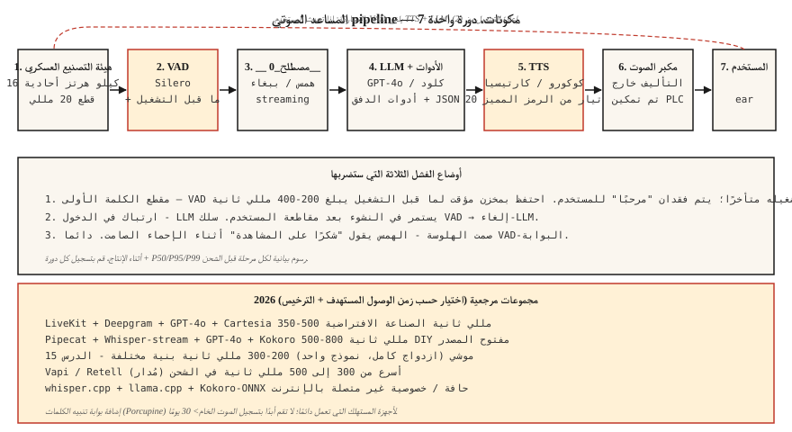

# Build a Voice Assistant Pipeline — The Phase 6 Capstone

> تم تجميع كل شيء بدءًا من الدروس 01 إلى 11 معًا. أنشئ مساعدًا صوتيًا يستمع ويفكر ويتحدث. في عام 2026، ستكون هذه مشكلة هندسية تم حلها، وليست مشكلة بحثية، ولكن تفاصيل التكامل هي التي تحدد ما إذا كان سيتم شحنها أم لا.

**النوع:** بناء
** اللغات: ** بايثون
**المتطلبات:** المرحلة 6 · 04، 05، 06، 07، 11؛ المرحلة 11 · 09 (استدعاء الوظيفة)؛ المرحلة 14 · 01 (حلقة الوكيل)
**الوقت:** ~120 دقيقة

## The Problem

إنشاء مساعد شامل:

1. يلتقط مدخلات الميكروفون (16 كيلو هرتز أحادي).
2. يكتشف بداية/نهاية كلام المستخدم.
3. يدون الدفق.
4. يقوم بتمرير النص إلى LLM الذي يمكنه استدعاء الأدوات (المؤقت، الطقس، التقويم).
5. تيارات LLM نص إلى TTS.
6. تشغيل الصوت مرة أخرى للمستخدم.
7. يتوقف إذا قاطع المستخدم منتصف الاستجابة.

هدف زمن الوصول: أول TTS بايت صوتي خلال 800 مللي ثانية من انتهاء المستخدم من كلامه على جهاز كمبيوتر محمول CPU. هدف الجودة: عدم وجود كلمات مفقودة، عدم وجود ترجمات مهلوسة عند الصمت، عدم تسرب استنساخ الصوت، عدم نجاح الحقن الفوري.

## The Concept



### The seven components

1. **التقاط الصوت.** الميكروفون → 16 كيلو هرتز أحادي → قطع 20 مللي ثانية. عادةً ما يكون `sounddevice` في لغة Python أو وحدة الصوت الأصلية/ALSA/WASAPI في الإنتاج.
2. **VAD (الدرس 11).** Silero VAD @ العتبة 0.5، الحد الأدنى للكلام 250 مللي ثانية، الصمت المتراكم 500 مللي ثانية. إشارات "البدء" و"النهاية".
3. **البث STT (الدرس 4-5).** البث عبر الهمس أو Parakeet-TDT أو Deepgram Nova-3 (API). النصوص الجزئية + النهائية.
4. **LLM مع استدعاء الأداة.** GPT-4o / كلود 3.5 / الجوزاء 2.5 فلاش. JSON مخطط للأدوات. الرموز الدفق.
5. **البث TTS (الدرس 7).** Kokoro-82M (الأسرع فتحًا) أو Cartesia Sonic (تجاري). ابدأ TTS بعد 20 LLM رمزًا.
6. ** التشغيل. ** خرج مكبر الصوت؛ opus-encode للشبكات ذات النطاق الترددي المنخفض.
7. **معالج المقاطعة.** إذا تم تشغيل VAD أثناء التشغيل TTS، أوقف التشغيل، قم بإلغاء LLM، أعد تشغيل STT.

### The three failure modes you will hit

1. **مقطع الكلمة الأولى.** VAD يبدأ الإيقاع بعد فوات الأوان. "مرحبا" للمستخدم مفقود. بداية العتبة عند 0.3 وليس 0.5.
2. **ارتباك مقاطعة الاستجابة المتوسطة.** LLM يستمر في الإنشاء بعد مقاطعة المستخدم؛ محادثات مساعد على المستخدم. سلك VAD → إلغاء-LLM.
3. **صمت الهلوسة.** يصدر الهمس "شكرًا على المشاهدة" على إطارات الإحماء الصامتة. دائما VAD-البوابة.

### 2026 production reference stacks

| كومة | الكمون | الترخيص | ملاحظات |
|-------|---------|--------|-------|
| لايف كيت + ديبجرام + GPT-4o + كارتيسيا | 350-500 مللي ثانية | تجاري API | الصناعة الافتراضية 2026 |
| Pipecat + Whisper-streaming + GPT-4o + كوكورو | 500-800 مللي ثانية | مفتوحة في الغالب | DIY-ودية |
| موشي (ثنائي الاتجاه) | 200-300 مللي ثانية | CC-BY 4.0 | نموذج واحد؛ الهندسة المعمارية المختلفة الدرس 15 |
| فابي / ريتيل (مُدار) | 300-500 مللي ثانية | تجاري | الأسرع في الإطلاق؛ التخصيص المحدود |
| Whisper.cpp + llama.cpp + Kokoro-ONNX | غير متصل | مفتوح | الخصوصية / الحافة |

## Build It

### Step 1: mic capture with chunking (pseudocode)

```python
import sounddevice as sd

def mic_stream(chunk_ms=20, sr=16000):
    q = queue.Queue()
    def cb(indata, frames, time, status):
        q.put(indata.copy().flatten())
    with sd.InputStream(channels=1, samplerate=sr, blocksize=int(sr * chunk_ms/1000), callback=cb):
        while True:
            yield q.get()
```

### Step 2: VAD-gated turn capture

```python
def capture_turn(stream, vad, pre_roll_ms=300, silence_ms=500):
    buf, pre, triggered = [], collections.deque(maxlen=pre_roll_ms // 20), False
    silent = 0
    for chunk in stream:
        pre.append(chunk)
        if vad(chunk):
            if not triggered:
                buf = list(pre)
                triggered = True
            buf.append(chunk)
            silent = 0
        elif triggered:
            silent += 20
            buf.append(chunk)
            if silent >= silence_ms:
                return b"".join(buf)
```

### Step 3: streaming STT → LLM → TTS

```python
async def turn(audio_bytes):
    transcript = await stt.transcribe(audio_bytes)
    async for token in llm.stream(transcript):
        async for audio in tts.stream(token):
            await speaker.play(audio)
```

### Step 4: tool calling inside the LLM loop

```python
tools = [
    {"name": "get_weather", "parameters": {"location": "string"}},
    {"name": "set_timer", "parameters": {"seconds": "int"}},
]

async for chunk in llm.stream(user_text, tools=tools):
    if chunk.type == "tool_call":
        result = dispatch(chunk.name, chunk.args)
        continue_streaming(result)
    if chunk.type == "text":
        await tts.stream(chunk.text)
```

### Step 5: interruption handling

```python
tts_task = asyncio.create_task(tts_loop())
while True:
    chunk = await mic.get()
    if vad(chunk):
        tts_task.cancel()
        await speaker.stop()
        await new_turn()
        break
```

## Use It

راجع `code/main.py` للحصول على محاكاة قابلة للتشغيل تربط جميع المكونات السبعة بنماذج كعب، حتى تتمكن من رؤية شكل الخط pip حتى بدون الأجهزة. للتنفيذ الحقيقي، قم بتبديل بذرة مع:

- `silero-vad` (`pip install silero-vad`)
- `deepgram-sdk` أو `openai-whisper`
- `openai` (`gpt-4o`) أو `anthropic`
- `kokoro` أو `cartesia`
- `sounddevice` للإدخال/الإخراج

## Pitfalls

- ** التسجيل PII للأبد.** الصوت الكامل هو PII في معظم الولايات القضائية. الاحتفاظ لمدة 30 يومًا، مشفرًا في حالة الراحة.
- ** لا يوجد دخول. ** سوف يقاطع المستخدمون. يجب أن يتوقف مساعدك عن الحديث.
- **TTS الذي يمنع.** متزامن TTS يحجب حلقة الحدث. استخدم غير متزامن أو موضوع منفصل.
- ** لا توجد معالجة لأخطاء استدعاء الأدوات. ** تفشل الأدوات. LLM يجب استرجاع الخطأ + إعادة المحاولة مرة واحدة، ثم التخفيض بأمان.
- **مرشحات الهلوسة المفرطة.** الإفراط في المرشح والمساعد يكرر "لا أستطيع المساعدة في ذلك". تحت التصفية ويقول أي شيء. معايرة على مجموعة محتجزة.
- **لا يوجد خيار تنبيه للكلمات.** الاستماع دائمًا هو مسؤولية تتعلق بالخصوصية. أضف بوابة تنبيه الكلمات (Porcupine أو openWakeWord).

## Ship It

حفظ باسم `outputs/skill-voice-assistant-architect.md`. نظرًا لقيود الميزانية + الحجم + اللغة + الامتثال، قم بإنتاج مواصفات مكدس كاملة.

## Exercises

1. **سهل.** تشغيل `code/main.py`. إنه يحاكي دورة كاملة من طرف إلى طرف مع وحدات كعب روتين ويطبع زمن الوصول لكل مرحلة.
2. **متوسط.** استبدل كعب STT بنموذج Whisper حقيقي على `.wav` مسجل مسبقًا. قياس WER والكمون من طرف إلى طرف.
3. **صعب.** إضافة استدعاء الأداة: قم بتنفيذ `get_weather` (أي API) و`set_timer`. قم بتوجيه LLM عبر الأدوات وتحقق من أنه عندما يقول المستخدم "ضبط مؤقت لمدة 5 دقائق"، يتم تشغيل الوظيفة الصحيحة ويؤكد الرد المنطوق ذلك.

## Key Terms

| مصطلح | ماذا يقول الناس | ماذا يعني في الواقع |
|------|-|--------------------------------------|
| بدوره | مستخدم + مساعد ذهابا وإيابا | خطاب مستخدم واحد VAD محدد + رد واحد LLM-TTS. |
| بارجة في | انقطاع | يتحدث المستخدم بينما يتحدث المساعد؛ توقف مساعد. |
| كلمة استيقظ | "يا مساعد" | كاشف الكلمات الرئيسية القصيرة؛ النيص، سنو بوي، openWakeWord. |
| الإشارة إلى النهاية | بدوره تنتهي | VAD + قرار دقيقة صمت انتهى منه المستخدم. |
| ما قبل التشغيل | المخزن المؤقت قبل الكلام | احتفظ بـ 200-400 مللي ثانية من الصوت قبل تشغيل VAD لتجنب مقطع الكلمة الأولى. |
| استدعاء الأداة | استدعاء الدالة | LLM تنبعث JSON; إرساليات وقت التشغيل؛ نتيجة التغذية المرتدة في الحلقة. |

## Further Reading

- [LiveKit — voice agent quickstart](https://docs.livekit.io/agents/) — production-grade reference.
- [Pipecat — voice agent examples]( — https-friendly framework.
- [OpenAI Realtime API](https://platform.openai.com/docs/guides/realtime) — the managed voice-native path.
- [Kyutai Moshi](https://github.com/kyutai-labs/moshi) — full-duplex reference (Lesson 15).
- [كلمة تنبيه النيص](https://picovoice.ai/products/porcupine/) — بوابة كلمة التنبيه.
- [أنثروبي — دليل استخدام الأداة](https://docs.anthropic.com/en/docs/build-with-claude/tool-use) — LLM استدعاء الوظائف.
