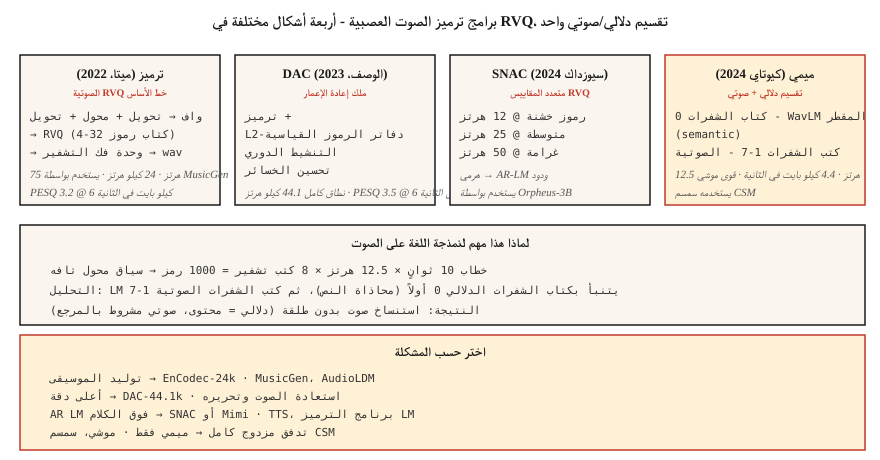

# Neural Audio Codecs — EnCodec, SNAC, Mimi, DAC and the Semantic-Acoustic Split

> 2026 توليد الصوت هو كل الرموز تقريبًا. يقوم EnCodec و SNAC و Mimi و DAC بتحويل الأشكال الموجية المستمرة إلى تسلسلات منفصلة يمكن للمحول التنبؤ بها. يعد الانقسام الرمزي الدلالي مقابل الصوتي - أول كتاب رموز دلالي، والباقي صوتي - هو التحول المعماري الأكثر أهمية منذ محول الصوت.

**النوع:** تعلم
** اللغات: ** بايثون
** المتطلبات الأساسية: ** المرحلة 6 · 02 (المخططات الطيفية)، المرحلة 10 · 11 (التكميم)، المرحلة 5 · 19 (ترميز الكلمات الفرعية)
**الوقت:** ~60 دقيقة

## The Problem

تعمل نماذج اللغة على رموز منفصلة. الصوت مستمر. إذا كنت تريد نموذجًا بنمط LLM للكلام/الموسيقى — MusicGen، وMoshi، وSesame CSM، وVibeVoice، وOrpheus — فأنت بحاجة أولاً إلى **برنامج ترميز صوتي عصبي**: برنامج تشفير متعلم يقوم بفصل الصوت إلى مفردات صغيرة من الرموز المميزة، ووحدة فك ترميز مطابقة تعيد بناء الشكل الموجي.

ظهرت عائلتين:

1. ** برامج الترميز الأولى لإعادة الإعمار ** — EnCodec, DAC. تحسين جودة الصوت الإدراكي. الرموز هي "صوتية" - فهي تلتقط كل شيء بما في ذلك هوية المتحدث والجرس وضوضاء الخلفية.
2. ** برامج الترميز الدلالية الأولى ** — Mimi (Kyutai)، SpeechTokenizer. فرض كتاب الرموز الأول على تشفير المحتوى اللغوي/الصوتي (غالبًا عن طريق التقطير من WavLM). كتب الشفرات اللاحقة عبارة عن تفاصيل صوتية.

رؤية 2024-2026: **يمنحك برنامج ترميز إعادة البناء النقي كلامًا ضبابيًا عند محاولة إنشاء نص من النص.** يجب أن تتعلم رموز LLM فوق رموز برنامج الترميز كلاً من البنية اللغوية AND والبنية الصوتية في نفس كتاب الرموز، والذي لا يمكن قياسه. إن الفصل بينهما - كتاب الشفرات الدلالي 0، وكتب الشفرات الصوتية 1-N - هو ما يعمل عليه makes Moshi وSesame CSM.

## The Concept



### The core trick: Residual Vector Quantization (RVQ)

بدلاً من كتاب رموز واحد كبير (والذي قد يحتاج إلى ملايين الأكواد للحصول على جودة جيدة)، تستخدم جميع برامج الترميز الصوتية الحديثة **RVQ**: سلسلة من كتب الأكواد الصغيرة. يقوم كتاب الشفرات الأول بقياس مخرجات التشفير؛ والثاني يكمّم المتبقي؛ إلخ. يتكون كل كتاب رموز من 1024 رمزًا. 8 كتب رموز = مفردات فعالة لـ 1024^8 = 10^24.

في وقت الاستدلال، يقوم مفكك التشفير بجمع جميع الرموز المختارة لكل إطار لإعادة بنائها.

### The four codecs that matter in 2026

**EnCodec (ميتا، 2022).** خط الأساس. التشفير-فك التشفير على الشكل الموجي، RVQ عنق الزجاجة. 24 كيلو هرتز، 32 كتاب رموز ممكنًا، 4 كتب رموز افتراضية بسرعة 1.5 كيلوبت في الثانية. يستخدم `1D conv + transformer + 1D conv` الهندسة المعمارية. المستخدمة من قبل MusicGen.

**DAC (الوصف، 2023).** RVQ مع L2-كتب الشفرات الطبيعية، ووظائف التنشيط الدورية، وتحسين الخسائر. أعلى دقة في إعادة البناء مقارنة بأي برنامج ترميز مفتوح — لا يمكن تمييزه أحيانًا عن الكلام الأصلي الذي يحتوي على 12 كتابًا للرموز. نطاق كامل 44.1 كيلو هرتز.

**SNAC (Hubert Siuzdak, 2024).** متعدد المقاييس RVQ — تعمل دفاتر الرموز الخشنة بمعدل إطارات أقل من تلك الدقيقة. يقوم بنمذجة الصوت بشكل هرمي بشكل فعال: "رسم" خشن عند حوالي 12 هرتز بالإضافة إلى التفاصيل عند 50 هرتز. يستخدم بواسطة Orpheus-3B لأن الهيكل الهرمي يتوافق بشكل جيد مع الجيل القائم على LM.

** ميمي (كيوتاي، 2024).** مغير قواعد اللعبة في 2026. معدل إطارات 12.5 هرتز (منخفض للغاية)، 8 كتب رموز بسرعة 4.4 كيلوبت في الثانية. Codebook 0 ** مستخرج من WavLM ** - تم تدريبه على التنبؤ بميزات محتوى الكلام الخاص بـ WavLM. دفاتر الرموز 1-7 هي بقايا صوتية. هذا الانقسام يقوي موشي (الدرس 15) وسمسم CSM.

### Frame rates matter for language modeling

معدل إطارات أقل = تسلسل أقصر = أسرع LM.

| الترميز | معدل الإطار | 1 ثانية = إطارات N | جيد ل |
|-------|----------|----------------|---------|
| ترميز-24ك | 75 هرتز | 75 | الموسيقى والصوت العام |
| DAC-44.1k | 86 هرتز | 86 | موسيقى عالية الدقة |
| SNAC - 24 ك (خشن) | ~12 هرتز | 12 | AR- LM كفاءة |
| ميمي | 12.5 هرتز | 12.5 | كلام متدفق |

عند تردد 12.5 هرتز، يكون الكلام لمدة 10 ثوانٍ عبارة عن 125 إطار ترميز فقط - يمكن للمحول التنبؤ بها بسهولة.

### Semantic vs acoustic tokens

```
frame_t → [semantic_token_t, acoustic_token_0_t, acoustic_token_1_t, ..., acoustic_token_6_t]
```

- **الرمز الدلالي (كتاب الشفرات 0 في Mimi).** يشفر ما قيل - الصوتيات والكلمات والمحتوى. مقطر من WavLM عبر خسارة التنبؤ المساعدة.
- ** الرموز الصوتية (دفاتر الرموز 1-7).** تشفير الجرس، وهوية المتحدث، والعروض، وضوضاء الخلفية، والتفاصيل الدقيقة.

يتنبأ AR LM بالرمز الدلالي أولاً (مشروط بالنص)، ثم يتنبأ بالرموز الصوتية (مشروط بمرجع الدلالي + مكبر الصوت). هذا التحليل هو السبب وراء إمكانية استنساخ الأصوات الحديثة TTS بدون طلقة: النموذج الدلالي يتعامل مع المحتوى؛ يتعامل النموذج الصوتي مع الجرس.

### 2026 reconstruction quality (bits per sec, lower bitrate is better)

| الترميز | معدل البت | PESQ | فيسكول |
|-------|---------|-------|--------|
| أوبوس-20 كيلوبت في الثانية | 20 كيلو بايت في الثانية | 4.0 | 4.3 |
| ترميز-6 كيلو بايت في الثانية | 6 كيلو بايت في الثانية | 3.2 | 3.8 |
| DAC-6 كيلو بايت في الثانية | 6 كيلو بايت في الثانية | 3.5 | 4.0 |
| SNAC-3 كيلو بايت في الثانية | 3 كيلو بايت في الثانية | 3.3 | 3.8 |
| ميمي-4.4 كيلو بايت في الثانية | 4.4 كيلوبت في الثانية | 3.1 | 3.7 |

لا تزال برامج الترميز التقليدية مثل Opus تفوز بالبت على الجودة الإدراكية. تفوز برامج الترميز العصبية على **الرموز المنفصلة** (التي لا تنتجها Opus) و**جودة النموذج التوليدي** (ما يمكن أن يفعله LM بهذه الرموز).

## Build It

### Step 1: encode with EnCodec

```python
from encodec import EncodecModel
import torch

model = EncodecModel.encodec_model_24khz()
model.set_target_bandwidth(6.0)  # kbps

wav = torch.randn(1, 1, 24000)
with torch.no_grad():
    encoded = model.encode(wav)
codes, scale = encoded[0]
# codes: (1, n_codebooks, n_frames), dtype=int64
```

`n_codebooks=8` بسرعة 6 كيلوبت في الثانية. كل رمز هو 0-1023 (10 بت).

### Step 2: decode and measure reconstruction

```python
with torch.no_grad():
    wav_recon = model.decode([(codes, scale)])

from torchaudio.functional import compute_deltas
import torch.nn.functional as F

mse = F.mse_loss(wav_recon[:, :, :wav.shape[-1]], wav).item()
```

### Step 3: the semantic-acoustic split (Mimi-style)

```python
from moshi.models import loaders
mimi = loaders.get_mimi()

with torch.no_grad():
    codes = mimi.encode(wav)  # shape (1, 8, frames@12.5Hz)

semantic = codes[:, 0]
acoustic = codes[:, 1:]
```

كتاب الرموز الدلالي 0 محاذاة لـ WavLM. يمكنك تدريب محول من النص إلى الدلالي، وهو عبارة عن مفردات أصغر بكثير من التحويل المباشر إلى الصوت. بعد ذلك، يقوم جهاز فك ترميز صوتي إلى شكل موجي منفصل بضبط مرجع مكبر الصوت.

### Step 4: why AR LM over codec tokens works

للحصول على مقطع كلام مدته 10 ثوانٍ في كتب الرموز الخاصة بـ Mimi بتردد 12.5 هرتز × 8:

```
N_tokens = 10 * 12.5 * 8 = 1000 tokens
```

1000 رمز هو سياق تافه للمحول. يمكن لمحول ذو معلمة 256M توليد 10 ثوانٍ من الكلام بالمللي ثانية على GPU حديث.

## Use It

مشكلة الخريطة → برنامج الترميز:

| مهمة | الترميز |
|------|-------|
| الجيل الموسيقي العام | ترميز-24ك |
| إعادة الإعمار بأعلى دقة | DAC-44.1k |
| AR LM على الكلام (TTS) | SNAC أو ميمي |
| تدفق الكلام المزدوج الكامل | ميمي (12.5 هرتز) |
| مكتبة المؤثرات الصوتية مع النص | EnCodec + T5 الشرط |
| تحرير الصوت بدقة | DAC + رسم |

القاعدة الأساسية: **إذا كنت تقوم ببناء نموذج توليدي، فابدأ بـ Mimi أو SNAC. إذا كنت تقوم بإنشاء خط ضغط pipeline، فاستخدم Opus.**

## Pitfalls

- ** عدد كبير جدًا من كتب الرموز. ** تؤدي إضافة كتب الرموز إلى زيادة الدقة خطيًا ولكن طول التسلسل LM خطيًا أيضًا. توقف عند 8-12.
- **عدم تطابق معدل الإطارات.** التدريب LM على 12.5 هرتز Mimi ثم الضبط الدقيق على 50 هرتز EnCodec يفشل بصمت.
- **بافتراض أن جميع كتب الشفرات متساوية.** في Mimi، يحتوي كتاب الشفرات 0 على محتوى؛ فقدانه يدمر الوضوح. فقدان كتاب الشفرات 7 بالكاد يمكن ملاحظته.
- **استخدام جودة إعادة البناء باعتبارها المقياس الوحيد.** يمكن أن يتمتع برنامج الترميز بإعادة بناء رائعة ولكنه يكون عديم الفائدة عند الإنشاء المستند إلى LM إذا كانت البنية الدلالية سيئة.

## Ship It

حفظ باسم `outputs/skill-codec-picker.md`. اختر برنامج ترميز لمهمة توليد أو ضغط معينة.

## Exercises

1. **سهل.** تشغيل `code/main.py`. إنها تنفذ لعبة عددية + مُكمِّم متبقي وتقيس خطأ إعادة البناء عند إضافة كتب الرموز.
2. **متوسط.** قم بتثبيت `encodec` ومقارنة 1، 4، 8، 32 كتاب رموز على مقطع كلام معلق. مؤامرة PESQ أو MSE مقابل معدل البت.
3. **صعب.** تحميل ميمي. تشفير مقطع. استبدل كتاب الشفرات 0 بأعداد صحيحة عشوائية؛ فك التشفير. ثم استبدل codebook 7 بالمثل. قارن بين الفسادين – يجب أن يؤدي الفساد في كتاب الشفرات 0 إلى تدمير الوضوح؛ يجب أن يغير الفساد Codebook 7 بالكاد أي شيء.

## Key Terms

| مصطلح | ماذا يقول الناس | ماذا يعني في الواقع |
|------|-|--------------------------------------|
| RVQ | التكميم المتبقي | سلسلة من كتب الشفرات الصغيرة؛ كل يكمم المتبقية السابقة. |
| معدل الإطار | سرعة الترميز | كم عدد الإطارات الرمزية في الثانية. أقل = أسرع LM. |
| كتاب الشفرات الدلالي | كتاب الشفرات 0 (ميمي) | كتاب الرموز المقطر من SSL الميزات؛ يشفر المحتوى. |
| كتب الشفرات الصوتية | كل شيء آخر | الجرس، العروض، الضوضاء، التفاصيل الدقيقة. |
| PESQ / فيسكول | الجودة الإدراكية | المقاييس الموضوعية المرتبطة بـ MOS. |
| الترميز | ميتا الترميز | خط الأساس RVQ؛ المستخدمة من قبل MusicGen. |
| ميمي | ترميز كيوتاي | معدل إطارات 12.5 هرتز؛ الانقسام الدلالي الصوتي. صلاحيات موشي. |

## Further Reading

- [Défossez et al. (2023). EnCodec](https://arxiv.org/abs/2210.13438) — the RVQ baseline.
- [Kumar et al. (2023). وصف برنامج ترميز الصوت (DAC)](https://arxiv.org/abs/2306.06546) — مفتوح بأعلى دقة.
- [Siuzdak (2024). SNAC](https://arxiv.org/abs/2410.14411) — multi-scale RVQ.
- [Kyutai (2024). برنامج ترميز Mimi](https://kyutai.org/codec-explainer) — الانقسام الدلالي الصوتي، والتقطير WavLM.
- [Borsos et al. (2023). AudioLM](https://arxiv.org/abs/2209.03143) — the two-stage semantic/acoustic paradigm.
- [Zeghidour et al. (2021). SoundStream](https://arxiv.org/abs/2107.03312) — برنامج الترميز الأصلي القابل للبث RVQ.
