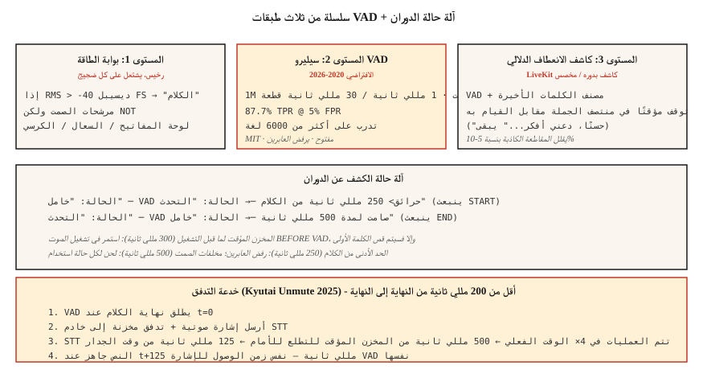

# اكتشاف النشاط الصوتي وأخذ الأدوار — Silero وCobra وFlush Trick
> يعيش كل وكيل صوتي أو يموت بناءً على قرارين: هل يتحدث المستخدم الآن، وهل انتهى؟ VAD يجيب على السؤال الأول. كشف الدوران (VAD + مخلفات الصمت + نموذج نقطة النهاية الدلالية) يجيب على السؤال الثاني. إذا أخطأت، فسيقوم مساعدك إما بقطع اتصال المستخدمين أو الصمت أبدًا.
**النوع:** بناء
** اللغات: ** بايثون
** المتطلبات الأساسية: ** المرحلة 6 · 11 (الصوت في الوقت الحقيقي)، المرحلة 6 · 12 (مساعد الصوت)
**الوقت:** ~45 دقيقة
## المشكلة
ثلاثة قرارات متميزة يتخذها وكيل الصوت makes في كل مقطع مدته 20 مللي ثانية:
1. **هل هذا إطار الكلام؟** — VAD. ثنائي، لكل إطار.
2. **هل بدأ المستخدم كلامًا جديدًا؟** — اكتشاف البداية.
3. **هل انتهى المستخدم؟** — الإشارة إلى النهاية (نهاية الدور).
تفشل الإجابة الساذجة (عتبة الطاقة) في مواجهة أي ضجيج - حركة المرور، ولوحات المفاتيح، وثرثرة الجماهير. إجابة 2026: Silero VAD (مفتوح، متعلم بعمق) + نموذج اكتشاف الدوران (نقطة النهاية الدلالية) + مخلفات الصمت التي تمت معايرتها VAD.
##المفهوم

### سلسلة VAD المكونة من ثلاث طبقات
**المستوى 1: بوابة الطاقة.** الأرخص. العتبة RMS عند -40 ديسيبل في الثانية. يقوم بتصفية الصمت الواضح ولكنه يطلق النار على أي ضوضاء أعلى من العتبة.
**المستوى 2: Silero VAD** (2020-2026، MIT). 1M المعلمات. تدرب على أكثر من 6000 لغة. يتم تشغيله بمعدل 1 مللي ثانية تقريبًا لكل 30 مللي ثانية على خيط CPU واحد. 87.7% TPR عند 5% FPR. الافتراضي مفتوح المصدر.
**المستوى 3: كاشف الانعطاف الدلالي.** نموذج اكتشاف الانعطاف الخاص بـ LiveKit (2024-2026) أو المصنف الصغير الخاص بك. يميز "الإيقاف المؤقت في منتصف الجملة" عن "انتهى الحديث". يستخدم السياق اللغوي (التنغيم + الكلمات الأخيرة)، وليس الصمت فقط.
### المعلمات الرئيسية وافتراضياتها
- **العتبة.** يُخرج Silero احتمالًا؛ تصنيف الكلام عند > 0.5 (افتراضي) أو > 0.3 (حساس). الحد الأدنى = عدد أقل من مقاطع الكلمة الأولى، والمزيد من النتائج الإيجابية الخاطئة.
- **الحد الأدنى لمدة الكلام.** ارفض الكلام الذي تقل مدته عن 250 مللي ثانية — عادة السعال أو ضجيج الكرسي.
- **صمت المخلفات (إشارة النهاية).** بعد عودة VAD إلى 0، انتظر 500-800 مللي ثانية قبل إعلان نهاية الدور. قصير جدًا → مقاطعة المستخدم. طويل جدًا → يشعر بالبطء.
- ** المخزن المؤقت لما قبل التشغيل. ** احتفظ بـ 300-500 مللي ثانية من الصوت قبل تشغيل VAD. يمنع قص "مرحبا".
### خدعة التدفق (كيوتاي 2025)
تتميز نماذج البث STT بتأخير نظرة للأمام (500 مللي ثانية لـ Kyutai STT-1B، و2.5 ثانية لـ STT-2.6B). عادةً ما تنتظر هذه المدة الطويلة بعد انتهاء الخطاب للحصول على النص. خدعة التدفق: عندما يقوم VAD بتشغيل نهاية الكلام، **أرسل إشارة تدفق إلى STT** التي تفرض إخراجًا فوريًا. تتم معالجة STT في ~4× الوقت الفعلي، لذا ينتهي المخزن المؤقت الذي يبلغ 500 مللي ثانية في حوالي 125 مللي ثانية.
من طرف إلى طرف: 125 مللي ثانية VAD + تدفق STT = زمن انتقال المحادثة.
### مقارنة 2026 VAD
| VAD | TPR @ 5% FPR | الكمون | الترخيص |
|-----|-------------|---------|---------|
| WebRTC VAD (جوجل، 2013) | 50.0% | 30 مللي ثانية | BSD |
| سيليرو VAD (2020-2026) | 87.7% | ~1 مللي ثانية | __المصطلح_6__ |
| كوبرا VAD (بيكوفويس) | 98.9% | ~1 مللي ثانية | تجاري |
| تجزئة بيانوت | 95% | ~10 مللي ثانية | MIT-عش |
Silero هو الافتراضي الصحيح. كوبرا هي ترقية الامتثال/الدقة. الطاقة فقط VAD ليس لها مكان في إنتاج عام 2026.
## بنائها
### الخطوة 1: بوابة الطاقة
```python
def energy_vad(chunk, threshold_dbfs=-40.0):
    rms = (sum(x * x for x in chunk) / len(chunk)) ** 0.5
    dbfs = 20.0 * math.log10(max(rms, 1e-10))
    return dbfs > threshold_dbfs
```

### الخطوة 2: Silero VAD في بايثون
```python
from silero_vad import load_silero_vad, get_speech_timestamps

vad = load_silero_vad()
audio = torch.tensor(waveform_16k, dtype=torch.float32)
segments = get_speech_timestamps(
    audio, vad, sampling_rate=16000,
    threshold=0.5,
    min_speech_duration_ms=250,
    min_silence_duration_ms=500,
    speech_pad_ms=300,
)
for s in segments:
    print(f"{s['start']/16000:.2f}s - {s['end']/16000:.2f}s")
```

### الخطوة 3: آلة حالة الدوران
```python
class TurnDetector:
    def __init__(self, silence_hangover_ms=500, min_speech_ms=250):
        self.state = "idle"
        self.speech_ms = 0
        self.silence_ms = 0
        self.silence_hangover_ms = silence_hangover_ms
        self.min_speech_ms = min_speech_ms

    def update(self, is_speech, chunk_ms=20):
        if is_speech:
            self.speech_ms += chunk_ms
            self.silence_ms = 0
            if self.state == "idle" and self.speech_ms >= self.min_speech_ms:
                self.state = "speaking"
                return "START"
        else:
            self.silence_ms += chunk_ms
            if self.state == "speaking" and self.silence_ms >= self.silence_hangover_ms:
                self.state = "idle"
                self.speech_ms = 0
                return "END"
        return None
```

### الخطوة 4: هيكل خدعة التدفق
```python
def flush_on_end(stt_client, audio_buffer):
    stt_client.send_audio(audio_buffer)
    stt_client.send_flush()
    return stt_client.recv_transcript(timeout_ms=150)
```

STT (Kyutai، Deepgram، AssemblyAI) يجب أن يدعم التدفق حتى يعمل هذا. لا يحدث بث Whisper — فهو يعتمد على الكتلة وينتظر دائمًا أجزاء.
## استخدمه
| الوضع | VAD الاختيار |
|-----------|-----------|
| مفتوح، سريع، عام | سيليرو VAD |
| مركز اتصال تجاري | كوبرا VAD |
| على الجهاز (الهاتف) | سيليرو VAD ONNX |
| بحث/ مذكرات | تجزئة بيانوت |
| احتياطي التبعية الصفرية | WebRTC VAD (قديم) |
| بحاجة إلى جودة بدوره تنتهي | Silero + LiveKit كاشف الدوران ذو الطبقات |
القاعدة الأساسية: لا تقم أبدًا بشحن الطاقة فقط VAD إلا إذا لم يكن لديك خيار آخر حقًا.
## مطبات
- **عتبة ثابتة.** يعمل في الأماكن الهادئة، ويفشل في الأماكن الصاخبة. إما أن تقوم بالمعايرة على الجهاز أو قم بالتبديل إلى Silero.
- **صمت قصير جدًا.** يقاطع الوكيل منتصف الجملة. 500-800 مللي ثانية هي النقطة المثالية للكلام التحادثي.
- **المخلفات لفترة طويلة جدًا.** الشعور بالخمول. اختبار أ/ب مع المستخدمين المستهدفين.
- **لا يوجد مخزن مؤقت لما قبل التشغيل.** تم فقدان أول 200-300 مللي ثانية من صوت المستخدم. احتفظ دائمًا بإعلان ما قبل التشغيل.
- **تجاهل الإشارة النهائية الدلالية.** "حسنًا، دعني أفكر..." تحتوي على فترات توقف طويلة. يكره المستخدمون أن يتم قطعهم في منتصف التفكير. استخدم كاشف الدوران الخاص بـ LiveKit أو ما شابه.
## اشحنها
احفظ باسم `outputs/skill-vad-tuner.md`. اختر VAD نموذج، وعتبة، ومخلفات، وما قبل التشغيل، واستراتيجية اكتشاف الدور لحجم العمل.
## تمارين
1. **سهل.** قم بتشغيل `code/main.py`. إنه يحاكي تسلسل الكلام + الصمت + الكلام + السعال ويختبر ثلاثة مستويات VAD.
2. **متوسط.** قم بتثبيت `silero-vad`، ومعالجة تسجيل مدته 5 دقائق، وضبط الحد الأدنى لتقليل مقاطع الكلمة الأولى والمشغلات الخاطئة. دقة التقرير/الاستدعاء.
3. **صعب.** أنشئ كاشفًا صغيرًا للدوران: Silero VAD + MLP من ثلاث طبقات على تضمينات آخر 10 كلمات (استخدم محولات الجملة). تدرب على مجموعة بيانات تم تحديدها يدويًا. تغلب على سيليرو فقط بنسبة 10% F1.
## المصطلحات الرئيسية
| مصطلح | ماذا يقول الناس | ماذا يعني في الواقع |
|------|-|--------------------------------------|
| VAD | كاشف الصوت | ثنائي لكل إطار: هل هذا الكلام؟ |
| كشف بدوره | الإشارة إلى النهاية | VAD + مخلفات الصمت + نقطة النهاية الدلالية. |
| مخلفات الصمت | الانتظار بعد الكلام | وقت الانتظار قبل إعلان نهاية المنعطف؛ 500-800 مللي ثانية. |
| ما قبل التشغيل | المخزن المؤقت قبل الكلام | احتفظ بصوت يتراوح من 300 إلى 500 مللي ثانية قبل تشغيل VAD. |
| خدعة دافق | اختراق كيوتاي | VAD → تدفق-STT → 125 مللي ثانية بدلاً من 500 مللي ثانية تأخير. |
| نقطة النهاية الدلالية | "هل قصدوا التوقف؟" | ML مُصنف ينظر إلى الكلمات، وليس الصمت فقط. |
| TPR @ FPR 5% | ROC نقطة | المعيار VAD المعياري؛ 87.7% لسيليرو، 50% WebRTC. |
## مزيد من القراءة
- [Silero VAD](https://github.com/snakers4/silero-vad) — المرجع مفتوح VAD.
- [Picovoice Cobra VAD](https://picovoice.ai/products/cobra/) — رائد الدقة التجارية.
- [Kyutai — Unmute + flush trick](https://kyutai.org/stt) — الحيلة الهندسية أقل من 200 مللي ثانية.
- [LiveKit — turn detection](https://docs.livekit.io/agents/logic/turns/) — نقطة النهاية الدلالية في الإنتاج.
- [WebRTC VAD](https://webrtc.googlesource.com/src/) — خط الأساس القديم.
- [pyannote segmentation](https://github.com/pyannote/pyannote-audio) — تجزئة على درجة الدياريزيشن.