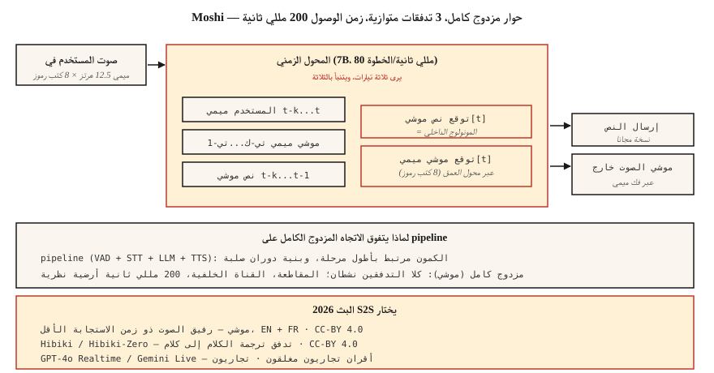

# دفق تحويل الكلام إلى كلام — موشي، وهيبيكي، والحوار المزدوج الكامل
> 2024-2026 أعيد تعريف الصوت AI. يشحن Moshi نموذجًا واحدًا يستمع ويتحدث في وقت واحد بزمن وصول قدره 200 مللي ثانية. يقوم Hibiki بترجمة الكلام إلى كلام قطعة تلو الأخرى. كلاهما يتخلى عن الخط ASR → LLM → TTS pipeline للحصول على بنية موحدة مزدوجة الاتجاه عبر رموز برنامج ترميز Mimi. هذا هو التصميم المرجعي الجديد.
**النوع:** تعلم
** اللغات: ** بايثون
** المتطلبات الأساسية: ** المرحلة 6 · 13 (برامج ترميز الصوت العصبية)، المرحلة 6 · 11 (الصوت في الوقت الحقيقي)، المرحلة 7 · 05 (محول كامل)
**الوقت:** ~75 دقيقة
## المشكلة
كل وكيل صوتي تم إنشاؤه من الدروس 11 + 12 له حد زمن الوصول الأساسي حوالي 300-500 مللي ثانية: VAD عمليات التشغيل، STT العمليات، LLM الأسباب، TTS الإنشاء. كل مرحلة لها الحد الأدنى من الكمون الخاص بها. يمكنك الضبط والموازنة، لكن الشكل الخطي pip يحجبك.
يطرح موشي (كيوتاي، 2024-2026) سؤالاً مختلفًا: ماذا لو لم يكن هناك خط pipe؟ ماذا لو قام أحد النماذج بإدخال الصوت وإخراجه بشكل مباشر ومستمر، مع النص باعتباره "مونولوجًا داخليًا" وسيطًا بدلاً من المسرح المطلوب؟
الجواب هو ** تحويل الكلام إلى كلام مزدوج الاتجاه **. الكمون النظري 160 مللي ثانية (80 مللي ثانية إطار ميمي + 80 مللي ثانية تأخير صوتي). الكمون العملي 200 مللي ثانية على L4 GPU واحد. وهذا نصف ما يحققه وكيل الصوت pipالأفضل في فئته.
##المفهوم

### عمارة موشي
**المدخلات.** تدفقان لترميز Mimi، كلاهما بسرعة 12.5 هرتز × 8 كتب ترميز:
- البث 1: صوت المستخدم (مشفر بـ Mimi، يصل باستمرار)
- الدفق 2: صوت موشي الخاص (تم إنشاؤه بواسطة موشي)
**المحول.** يعالج المحول الزمني ذو المعلمة 7B كلا من التدفقات ودفق النص "المونولوج الداخلي". في كل خطوة 80 مللي ثانية، يتم:
1. يستهلك أحدث رموز Mimi للمستخدم (8 كتب رموز).
2. يستهلك أحدث رموز Moshi Mimi المميزة (8 كتب رموز، كما تم إنتاجها).
3. يقوم بإنشاء رمز نص Moshi التالي (المونولوج الداخلي).
4. يُنشئ رموز Moshi Mimi التالية (8 كتب رموز عبر محول عمق صغير).
تعمل جميع التدفقات الثلاثة - صوت المستخدم، وصوت Moshi، ونص Moshi - بالتوازي. يستطيع موشي سماع المستخدم أثناء التحدث؛ يمكن أن يقاطع نفسه عندما يقاطع المستخدم؛ يمكنه إجراء قناة خلفية ("mhm") دون كسر كلامه الرئيسي.
**محول العمق.** داخل الإطار، لا يتم التنبؤ بكتب الشفرات الثمانية بشكل متوازٍ - فهي تحتوي على تبعيات بين دفاتر الشفرات. يتنبأ "محول العمق" الصغير المكون من طبقتين بالتسلسل خلال 80 مللي ثانية. هذا هو التحليل القياسي لبرامج الترميز AR LMs (المستخدم أيضًا بواسطة VALL-E، VibeVoice).
### لماذا يساعد نص المونولوج الداخلي
بدون نص صريح، يجب على النموذج أن يصمم اللغة ضمنيًا في تدفقه الصوتي. رؤية موشي: إجباره على إصدار رموز نصية بجانب الصوت. دفق النص هو في الأساس نص لما يقوله موشي. يؤدي هذا إلى تحسين التماسك الدلالي، make مما يسهل تبديل رأس نموذج اللغة، ويمنحك نسخًا مجانية.
### الهيبيكي: دفق ترجمة الكلام إلى كلام
نفس البنية، مدربة على أزواج الترجمة. مصدر الصوت الداخل، وصوت اللغة الهدف الخارج، بشكل مستمر. يلغي Hibiki-Zero (فبراير 2026) الحاجة إلى بيانات تدريب متسقة على مستوى الكلمة — يستخدم بيانات على مستوى الجملة + GRPO التعلم المعزز لتحسين زمن الاستجابة.
أربعة أزواج لغوية مدعومة في البداية؛ يمكن تكييفها مع لغة جديدة بـ ≈1000 ساعة.
### مجموعة كيوتاي الأوسع (2026)
- **Moshi** — حوار مزدوج كامل (الفرنسية أولاً، الإنجليزية مدعومة جيدًا)
- **Hibiki / Hibiki-Zero** — ترجمة فورية للكلام
- **Kyutai STT** — البث ASR (500 مللي ثانية أو 2.5 ثانية نظرة للأمام)
- **Kyutai Pocket TTS** — 100M-param TTS يعمل في CPU (يناير 2026)
- **إلغاء الكتم** — خط pipe الكامل الذي يجمع هذه العناصر على الخوادم العامة
الإنتاجية في L40S GPU: 64 جلسة متزامنة بمعدل 3× في الوقت الفعلي.
### سمسم CSM — ابن العم
يستخدم Sesame CSM (2025) فكرة مماثلة - العمود الفقري Llama-3 مع رأس برنامج ترميز Mimi. لكن CSM أحادي الاتجاه (يأخذ السياق + النص، وينتج الكلام) وليس ثنائي الاتجاه. إنه أفضل "حضور صوتي" TTS في السوق؛ ليست تمامًا مثل قدرة Moshi على الإرسال المزدوج الكامل.
### أرقام الأداء 2026
| نموذج | الكمون | حالة الاستخدام | الترخيص |
|-------|---------|---------|---------|
| موشي | 200 مللي ثانية (L4) | حوار مزدوج كامل باللغة الإنجليزية / الفرنسية | CC-BY 4.0 |
| هيبيكي | معدل إطارات 12.5 هرتز | الفرنسية ↔ الترجمة الإنجليزية المتدفقة | CC-BY 4.0 |
| هيبيكي-صفر | نفس | 5 أزواج لغوية، لا توجد بيانات محاذية | CC-BY 4.0 |
| سمسم CSM-1B | 200 مللي ثانية TTFA | مشروطة بالسياق TTS | أباتشي-2.0 |
| GPT-4o الوقت الفعلي | ~300 مللي ثانية | مغلق، OpenAI API | تجاري |
| الجوزاء 2.5 لايف | ~350 مللي ثانية | مغلق، جوجل API | تجاري |
## بنائها
### الخطوة 1: الواجهة
يكشف Moshi عن خادم WebSocket الذي يأخذ 80 مللي ثانية من الصوت المشفر بـ Mimi ويعيد 80 مللي ثانية من الصوت المشفر بـ Mimi. كلا الاتجاهين. باستمرار.
```python
import asyncio
import websockets
from moshi.client_utils import encode_audio_mimi, decode_audio_mimi

async def moshi_chat():
    async with websockets.connect("ws://localhost:8998/api/chat") as ws:
        mic_task = asyncio.create_task(stream_mic_to(ws))
        spk_task = asyncio.create_task(stream_from_to_speaker(ws))
        await asyncio.gather(mic_task, spk_task)
```

### الخطوة الثانية: حلقة الازدواج الكامل
```python
async def stream_mic_to(ws):
    async for chunk_80ms in mic_stream_at_12_5_hz():
        mimi_tokens = encode_audio_mimi(chunk_80ms)
        await ws.send(serialize(mimi_tokens))

async def stream_from_to_speaker(ws):
    async for msg in ws:
        mimi_tokens, text_token = deserialize(msg)
        audio = decode_audio_mimi(mimi_tokens)
        await play(audio)
```

كلا الاتجاهين يعملان في وقت واحد. Python asyncio أو العقود الآجلة Rust هي وسيلة النقل القياسية.
### الخطوة 3: هدف التدريب (المفاهيمي)
لكل إطار 80 مللي ثانية `t`:
- الإدخال: `user_mimi[0..t]`، `moshi_mimi[0..t-1]`، `moshi_text[0..t-1]`
- توقع: `moshi_text[t]`، ثم `moshi_mimi[t, codebook_0..7]`
يتم توقع النص قبل الصوت (المونولوج الداخلي)؛ يتم توقع الصوت بشكل متسلسل ضمن كتاب الشفرات داخل محول العمق.
### الخطوة 4: حيث يفوز موشي وأين لا يفوز
موشي يفوز:
- أقل من 250 مللي ثانية من طرف إلى طرف على الأجهزة الرخيصة.
- القنوات الخلفية الطبيعية والانقطاعات.
- لا يوجد pipeline كود الغراء.
موشي لا يفوز:
- استدعاء الأداة (غير مدرب عليها؛ أنت بحاجة إلى مسار LLM منفصل).
- التفكير الطويل (موشي هو نموذج حوار 8B-ish، وليس كلود/GPT-4).
- الدقة الواقعية في المواضيع المتخصصة.
- معظم حالات استخدام مؤسسات الإنتاج (لا تزال تستخدم pipelines في عام 2026).
## استخدمه
| الوضع | اختر |
|-----------|------|
| رفيق الصوت ذو الكمون الأقل | موشي |
| مكالمة ترجمة حية | هيبيكي |
| عرض صوتي / بحث | موشي، CSM |
| وكيل المؤسسة مع الأدوات | خط الأنابيب (الدرس 12)، وليس موشي |
| الصوت المخصص TTS في السياق | سمسم CSM |
| تحويل الكلام إلى كلام، أي لغة | GPT-4o Realtime أو Gemini 2.5 Live (تجاري) |
## مطبات
- **استدعاء أداة محدودة.** Moshi هو نموذج حوار، وليس إطار عمل وكيل. ادمجها مع pipeline للأدوات.
- ** تكييف صوتي محدد. ** يستخدم موشي شخصية واحدة مدربة؛ الاستنساخ هو عملية تدريب منفصلة.
- **التغطية اللغوية** الفرنسية + الإنجليزية ممتازة؛ البعض الآخر محدود. يساعد Hibiki-Zero، لكنك لا تزال بحاجة إلى بيانات التدريب.
- **تكلفة الموارد.** تحتوي جلسة Moshi الكاملة على فتحة GPU؛ ليس نمط نشر مستأجر مشترك رخيص.
## اشحنها
احفظ باسم `outputs/skill-duplex-pipeline.md`. اختر pipeline مقابل بنية الإرسال المزدوج الكامل لأحمال عمل وكيل الصوت، لسبب وجيه.
## تمارين
1. **سهل.** قم بتشغيل `code/main.py`. إنه يحاكي بنية التيارين + المونولوج الداخلي بشكل رمزي.
2. **متوسط.** اسحب Moshi من HuggingFace، وقم بتشغيل الخادم، واختبر محادثة واحدة. قم بقياس زمن استجابة ساعة الحائط من نهاية كلام المستخدم إلى بداية استجابة Moshi.
3. **صعب.** خذ الدرس 12 pipوكيل الخط وقارن P50 زمن الاستجابة مقابل Moshi في 20 عبارة اختبارية متطابقة. اكتب عندما يفوز pipeline معماريًا على أي حال.
## المصطلحات الرئيسية
| مصطلح | ماذا يقول الناس | ماذا يعني في الواقع |
|------|-|--------------------------------------|
| ثنائي الاتجاه | اسمع وتحدث في وقت واحد | دفقان صوتيان نشطان في وقت واحد على نفس الطراز. |
| المونولوج الداخلي | دفق النص الخاص بالنموذج | يصدر Moshi رموزًا نصية إلى جانب إخراج الصوت الخاص به. |
| محول العمق | توقع بين كتاب الشفرات | محول صغير يتنبأ بـ 8 كتب رموز ضمن إطار واحد يبلغ طوله 80 مللي ثانية. |
| ميمي | برنامج الترميز كيوتاي | 12.5 هرتز × 8 كتب رموز؛ الدلالية + الصوتية؛ صلاحيات موشي. |
| الجري S2S | الصوت → الصوت المباشر | ترجمة/حوار قطعة تلو الأخرى، بدون مراحل pipeline. |
| إعادة توجيه | ردود أفعال "مم" | يمكن لموشي أن يصدر اعترافات صغيرة دون أن يكسر دوره. |
## مزيد من القراءة
- [Défossez et al. (2024). Moshi — speech-text foundation model](https://arxiv.org/html/2410.00037v2) — الورقة.
- [Kyutai Labs (2026). Hibiki-Zero](https://arxiv.org/abs/2602.12345) — ترجمة متدفقة بدون بيانات محاذية.
- [Sesame (2025). Crossing the uncanny valley of voice](https://www.sesame.com/research/crossing_the_uncanny_valley_of_voice) — CSM المواصفات.
- [Kyutai — Moshi repo](https://github.com/kyutai-labs/moshi) — التثبيت + الخادم.
- [OpenAI — Realtime API](https://platform.openai.com/docs/guides/realtime) — نظير تجاري مغلق.
- [Kyutai — Delayed Streams Modeling](https://github.com/kyutai-labs/delayed-streams-modeling) — إطار العمل STT/TTS الموجود أسفل الغطاء.