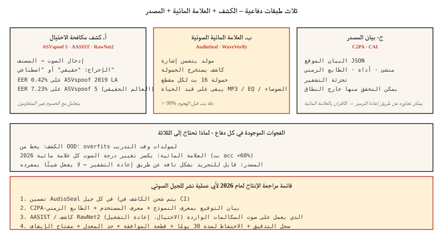

# Voice Anti-Spoofing & Audio Watermarking — ASVspoof 5, AudioSeal, WaveVerify

> يتم شحن استنساخ الصوت بشكل أسرع من الدفاعات. تحتاج الأنظمة الصوتية للإنتاج لعام 2026 إلى شيئين: كاشف (AASIST، RawNet2) يصنف الكلام الحقيقي مقابل الكلام المزيف، وعلامة مائية (AudioSeal) تنجو من الضغط والتحرير. قم بشحن كليهما أو لا تشحن استنساخ الصوت.

**النوع:** بناء
** اللغات: ** بايثون
** المتطلبات الأساسية: ** المرحلة 6 · 06 (التعرف على المتحدث)، المرحلة 6 · 08 (استنساخ الصوت)
**الوقت:** ~75 دقيقة

## The Problem

ثلاثة دفاعات ذات صلة:

1. **مكافحة الانتحال / الكشف عن التزييف العميق.** بالنظر إلى مقطع صوتي، هل هو اصطناعي أم حقيقي؟ معايير ASVspoof (ASVspoof 2019 → 2021 → 5) هي المعيار الذهبي.
2. **العلامة المائية الصوتية.** قم بتضمين إشارة غير محسوسة في الصوت الذي تم إنشاؤه والذي يمكن للكاشف استخراجه لاحقًا. يعد AudioSeal (Meta) وWavMark من الخيارات المفتوحة.
3. **المصدر الموثق.** التوقيع المشفر للملفات الصوتية + البيانات الوصفية. C2PA / مبادرة أصالة المحتوى.

الكشف يتعامل مع الخصوم الذين لا يتعاونون. تتعامل العلامة المائية مع الامتثال — يجب أن يكون الصوت الناتج عن AI قابلاً للتعريف على هذا النحو. وكلاهما مطلوب في عام 2026.

## The Concept



### ASVspoof 5 — the 2024-2025 benchmark

أكبر تغيير عن الإصدارات السابقة:

- **بيانات جماعية** (غير نظيفة في الاستوديو) — ظروف واقعية.
- **~2000 مكبر صوت** (مقابل ~100 مكبر صوت سابقًا).
- **32 خوارزمية هجوم.** TTS + تحويل الصوت + اضطراب الخصومة.
- **مساران.** الإجراء المضاد (CM) الكشف المستقل؛ انتحال قوي ASV (SASV) للأنظمة البيومترية.

أحدث ما توصلت إليه ASVspoof 5: ~7.23% EER. على ASVspoof الأقدم 2019 LA: 0.42% EER. النشر في العالم الحقيقي: توقع 5-10% EER على المقاطع البرية.

### AASIST and RawNet2 — detection model families

**AASIST** (2021، تم التحديث حتى 2026). رسم بياني للانتباه إلى السمات الطيفية. الحالي SOTA في مهمة الإجراء المضاد ASVspoof 5.

**RawNet2.** واجهة أمامية تلافيفية فوق شكل موجة خام + العمود الفقري TDNN. خط أساس أبسط؛ لا تزال قادرة على المنافسة مع الضبط الدقيق.

**ميزات NeXt-TDNN + SSL.** متغير 2025: ECAPA-نمط + ميزات WavLM + فقدان بؤري. يحقق 0.42% EER في ASVspoof 2019 LA.

### AudioSeal — the 2024 watermark default

Meta's **AudioSeal** (يناير 2024، الإصدار 0.2 ديسمبر 2024). التصميم الرئيسي:

- **مترجمة.** تكتشف العلامة المائية لكل إطار بدقة عينة تبلغ 16 كيلو هرتز (1/16000 ثانية).
- ** تدريب المولد + الكاشف بشكل مشترك. ** يتعلم المولد تضمين إشارة غير مسموعة؛ يتعلم الكاشف كيفية العثور عليه من خلال التعزيزات.
- **قوي.** يتحمل الضغط MP3 / AAC، EQ، تغيير السرعة ±10%، مزيج الضوضاء +10 ديسيبل SNR.
- **سريع.** يعمل الكاشف بمعدل 485× في الوقت الفعلي؛ 1000× أسرع من WavMark.
- **السعة.** حمولة 16 بت (يمكن تشفير النموذج ID، الطابع الزمني للإنشاء، المستخدم ID) قابلة للتضمين في كل كلام.

### WavMark

خط الأساس المفتوح لما قبل AudioSeal. شبكة عصبية قابلة للعكس، 32 بت/ثانية. المشاكل:

- القوة الغاشمة للمزامنة بطيئة.
- يمكن إزالته عن طريق الضوضاء الغوسية أو الضغط MP3.
- ليست ودية في الوقت الحقيقي.

### WaveVerify (July 2025)

يعالج نقاط الضعف في AudioSeal — وتحديدًا عمليات التلاعب الزمنية (الانعكاس، والسرعة). يستخدم المولد القائم على FiLM + كاشف خليط الخبراء. التنافس مع AudioSeal في الهجمات القياسية؛ يتعامل مع التعديلات المؤقتة.

### The gap adversaries exploit

من AudioMarkBench: "تحت تغيير درجة الصوت، تظهر جميع العلامات المائية دقة استرداد البت أقل من 0.6، مما يشير إلى الإزالة شبه الكاملة." **تغيير درجة الصوت هو الهجوم الشامل.** لا توجد علامة مائية لعام 2026 مقاومة تمامًا لتعديل درجة الصوت بقوة. لهذا السبب تحتاج إلى الكشف (AASIST) بجانب العلامة المائية.

### C2PA / Content Authenticity Initiative

ليست تقنية ML — تنسيق واضح. تحتوي الملفات الصوتية على بيانات تعريف موقعة بالتشفير حول أداة الإنشاء والمؤلف والتاريخ. Audobox / استخدامه بسلاسة. جيد للمصدر. لا يفعل شيئًا إذا قام أحد الممثلين السيئين بإعادة تشفير البيانات الوصفية وحذفها.

## Build It

### Step 1: a simple spectral-feature detector (toy)

```python
def spectral_rolloff(spec, percentile=0.85):
    cum = 0
    total = sum(spec)
    if total == 0:
        return 0
    threshold = total * percentile
    for k, v in enumerate(spec):
        cum += v
        if cum >= threshold:
            return k
    return len(spec) - 1

def is_suspicious(audio):
    spec = magnitude_spectrum(audio)
    rolloff = spectral_rolloff(spec)
    return rolloff / len(spec) > 0.92
```

غالبًا ما يحتوي الكلام الاصطناعي على طاقة مسطحة عالية التردد بشكل غير عادي. تستخدم كاشفات الإنتاج AASIST، وليس هذا. ولكن الحدس يحمل.

### Step 2: AudioSeal embed + detect

```python
from audioseal import AudioSeal
import torch

generator = AudioSeal.load_generator("audioseal_wm_16bits")
detector = AudioSeal.load_detector("audioseal_detector_16bits")

audio = load_wav("generated.wav", sr=16000)[None, None, :]
payload = torch.tensor([[1, 0, 1, 1, 0, 1, 0, 0, 1, 1, 0, 1, 0, 1, 1, 0]])
watermark = generator.get_watermark(audio, sample_rate=16000, message=payload)
watermarked = audio + watermark

result, decoded_payload = detector.detect_watermark(watermarked, sample_rate=16000)
# result: float in [0, 1] — probability of watermark presence
# decoded_payload: 16 bits; match against embedded payload
```

### Step 3: evaluation — EER

```python
def eer(real_scores, fake_scores):
    thresholds = sorted(set(real_scores + fake_scores))
    best = (1.0, 0.0)
    for t in thresholds:
        far = sum(1 for s in fake_scores if s >= t) / len(fake_scores)
        frr = sum(1 for s in real_scores if s < t) / len(real_scores)
        if abs(far - frr) < best[0]:
            best = (abs(far - frr), (far + frr) / 2)
    return best[1]
```

### Step 4: the production integration

```python
def safe_tts(text, voice, clone_reference=None):
    if clone_reference is not None:
        verify_consent(user_id, clone_reference)
    audio = tts_model.synthesize(text, voice)
    audio_with_wm = audioseal_embed(audio, payload=build_payload(user_id, model_id))
    manifest = c2pa_sign(audio_with_wm, user_id, timestamp=now())
    return audio_with_wm, manifest
```

يتم شحن كل جيل: (1) علامة مائية، (2) بيان موقع، (3) سجل تدقيق متوافق مع سياسة الاحتفاظ.

## Use It

| حالة الاستخدام | دفاع |
|----------|--------|
| الشحن TTS / استنساخ صوت | تضمين AudioSeal في كل مخرجات (غير قابل للتفاوض) |
| فتح الصوت البيومتري | AASIST + ECAPA فرقة؛ تحدي الحياة |
| كشف الاحتيال في مركز الاتصال | AASIST على 20% عينة من المكالمات الواردة |
| بودكاست أصالة | C2PA تسجيل الدخول عند التحميل، AudioSeal إذا تم إنشاء AI |
| بحث / كاشفات التدريب | ASVspoof 5 مجموعات تدريب/تطوير/تقييم |

## Pitfalls

- **علامة مائية بدون كاشف قيد التشغيل على الإطلاق.** لا طائل من ورائها. اشحن الكاشف في CI.
- **الكشف بدون معايرة.** AASIST تم تدريبه على ASVspoof LA التجاوزات؛ تنخفض دقة العالم الحقيقي. معايرة على المجال الخاص بك.
- **فجوة تغيير درجة الصوت.** يؤدي تغيير درجة الصوت الشديد إلى إزالة معظم العلامات المائية. هل لديك احتياطي الكشف.
- **تجريد وإعادة استضافة البيانات الوصفية.** C2PA يمكن تجاوزه بشكل تافه عن طريق إعادة التشفير. قم دائمًا بإضافة دفاع التشفير + الإدراك الحسي (العلامة المائية) معًا.
- **الحيوية كاكتشاف.** اطلب من المستخدم أن يقول عبارة عشوائية. يمنع هجمات إعادة التشغيل ولكن لا يمنع الاستنساخ في الوقت الفعلي.

## Ship It

حفظ باسم `outputs/skill-spoof-defender.md`. اختر نموذج الكشف والعلامة المائية وبيان المصدر وقواعد التشغيل التشغيلية لنشر الجيل الصوتي.

## Exercises

1. **سهل.** تشغيل `code/main.py`. كاشف اللعبة + تضمين/اكتشاف العلامة المائية للعبة على الصوت الاصطناعي.
2. **متوسط.** قم بتثبيت `audioseal`، وقم بتضمين حمولة 16 بت في مخرج TTS، وأعد فك التشفير. قم بإفساد الصوت بالضوضاء وقياس دقة استرداد البت.
3. **صعب.** قم بضبط RawNet2 أو AASIST على ASVspoof 2019 LA. قياس EER. اختبر على مجموعة من المقاطع التي تم إنشاؤها F5-TTS - انظر كيف يتدهور اكتشاف OOD.

## Key Terms

| مصطلح | ماذا يقول الناس | ماذا يعني في الواقع |
|------|-|--------------------------------------|
| ASVspoof | المعيار | تحدي البينالي؛ 2024 = ASVspoof 5. |
| CM (إجراء مضاد) | الكاشف | المصنف: الكلام الحقيقي مقابل الكلام الاصطناعي / المحول. |
| SASV | التحقق من مكبر الصوت + CM | البيومترية المتكاملة + كشف محاكاة ساخرة. |
| أوديوسيل | علامة مائية ميتا | حمولة محلية 16 بت، أسرع 485× من WavMark. |
| دقة استرداد البت | بقاء العلامة المائية | جزء من بتات الحمولة النافعة التي تم استردادها بعد الهجوم. |
| C2PA | بيان المصدر | البيانات الوصفية المشفرة حول الإنشاء/التأليف. |
| AASIST | عائلة الكاشف | مكافحة الانتحال على أساس الرسم البياني SOTA. |

## Further Reading

- [Todisco et al. (2024). ASVspoof 5](https://dl.acm.org/doi/10.1016/j.csl.2025.101825) — the current benchmark.
- [Defossez et al. (2024). AudioSeal](https://arxiv.org/abs/2401.17264) — العلامة المائية الافتراضية.
- [Chen et al. (2025). WaveVerify](https://arxiv.org/abs/2507.21150) — MoE detector for temporal attacks.
- [Jung et al. (2022). AASIST](https://arxiv.org/abs/2110.01200) — العمود الفقري للكشف SOTA.
- [AudioMarkBench (2024)](https://proceedings.neurips.cc/paper_files/paper/2024/file/5d9b7775296a641a1913ab6b4425d5e8-Paper-Datasets_and_Benchmarks_Track.pdf) — تقييم المتانة.
- [C2PA المواصفات](https://c2pa.org/specifications/specifications/) — تنسيق بيان المصدر.
