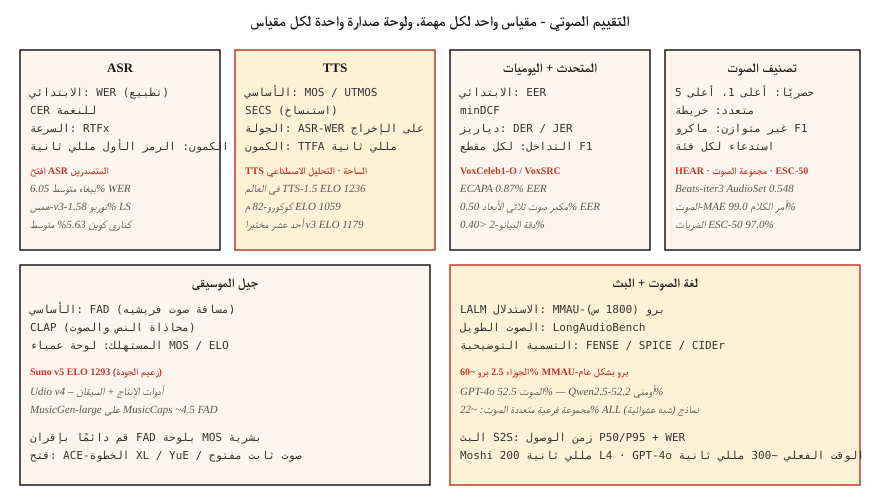

# التقييم الصوتي — WER، MOS، UTMOS، MMAU، FAD، ولوحات المتصدرين المفتوحة
> لا يمكنك شحن ما لا يمكنك قياسه. يسمي هذا الدرس مقاييس 2026 لكل مهمة صوتية: ASR (WER، CER، RTFx)، TTS (MOS، UTMOS، SECS، WER-on-ASR-round-trip)، واللغة الصوتية (MMAU، LongAudioBench)، والموسيقى (FAD، CLAP)، والمتحدث (EER). بالإضافة إلى المتصدرين حيث يمكنك المقارنة.
**النوع:** تعلم
** اللغات: ** بايثون
**المتطلبات:** المرحلة 6 · 04، 06، 07، 09، 10؛ المرحلة الثانية · 09 (تقييم النموذج)
**الوقت:** ~60 دقيقة
## المشكلة
تحتوي كل مهمة صوتية على مقاييس متعددة، كل منها يقيس محورًا مختلفًا. إن استخدام المقياس الخاطئ هو الطريقة التي تشحن بها نموذجًا يبدو رائعًا على لوحة القيادة لديك وسيئًا جدًا في الإنتاج. القائمة الأساسية لعام 2026:
| مهمة | الابتدائية | Secondary |
|------|---------|-----------|
| __المصطلح_1__ | __المصطلح_2__ | CER · RTFx · زمن الاستجابة للرمز المميز الأول |
| TTS | MOS / UTMOS | SECS · WER-on-ASR-ذهابًا وإيابًا · CER · TTFA |
| استنساخ الصوت | SECS (ECAPA جيب التمام) | MOS · CER |
| التحقق من المتحدث | EER | minDCF · FAR / FRR عند نقطة التشغيل |
| دياريزيشن | DER | JER · ارتباك المتكلم |
| تصنيف الصوت | أعلى 1 · خريطة | ماكرو F1 · الاستدعاء لكل فصل |
| جيل الموسيقى | FAD | CLAP · لجنة الاستماع MOS |
| نموذج اللغة الصوتية | MMAU-برو | LongAudioBench · AudioCaps FENSE |
| البث S2S | زمن الوصول P50/P95 | WER · MOS |
##المفهوم

### ASR المقاييس
**WER (معدل خطأ الكلمات).** `(S + D + I) / N`. أحرف صغيرة، وعلامات الترقيم، وتطبيع الأرقام قبل التسجيل. استخدم `jiwer` أو OpenAI `whisper_normalizer` الخاص بـ. <5% = التكافؤ البشري في قراءة الكلام.
**CER (معدل خطأ الأحرف).** نفس الصيغة، على مستوى الحرف. يُستخدم للغات النغمية (الماندرين والكانتونية) حيث يكون تجزئة الكلمات غامضًا.
**RTFx (عامل الوقت الحقيقي العكسي).** تتم معالجة ثوانٍ الصوت لكل ثانية على مدار ساعة الحائط. الأعلى هو الأفضل. ببغاء-TDT يصل إلى 3380×. Whisper-large-v3 هو ~30×.
** زمن الاستجابة للرمز الأول. ** ساعة الحائط من إدخال الصوت إلى أول رمز مميز للنص. حاسمة للتدفق. ديبجرام نوفا-3: ~150 مللي ثانية.
### TTS المقاييس
**MOS (متوسط ​​درجة الرأي).** 1-5 تقييم بشري. المعيار الذهبي ولكنه بطيء. اجمع أكثر من 20 مستمعًا لكل عينة، وأكثر من 100 عينة لكل نموذج.
**UTMOS (2022-2026).** المتنبئ MOS المستفادة. يرتبط بـ ~0.9 مع MOS البشري وفقًا للمعايير القياسية. F5-TTS: UTMOS 3.95؛ الحقيقة الأرضية: 4.08.
**SECS (تشابه جيب التمام لتشفير السماعة).** لاستنساخ الصوت. ECAPA تضمين جيب التمام بين المرجع والإخراج المستنسخ. > 0.75 = استنساخ يمكن التعرف عليه.
**WER-on-ASR-round-trip.** قم بتشغيل Whisper على إخراج TTS، واحسب WER مقابل النص المُدخل. يمسك تراجعات الوضوح. 2026 SOTA: < 2% CER.
**TTFA (الوقت حتى أول صوت).** زمن الاستجابة على مدار الساعة. كوكورو-82M: ~100 مللي ثانية؛ F5-TTS: ~1 ثانية.
### خاص باستنساخ الصوت
**SECS + MOS + CER** كثلاثية. الاستنساخ الذي يسجل درجة عالية SECS ولكن منخفض MOS يعني أن الجرس صحيح ولكنه غير طبيعي؛ والعكس يعني الصوت الطبيعي ولكن المتحدث الخاطئ.
### التحقق من مكبر الصوت
**EER (معدل الخطأ المتساوي).** الحد الذي يساوي فيه معدل القبول الخاطئ معدل الرفض الخاطئ. ECAPA على VoxCeleb1-O: 0.87%.
**minDCF (الحد الأدنى لتكلفة الاكتشاف).** التكلفة المرجحة عند نقطة تشغيل مختارة (غالبًا FAR=0.01). أكثر صلة بالإنتاج من EER.
### دياريزايشن
**DER (معدل الخطأ في الترميز).** `(FA + Miss + Confusion) / total_speaker_time`. الكلام المفقود + خطاب الإنذار الكاذب + ارتباك المتحدث، كل جزء ككسر. AMI الاجتماعات: DER ~10-20% نسبة واقعية. بياننوت 3.1 + إعلان Precision-2: <10% DER على الصوت المسجل جيدًا.
**JER (معدل خطأ Jaccard).** بديل لـ DER، قوي للتحيز للقطاعات القصيرة.
### تصنيف الصوت
العلامات المتعددة: **mAP (متوسط ​​الدقة)** في جميع الفئات. مجموعة الصوت: 0.548 مللي أمبير لـ BEATs-iter3.
حصري متعدد الفئات: ** أعلى 1، أعلى 5 دقة **. أوامر الكلام الإصدار 2: 99.0% أعلى 1 (الصوت-MAE).
غير متوازن: **ماكرو F1** + **استدعاء لكل فصل**. التقرير لكل فئة - الدقة الإجمالية تخفي الفئات التي تفشل.
### جيل الموسيقى
**FAD (مسافة الصوت Fréchet).** المسافة بين توزيعات تضمين VGGish للصوت الحقيقي مقابل الصوت المولد. MusicGen-small على MusicCaps: 4.5. الموسيقى LM: 4.0. أقل بشكل أفضل.
**CLAP النتيجة.** درجة محاذاة النص والصوت باستخدام تضمينات CLAP. > 0.3 = محاذاة معقولة.
**لوحة الاستماع MOS.** لا تزال الكلمة الأخيرة للموسيقى المخصصة للمستهلكين. Suno v5 ELO 1293 في TTS الساحة (من التفضيلات البشرية المقترنة).
### معايير اللغة الصوتية
**MMAU (فهم هائل للصوت المتعدد).** 10 آلاف صوت - QA زوج.
**MMAU-Pro.** 1800 عنصر صلب، أربع فئات: الكلام / الصوت / الموسيقى / الصوت المتعدد. فرصة عشوائية 25% على 4 اتجاهات. الجوزاء 2.5 برو بشكل عام ~ 60%؛ صوت متعدد ~ 22% في جميع الطرازات.
**LongAudioBench.** مقاطع متعددة الدقائق مع استعلامات دلالية. الصوت Flamingo Next يتفوق على Gemini 2.5 Pro.
**AudioCaps / Clotho.** معايير التسميات التوضيحية. SPICE، CIDEr، FENSE المقاييس.
### دفق الكلام إلى كلام
**زمن الوصول P50 / P95 / P99.** ساعة الحائط من نهاية كلام المستخدم إلى أول استجابة مسموعة. موشي: 200 مللي ثانية؛ GPT-4o الوقت الفعلي: 300 مللي ثانية.
**WER / MOS** على الإخراج.
**استجابة المشاركة.** الوقت من مقاطعة المستخدم إلى كتم صوت المساعد. الهدف <150 مللي ثانية.
### المتصدرين لعام 2026
| المتصدرين | المسارات | URL |
|------------|-------|-----|
| افتح ASR لوحة المتصدرين (HF) | الإنجليزية + متعدد اللغات + صيغة طويلة | `huggingface.co/spaces/hf-audio/open_asr_leaderboard` |
| TTS الساحة (HF) | الإنجليزية TTS | __الكود_1__ |
| تحليل الكلام الاصطناعي | TTS + STT، ​​ELO من الأصوات المقترنة | __الكود_2__ |
| MMAU-برو | LALM الاستدلال | __الكود_3__ |
| مكبر الصوت / VoxSRC | التعرف على المتحدث | __الكود_4__ |
| MMAU مجموعة فرعية من الموسيقى | الموسيقى LALM | (خلال MMAU) |
| HEAR المعيار | الصوت الخاضع للإشراف الذاتي | __الكود_5__ |
## بنائها
### الخطوة 1: WER مع التطبيع
```python
from jiwer import wer, Compose, ToLowerCase, RemovePunctuation, Strip

transform = Compose([ToLowerCase(), RemovePunctuation(), Strip()])
score = wer(
    truth="Please turn on the lights.",
    hypothesis="please turn on the light",
    truth_transform=transform,
    hypothesis_transform=transform,
)
# ~0.17
```

### الخطوة 2: TTS رحلة ذهابًا وإيابًا WER
```python
def ttr_wer(tts_model, asr_model, texts):
    errors = []
    for txt in texts:
        audio = tts_model.synthesize(txt)
        recog = asr_model.transcribe(audio)
        errors.append(wer(truth=txt, hypothesis=recog))
    return sum(errors) / len(errors)
```

### الخطوة 3: SECS لاستنساخ الصوت
```python
from speechbrain.inference.speaker import EncoderClassifier
sv = EncoderClassifier.from_hparams("speechbrain/spkrec-ecapa-voxceleb")

emb_ref = sv.encode_batch(load_wav("reference.wav"))
emb_clone = sv.encode_batch(load_wav("cloned.wav"))
secs = torch.nn.functional.cosine_similarity(emb_ref, emb_clone, dim=-1).item()
```

### الخطوة 4: FAD لتوليد الموسيقى
```python
from frechet_audio_distance import FrechetAudioDistance
fad = FrechetAudioDistance()
score = fad.get_fad_score("generated_folder/", "reference_folder/")
```

### الخطوة 5: EER للتحقق من المتحدث (نفس رمز الدرس 6)
```python
def eer(same_scores, diff_scores):
    thresholds = sorted(set(same_scores + diff_scores))
    best = (1.0, 0.0)
    for t in thresholds:
        far = sum(1 for s in diff_scores if s >= t) / len(diff_scores)
        frr = sum(1 for s in same_scores if s < t) / len(same_scores)
        if abs(far - frr) < best[0]:
            best = (abs(far - frr), (far + frr) / 2)
    return best[1]
```

## استخدمه
قم بإقران كل عملية نشر بأداة تقييم ثابتة تعمل على كل تحديث للنموذج. ثلاث قواعد أساسية:
1. **التطبيع قبل التسجيل.** أحرف صغيرة، وعلامات الترقيم، وتوسيع الأرقام. الإبلاغ عن قاعدة التطبيع.
2. **تقرير التوزيعات، وليس المتوسطات.** P50/P95/P99 لوقت الاستجابة. استدعاء لكل فئة للتصنيف. لكل فئة لـ MMAU.
3. **قم بتشغيل معيار معياري عام واحد.** حتى إذا اختلفت بيانات الإنتاج لديك، فإن إعداد التقارير في Open ASR / TTS Arena / MMAU يتيح للمراجعين المقارنة بين تفاحتين.
## مطبات
- **UTMOS الاستقراء.** تدربت على أسلوب VCTK في الكلام النظيف؛ درجات الصوت الصاخبة / المستنسخة / العاطفية سيئة.
- **MOS انحياز اللوحة.** 20 عاملاً في Amazon Mechanical Turk ≠ 20 مستخدمًا مستهدفًا. ادفع مقابل لوحة المجال إذا كانت المخاطر عالية.
- **FAD يعتمد على المجموعة المرجعية.** قارن مع نفس التوزيع المرجعي عبر النماذج.
- **إجمالي WER.** 5% WER بشكل عام يمكن أن يخفي 30% WER في الكلام المشدد. التقرير حسب الشريحة الديموغرافية.
- **تشبع المعايير العامة.** تقترب معظم النماذج الحدودية من الحد الأقصى للمعايير القياسية. قم ببناء مجموعة داخلية تعكس حركة المرور الخاصة بك.
## اشحنها
احفظ باسم `outputs/skill-audio-evaluator.md`. اختر المقاييس والمعايير وتنسيق التقارير لأي إصدار لنموذج صوتي.
## تمارين
1. **سهل.** قم بتشغيل `code/main.py`. قم بحساب WER / CER / EER / SECS / FAD-ish / MMAU-ish على مدخلات اللعبة.
2. **متوسط.** أنشئ حزام TTS ذهابًا وإيابًا WER. قم بتشغيل مخرجات Kokoro أو F5-TTS من خلال Whisper. قم بحساب WER أكثر من 50 مطالبة. ضع علامة على المطالبات بـ WER > 10%.
3. **صعب.** سجل اختيارك للدرس 10 LALM في MMAU- الكلام الاحترافي + مجموعات فرعية متعددة الصوت (50 عنصرًا لكل منها). الإبلاغ عن دقة كل فئة ومقارنتها بالرقم المنشور.
## المصطلحات الرئيسية
| مصطلح | ماذا يقول الناس | ماذا يعني في الواقع |
|------|-|--------------------------------------|
| WER | ASR النتيجة | `(S+D+I)/N` على مستوى الكلمة بعد التطبيع. |
| __المصطلح_2__ | الحرف WER | للغات النغمات أو الأنظمة على مستوى الحرف. |
| MOS | رأي إنساني | تصنيف 1-5؛ أكثر من 20 مستمع × 100 عينة. |
| __المصطلح_5__ | ML MOS المتنبئ | النموذج المستفادة؛ يرتبط بـ ~0.9 مع MOS البشري. |
| SECS | تشابه استنساخ الصوت | ECAPA جيب التمام بين المرجع والاستنساخ. |
| EER | المتحدث التحقق من النتيجة | العتبة حيث FAR = FRR. |
| DER | درجة Diarization | (FA + ملكة جمال + ارتباك) / المجموع. |
| FAD | جودة الموسيقى | مسافة فريشيه على التضمينات VGGish. |
| رتفكس | الإنتاجية | ثانية صوتية لكل ثانية على مدار الساعة. |
## مزيد من القراءة
- [jiwer](https://github.com/jitsi/jiwer) — مكتبة WER/CER مع أدوات التسوية.
- [UTMOS (Saeki et al. 2022)](https://arxiv.org/abs/2204.02152) — المتنبئ MOS المستفادة.
- [Fréchet Audio Distance (Kilgour et al. 2019)](https://arxiv.org/abs/1812.08466) — معيار الموسيقى.
- [Open ASR Leaderboard](https://huggingface.co/spaces/hf-audio/open_asr_leaderboard) — التصنيف المباشر لعام 2026.
- [TTS Arena](https://huggingface.co/spaces/TTS-AGI/TTS-Arena) — لوحة صدارة التصويت البشري TTS.
- [MMAU-Pro benchmark](https://mmaubenchmark.github.io/) — LALM لوحة المتصدرين المنطقية.
- [HEAR benchmark](https://hearbenchmark.com/) — معايير الصوت SSL.