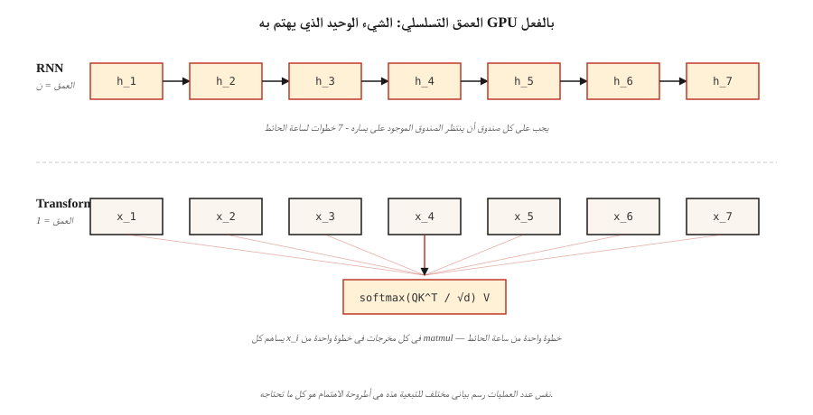

# Why Transformers — The Problems with RNNs

> تقوم شبكات RNN بمعالجة الرموز المميزة واحدًا تلو الآخر. تقوم المحولات بمعالجة جميع الرموز المميزة مرة واحدة. لقد غيّر هذا الرهان المعماري الوحيد كل منحنى القياس في التعلم العميق بعد عام 2017.

**النوع:** تعلم
** اللغات: ** بايثون
**المتطلبات الأساسية:** المرحلة 3 (أساسية التعلم العميق)، المرحلة 5 · 09 (تسلسل إلى تسلسل)، المرحلة 5 · 10 (آلية الانتباه)
**الوقت:** ~45 دقيقة

## The Problem

قبل عام 2017، كان كل نموذج تسلسلي متطور على هذا الكوكب - اللغة، والترجمة، والكلام - عبارة عن شبكة عصبية متكررة. فازت LSTMs وGRUs بمعايير الترجمة المكافئة لـ ImageNet لمدة نصف عقد. لقد كانوا الأداة الوحيدة التي يملكها أي شخص.

كان لديهم ثلاث نقاط ضعف قاتلة. يعني الحساب المتسلسل أنه لا يمكنك التوازي على طول محور الوقت: الرمز المميز `t+1` يحتاج إلى الحالة المخفية من الرمز المميز `t`. يعني التسلسل المكون من 1,024 رمزًا 1,024 خطوة تسلسلية على GPU يمكنها تنفيذ 1,000,000 عملية فاصلة عائمة في كل دورة. تم قياس وقت ساعة الحائط التدريبية خطيًا مع طول التسلسل على الأجهزة المصممة للتوازي.

يعني تلاشي التدرجات أن المعلومات التي تم إرجاعها إلى 50 رمزًا تم ضغطها بالفعل من خلال 50 خطًا غير خطي. الوحدات المتكررة المسورة (LSTM، GRU) خففت من قوة الصدمة ولكنها لم تزيلها أبدًا. إن التبعيات بعيدة المدى ــ "الكتاب الذي قرأته الصيف الماضي على متن طائرة متجهة إلى كيوتو كان..." ــ تفشل بشكل روتيني.

تعني الحالات المخفية ذات العرض الثابت أن جهاز التشفير ضغط تسلسل المصدر بأكمله في متجه واحد قبل أن يرى جهاز فك التشفير أي شيء. لا يهم إذا كان المصدر 5 رموز أو 500؛ عنق الزجاجة هو نفس الشكل.

اقترحت ورقة بحثية بعنوان "الانتباه هو كل ما تحتاجه" عام 2017 شيئًا جذريًا: التوقف عن التكرار تمامًا. دع كل موقف يحضر كل موقف آخر بالتوازي. تدرب على ضرب مصفوفة واحدة كبيرة بدلاً من 1024 مصفوفة متتالية.

تهيمن النتيجة على كل طريقة بحلول عام 2026. اللغة (GPT-5، كلود 4، اللاما 4)، الرؤية (ViT، DINOv2، SAM 3)، الصوت (Whisper)، علم الأحياء (AlphaFold 3)، الروبوتات (RT-2). نفس الكتلة، ومدخلات مختلفة.

## The Concept



**التكرار باعتباره عنق الزجاجة.** يحسب RNN `h_t = f(h_{t-1}, x_t)`. كل خطوة تعتمد على السابقة. لا يمكنك حساب `h_5` قبل `h_4`. في GPUs الحديثة التي تحتوي على أكثر من 10000 نواة متوازية، يؤدي ذلك إلى إهدار 99% من السيليكون على تسلسل طويل.

**الانتباه كبث.** الانتباه الذاتي يحسب `output_i = sum_j(a_ij * v_j)` لكل زوج `(i, j)` في وقت واحد. تملأ مصفوفة الاهتمام N×N بالكامل ماتمول واحد. لا توجد خطوة تعتمد على أخرى. GPU أحبه.

**التسارع ليس ثابتًا.** إنه الفرق بين العمق التسلسلي `O(N)` والعمق التسلسلي `O(1)`. من الناحية العملية، تقوم المحولات بتدريب 5-10× أسرع لكل فترة على الأجهزة المتطابقة عند N=512، وتتسع الفجوة مع طول التسلسل حتى تصل إلى جدار الذاكرة `O(N²)` للانتباه (الذي تم إصلاحه لاحقًا بواسطة Flash Attention - راجع الدرس 12).

**ما هي تكلفة المحولات.** مقياس ذاكرة الانتباه هو `O(N²)`. لسياق 2K، جيد. بالنسبة لسياق 128 كيلو بايت، تحتاج إلى نوافذ منزلقة، أو استقراء RoPE، أو تجانب Flash Attention، أو متغيرات انتباه خطية. كان التكرار `O(N)` في كل من الوقت والذاكرة؛ تستبدل المحولات الوقت بالذاكرة ثم تستعيد الوقت من خلال التوازي.

** تحول التحيز الاستقرائي. ** تفترض شبكات RNN المحلية والحداثة. لا تفترض المحولات شيئًا، فكل زوج مرشح لجذب الانتباه. ولهذا السبب يحتاج المحولون إلى مزيد من البيانات للتدريب بشكل جيد ولكنهم يتوسعون بشكل أكبر بمجرد حصولهم عليها. شينشيلا (2022) أضفى طابعًا رسميًا على هذا: مع وجود عدد كافٍ من الرموز، يتفوق المحول دائمًا على RNN من عدد المعلمات المتساوية.

## Build It

لا توجد شبكة عصبية هنا - فنحن نحاكي عنق الزجاجة الأساسي رقميًا حتى تشعر بالفجوة على الكمبيوتر المحمول الخاص بك.

### Step 1: measure serial depth

انظر `code/main.py`. نحن نبني وظيفتين. يقوم المرء بتشفير تسلسل كسلسلة من الإضافات (مسلسل، مثل RNN). أحدهما يشفره كاختزال موازي (البث، مثل الاهتمام). نفس الرياضيات، ورسم بياني مختلف للتبعية.

```python
def rnn_style(xs):
    h = 0.0
    for x in xs:
        h = 0.9 * h + x   # can't parallelize: h depends on previous h
    return h

def attention_style(xs):
    return sum(xs) / len(xs)  # every x is independent
```

نقوم بالوقت على تسلسلات تصل إلى 100000 عنصر. الإصدار RNN هو O(N) وخط واحد CPU pipe. حتى في لغة Python النقية، فإن تقليل نمط الانتباه يتفوق عليه بطول ≥ 1000 لأن لغة Python `sum()` يتم تنفيذها في لغة C ويتم تكرارها دون زيادة عبء المترجم الفوري في كل خطوة.

### Step 2: count theoretical operations

تضيف كلتا الخوارزميتين N. الفرق هو *عمق التبعية*: عدد العمليات التي يجب أن تتم بشكل تسلسلي قبل أن تبدأ العملية التالية. RNN العمق = N. عمق الانتباه = السجل (N) مع تقليل الشجرة، أو 1 مع المسح المتوازي. العمق، وليس عدد العمليات، هو الذي يقرر GPU الوقت.

### Step 3: empirical scaling on long sequences

نقوم بطباعة جدول توقيت يظهر فجوة O(N) make. على جهاز كمبيوتر محمول يعمل بنظام التشغيل Mac موديل 2026، تكون التسلسلات التي تقل عن 1000 عنصر سريعة جدًا بحيث لا يمكن قياسها. تُظهر تسلسلات 100000 مسحًا خطيًا نظيفًا. قم بقياس ذلك إلى محول مكون من 16,384 رمزًا مع ما يعادل 12 طبقة LSTM وسترى لماذا كانت ساعة الحائط التدريبية بمثابة مانع في عام 2016.

## Use It

متى لا يزال عليك اختيار RNN في عام 2026:

| الوضع | اختر |
|-----------|------|
| الاستدلال المتدفق، رمز واحد في كل مرة، ذاكرة ثابتة | RNN أو نموذج مساحة الدولة (مامبا، RWKV) |
| تسلسلات طويلة جدًا (> مليون رمز) حيث تنفجر ذاكرة الانتباه | الاهتمام الخطي، مامبا 2، الضبع |
| جهاز ايدج بدون مسرع ماتمول | لا يزال RNN القابل للفصل بعمق يفوز على FLOPs/واط |
| أي شيء آخر (التدريب، الاستدلال المجمع، السياق حتى 128 كيلو بايت) | محول |

نماذج مساحة الحالة (SSMs) مثل Mamba هي في الأساس شبكات RNN ذات معلمات منظمة تمنحها الأفضل في كليهما: `O(N)` مسح الذاكرة، والتدريب المتوازي عبر المسح الانتقائي. إنها تستعيد 90% من جودة المحولات مع تحجيم أفضل للسياق الطويل. في عام 2026، تقوم معظم المختبرات الحدودية بتدريب نماذج محولات هجينة SSM+ (مثل جامبا وسامبا) - التكرار لم يمت، بل هو مكون.

## Ship It

انظر `outputs/skill-architecture-picker.md`. تختار المهارة بنية لمشكلة تسلسل جديدة مع مراعاة الطول والإنتاجية وقيود ميزانية التدريب. يجب أن يرفض دائمًا التوصية بـ RNN خالص للتدريب الذي يزيد عن 1B من الرموز المميزة دون ذكر المقايضة.

## Exercises

1. **سهل.** خذ `rnn_style` من `code/main.py` واستبدل الحالة المخفية العددية بمتجه بطول 64 للحالات المخفية. إعادة القياس. ما مقدار نمو الحمل التسلسلي مع بُعد الحالة المخفية؟
2. **متوسط.** تنفيذ مجموع البادئة الموازية (مسح Hillis-Steele) في لغة Python النقية. تحقق من أنه ينتج نفس الإخراج الرقمي مثل المسح التسلسلي على الطول 1024. قم بحساب العمق.
3. **صعب.** قم بنقل تقليل نمط الانتباه إلى PyTorch على GPU. قم بالوقت أثناء اكتساح طول التسلسل من 64 إلى 65.536. رسم وشرح شكل المنحنى.

## Key Terms

| مصطلح | ماذا يقول الناس | ماذا يعني في الواقع |
|------|-|--------------------------------------|
| التكرار | "شبكات RNN متسلسلة" | الحساب حيث تعتمد الخطوة `t` على الخطوة `t-1`، مما يفرض التنفيذ التسلسلي على طول محور الوقت. |
| عمق المسلسل | "ما مدى عمق الرسم البياني" | أطول سلسلة من العمليات التابعة؛ حدود ساعة الحائط حتى على الأجهزة غير المحدودة. |
| انتبه | "دعوا الرموز ينظر بعضها إلى بعض" | المجموع المرجح `sum_j a_ij v_j` حيث يأتي `a_ij` من درجة التشابه بين الموضعين i وj. |
| نافذة السياق | "كم يرى النموذج" | عدد المواضع التي يمكن أن تتخذها طبقة الانتباه كمدخل؛ مقاييس تكلفة الذاكرة التربيعية هنا. |
| التحيز الاستقرائي | "الافتراضات المخبأة في العمارة" | قبل أن نتحدث عن الشكل الذي تبدو عليه البيانات؛ تفترض شبكات CNN ثبات الترجمة، بينما تفترض شبكات RNN الحداثة. |
| نموذج الدولة الفضائية | "RNN ومن خلفه الجبر" | تكرار معلمات للتدريب الموازي عبر مصفوفات مساحة الدولة المنظمة. |
| عنق الزجاجة التربيعي | "لماذا يكلف السياق الكثير" | ذاكرة الانتباه = `O(N²)` في طول التسلسل؛ يخفي Flash Attention الثوابت، وليس القياس. |

## Further Reading

- [Vaswani et al. (2017). Attention Is All You Need](https://arxiv.org/abs/1706.03762) — the paper that killed recurrence in mainstream NLP.
- [Bahdanau, Cho, Bengio (2014). العصبية MT من خلال التعلم المشترك للمحاذاة والترجمة](https://arxiv.org/abs/1409.0473) - حيث وُلد الاهتمام، وتم تثبيته على RNN.
- [Hochreiter, Schmidhuber (1997). Long Short-Term Memory](https://www.bioinf.jku.at/publications/older/2604.pdf) — the original LSTM paper, for the record.
- [Gu, Dao (2023). مامبا: نمذجة التسلسل الزمني الخطي مع مساحات الحالة الانتقائية](https://arxiv.org/abs/2312.00752) — إجابة متكررة حديثة للمحولات.
