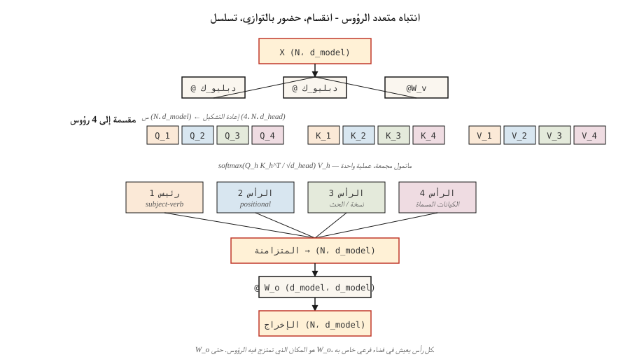

# Multi-Head Attention

> يتعلم رأس الاهتمام علاقة واحدة في كل مرة. ثمانية رؤوس تتعلم ثمانية. الرؤوس مجانية. خذ المزيد منهم.

**النوع:** بناء
** اللغات: ** بايثون
**المتطلبات الأساسية:** المرحلة 7 · 02 (الانتباه الذاتي من الصفر)
**الوقت:** ~75 دقيقة

## The Problem

يقوم رأس واحد للانتباه الذاتي بحساب مصفوفة اهتمام واحدة. تلتقط هذه المصفوفة نوعًا واحدًا من العلاقة، وهو عادةً النوع الذي يقلل من الخسارة مهما كانت إشارة التدريب. إذا كانت بياناتك تحتوي على اتفاق بين الفاعل والفعل، ومرجع مشترك، وخطاب طويل المدى، وتقطيع نحوي، كلها متشابكة معًا، فإن رأسًا واحدًا يقسمها إلى توزيع soft-max واحد ويفقد نصف الإشارة.

الحل من ورقة فاسواني لعام 2017: تشغيل العديد من وظائف الانتباه بالتوازي، كل منها بإسقاطات Q، K، V الخاصة بها، وتسلسل المخرجات. يعمل كل رأس في مساحة فرعية أصغر من البعد `d_model / n_heads`. يبقى إجمالي المعلمات كما هو. ترتفع القوة التعبيرية.

الاهتمام متعدد الرؤوس هو الافتراضي الذي يأتي معه كل محول في عام 2026. الحجة الوحيدة تدور حول *عدد* الرؤوس وما إذا كانت المفاتيح والقيم تشترك في التوقعات (انتباه الاستعلام المجمع، انتباه الاستعلام المتعدد، الانتباه الكامن متعدد الرؤوس).

## The Concept



**تقسيم.** خذ `X` من الشكل `(N, d_model)`. مشروع على Q، K، V لكل شكل `(N, d_model)`. أعد التشكيل إلى `(N, n_heads, d_head)` حيث `d_head = d_model / n_heads`. قم بالتبديل إلى `(n_heads, N, d_head)`.

**الحضور بالتوازي.** قم بتشغيل انتباه المنتج النقطي المتدرج داخل كل رأس. كل رأس ينتج `(N, d_head)`. تعمل الرؤوس على مساحات فرعية مختلفة من التضمين ولا تتحدث أبدًا أثناء حساب الانتباه نفسه.

**التسلسل والمشروع.** يعود المكدس إلى `(N, d_model)` ويضرب في مصفوفة الإخراج التي تم تعلمها `W_o` بالشكل `(d_model, d_model)`. `W_o` هو المكان الذي تختلط فيه الرؤوس.

**لماذا يعمل.** يمكن لكل رئيس أن يتخصص دون التنافس مع الآخرين على الميزانية التمثيلية. تُظهر الدراسات الاستقصائية من 2019 إلى 2024 أدوارًا رئيسية مميزة: الرؤوس الموضعية، والرأس الذي يهتم بالرمز المميز السابق، ورؤوس النسخ، ورؤساء الكيانات المسماة، والرؤوس التعريفية (التي تكمن وراء التعلم في السياق).

** نسب الاختلافات لعام 2026: **

| البديل | رؤساء س | رؤوس K/V | يستخدم بواسطة |
|---------|--------|-----------|---------|
| متعدد الرؤوس (MHA) | ن | ن | GPT-2, BERT, T5 |
| استعلام متعدد (MQA) | ن | 1 | بالم، فالكون |
| استعلام مجمع (GQA) | ن | G (على سبيل المثال N/8) | لاما 2 70 ب، لاما 3+، كوين 2+، ميسترال |
| متعدد الرؤوس كامنة (MLA) | ن | مضغوط إلى رتبة منخفضة | ديب سيك-V2, V3 |

GQA هو الإعداد الافتراضي الحديث لأنه يقطع ذاكرة التخزين المؤقت KV بعامل `N/G` مع الحفاظ على الجودة الكاملة تقريبًا. MLA يذهب إلى أبعد من ذلك عن طريق ضغط K/V في مساحة كامنة، ثم إسقاطه مرة أخرى في وقت الحوسبة - يكلف FLOPs، ويوفر الكثير من الذاكرة.

## Build It

### Step 1: split heads from the single-head attention we already have

خذ `SelfAttention` من الدرس 02 وقم بتغليفه بزوج منقسم/متشابك. راجع `code/main.py` للتعرف على التنفيذ المزعج؛ المنطق هو:

```python
def split_heads(X, n_heads):
    n, d = X.shape
    d_head = d // n_heads
    return X.reshape(n, n_heads, d_head).transpose(1, 0, 2)  # (heads, n, d_head)

def combine_heads(H):
    h, n, d_head = H.shape
    return H.transpose(1, 0, 2).reshape(n, h * d_head)
```

تغيير واحد وتغيير واحد. لا حلقة. هذا هو بالضبط ما يفعله PyTorch تحت `nn.MultiheadAttention`.

### Step 2: run scaled-dot-product attention per head

يحصل كل رأس على شريحة Q وK وV الخاصة به. ويصبح الانتباه عبارة عن مجموعة متمول:

```python
def mha_forward(X, W_q, W_k, W_v, W_o, n_heads):
    Q = X @ W_q
    K = X @ W_k
    V = X @ W_v
    Qh = split_heads(Q, n_heads)         # (heads, n, d_head)
    Kh = split_heads(K, n_heads)
    Vh = split_heads(V, n_heads)
    scores = Qh @ Kh.transpose(0, 2, 1) / np.sqrt(Qh.shape[-1])
    weights = softmax(scores, axis=-1)
    out = weights @ Vh                    # (heads, n, d_head)
    concat = combine_heads(out)
    return concat @ W_o, weights
```

على الأجهزة الحقيقية `Qh @ Kh.transpose(...)` يوجد واحد `bmm`. يرى GPU مطمولًا واحدًا على شكل دفعة واحدة `(heads, N, d_head) × (heads, d_head, N) -> (heads, N, N)`. إضافة الرؤوس مجانية.

### Step 3: Grouped-Query Attention variant

تتغير توقعات المفتاح والقيمة فقط. Q يحصل على `n_heads` مجموعات؛ تحصل K وV على مجموعات `n_kv_heads < n_heads` ويتم تكرارها للمطابقة:

```python
def gqa_project(X, W, n_kv_heads, n_heads):
    kv = split_heads(X @ W, n_kv_heads)       # (kv_heads, n, d_head)
    repeat = n_heads // n_kv_heads
    return np.repeat(kv, repeat, axis=0)      # (n_heads, n, d_head)
```

عند الاستدلال، يؤدي هذا إلى حفظ الذاكرة لأن النسخ `n_kv_heads` فقط تعيش في ذاكرة التخزين المؤقت KV، وليس `n_heads`. يستخدم Llama 3 70B 64 رأس استعلام مع 8 رؤوس KV - تقليص ذاكرة التخزين المؤقت 8×.

### Step 4: probe what each head learned

تشغيل MHA في جملة قصيرة بأربعة رؤوس. لكل رأس، قم بطباعة مصفوفة الاهتمام `(N, N)`. سترى رؤوسًا مختلفة تختار بنية مختلفة حتى مع التهيئة العشوائية - وهذا يشير جزئيًا إلى التماثل الدوراني في المساحات الفرعية.

## Use It

في PyTorch، الإصدار المكون من سطر واحد:

```python
import torch.nn as nn

mha = nn.MultiheadAttention(embed_dim=512, num_heads=8, batch_first=True)
```

GQA اعتبارًا من PyTorch 2.5+:

```python
from torch.nn.functional import scaled_dot_product_attention

# scaled_dot_product_attention auto-dispatches Flash Attention on CUDA.
# For GQA, pass Q of shape (B, n_heads, N, d_head) and K,V of shape
# (B, n_kv_heads, N, d_head). PyTorch handles the repeat.
out = scaled_dot_product_attention(q, k, v, is_causal=True, enable_gqa=True)
```

**كم عدد الرؤوس؟** القواعد الأساسية لنماذج الإنتاج في عام 2026:

| حجم الموديل | د_نموذج | n_heads | د_الرأس |
|------------|---------|---------|--------|
| صغير (~125م) | 768 | 12 | 64 |
| القاعدة (~350 م) | 1024 | 16 | 64 |
| كبير (~1B) | 2048 | 16 | 128 |
| الحدود (~70 ب) | 8192 | 64 | 128 |

`d_head` يصل دائمًا إلى 64 أو 128. وهي وحدة قياس المقدار الذي يمكن أن "يراه" رأس واحد. انخفض إلى ما دون 32 وتبدأ الرؤوس في محاربة عامل التحجيم `sqrt(d_head)`؛ إذا تجاوزت 256 فستفقد ميزة "العديد من المتخصصين الصغار".

## Ship It

انظر `outputs/skill-mha-configurator.md`. توصي المهارة بعدد الرؤوس وعدد رؤوس كيلوفولت واستراتيجية الإسقاط لمحول جديد مع مراعاة ميزانية المعلمة وطول التسلسل وهدف النشر.

## Exercises

1. **سهل.** خذ MHA من `code/main.py` وغير `n_heads` من 1 إلى 16 مع `d_model=64` ثابت. ارسم فقدان نموذج صغير مكون من طبقة واحدة في مهمة نسخ تركيبية. هل المزيد من الرؤوس تساعد أم تهبط أم تؤذي؟
2. **متوسط.** تنفيذ MQA (رأس KV واحد مشترك عبر جميع رؤوس الاستعلام). قم بقياس مقدار انخفاض عدد المعلمات مقابل MHA الكامل. احسب مقدار تقلص حجم ذاكرة التخزين المؤقت KV عند الاستدلال على N=2048.
3. **صعب.** تنفيذ نسخة صغيرة من الانتباه الكامن متعدد الرؤوس: ضغط K,V إلى المرتبة `r` الكامنة، وتخزين الكامن في ذاكرة التخزين المؤقت KV، وفك الضغط في وقت الانتباه. عند أي `r` تتجاوز ذاكرة التخزين المؤقت أقل من 1/8 من MHA الكاملة بينما تظل الجودة في حدود 1 بت من التحقق من الصحة؟

## Key Terms

| مصطلح | ماذا يقول الناس | ماذا يعني في الواقع |
|------|-|--------------------------------------|
| رئيس | "دائرة اهتمام واحدة" | إسقاط Q/K/V واحد للبعد `d_head = d_model / n_heads` مع مصفوفة الاهتمام الخاصة به. |
| د_الرأس | "بعد الرأس" | عرض مخفي لكل رأس؛ دائمًا تقريبًا 64 أو 128 في الإنتاج. |
| انقسام / الجمع | "حيل إعادة التشكيل" | `(N, d_model) ↔ (n_heads, N, d_head)` إعادة التشكيل+التبديل حول الانتباه. |
| W_o | "إسقاط الإخراج" | `(d_model, d_model)` يتم تطبيق المصفوفة بعد تسلسل الرؤوس؛ حيث تختلط الرؤوس. |
| MQA | "رأس واحد KV" | تنبيه متعدد الاستعلام: إسقاط K/V مشترك واحد. أصغر KV ذاكرة تخزين مؤقت، مع بعض فقدان الجودة. |
| GQA | "الافتراضي منذ اللاما 2" | تنبيه الاستعلام المجمع باستخدام `n_kv_heads < n_heads`؛ يتكرر لمطابقة س. |
| MLA | "خدعة DeepSeek" | تنبيه كامن متعدد الرؤوس: يتم ضغط K،V إلى مستوى كامن منخفض الرتبة، ويتم فك الضغط عنه في وقت الحضور. |
| رأس الحث | "الدائرة الكامنة وراء التعلم في السياق" | زوج من الرؤوس التي تكتشف الأحداث السابقة وتنسخ ما تلاها. |

## Further Reading

- [Vaswani et al. (2017). Attention Is All You Need §3.2.2](https://arxiv.org/abs/1706.03762) — the original multi-head spec.
- [Shazeer (2019). فك تشفير المحول السريع: رأس كتابة واحد هو كل ما تحتاجه](https://arxiv.org/abs/1911.02150) — الورقة MQA.
- [Ainslie et al. (2023). GQA: Training Generalized Multi-Query Transformer Models from Multi-Head Checkpoints](https://arxiv.org/abs/2305.13245) — how to convert MHA to GQA after training.
- [DeepSeek-AI (2024). DeepSeek-V2 تقرير فني](https://arxiv.org/abs/2405.04434) — MLA ولماذا يتفوق على MHA/GQA على ذاكرة التخزين المؤقت.
- [أولسون وآخرون. (2022). التعلم في السياق والرؤوس التعريفية](https://transformer-circuits.pub/2022/in-context-learning-and-induction-heads/index.html) — نظرة آلية على ما يفعله الرؤوس فعليًا.
