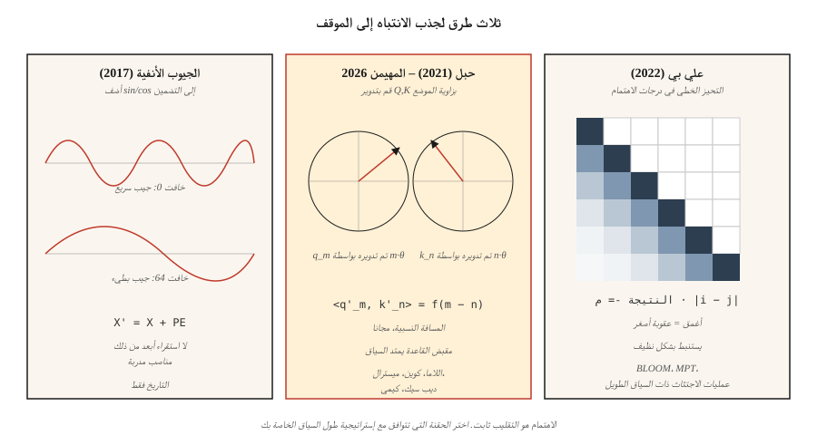

# Positional Encoding — Sinusoidal, RoPE, ALiBi

> الاهتمام التقليب ثابت. "جلست القطة على السجادة" و"جلست القطة على السجادة" تنتج نفس الإخراج بدون إشارة موضعية. قامت ثلاث خوارزميات بإصلاح الأمر، ولكل منها رهان مختلف على معنى "المركز".

**النوع:** بناء
** اللغات: ** بايثون
** المتطلبات الأساسية: ** المرحلة 7 · 02 (الانتباه الذاتي)، المرحلة 7 · 03 (الانتباه متعدد الرؤوس)
**الوقت:** ~45 دقيقة

## The Problem

الاهتمام المتدرج بالمنتج النقطي هو أعمى النظام. يتم حساب مصفوفة الاهتمام `softmax(Q K^T / √d) V` من أوجه التشابه الزوجية. قم بتبديل صفوف `X`، واحصل على خلط صفوف الإخراج بنفس الطريقة. لا شيء داخل الاهتمام يهتم بالمنصب.

وهذا ليس خطأً في نموذج حقيبة الكلمات. بالنسبة للغة والرمز والصوت والفيديو - أي شيء يحمل فيه النظام معنى - فهو أمر قاتل.

الإصلاح هو حقن الموضع في التضمينات بطريقة أو بأخرى. ثلاثة عصور من الإجابات:

1. **الجيبية المطلقة** (فاسواني 2017). أضف `sin/cos` للموضع إلى التضمين. بسيطة، خالية من التعلم، واستقراءها ضعيف بما يتجاوز الأطوال المدربة.
2. **الحبل — زخارف الموضع الدوار** (سو 2021). قم بتدوير متجهات Q وK بزاوية متناسبة مع الموضع. يشفر الموضع *النسبي* مباشرة في منتج النقطة. المهيمنة في عام 2026.
3. **ALiBi — الانتباه إلى التحيزات الخطية** (الصحافة 2022). تخطي التضمينات بالكامل؛ إضافة عقوبة خطية لكل رأس إلى درجات الانتباه بناءً على المسافة. استقراء طول ممتاز.

اعتبارًا من عام 2026، يستخدم كل نموذج مفتوح من Frontier بشكل أساسي RoPE: Llama 2/3/4، Qwen 2/3، Mistral، Mixtral، DeepSeek-V3، Kimi. تستخدم مجموعة قليلة من نماذج السياق الطويل ALiBi أو أشكاله الحديثة. الجيبية المطلقة تاريخية.

## The Concept



### Absolute sinusoidal

قم بالحساب المسبق لمصفوفة ثابتة `PE` للشكل `(max_len, d_model)`:

```
PE[pos, 2i]   = sin(pos / 10000^(2i / d_model))
PE[pos, 2i+1] = cos(pos / 10000^(2i / d_model))
```

ثم `X' = X + PE[:N]` قبل الانتباه. كل بعد هو شكل جيبي بتردد مختلف. يتعلم النموذج قراءة الموضع من نمط الطور. فشل بعد `max_len`: لم يخبر النموذج ما يحدث في الموضع 2048 عندما رأى المواضع من 0 إلى 2047 فقط.

### RoPE

قم بتدوير المتجهات Q وK (وليس التضمينات). لزوج من الأبعاد `(2i, 2i+1)`:

```
[q'_2i    ]   [ cos(pos·θ_i)  -sin(pos·θ_i) ] [q_2i   ]
[q'_2i+1  ] = [ sin(pos·θ_i)   cos(pos·θ_i) ] [q_2i+1 ]

θ_i = base^(-2i / d_head),  base = 10000 by default
```

قم بتطبيق نفس التدوير على المفاتيح ذات الموضع `pos_k`. يصبح المنتج النقطي `q'_m · k'_n` دالة لـ `(m - n)` وحدها. وهذا يعني: **تعتمد درجة الانتباه فقط على المسافة النسبية**، على الرغم من أن التدوير كان متوقفًا عن المواضع المطلقة. خدعة جميلة.

تمديد حبل: `base` يمكن تحجيمه (NTK، YaRN، LongRoPE) لاستقراء سياقات أطول دون إعادة التدريب. امتد Llama 3 من سياق 8K إلى 128K بهذه الطريقة.

### ALiBi

تخطي خدعة التضمين. تحيز درجات الاهتمام مباشرة:

```
attn_score[i, j] = (q_i · k_j) / √d  -  m_h · |i - j|
```

حيث `m_h` هو منحدر خاص بالرأس (على سبيل المثال `1 / 2^(8·h/H)`). يتم تعزيز الرموز المميزة الأقرب؛ يتم معاقبة الرموز البعيدة. لا توجد تكلفة وقت التدريب. تُظهر الورقة أن استقراء الطول يتفوق على الجيبية ويطابق حبل RoPE على طوله الأصلي المدرب.

### What to pick in 2026

| البديل | استقراء | تكلفة التدريب | يستخدم بواسطة |
|---------|-----------------------|----------|---------|
| الجيبية المطلقة | فقير | مجاني | محول اصلي مبكر BERT |
| تعلمت المطلقة | لا شيء | صغير | GPT-2، GPT-3 |
| حبل | جيدة مع التحجيم | مجاني | اللاما 2/3/4، كوين 2/3، ميسترال، ديب سيك-V3، كيمي |
| حبل + غزل | ممتاز | مرحلة الضبط | Qwen2-1M، اللاما 3.1 128K |
| عليبي | ممتاز | مجاني | BLOOM، MPT، بايتشوان |

فاز RoPE لأنه يلفت الانتباه دون تغيير البنية، ويشفر الموضع النسبي، كما توفر المعلمة الفائقة `base` الخاصة به مقبضًا نظيفًا لضبط السياق الطويل.

## Build It

### Step 1: sinusoidal encoding

انظر `code/main.py`. حساب من 4 أسطر:

```python
def sinusoidal(N, d):
    pe = [[0.0] * d for _ in range(N)]
    for pos in range(N):
        for i in range(d // 2):
            theta = pos / (10000 ** (2 * i / d))
            pe[pos][2 * i]     = math.sin(theta)
            pe[pos][2 * i + 1] = math.cos(theta)
    return pe
```

أضف هذا إلى مصفوفة التضمين قبل طبقة الاهتمام الأولى.

### Step 2: RoPE applied to Q, K

يعمل RoPE في مكانه على Q وK. لكل زوج من الخفتات:

```python
def apply_rope(x, pos, base=10000):
    d = len(x)
    out = list(x)
    for i in range(d // 2):
        theta = pos / (base ** (2 * i / d))
        c, s = math.cos(theta), math.sin(theta)
        a, b = x[2 * i], x[2 * i + 1]
        out[2 * i]     = a * c - b * s
        out[2 * i + 1] = a * s + b * c
    return out
```

حاسم: قم بتطبيق نفس الوظيفة على Q في الموضع `m` وK في الموضع `n`. يلتقط منتجهم النقطي عامل `cos((m-n)·θ_i)` في كل زوج إحداثي. الاهتمام يتعلم الموقف النسبي مجانا.

### Step 3: ALiBi slopes and bias

```python
def alibi_bias(n_heads, seq_len):
    # slope_h = 2 ** (-8 * h / n_heads) for h = 1..n_heads
    slopes = [2 ** (-8 * (h + 1) / n_heads) for h in range(n_heads)]
    bias = []
    for m in slopes:
        row = [[-m * abs(i - j) for j in range(seq_len)] for i in range(seq_len)]
        bias.append(row)
    return bias  # add to attention scores before softmax
```

أضف `bias[h]` إلى مصفوفة نقاط الانتباه `(seq_len, seq_len)` للرأس `h`، ثم softmax.

### Step 4: verify relative-distance property of RoPE

اختر متجهين عشوائيين `a, b`. التدوير بمقدار `(pos_a, pos_b)`. ثم بواسطة `(pos_a + k, pos_b + k)`. يجب أن يتطابق كلا المنتجين النقطيين ضمن خطأ الفاصلة العائمة. هذه الخاصية هي بيت القصيد من RoPE - فهي ثابتة بالنسبة للإزاحة المطلقة، فقط الفجوة النسبية هي التي تهم.

## Use It

PyTorch 2.5+ يشحن مرافق RoPE في `torch.nn.functional`. تستخدم معظم أكواد الإنتاج `flash_attn` أو `xformers` حيث يتم تطبيق RoPE داخل نواة الانتباه.

```python
from transformers import AutoModel
model = AutoModel.from_pretrained("meta-llama/Llama-3.2-3B")
# model.config.rope_scaling → {"type": "yarn", "factor": 32.0, "original_max_position_embeddings": 8192}
```

**حيل طويلة السياق في عام 2026:**

- **NTK-استيفاء مدرك.** قم بإعادة القياس `base` إلى `base * (scale_factor)^(d/(d-2))` عند التمديد من 4K إلى 16K+.
- **YaRN.** استيفاء أكثر ذكاءً يحافظ على انتروبيا الانتباه في السياقات الطويلة. يستخدمه Llama 3.1 128K.
- **LongRoPE.** أسلوب Microsoft 2024 الذي يستخدم البحث التطوري لاختيار عوامل القياس لكل بعد. يستخدمه Phi-3-Long.
- **استيفاء الموضع + الضبط الدقيق.** ما عليك سوى تقليص المواضع بواسطة عامل الامتداد والضبط الدقيق لرموز 1–5B. فعالة بشكل مدهش.

## Ship It

انظر `outputs/skill-positional-encoding-picker.md`. تختار المهارة استراتيجية ترميز لنموذج جديد بالنظر إلى طول السياق المستهدف واحتياجات الاستقراء وميزانية التدريب.

## Exercises

1. **سهل.** ارسم المصفوفة الجيبية `PE` كخريطة حرارية لـ `max_len=512, d=128`. قم بتأكيد نمط "الخطوط تصبح أوسع مع نمو مؤشر الأبعاد".
2. **متوسط.** تنفيذ NTK-Aware RoPE Scaling. قم بتدريب LM صغير على تسلسلات بطول 256، ثم اختبر الطول 1024 مع وبدون مقياس. قياس الحيرة.
3. **صعب.** تنفيذ ALiBi وRoPE في نفس وحدة الاهتمام. تدريب محول من 4 طبقات على مهمة نسخ بتسلسلات بطول 512. استقراء إلى 2048 في وقت الاختبار. قارن التدهور.

## Key Terms

| مصطلح | ماذا يقول الناس | ماذا يعني في الواقع |
|------|-|--------------------------------------|
| الترميز الموضعي | "يخبر الاهتمام بالنظام" | أي إشارة تضاف إلى التضمينات أو الانتباه الذي يشفر الموضع. |
| الجيوب الأنفية | "الأصل" | `sin/cos` عند الترددات الهندسية المضافة إلى التضمينات؛ لا استقراء. |
| حبل | "التضمينات الدوارة" | تدوير Q، K بزاوية تعتمد على الموضع؛ منتج النقطة يشفر المسافة النسبية. |
| عليبي | "خدعة التحيز الخطي" | أضف `-m·|i-j|` إلى درجات الاهتمام؛ لا حاجة للتضمين، استقراء عظيم. |
| قاعدة | "مقبض حبل" | مقياس التردد في RoPE؛ زيادة لتوسيع السياق عند الاستدلال. |
| NTK- ​​واعي | "خدعة تحجيم الحبل" | قم بإعادة مقياس `base` بحيث لا يتم ضغط عمليات التعتيم عالية التردد عند توسيع السياق. |
| غزل | "الفخم" | الاستيفاء لكل بعد + الاستقراء الذي يحافظ على إنتروبيا الانتباه. |
| استقراء | "يعمل بما يتجاوز الطول المدرّب" | هل يمكن لمخطط الموضع أن يخدم المخرجات الصحيحة بعد `max_len` التي شوهدت في التدريب؟ |

## Further Reading

- [Vaswani et al. (2017). Attention Is All You Need §3.5](https://arxiv.org/abs/1706.03762) — original sinusoidal.
- [Su et al. (2021). RoFormer: محول محسّن مع تضمين موضع دوار](https://arxiv.org/abs/2104.09864) - ورق حبل.
- [Press, Smith, Lewis (2021). Train Short, Test Long: Attention with Linear Biases Enables Input Length Extrapolation](https://arxiv.org/abs/2108.12409) — ALiBi.
- [Peng et al. (2023). YaRN: امتداد نافذة السياق الفعال لنماذج اللغات الكبيرة](https://arxiv.org/abs/2309.00071) — مقياس RoPE المتطور.
- [Chen et al. (2023). Extending Context Window of Large Language Models via Positional Interpolation](https://arxiv.org/abs/2306.15595) — Meta's Llama 2 long-context paper.
- [Ding et al. (2024). LongRoPE: توسيع LLM نافذة السياق إلى ما يتجاوز 2 مليون رمز مميز](https://arxiv.org/abs/2402.13753) — طريقة Microsoft المستخدمة بواسطة Phi-3-Long والمذكورة في قسم Use It.
- [HuggingFace Transformers — `modeling_rope_utils.py`](https://github.com/huggingface/transformers/blob/main/src/transformers/modeling_rope_utils.py) — production-grade implementations of every RoPE scaling scheme (default, linear, dynamic, YaRN, LongRoPE, Llama-3).
