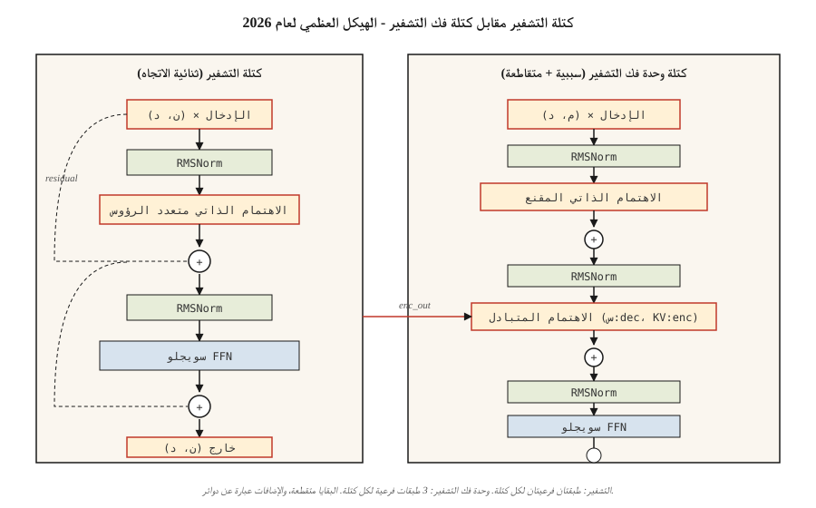

# The Full Transformer — Encoder + Decoder

> الاهتمام هو النجم. كل شيء آخر - البقايا، والتطبيع، والتغذية الأمامية، والانتباه المتبادل - هو السقالات التي تتيح لك تكديسها بعمق.

**النوع:** بناء
** اللغات: ** بايثون
** المتطلبات الأساسية: ** المرحلة 7 · 02 (انتباه ذاتي)، المرحلة 7 · 03 (انتباه متعدد الرؤوس)، المرحلة 7 · 04 (التشفير الموضعي)
**الوقت:** ~75 دقيقة

## The Problem

طبقة الاهتمام الواحدة هي مستخرج للميزات، وليست نموذجًا. ماتمول واحد لكل طبقة لا يكفي للغة. أنت بحاجة إلى العمق – والعمق يتكسر بدون السباكة الصحيحة.

تضمنت ورقة فاسواني لعام 2017 ستة قرارات تصميمية حولت طبقة انتباه واحدة إلى كتلة قابلة للتكديس. كل محول منذ ذلك الحين - التشفير فقط (BERT)، فك التشفير فقط (GPT)، التشفير-فك التشفير (T5) - يرث نفس الهيكل العظمي. في عام 2026، تم تحسين الكتل (RMSNorm، SwiGLU، pre-norm، RoPE) ولكن الهيكل العظمي متطابق.

هذا الدرس هو الهيكل العظمي. الدروس التالية متخصصة في ذلك - 06 لأجهزة التشفير، و07 لأجهزة فك التشفير، و08 لأجهزة فك التشفير.

## The Concept



### The six pieces

1. **التضمين + الإشارة الموضعية.** الرموز المميزة → المتجهات. يتم حقن الموضع عبر حبل (حديث) أو جيبي (كلاسيكي).
2. **الانتباه إلى الذات.** يهتم كل موقف ببعضه البعض. ملثمين في أجهزة فك التشفير.
3. ** شبكة التغذية الأمامية (FFN).** طبقتين من حيث الموضع MLP: `W_2 · activation(W_1 · x)`. نسبة التوسيع 4× بشكل افتراضي.
4. **الاتصال المتبقي.** `x + sublayer(x)`. بدون هذا، تختفي التدرجات بعد 6 طبقات تقريبًا.
5. **تسوية الطبقة.** `LayerNorm` أو `RMSNorm` (حديث). يستقر تيار المتبقية.
6. **الانتباه المتقاطع (وحدة فك التشفير فقط).** تأتي الاستعلامات من وحدة فك التشفير والمفاتيح والقيم من مخرجات وحدة التشفير.

### Encoder block (used by BERT, T5 encoder)

```
x → LN → MHA(self) → + → LN → FFN → + → out
                     ^              ^
                     |              |
                     └── residual ──┘
```

التشفير ثنائي الاتجاه. لا اخفاء. جميع المواقف ترى جميع المواقف.

### Decoder block (used by GPT, T5 decoder)

```
x → LN → MHA(masked self) → + → LN → MHA(cross to encoder) → + → LN → FFN → + → out
```

يحتوي جهاز فك التشفير على ثلاث طبقات فرعية لكل كتلة. الوسط - الانتباه المتبادل - هو المكان الوحيد الذي تتدفق فيه المعلومات من جهاز التشفير إلى جهاز فك التشفير. في بنية وحدة فك التشفير فقط (GPT)، يتم حذف الانتباه المتبادل ويكون لديك فقط اهتمام ذاتي مقنع + FFN.

### Pre-norm vs post-norm

الورقة الأصلية: `x + sublayer(LN(x))` مقابل `LN(x + sublayer(x))`. فقدت مرحلة ما بعد المعيار شعبيتها في عام 2019 تقريبًا - فمن الصعب التدرب بعمق دون الإحماء الدقيق. المعيار المسبق (`LN` *قبل* الطبقة الفرعية) هو الإعداد الافتراضي لعام 2026: يستخدمه كل من Llama وQwen وGPT-3+ وMistral.

### The 2026 modernized block

تم شحن Vaswani 2017 LayerNorm + ReLU. حلت الأكوام الحديثة محل كليهما. كيف تبدو كتل الإنتاج في الواقع:

| مكون | 2017 | 2026 |
|-----------|------|------|
| التطبيع | طبقة نورم | آر إم إس نورم |
| FFN التفعيل | ريلو | سويجلو |
| FFN التوسعة | 4× | 2.6× (يستخدم SwiGLU ثلاث مصفوفات، يتطابق إجمالي المعلمات) |
| الموقف | الجيبية المطلقة | حبل |
| انتبه | كامل MHA | GQA (أو MLA) |
| مصطلحات التحيز | نعم | لا |

يسقط RMSNorm متوسط ​​توسيط LayerNorm (طرح أقل بمقدار واحد)، مما يوفر الحساب ويكون مستقرًا تجريبيًا على الأقل. يتفوق SwiGLU (`Swish(W1 x) ⊙ W3 x`) باستمرار على ReLU/GELU FFN بمقدار 0.5 نقطة تقريبًا في أوراق Llama وPaLM وQwen.

### Parameter count

لكتلة واحدة ذات توسعة `d_model = d` وFFN `r`:

- MHA: `4 · d²` (إسقاطات Q، K، V، O)
- FFN (SwiGLU): `3 · d · (r · d)` ≈ `3rd²`
- الأعراف: لا يكاد يذكر

عند `d = 4096, r = 2.6, layers = 32` (تقريبًا Llama 3 8B)، الإجمالي: `32 · (4·4096² + 3·2.6·4096²) ≈ 32 · (16 + 32) M = ~1.5B parameters per layer × 32 ≈ 7B` (بالإضافة إلى التضمينات والرأس). يطابق الأعداد المنشورة.

## Build It

### Step 1: the building blocks

باستخدام الفصل `Matrix` الصغير من الدرس 03 (منسوخ إلى هذا الملف من أجل الاستقلال):

- `layer_norm(x, eps=1e-5)` — طرح المتوسط، والقسمة على الأمراض المنقولة جنسيًا.
- `rms_norm(x, eps=1e-6)` — القسمة على RMS. لا يعني الطرح.
- `gelu(x)` و `silu(x) * W3 x` (SwiGLU).
- `ffn_swiglu(x, W1, W2, W3)`.
- `encoder_block(x, params)` and `decoder_block(x, enc_out, params)`.

انظر `code/main.py` للتعرف على الأسلاك الكاملة.

### Step 2: wire a 2-layer encoder and a 2-layer decoder

كومة لهم. قم بتمرير مخرجات جهاز التشفير إلى كل انتباه مشترك لجهاز فك التشفير. أضف LN نهائي قبل إسقاط الإخراج.

```python
def encode(tokens, params):
    x = embed(tokens, params.emb) + sinusoidal(len(tokens), params.d)
    for block in params.encoder_blocks:
        x = encoder_block(x, block)
    return x

def decode(target_tokens, encoder_out, params):
    x = embed(target_tokens, params.emb) + sinusoidal(len(target_tokens), params.d)
    for block in params.decoder_blocks:
        x = decoder_block(x, encoder_out, block)
    return x
```

### Step 3: run forward on a toy example

قم بتغذية مصدر مكون من 6 رموز وهدف مكون من 5 رموز. تحقق من أن شكل الإخراج هو `(5, vocab)`. لا يوجد تدريب - هذا الدرس يدور حول الهندسة المعمارية، وليس الخسارة.

### Step 4: swap in RMSNorm + SwiGLU

استبدل LayerNorm وReLU-FFN بـ RMSNorm وSwiGLU. تأكد من أن الأشكال لا تزال متطابقة. هذا هو تحديث 2026 مع استبدال وظيفة واحدة.

## Use It

التطبيقات المرجعية PyTorch/TF: `nn.TransformerEncoderLayer`، `nn.TransformerDecoderLayer`. لكن معظم كود الإنتاج لعام 2026 يلف الكتلة الخاصة به للأسباب التالية:

- يتم استدعاء انتباه الفلاش داخل الانتباه، وليس عبر `nn.MultiheadAttention`.
- GQA / MLA ليست في مرجع stdlib.
- RoPE، RMSNorm، SwiGLU ليست الإعدادات الافتراضية PyTorch.

HF `transformers` يحتوي على كتل مرجعية نظيفة يجب عليك قراءتها: `modeling_llama.py` هي الكتلة الأساسية لوحدة فك ترميز 2026 فقط. إنه ~ 500 سطر ويستحق المشي مرة واحدة.

**جهاز التشفير مقابل وحدة فك التشفير مقابل وحدة فك التشفير - متى يتم الاختيار:**

| بحاجة | اختر | مثال |
|------|------|---------|
| التصنيف، التضمينات، QA فوق النص | التشفير فقط | BERT، ديبيرتا، مودرن بيرت |
| توليد النص، الدردشة، الكود، الاستدلال | وحدة فك التشفير فقط | GPT، لاما، كلود، كوين |
| المدخلات المنظمة → المخرجات المنظمة (الترجمة والتلخيص) | التشفير فك | T5, BART, همس |

فازت وحدة فك التشفير باللغة فقط لأنها تتوسع بشكل أنظف وتتعامل مع كل من الفهم والتوليد. لا يزال برنامج التشفير وفك التشفير هو الأفضل عندما يكون للإدخال هوية "تسلسل مصدر" واضحة (الترجمة، والتعرف على الكلام، والمهام المنظمة).

## Ship It

انظر `outputs/skill-transformer-block-reviewer.md`. تستعرض المهارة تنفيذ كتلة محول جديدة مقابل الإعدادات الافتراضية لعام 2026 وتضع علامة على القطع المفقودة (المعيار المسبق، RoPE، RMSNorm، GQA، FFN نسبة التوسيع).

## Exercises

1. **سهل.** احسب المعلمات الموجودة في encoder_block الخاص بك عند `d_model=512, n_heads=8, ffn_expansion=4, swiglu=True`. التحقق من الصحة من خلال تنفيذ الكتلة واستخدام `sum(p.numel() for p in block.parameters())`.
2. **متوسط.** التبديل من ما بعد المعيار إلى ما قبل المعيار. قم بتهيئة كليهما وقياس معيار التنشيط بعد 12 طبقة مكدسة على مدخلات عشوائية. يجب أن تنفجر عمليات تنشيط ما بعد القاعدة؛ يجب أن تظل القواعد المسبقة محدودة.
3. **صعب.** تنفيذ برنامج تشفير وفك ترميز مكون من 4 طبقات في مهمة نسخ لعبة (نسخة `x` معكوسة). تدريب 100 خطوة. الإبلاغ عن الخسارة. التبديل في RMSNorm + SwiGLU + RoPE - هل تنخفض الخسارة؟

## Key Terms

| مصطلح | ماذا يقول الناس | ماذا يعني في الواقع |
|------|-|--------------------------------------|
| كتلة | "طبقة محولة واحدة" | كومة من القاعدة + الاهتمام + القاعدة + FFN، ملفوفة في الوصلات المتبقية. |
| المتبقية | "تخطي الاتصال" | `x + f(x)` الإخراج؛ يتيح تدفق التدرج من خلال أكوام عميقة. |
| القاعدة المسبقة | "التطبيع قبل وليس بعد" | الحديث: `x + sublayer(LN(x))`. تدرب بشكل أعمق بدون تمارين إحماء. |
| آر إم إس نورم | "LayerNorm بدون الوسط" | قسمة على RMS؛ واحد أقل المرجع، نفس الاستقرار التجريبي. |
| سويجلو | "الـ FFN تحول الجميع إليه" | `Swish(W1 x) ⊙ W3 x → W2`. يتفوق على ReLU/GELU على LM الأشخاص. |
| عبر الاهتمام | "كيف يرى جهاز فك التشفير جهاز التشفير" | MHA مع Q من وحدة فك التشفير، K/V من مخرجات التشفير. |
| FFN التوسعة | "ما مدى اتساع الوسط MLP" | نسبة الحجم المخفي إلى d_model، عادةً 4 (LayerNorm) أو 2.6 (SwiGLU). |
| خالية من التحيز | "أسقط مصطلحات +b" | الأكوام الحديثة تحذف التحيزات في الطبقات الخطية؛ تحسن طفيف شركته تنوي، نموذج أصغر. |

## Further Reading

- [Vaswani et al. (2017). Attention Is All You Need](https://arxiv.org/abs/1706.03762) — original block spec.
- [Xiong et al. (2020). حول تطبيع الطبقة في بنية المحولات](https://arxiv.org/abs/2002.04745) - لماذا تتفوق القاعدة المسبقة على القاعدة اللاحقة بعمق.
- [Zhang, Sennrich (2019). Root Mean Square Layer Normalization](https://arxiv.org/abs/1910.07467) — RMSNorm.
- [Shazeer (2020). GLU المتغيرات تعمل على تحسين المحول](https://arxiv.org/abs/2002.05202) — ورقة SwiGLU.
- [HuggingFace `modeling_llama.py`](https://githubhub.com/huggingface/transformers/blob/main/src/transformers/models/llama/modeling_llama.py) — كتلة فك ترميز 2026 الأساسية فقط.
