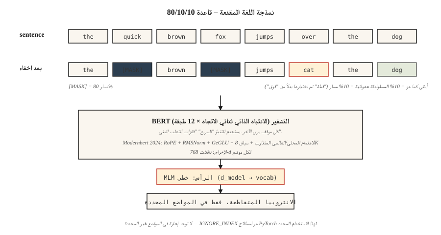

# BERT — نمذجة اللغة المقنعة
> GPT يتنبأ بالكلمة التالية. BERT يتنبأ بكلمة مفقودة. جملة واحدة من الاختلاف - ونصف عقد من كل شيء مدمج.
**النوع:** بناء
** اللغات: ** بايثون
** المتطلبات الأساسية: ** المرحلة 7 · 05 (محول كامل)، المرحلة 5 · 02 (تمثيل النص)
**الوقت:** ~45 دقيقة
## المشكلة
في عام 2018، قامت كل مهمة NLP - المشاعر، NER، QA، الاستلزام - بتدريب نموذجها الخاص من الصفر على البيانات المصنفة الخاصة بها. لم تكن هناك نقطة تفتيش "فهم اللغة الإنجليزية" مدربة مسبقًا يمكنك ضبطها. أظهر ELMo (2018) أنه يمكنك التدريب المسبق على عمليات التضمين السياقية باستخدام LSTM ثنائي الاتجاه؛ لقد ساعد لكنه لم يعمم.
BERT (Devlin et al. 2018) سأل: ماذا لو أخذنا برنامج تشفير المحولات، وقمنا بتدريبه على كل جملة على الإنترنت، وأجبرناه على التنبؤ بالكلمات المفقودة من السياق على كلا الجانبين؟ ثم تقوم بضبط رأس واحد في مهمتك النهائية. وكانت كفاءة المعلمة الوحي.
النتيجة: في غضون 18 شهرًا، هيمن BERT ومتغيراته (RoBERTa، ALBERT، ELECTRA) على كل لوحة صدارة NLP موجودة. بحلول عام 2020، كان لكل محرك بحث، والإشراف على المحتوى pipeline، ونظام البحث الدلالي على وجه الأرض BERT بداخله.
في عام 2026، لا تزال نماذج التشفير فقط هي الأداة المناسبة للتصنيف والاسترجاع والاستخراج المنظم - فهي تعمل بمعدل 5-10x أسرع لكل رمز مميز من أجهزة فك التشفير وتعد تضميناتها هي العمود الفقري لكل مكدس استرجاع حديث. دفعت ModernBERT (ديسمبر 2024) البنية إلى سياق 8K باستخدام Flash Attention + RoPE + GeGLU.
##المفهوم

### إشارة التدريب
خذ جملة: `the quick brown fox jumps over the lazy dog`.
قم بإخفاء 15% من الرموز بشكل عشوائي:
```
input:  the [MASK] brown fox jumps [MASK] the lazy dog
target: the  quick brown fox jumps  over  the lazy dog
```

تدريب النموذج على التنبؤ بالرموز الأصلية في المواضع المقنعة. نظرًا لأن المشفر ثنائي الاتجاه، فإن التنبؤ بـ `[MASK]` في الموضع 1 يمكن استخدام `brown fox jumps` في المواضع 2+. هذا هو الشيء الذي لا يستطيع GPT فعله.
### قواعد القناع BERT
من بين 15% من الرموز المختارة للتنبؤ:
- تم استبدال 80% بـ `[MASK]`.
- يتم استبدال 10% برمز عشوائي.
- 10% تبقى دون تغيير.
لماذا لا يكون `[MASK]` دائمًا؟ لأن `[MASK]` لا يظهر أبدًا في وقت الاستدلال. إن تدريب النموذج لتوقع `[MASK]` بنسبة 100% من المواضع المقنعة سيؤدي إلى حدوث تحول في التوزيع بين التدريب المسبق والضبط الدقيق. إن نسبة 10% عشوائية + 10% دون تغيير تحافظ على صدق النموذج.
### توقع الجملة التالية (NSP) - ولماذا تم إسقاطها
تم تدريب BERT الأصلي أيضًا على NSP: في ضوء جملتين A وB، توقع ما إذا كان B يتبع A. وقد ألغى RoBERTa (2019) ذلك وأظهر أن NSP مؤلم، ولم يساعد. تتخطاه أجهزة التشفير الحديثة.
### ما الذي تغير في عام 2026: ModernBERT
أعادت ورقة ModernBERT لعام 2024 بناء الكتلة باستخدام العناصر الأولية لعام 2026:
| المكون | الأصلي BERT (2018) | مودرن بيرت (2024) |
|-----------|---------------------|---||
| الموضعية | تعلمت المطلقة | حبل |
| التنشيط | __المصطلح_1__ | جيغلو |
| التطبيع | طبقة نورم | ما قبل المعيار RMSNorm |
| انتبه | كثيفة كاملة | بالتناوب المحلي (128) + العالمي |
| طول السياق | 512 | 8192 |
| رمز مميز | كلمة | __المصطلح_2__ |
وعلى عكس حزمة 2018، فهي تعتمد على Flash-Attention. يكون الاستدلال أسرع بمقدار 2–3× عند طول التسلسل 8K مقارنة بـ DeBERTa-v3 مع درجات GLUE أفضل.
### حالات الاستخدام التي لا تزال تختار برنامج تشفير في عام 2026
| مهمة | لماذا يتفوق برنامج التشفير على جهاز فك التشفير |
|------|--------------------------|
| استرجاع / تضمينات البحث الدلالي | سياق ثنائي الاتجاه = جودة تضمين أفضل لكل رمز مميز |
| التصنيف (المشاعر، النية، السمية) | تمريرة أمامية واحدة؛ لا يوجد جيل النفقات العامة |
| NER / وضع العلامات المميزة | إخراج لكل موضع، ثنائي الاتجاه أصلاً |
| استنفاد اللقطة الصفرية (NLI) | رأس المصنف أعلى التشفير |
| إعادة ترتيب لـ RAG | تسجيل نقاط التشفير المتقاطع، أسرع بـ 10 مرات من أدوات إعادة الترتيب LLM |
## بنائها
### الخطوة 1: منطق الإخفاء
انظر `code/main.py`. تأخذ الدالة `create_mlm_batch` قائمة بمعرفات الرموز المميزة وحجم المفردات واحتمالية القناع. إرجاع معرفات الإدخال (مع تطبيق الأقنعة) والتسميات (فقط في المواضع المقنعة، -100 في أي مكان آخر - اصطلاح فهرس التجاهل الخاص بـ PyTorch).
```python
def create_mlm_batch(tokens, vocab_size, mask_prob=0.15, rng=None):
    input_ids = list(tokens)
    labels = [-100] * len(tokens)
    for i, t in enumerate(tokens):
        if rng.random() < mask_prob:
            labels[i] = t
            r = rng.random()
            if r < 0.8:
                input_ids[i] = MASK_ID
            elif r < 0.9:
                input_ids[i] = rng.randrange(vocab_size)
            # else: keep original
    return input_ids, labels
```

### الخطوة 2: تشغيل التنبؤ MLM على مجموعة صغيرة
قم بتدريب برنامج تشفير مكون من طبقتين + MLM على مفردات مكونة من 20 كلمة و200 جملة. لا يوجد تدرج - نحن نجري فحوصات سلامة للتمرير الأمامي. الاحتياجات التدريبية الكاملة PyTorch.
### الخطوة 3: مقارنة أنواع الأقنعة
أظهر كيف تجعل القاعدة الثلاثية النموذج قابلاً للاستخدام بدون `[MASK]`. التنبؤ على جملة غير مقنعة وعلى جملة مقنعة. يجب أن ينتج كلاهما توزيعات رمزية معقولة لأن النموذج رأى كلا النموذجين في التدريب.
### الخطوة 4: ضبط الرأس بشكل دقيق
استبدل رأس MLM برأس التصنيف في مجموعة بيانات معنويات الألعاب. فقط الرأس يتدرب. تم تجميد التشفير. هذا هو النمط الذي يتبعه كل تطبيق BERT.
## استخدمه
```python
from transformers import AutoModel, AutoTokenizer

tok = AutoTokenizer.from_pretrained("answerdotai/ModernBERT-base")
model = AutoModel.from_pretrained("answerdotai/ModernBERT-base")

text = "Attention is all you need."
inputs = tok(text, return_tensors="pt")
out = model(**inputs).last_hidden_state   # (1, N, 768)
```

**تم ضبط نماذج التضمين بشكل دقيق BERT.** نماذج `sentence-transformers` مثل `all-MiniLM-L6-v2` هي مجموعات BERT مدربة على فقدان التباين. التشفير هو نفسه. تغيرت الخسارة.
**تم أيضًا تحسين أدوات إعادة ترتيب التشفير المتقاطع BERT.** تصنيف الأزواج في `[CLS] query [SEP] doc [SEP]`. إن الاهتمام ثنائي الاتجاه بين الاستعلام والمستند هو بالضبط ما يمنح أجهزة التشفير المتقاطعة ميزة الجودة الخاصة بها على أجهزة التشفير الثنائية.
**متى لا تختار BERT في عام 2026.** أي شيء مولد. ليس لدى برنامج التشفير طريقة معقولة لإنتاج الرموز المميزة بشكل رجعي. أيضًا: أي شيء أقل من 1B من المعلمات حيث يمكن لجهاز فك ترميز صغير أن يطابق الجودة بمرونة أكبر (Phi-3-Mini، Qwen2-1.5B).
## اشحنها
انظر `outputs/skill-bert-finetuner.md`. تحدد المهارة نطاقًا دقيقًا BERT (اختيار العمود الفقري، مواصفات الرأس، البيانات، التقييم، التوقف) لمهمة تصنيف أو استخراج جديدة.
## تمارين
1. **سهل.** قم بتشغيل `code/main.py` وطباعة توزيع القناع على 10000 رمز مميز. تأكد من تحديد ~15%، ومنهم ~80% يصبحون `[MASK]`.
2. **متوسط.** تنفيذ إخفاء الكلمة بالكامل: إذا تم تحويل كلمة إلى كلمات فرعية، فقم بإخفاء كل الكلمات الفرعية معًا أو لا شيء. قم بقياس ما إذا كان هذا يؤدي إلى تحسين دقة MLM في مجموعة مكونة من 500 جملة.
3. **صعب.** قم بتدريب BERT صغير (طبقتين، d=64) على 10000 جملة من مجموعة بيانات عامة. قم بضبط الرمز المميز `[CLS]` على المشاعر SST-2. قارن مع خط الأساس الخاص بوحدة فك التشفير فقط عند المعلمات المتطابقة - أيهما يفوز؟
## المصطلحات الرئيسية
| مصطلح | ماذا يقول الناس | ماذا يعني في الواقع |
|------|-|--------------------------------------|
| MLM | "نمذجة اللغة المقنعة" | إشارة التدريب: استبدل 15% من الرموز بشكل عشوائي بـ `[MASK]`، وتوقع النسخ الأصلية. |
| ثنائي الاتجاه | "يبدو في كلا الاتجاهين" | لا يوجد لدى انتباه المشفر قناع سببي، فكل موقف يرى كل موقف آخر. |
| __الكود_1__ | "رمز المجمع" | رمز خاص مُلحق بكل تسلسل؛ يتم استخدام التضمين النهائي كتمثيل على مستوى الجملة. |
| __الكود_2__ | "فاصل المقطع" | يفصل التسلسلات المقترنة (على سبيل المثال استعلام/مستند، الجملة أ/ب). |
| __المصطلح_1__ | "توقع الجملة التالية" | مهمة التدريب المسبق الثانية لـ BERT؛ تبين أنها عديمة الفائدة في RoBERTa، وتم إسقاطها بعد عام 2019. |
| ضبط دقيق | "التكيف مع مهمة" | أبقِ جهاز التشفير مجمدًا في الغالب؛ تدريب رأس صغير في الأعلى للمهمة النهائية. |
| عبر التشفير | "إعادة الترتيب" | BERT الذي يأخذ كلا من الاستعلام والمستند كمدخل، ويخرج درجة الصلة. |
| مودرن بيرت | "تحديث 2024" | تمت إعادة بناء برنامج التشفير باستخدام RoPE، وRMSNorm، وGeGLU، مع الاهتمام المحلي/العالمي بالتناوب، وسياق 8K. |
## مزيد من القراءة
- [Devlin et al. (2018). BERT: Pre-training of Deep Bidirectional Transformers for Language Understanding](https://arxiv.org/abs/1810.04805) — الورقة الأصلية.
- [Liu et al. (2019). RoBERTa: A Robustly Optimized BERT Pretraining Approach](https://arxiv.org/abs/1907.11692) — كيفية تدريب BERT بشكل صحيح؛ يقتل NSP.
- [Clark et al. (2020). ELECTRA: Pre-training Text Encoders as Discriminators Rather Than Generators](https://arxiv.org/abs/2003.10555) — يتفوق اكتشاف الرمز المميز المستبدل على MLM عند الحوسبة المتطابقة.
- [Warner et al. (2024). Smarter, Better, Faster, Longer: A Modern Bidirectional Encoder](https://arxiv.org/abs/2412.13663) — ورقة ModernBERT.
- [HuggingFace `modeling_bert.py`](https://github.com/huggingface/transformers/blob/main/src/transformers/models/bert/modeling_bert.py) — مرجع التشفير الأساسي.