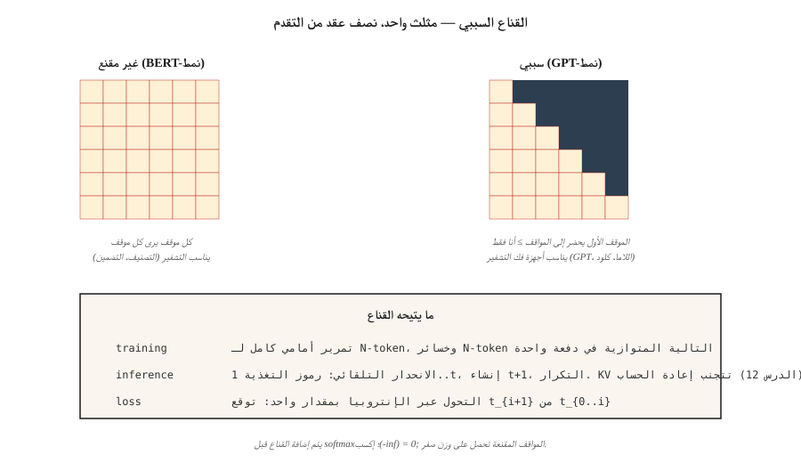

# GPT — Causal Language Modeling

> BERT يرى كلا الجانبين. GPT يرى الماضي فقط. قناع المثلث هو السطر الفردي الأكثر أهمية في الكود الحديث AI.

**النوع:** بناء
** اللغات: ** بايثون
** المتطلبات الأساسية: ** المرحلة 7 · 02 (الانتباه الذاتي)، المرحلة 7 · 05 (محول كامل)، المرحلة 7 · 06 (BERT)
**الوقت:** ~75 دقيقة

## The Problem

يجيب نموذج اللغة على سؤال واحد: بالنظر إلى الرموز `t-1` الأولى، ما هو التوزيع الاحتمالي على الرمز `t`؟ تدرب على تلك الإشارة - التنبؤ بالرمز التالي - وستحصل على نموذج يمكنه إنشاء نص عشوائي برمز مميز واحد في كل مرة.

لتدريبه بشكل كامل على تسلسل كامل بالتوازي، تحتاج إلى أن يعتمد التنبؤ بكل موضع على المواضع السابقة فقط. وإلا فإن النموذج يغش بشكل تافه من خلال النظر إلى الإجابة.

القناع السببي يفعل هذا. إنها مصفوفة مثلثة علوية واحدة مكونة من قيم `-inf` تضاف إلى درجات الانتباه قبل softmax. بعد softmax، تصبح هذه المواضع 0. يمكن لكل موضع أن يهتم فقط بنفسه وبالمواضع السابقة. ولأنك تطبقه مرة واحدة على التسلسل بأكمله، فإنك تحصل على تنبؤات N متوازية للرمز التالي في تمريرة أمامية واحدة.

GPT-1 (2018)، GPT-2 (2019)، GPT-3 (2020)، GPT-4 (2023)، GPT-5 (2024)، كلود، لاما، كوين، ميسترال، ديب سيك، كيمي - جميعهم محولات سببية لوحدة فك التشفير فقط بنفس الشيء الحلقة الأساسية. فقط بيانات أكبر وأفضل وأفضل RLHF.

## The Concept



### The mask

بالنظر إلى تسلسل بطول `N`، قم ببناء مصفوفة `N × N`:

```
M[i, j] = 0       if j <= i
M[i, j] = -inf    if j > i
```

أضف `M` إلى درجات الاهتمام الأولية قبل softmax. `exp(-inf) = 0`، لذا فإن المواضع المقنعة تساهم بوزن صفر. كل صف من مصفوفة الانتباه هو توزيع احتمالي على المواضع السابقة فقط.

تكلفة التنفيذ: مكالمة `torch.tril()` واحدة. الوقت اللازم للحساب: نانو ثانية. التأثير على الميدان: كل شيء.

### Parallel training, serial inference

التدريب: تمرير التسلسل `(N, d_model)` بأكمله إلى الأمام مرة واحدة، وحساب خسائر الإنتروبيا المتقاطعة N (واحدة لكل موضع)، والمجموع، والدعامة الخلفية. بالتوازي على طول التسلسل. هذا هو السبب في أن موازين التدريب GPT — تقوم بمعالجة 1 مليون رمز دفعة واحدة في تمريرة GPU واحدة.

الاستدلال: تقوم بإنشاء رمز مميز بواسطة رمز مميز. إطعام `[t1, t2, t3]`، الحصول على `t4`. إطعام `[t1, t2, t3, t4]`، احصل على `t5`. إطعام `[t1, t2, t3, t4, t5]`، احصل على `t6`. تحفظ ذاكرة التخزين المؤقت KV (الدرس 12) الحالات المخفية لـ `t1…tn` حتى لا تقوم بإعادة حسابها في كل خطوة. لكن العمق التسلسلي عند الاستدلال = طول الإخراج. هذه هي ضريبة الانحدار الذاتي ولماذا يمثل فك التشفير عنق الزجاجة لزمن الوصول لكل LLM.

### The loss — shift-by-one

الرموز المعطاة `[t1, t2, t3, t4]`:

- الإدخال: `[t1, t2, t3]`
- الأهداف: `[t2, t3, t4]`

لكل موضع `i`، احسب `-log P(target_i | inputs[:i+1])`. مجموع. هذا هو الإنتروبيا المتقاطعة للتسلسل بأكمله.

كل محول LM سمعت عنه قطارات على هذه الخسارة. التدريب المسبق، الضبط الدقيق، SFT — نفس الخسارة، بيانات مختلفة.

### Decoding strategies

بعد التدريب، تصبح خيارات أخذ العينات أكثر أهمية مما يعتقده الناس.

| الطريقة | ماذا يفعل | متى تستخدم |
|--------|-------------|-------------|
| الجشع | ارجماكس في كل خطوة | المهام الحتمية، إكمال التعليمات البرمجية |
| درجة الحرارة | اقسم logits على T، عينة | المهام الإبداعية، T أعلى = المزيد من التنوع |
| توب ك | عينة من رموز top-k فقط | يقتل ذيول الاحتمالية المنخفضة |
| أعلى ع (النواة) | عينة من أصغر مجموعة ذات احتمالية تراكمية ≥ p | 2020+ الافتراضي؛ يتكيف مع شكل التوزيع |
| مين ع | احتفظ بالرموز باستخدام `p > min_p * max_p` | 2024+؛ أفضل في رفض الذيول الطويلة من top-p |
| فك التشفير المضاربة | يقترح نموذج المسودة رموز N، ويتحقق النموذج الكبير من | تقليل زمن الوصول بمقدار 2–3× بنفس الجودة |

في عام 2026، تعد درجة الحرارة الدنيا + درجة الحرارة 0.7 قيمة افتراضية معقولة لنماذج الأوزان المفتوحة. يعد فك التشفير التخميني حصصًا على الطاولة لأي مكدس استدلال إنتاجي.

### What made the "GPT recipe" work

1. **جهاز فك التشفير فقط.** لا يوجد أي حمل إضافي لجهاز التشفير. تمريرة انتباه + FFN لكل طبقة.
2. **التحجيم.** 124M → 1.5B → 175B → تريليونات. تخبرك قوانين قياس شينشيلا (الدرس 13) بكيفية إنفاق الحساب.
3. **التعلم في سياق السياق.** ظهر حوالي 6ب-13ب. يمكن للنموذج أن يتبع أمثلة قليلة دون ضبط دقيق.
4. **RLHF.** بعد التدريب على التفضيلات البشرية، تم تحويل النص الخام المُدرب مسبقًا إلى مساعدين للدردشة.
5. **المعيار المسبق + RoPE + SwiGLU.** تدريب مستقر على نطاق واسع.

لم تتغير البنية الأساسية كثيرًا منذ GPT-2. لقد حدث كل شيء مثير للاهتمام في البيانات والحجم وما بعد التدريب.

## Build It

### Step 1: the causal mask

انظر `code/main.py`. بطانة واحدة:

```python
def causal_mask(n):
    return [[0.0 if j <= i else float("-inf") for j in range(n)] for i in range(n)]
```

إضافته إلى درجات الاهتمام قبل softmax. هذه هي الآلية بأكملها.

### Step 2: a 2-layer GPT-ish model

قم بتجميع كتلتين من أجهزة فك التشفير (انتباه ذاتي مقنع + FFN، بدون انتباه متقاطع). أضف تضمين الرمز المميز، والتشفير الموضعي، وإلغاء التضمين (مرتبط بمصفوفة تضمين الرمز المميز - وهي خدعة قياسية منذ GPT-2).

### Step 3: next-token prediction, end-to-end

في لعبة مكونة من 20 رمزًا، قم بإنتاج لوgit في كل موضع. حساب الخسارة عبر الإنتروبيا مقابل هدف التحول تلو الآخر. لا يوجد تدرج - هذا فحص سلامة للتمرير الأمامي.

### Step 4: sampling

تنفيذ الجشع، درجة الحرارة، أعلى ك، أعلى ص، دقيقة ص. قم بتشغيل كل منها على موجه ثابت وقارن المخرجات. وظيفة أخذ العينات هي 10 أسطر.

## Use It

PyTorch، 2026 المصطلح:

```python
from transformers import AutoModelForCausalLM, AutoTokenizer
model = AutoModelForCausalLM.from_pretrained("meta-llama/Llama-3.2-3B-Instruct")
tok = AutoTokenizer.from_pretrained("meta-llama/Llama-3.2-3B-Instruct")

prompt = "Attention is all you need because"
inputs = tok(prompt, return_tensors="pt")
out = model.generate(
    **inputs,
    max_new_tokens=64,
    temperature=0.7,
    top_p=0.9,
    do_sample=True,
)
print(tok.decode(out[0]))
```

تحت الغطاء، يقوم `generate()` بتشغيل التمريرة الأمامية، وسحب الموضع النهائي logits، وأخذ عينات من الرمز المميز التالي، وإلحاقه، والتكرار. كل إنتاج LLM مكدس الاستدلال (vLLM، TensorRT-LLM، llama.cpp، Ollama، MLX) ينفذ نفس الحلقة مع تحسين كبير - التعبئة المسبقة المجمعة، الدفع المستمر، KV ترحيل صفحات ذاكرة التخزين المؤقت، فك التشفير التخميني.

** GPT مقابل BERT، سطر واحد لكل منهما:** GPT يتنبأ `P(x_t | x_{<t})`. BERT يتنبأ `P(x_masked | x_unmasked)`. تحدد الخسارة ما إذا كان النموذج قادرًا على الإنشاء.

## Ship It

انظر `outputs/skill-sampling-tuner.md`. تختار المهارة معلمات أخذ العينات لمهمة الجيل الجديد وتضع العلامات عند الحاجة إلى فك التشفير الحتمي.

## Exercises

1. **سهل.** قم بتشغيل `code/main.py` وتأكد من أن مصفوفة الانتباه السببي تكون مثلثية سفلية بعد softmax. الفحص الفوري: يجب أن يحتوي الصف 3 على أوزان في الأعمدة من 0 إلى 3 فقط.
2. **متوسط.** تنفيذ بحث الشعاع للعرض 4. قارن بين حيرة الشعاع 4 مقابل الجشع في 10 مطالبات قصيرة. هل الشعاع يفوز دائما؟ (تلميح: عادةً للترجمة، وليس للدردشة المفتوحة.)
3. **صعب.** تنفيذ فك التشفير التخميني: استخدم نموذجًا صغيرًا مكونًا من طبقتين كمسودة ونموذجًا مكونًا من 6 طبقات كأداة للتحقق. قم بقياس سرعة ساعة الحائط على 100 اكتمال بطول 64. تأكد من تطابق المخرجات مع جشع المدقق.

## Key Terms

| مصطلح | ماذا يقول الناس | ماذا يعني في الواقع |
|------|-|--------------------------------------|
| القناع السببي | "المثلث" | تمت إضافة مصفوفة المثلث العلوي `-inf` إلى درجات الانتباه، لذا فإن الموضع `i` يرى المواضع `≤ i` فقط. |
| التنبؤ بالرمز التالي | "الخسارة" | الإنتروبيا المتقاطعة لتوزيع النموذج مقابل الرمز المميز التالي الحقيقي في كل موضع. |
| الانحدار الذاتي | "إنشاء واحدة تلو الأخرى" | تغذية الإخراج مرة أخرى كمدخل؛ التوازي فقط أثناء التدريب، وليس أثناء التوليد. |
| لوgitس | "نتائج ما قبل softmax" | الإخراج الخام للرأس LM قبل softmax؛ أخذ العينات يحدث على هذه. |
| درجة الحرارة | "مقبض الإبداع" | اقسم logits على T؛ T→0 = الجشع، T→∞ = موحد. |
| أعلى ع | "أخذ عينات النواة" | اقتطاع التوزيع إلى أصغر مجموعة مجموعها إلى ≥p؛ عينة مما تبقى. |
| مين ع | "أفضل من أعلى ع" | احتفظ بالرموز المميزة حيث `p ≥ min_p × max_p`؛ يكيف القطع مع حدة التوزيع. |
| فك التشفير المضاربة | "مسودة + تحقق" | يقترح النموذج الرخيص رموز N؛ نموذج كبير يتحقق بالتوازي. |
| إجبار المعلم | "خدعة التدريب" | أثناء التدريب، قم بتغذية الرمز المميز السابق الحقيقي، وليس تنبؤ النموذج. المعيار لكل seq2seq LM. |

## Further Reading

- [Radford et al. (2018). Improving Language Understanding by Generative Pre-Training]( — https-1.
- [Radford et al. (2019). نماذج اللغة هي متعلمون متعددو المهام غير خاضعين للرقابة](https://cdn.openai.com/better-language-models/language_models_are_unsupervised_multitask_learners.pdf) — GPT-2.
- [Brown et al. (2020). Language Models are Few-Shot Learners]( — https-3 and in-context learning.
- [Leviathan, Kalman, Matias (2023). الاستدلال السريع من المحولات عبر فك التشفير التأملي](https://arxiv.org/abs/2211.17192) - ورقة فك التشفير المواصفات.
- [HuggingFace `modeling_llama.py`](https://githubhub.com/huggingface/transformers/blob/main/src/transformers/models/llama/modeling_llama.py) — الرمز السببي الأساسي-LM الرمز المرجعي.
