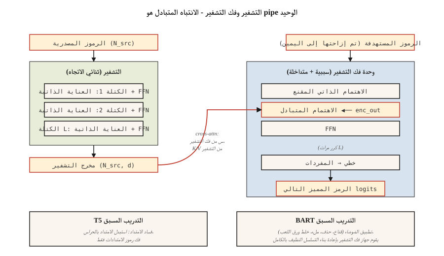

# T5، BART — نماذج التشفير وفك التشفير
> يفهم التشفير. تولد أجهزة فك التشفير. قم بجمعها معًا مرة أخرى وستحصل على نموذج مصمم لمهام الإدخال → الإخراج: الترجمة والتلخيص وإعادة الكتابة والنسخ.
**النوع:** تعلم
** اللغات: ** بايثون
**المتطلبات الأساسية:** المرحلة 7 · 05 (محول كامل)، المرحلة 7 · 06 (BERT)، المرحلة 7 · 07 (GPT)
**الوقت:** ~45 دقيقة
## المشكلة
يعمل كل من برنامج فك التشفير فقط GPT وبرنامج التشفير فقط BERT على تصميم بنية 2017 لتحقيق هدف مختلف. لكن العديد من المهام هي بشكل طبيعي مدخلات ومخرجات:
- ترجمة: الإنجليزية → الفرنسية.
- التلخيص: مقالة ذات 5000 رمز → ملخص ذو 200 رمز.
- التعرف على الكلام: الرموز الصوتية → الرموز النصية.
- الاستخراج المنظم: النثر → JSON.
بالنسبة لهذه، يعتبر برنامج التشفير وفك التشفير make هو الأنسب. ينتج المشفر تمثيلاً كثيفًا للمصدر. يقوم جهاز فك التشفير بإنشاء الإخراج، ويتوافق مع هذا التمثيل في كل خطوة. يتم التدريب بالتناوب على جانب الإخراج. نفس الخسارة مثل GPT، مشروطة فقط بإخراج برنامج التشفير.
حددت ورقتان قواعد اللعبة الحديثة:
1. **T5** (رافيل وآخرون 2019). "محول نقل النص إلى النص." يتم إعادة صياغة كل مهمة NLP كنص داخلي أو نص خارجي. بنية واحدة، مفردات واحدة، خسارة واحدة. تم تدريبه مسبقًا على التنبؤ بالامتداد المقنع (الامتدادات الفاسدة في الإدخال، وفك تشفيرها في الإخراج).
2. **BART** (لويس وآخرون 2019). "محول ثنائي الاتجاه ومحول ذاتي الانحدار." تقليل الضوضاء من وحدة التشفير التلقائي: الإدخال الفاسد بطرق متعددة (خلط ورق اللعب، والقناع، والحذف، والتدوير)، واطلب من وحدة فك التشفير إعادة بناء النسخة الأصلية.
في عام 2026، سيظل تنسيق التشفير وفك التشفير قائمًا على حيث تكون بنية الإدخال مهمة:
- الهمس (الكلام → النص).
- مكدس الترجمة من Google.
- بعض نماذج إكمال/إصلاح التعليمات البرمجية التي لها هياكل مميزة للسياق والتحرير.
- Flan-T5 ومتغيرات لمهام التفكير المنطقي المنظمة.
فازت وحدة فك التشفير فقط بالأضواء، لكن وحدة فك التشفير والتشفير لم تختفي أبدًا.
##المفهوم

### الحلقة الأمامية
```
source tokens ─▶ encoder ─▶ (N_src, d_model)  ──┐
                                                 │
target tokens ─▶ decoder block                   │
                 ├─▶ masked self-attention       │
                 ├─▶ cross-attention ◀───────────┘
                 └─▶ FFN
                ↓
              next-token logits
```

والأهم من ذلك، أن جهاز التشفير يعمل مرة واحدة لكل إدخال. تعمل وحدة فك الترميز بشكل انحداري تلقائي ولكنها تتوافق مع مخرجات وحدة التشفير *نفسها* في كل خطوة. يعد التخزين المؤقت لمخرجات برنامج التشفير بمثابة تسريع مجاني للمدخلات الطويلة.
### T5 التدريب المسبق — الفساد الشامل
اختر نطاقات عشوائية من الإدخال (متوسط ​​الطول 3 رموز، إجمالي 15%). استبدل كل فترة بحارس فريد: `<extra_id_0>`، `<extra_id_1>`، وما إلى ذلك. يقوم مفكك التشفير بإخراج المسافات التالفة فقط مع البادئة الحارسة الخاصة بها:
```
source: The quick <extra_id_0> fox jumps <extra_id_1> dog
target: <extra_id_0> brown <extra_id_1> over the lazy
```

إشارة أرخص من التنبؤ بالتسلسل بأكمله. يتنافس مع MLM (BERT) والبادئة-LM (UniLM) في استئصال الورقة T5.
### BART التدريب المسبق — تقليل الضوضاء المتعددة
BART يحاول خمس وظائف مزعجة:
1. إخفاء الرمز المميز.
2. حذف الرمز المميز.
3. ملء النص (إخفاء الامتداد، وإدراج وحدة فك الترميز بالطول الصحيح).
4. تبديل الجملة.
5. تدوير الوثيقة.
أدى الجمع بين ملء النص وتبديل الجملة إلى إنتاج أفضل الأرقام النهائية. يقوم جهاز فك التشفير دائمًا بإعادة بناء النسخة الأصلية. إخراج BART هو التسلسل الكامل، وليس فقط الامتدادات التالفة - لذا فإن حساب التدريب المسبق أعلى من T5.
### الاستدلال
نفس جيل الانحدار الذاتي مثل GPT. يتم تطبيق أخذ العينات الجشع / الشعاع / الأعلى. يعد البحث عن الشعاع (العرض 4-5) أمرًا قياسيًا للترجمة والتلخيص لأن توزيع المخرجات أضيق من الدردشة.
### متى يتم اختيار كل متغير في عام 2026
| مهمة | التشفير فك؟ | لماذا |
|------|------------------|-----|
| ترجمة | نعم عادة | مسح تسلسل المصدر؛ توزيع المخرجات الثابتة؛ أعمال بحث شعاع |
| تحويل الكلام إلى نص | نعم (همس) | تختلف طريقة الإدخال عن الإخراج؛ التشفير الأشكال ميزات الصوت |
| الدردشة / الاستدلال | لا، وحدة فك التشفير فقط | لا يوجد "إدخال" مستمر - المحادثة هي التسلسل |
| إكمال الكود | عادة لا | وحدة فك الترميز فقط ذات السياق الطويل هي التي تفوز؛ نماذج التعليمات البرمجية مثل Qwen 2.5 Coder هي وحدة فك ترميز فقط |
| تلخيص | إما يعمل | BART، PEGASUS تفوقت على الخطوط الأساسية السابقة لوحدة فك التشفير فقط؛ برامج LLM الحديثة المخصصة لوحدة فك التشفير فقط تطابقها |
| استخراج منظم | إما | T5 نظيف لأن "النص → النص" يمتص أي تنسيق إخراج |
الاتجاه منذ عام 2022 تقريبًا: تتولى وحدة فك التشفير فقط المهام التي كانت وحدة فك التشفير والتشفير تمتلكها لأن (أ) تعميم LLMs على وحدة فك التشفير المضبوطة للتعليمات على أي شيء عبر المطالبة، (ب) مقياس بنية واحدة أسهل من اثنين، (ج) RLHF يفترض وحدة فك ترميز. يستمر برنامج التشفير وفك التشفير في الحالات التي تختلف فيها طريقة الإدخال (الكلام والصور) أو عندما تكون جودة البحث عن الشعاع مهمة.
## بنائها
انظر `code/main.py`. لقد قمنا بتنفيذ تلف النطاق على طراز T5 لمجموعة الألعاب - الجزء الفردي الأكثر فائدة في هذا الدرس لأنه يظهر في كل وصفة للتدريب المسبق على التشفير وفك التشفير منذ ذلك الحين.
### الخطوة 1: انتشار الفساد
```python
def corrupt_spans(tokens, mask_rate=0.15, mean_span=3.0, rng=None):
    """Pick spans summing to ~mask_rate of tokens. Return (corrupted_input, target)."""
    n = len(tokens)
    n_mask = max(1, int(n * mask_rate))
    n_spans = max(1, int(round(n_mask / mean_span)))
    ...
```

التنسيق المستهدف هو اصطلاح T5: `<sent0> span0 <sent1> span1 ...`. يقوم الإدخال التالف بتشذير الرموز المميزة التي لم تتغير مع الرموز المميزة للحارس في مواقع الامتداد.
### الخطوة الثانية: التحقق ذهابًا وإيابًا
بالنظر إلى المدخلات والهدف التالفين، أعد بناء الجملة الأصلية. إذا كان الفساد الخاص بك قابلاً للعكس، فإن التمريرة الأمامية محددة جيدًا. هذا هو التحقق من سلامة العقل - التدريب الحقيقي لا يفعل ذلك أبدًا، لكن الاختبار رخيص الثمن ويكتشف الأخطاء الفردية في مسك الدفاتر الخاصة بك.
### الخطوة 3: BART الضوضاء
خمس وظائف: `token_mask`، `token_delete`، `text_infill`، `sentence_permute`، `document_rotate`. قم بتأليف اثنين منهم وإظهار النتيجة.
## استخدمه
مرجع عناق الوجه:
```python
from transformers import T5ForConditionalGeneration, T5Tokenizer
tok = T5Tokenizer.from_pretrained("google/flan-t5-base")
model = T5ForConditionalGeneration.from_pretrained("google/flan-t5-base")

inputs = tok("translate English to French: Attention is all you need.", return_tensors="pt")
out = model.generate(**inputs, max_new_tokens=32)
print(tok.decode(out[0], skip_special_tokens=True))
```

الحيلة T5: يدخل اسم المهمة في نص الإدخال. يتعامل نفس النموذج مع العشرات من المهام لأن كل مهمة عبارة عن نص داخلي ونص خارجي. في عام 2026، تم تعميم هذا النمط من خلال نماذج فك التشفير المضبوطة للتعليمات فقط، ولكن T5 قام بتدوينه أولاً.
## اشحنها
انظر `outputs/skill-seq2seq-picker.md`. تختار المهارة بين وحدة فك التشفير ووحدة فك التشفير فقط لمهمة جديدة نظرًا لبنية المدخلات والمخرجات وزمن الوصول وأهداف الجودة.
## تمارين
1. **سهل.** قم بتشغيل `code/main.py`، وتطبيق تلف الامتداد على جملة مكونة من 30 رمزًا مميزًا، والتحقق من أن تسلسل الرموز المميزة للمصدر غير الحارس مع الامتدادات المستهدفة التي تم فك تشفيرها يؤدي إلى إعادة إنتاج الأصل.
2. **متوسط.** تنفيذ ضوضاء `text_infill` الخاصة بـ BART: استبدل الامتدادات العشوائية برمز مميز `<mask>` واحد، ويجب على وحدة فك التشفير استنتاج طول الامتداد الصحيح بالإضافة إلى المحتويات. عرض مثال واحد.
3. **صعب.** قم بضبط `flan-t5-small` على مجموعة صغيرة من اللغة الإنجليزية → مجموعة الخنازير اللاتينية (200 زوج). قم بقياس BLEU على مجموعة مكونة من 50 زوجًا. قارن بين الضبط الدقيق `Llama-3.2-1B` على نفس البيانات وبنفس الحساب.
## المصطلحات الرئيسية
| مصطلح | ماذا يقول الناس | ماذا يعني في الواقع |
|------|-|--------------------------------------|
| التشفير فك | "محول Seq2seq" | مكدسين: جهاز تشفير ثنائي الاتجاه للإدخال، وجهاز فك تشفير سببي مع الانتباه المتبادل للإخراج. |
| عبر الاهتمام | "أين يتحدث المصدر للاستهداف" | جهاز فك التشفير Q × جهاز التشفير K/V. المكان الوحيد الذي تدخل فيه معلومات التشفير إلى وحدة فك التشفير. |
| سبان الفساد | "خدعة التدريب المسبق لـT5" | استبدل الامتدادات العشوائية برموز الحارس؛ يقوم جهاز فك التشفير بإخراج الامتدادات. |
| تقليل الضوضاء الهدف | "لعبة BART" | قم بتطبيق وظيفة الضوضاء على الإدخال، وقم بتدريب وحدة فك التشفير على إعادة بناء التسلسل النظيف. |
| رمز الحارس | "العنصر النائب `<extra_id_N>`" | الرموز المميزة الخاصة التي تضع علامة على الامتدادات التالفة في المصدر وتعيد وضع علامة عليها في الهدف. |
| فلان | "ضبط التعليمات T5" | T5 تم ضبطه على أكثر من 1800 مهمة؛ جعل التشفير وفك التشفير تنافسيًا في متابعة التعليمات. |
| بحث الشعاع | "استراتيجية فك التشفير" | احتفظ بالتسلسلات الجزئية أعلى k في كل خطوة؛ معيار الترجمة/التلخيص. |
| إجبار المعلم | "إدخال وقت التدريب" | أثناء التدريب، قم بتغذية رمز الإخراج السابق الحقيقي إلى وحدة فك التشفير، وليس رمز العينة. |
## مزيد من القراءة
- [Raffel et al. (2019). Exploring the Limits of Transfer Learning with a Unified Text-to-Text Transformer](https://arxiv.org/abs/1910.10683) — T5.
- [Lewis et al. (2019). BART: Denoising Sequence-to-Sequence Pre-training for Natural Language Generation, Translation, and Comprehension](https://arxiv.org/abs/1910.13461) — BART.
- [Chung et al. (2022). Scaling Instruction-Finetuned Language Models](https://arxiv.org/abs/2210.11416) — فلان-T5.
- [Radford et al. (2022). Robust Speech Recognition via Large-Scale Weak Supervision](https://arxiv.org/abs/2212.04356) — Whisper، برنامج التشفير وفك التشفير الأساسي لعام 2026.
- [HuggingFace `modeling_t5.py`](https://github.com/huggingface/transformers/blob/main/src/transformers/models/t5/modeling_t5.py) — التنفيذ المرجعي.