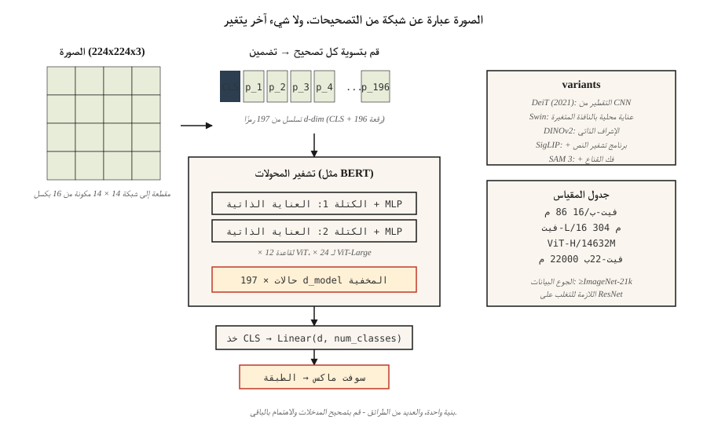

# Vision Transformers (ViT)

> الصورة عبارة عن شبكة من التصحيحات. الجملة عبارة عن شبكة من الرموز. نفس المحول يأكل كليهما.

**النوع:** بناء
** اللغات: ** بايثون
** المتطلبات الأساسية: ** المرحلة 7 · 05 (محول كامل)، المرحلة 4 · 03 (CNN)، المرحلة 4 · 14 (مقدمة محولات الرؤية)
**الوقت:** ~45 دقيقة

## The Problem

قبل عام 2020، كانت الرؤية الحاسوبية تعني التلافيف. كل SOTA على ImageNet، COCO، ومعايير الكشف تستخدم العمود الفقري CNN. كانت المحولات للغة.

دوسوفيتسكي وآخرون. (2020) - "الصورة تستحق 16 × 16 كلمة" - أظهرت أنه يمكنك إسقاط التلافيفات بالكامل. قم بتقطيع الصورة إلى رقع ذات حجم ثابت، وقم بعرض كل رقع خطيًا في جزء مضمن، ثم قم بتغذية التسلسل إلى مشفر محولات الفانيليا. على نطاق كافٍ (التدريب المسبق لـ ImageNet-21k أو أكبر)، يطابق ViT النماذج المستندة إلى ResNet أو يتفوق عليها.

كانت ViT بداية لنمط أوسع في عام 2026: بنية واحدة والعديد من الطرائق. الهمس يرمز الصوت. ViT يرمز إلى الصور. رموز العمل للروبوتات. رموز البكسل للفيديو. المحول لا يهتم - قم بإطعامه بالتسلسل وسيتعلم.

بحلول عام 2026، سيمتلك ViT وأحفاده (DeiT، Swin، DINOv2، ViT-22B، SAM 3) معظم الرؤية. لا تزال شبكات CNN تفوز بالأجهزة المتطورة والمهام الحساسة لزمن الوصول. كل شيء آخر لديه ViT في مكان ما في المكدس.

## The Concept



### Step 1 — patchify

قم بتقسيم الصورة `H × W × C` إلى سلسلة `N × (P·P·C)` من التصحيحات المسطحة. الإعداد النموذجي: `224 × 224` صورة، `16 × 16` تصحيحات → 196 تصحيحًا تحتوي كل منها على 768 قيمة.

```
image (224, 224, 3) → 14 × 14 grid of 16x16x3 patches → 196 vectors of length 768
```

حجم التصحيح هو الرافعة. تصحيحات أصغر = المزيد من الرموز، ودقة أفضل، وتكلفة الاهتمام التربيعية. البقع الأكبر = خشنة وأرخص.

### Step 2 — linear embedding

تقوم مصفوفة تعلمية واحدة بإسقاط كل تصحيح مسطح على `d_model`. أي ما يعادل التفاف حجم النواة `P` والخطوة `P`. في PyTorch هذا حرفيًا `nn.Conv2d(C, d_model, kernel_size=P, stride=P)` — تنفيذ من سطرين.

### Step 3 — prepend `[CLS]` token, add positional embeddings

- قم بإضافة رمز مميز `[CLS]` قابل للتعلم. حالتها المخفية النهائية هي تمثيل الصورة المستخدم للتصنيف.
- إضافة التضمينات الموضعية القابلة للتعلم (ViT-original) أو الجيبية ثنائية الأبعاد (الإصدارات الأحدث).
- في 2024+، تم تمديد RoPE إلى الوضع ثنائي الأبعاد، وأحيانًا بدون تضمينات واضحة.

### Step 4 — standard transformer encoder

كتل المكدس L من `LayerNorm → Self-Attention → + → LayerNorm → MLP → +`. مطابق لـ BERT. لا توجد طبقات خاصة بالرؤية. هذا هو النكتة التربوية للورقة.

### Step 5 — head

للتصنيف: خذ `[CLS]` الحالة المخفية → الخطية → softmax. بالنسبة إلى DINOv2 أو SAM، تجاهل `[CLS]`، واستخدم تضمينات التصحيح مباشرةً.

### Variants that mattered

| نموذج | سنة | التغيير |
|-------|------|--------|
| فيت | 2020 | الأصلي. حجم التصحيح ثابت، والاهتمام العالمي الكامل. |
| ديت | 2021 | التقطير؛ قابل للتدريب على ImageNet-1k فقط. |
| سوين | 2021 | هرمي مع نوافذ متغيرة. التكلفة التربيعية الثابتة. |
| دينوف2 | 2023 | الإشراف الذاتي (بدون تسميات). أفضل ميزات الرؤية العامة. |
| فيتامين-22ب | 2023 | 22B معلمات. تنطبق قوانين القياس. |
| سيجليب | 2023 | ViT + الزوج اللغوي، فقدان التباين السيني. |
| SAM3 | 2025 | قسم أي شيء؛ ViT-Large + جهاز فك ترميز القناع الفوري. |

### Why it took a while

يحتاج ViT إلى *الكثير* من البيانات لمطابقة شبكات CNN لأنه لا يحتوي على أي من التحيزات الاستقرائية CNN (ثبات الترجمة، المنطقة المحلية). بدون أكثر من 100 مليون صورة مصنفة أو تدريب مسبق قوي خاضع للإشراف الذاتي، لا تزال شبكات CNN تفوز بالحوسبة المتطابقة. أصلحت DeiT هذا الأمر في عام 2021 باستخدام حيل التقطير. تم إصلاحه من قبل DINOv2 بشكل دائم في عام 2023 بإشراف ذاتي.

## Build It

انظر `code/main.py`. Pure-stdlib patchify + التضمين الخطي + التحقق من سلامة العقل. لا يوجد تدريب - يحتاج ViT بأي مقياس واقعي إلى PyTorch وساعات من GPU من الوقت.

### Step 1: fake image

صورة مقاس 24 × 24 RGB كقائمة من صفوف `(R, G, B)` صفوف. نحن نستخدم 6 × 6 تصحيحات → 16 تصحيحًا، كل منها عبارة عن ناقل تضمين 108 د.

### Step 2: patchify

```python
def patchify(image, P):
    H = len(image)
    W = len(image[0])
    patches = []
    for i in range(0, H, P):
        for j in range(0, W, P):
            patch = []
            for di in range(P):
                for dj in range(P):
                    patch.extend(image[i + di][j + dj])
            patches.append(patch)
    return patches
```

الترتيب النقطي: الصف الرئيسي عبر الشبكة. يستخدم كل ViT هذا الترتيب.

### Step 3: linear embed

اضرب كل رقعة مسطحة في مصفوفة عشوائية `(patch_flat_size, d_model)`. تحقق من أن شكل الإخراج هو `(N_patches + 1, d_model)` بعد التعليق المسبق `[CLS]`.

### Step 4: count parameters for a realistic ViT

اطبع عدد المعلمات لقاعدة ViT: 12 طبقة، 12 رأسًا، d=768، التصحيح=16. قارن بـ ResNet-50 (~25 مليونًا). يهبط ViT-Base عند 86M تقريبًا. فيتامين كبير ~ 307 م. ViT-ضخم ~ 632 م.

## Use It

```python
from transformers import ViTImageProcessor, ViTModel
import torch
from PIL import Image

processor = ViTImageProcessor.from_pretrained("google/vit-base-patch16-224-in21k")
model = ViTModel.from_pretrained("google/vit-base-patch16-224-in21k")

img = Image.open("cat.jpg")
inputs = processor(img, return_tensors="pt")
out = model(**inputs).last_hidden_state   # (1, 197, 768): [CLS] + 196 patches
cls_emb = out[:, 0]                       # image representation
```

** تعد عمليات تضمين DINOv2 هي الإعداد الافتراضي لميزات الصورة لعام 2026. ** قم بتجميد العمود الفقري، وتدريب رأس صغير. يعمل على التصنيف والاسترجاع والكشف والتعليق. تتفوق نقاط تفتيش DINOv2 الخاصة بـ Meta في الأداء على CLIP في كل مهمة رؤية غير نصية.

**اختيار حجم التصحيح.** تستخدم النماذج الصغيرة 16×16 (ViT-B/16). يستخدم التنبؤ الكثيف (التجزئة) 8 × 8 أو 14 × 14 (SAM، DINOv2). نماذج كبيرة جدًا تستخدم 14 × 14.

## Ship It

انظر `outputs/skill-vit-configurator.md`. تختار المهارة متغير ViT وحجم التصحيح لمهمة رؤية جديدة بالنظر إلى حجم مجموعة البيانات والدقة وميزانية الحساب.

## Exercises

1. **سهل.** تشغيل `code/main.py`. تحقق من أن عدد التصحيحات يساوي `(H/P) * (W/P)` وبُعد التصحيح المسطح يساوي `P*P*C`.
2. **متوسط.** تنفيذ التضمين الموضعي الجيبي ثنائي الأبعاد - رمزان جيبيان مستقلان لـ `row` و `col` لكل رقعة، متسلسلة. قم بإطعامهم في PyTorch ViT صغير وقارن الدقة مع التضمينات الموضعية القابلة للتعلم على CIFAR-10.
3. **صعب.** قم ببناء ViT من 3 طبقات (PyTorch)، وتدرب على 1000 MNIST صورة مع تصحيحات 4×4. قياس دقة الاختبار. أضف الآن التدريب المسبق لـ DINOv2 على نفس 1000 صورة (مبسط: فقط قم بتدريب برنامج التشفير على التنبؤ بتضمينات التصحيح من التصحيحات المقنعة). هل تتحسن الدقة؟

## Key Terms

| مصطلح | ماذا يقول الناس | ماذا يعني في الواقع |
|------|-|--------------------------------------|
| التصحيح | "رمز تحويل الرؤية" | متجه مسطح لقيم البكسل لمنطقة `P × P × C` من الصورة. |
| تصحيح | "تقطيع + تسطيح" | قم بتقطيع الصورة إلى بقع غير متداخلة، وقم بتسوية كل منها إلى متجه. |
| `[CLS]` رمز مميز | "ملخص الصورة" | الرمز المميز القابل للتعلم مسبقًا؛ التضمين النهائي هو تمثيل الصورة. |
| التحيز الاستقرائي | "ما يفترضه النموذج" | لدى ViT عدد أقل من السوابق من CNNs؛ يحتاج إلى مزيد من البيانات لسد الفجوة make. |
| دينوف2 | "ViT الخاضع للإشراف الذاتي" | تدرب بدون تسميات باستخدام تكبير الصور + زخم المعلم. أفضل مميزات الصورة العامة عام 2026. |
| سيجليب | "خليفة CLIP" | تم تدريب برنامج تشفير النص ViT + على فقدان التباين السيني؛ أفضل من CLIP على الحساب المطابق. |
| سوين | "نافذة فيت" | ViT الهرمي مع الاهتمام المحلي + النوافذ المتغيرة؛ شبه تربيعي. |
| تسجيل الرموز | "خدعة 2023" | بعض الرموز الإضافية القابلة للتعلم والتي تمتص الانتباه؛ يحسن ميزات DINOv2. |

## Further Reading

- [Dosovitskiy et al. (2020). An Image is Worth 16x16 Words: Transformers for Image Recognition at Scale](https://arxiv.org/abs/2010.11929) — the ViT paper.
- [ToTouvronron et al. (2021). تدريب محولات الصور ذات الكفاءة في البيانات والتقطير من خلال الانتباه](https://arxiv.org/abs/2012.12877) — DeiT.
- [Liu et al. (2021). Swin Transformer: Hierarchical Vision Transformer using Shifted Windows](https://arxiv.org/abs/2103.14030) — Swin.
- [Oquab et al. (2023). DINOv2: تعلم الميزات المرئية القوية دون إشراف](https://arxiv.org/abs/2304.07193) — DINOv2.
- [دارسيت وآخرون. (2023). تحتاج محولات الرؤية إلى سجلات](https://arxiv.org/abs/2309.16588) - إصلاح رمز التسجيل لـ DINOv2.
