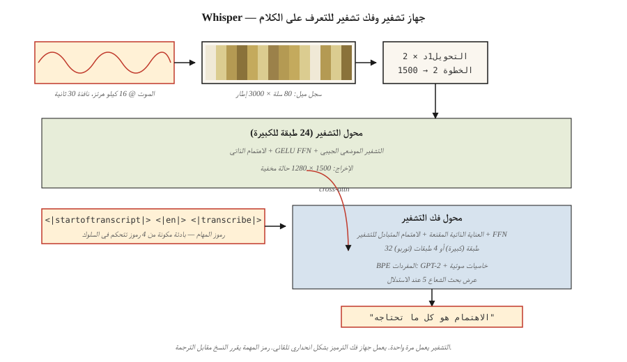

# Audio Transformers — Whisper Architecture

> الصوت هو صورة ترددها عبر الزمن. Whisper هو ViT الذي يأكل الطيف الطيفي ويتحدث مرة أخرى.

**النوع:** تعلم
** اللغات: ** بايثون
** المتطلبات الأساسية: ** المرحلة 7 · 05 (محول كامل)، المرحلة 7 · 08 (جهاز التشفير-فك التشفير)، المرحلة 7 · 09 (ViT)
**الوقت:** ~45 دقيقة

## The Problem

قبل Whisper (OpenAI، Radford et al. 2022)، كان التعرف التلقائي على الكلام (ASR) يعني wav2vec 2.0 وHuBERT - مستخرجات الميزات ذاتية الإشراف بالإضافة إلى رأس مضبوط بدقة. بيانات عالية الجودة ومكلفة pipخطوط، المجال هش. يحتاج التعرف على الكلام متعدد اللغات إلى نماذج منفصلة لكل عائلة لغوية.

قام Whisper بثلاثة رهانات:

1. **التدريب على كل شيء.** 680,000 ساعة من الملفات الصوتية ذات التصنيف الضعيف المستخرجة من الإنترنت عبر 97 لغة. لا يوجد هيئة أكاديمية نظيفة. لا توجد تسميات صوتية.
2. **نموذج واحد متعدد المهام.** تم تدريب وحدة فك ترميز واحدة بشكل مشترك على النسخ والترجمة واكتشاف النشاط الصوتي واللغة ID والطابع الزمني عبر رموز المهام.
3. ** محول التشفير وفك التشفير القياسي. ** يستهلك التشفير طيفيًا من نوع log-mel. تقوم وحدة فك الترميز بإنتاج الرموز النصية بشكل انحداري. لا يوجد مشفر صوتي، لا CTC، لا HMM.

النتيجة: Whisper Large-v3 قوي عبر اللهجات والضوضاء واللغات التي لا تحتوي على أي بيانات مصنفة نظيفة. إنها الواجهة الأمامية الافتراضية لكل مساعد صوتي مفتوح المصدر ومعظم المساعدين التجاريين في عام 2026.

## The Concept



### Step 1 — resample + window

الصوت عند 16 كيلو هرتز. مقطع/وسادة إلى 30 ثانية. حساب الطيف اللوغاريتمي: 80 مل، خطوة 10 مللي ثانية → ~ 3000 إطار × 80 ميزة. هذه هي "صورة الإدخال" التي يراها ويسبر.

### Step 2 — convolutional stem

تعمل طبقتان Conv1D مع kernel 3 والخطوة 2 على تقليل الإطارات البالغ عددها 3000 إلى 1500. نصف طول التسلسل دون إضافة الكثير من المعلمات.

### Step 3 — encoder

مشفر محولات مكون من 24 طبقة (للكبيرة) يزيد عن 1500 خطوة زمنية. التشفير الموضعي الجيبي، الانتباه الذاتي، GELU FFN. ينتج 1,500 × 1,280 حالة مخفية.

### Step 4 — decoder

وحدة فك ترميز المحولات ذات 24 طبقة. إنه ينتج بشكل انحداري رموزًا مميزة من مفردات BPE وهي مجموعة شاملة من GPT-2 مع عدد قليل من الرموز المميزة الخاصة بالصوت.

### Step 5 — task tokens

تبدأ موجه وحدة فك التشفير برموز التحكم التي تخبر النموذج بما يجب فعله:

```
<|startoftranscript|>  <|en|>  <|transcribe|>  <|0.00|>
```

or

```
<|startoftranscript|>  <|fr|>  <|translate|>   <|0.00|>
```

تم تدريب النموذج على هذه الاتفاقية. يمكنك التحكم في المهمة عن طريق البادئة. ما يعادل 2026 من ضبط التعليمات، ولكن يطبق على الكلام.

### Step 6 — output

بحث الشعاع (العرض 5) مع عتبة تسجيل المشكلة. يتم توقع الطوابع الزمنية كل 0.02 ثانية من الصوت عند غياب الرمز المميز `<|notimestamps|>`.

### Whisper sizes

| نموذج | بارامس | طبقات | د_نموذج | رؤساء | VRAM (fp16) |
|-------|--------|---------|-------|-------------|
| صغير | 39 م | 4 | 384 | 6 | ~1 GB |
| قاعدة | 74 م | 6 | 512 | 8 | ~1 GB |
| صغير | 244 م | 12 | 768 | 12 | ~2 GB |
| متوسطة | 769 م | 24 | 1024 | 16 | ~5 GB |
| كبير | 1550 م | 32 | 1280 | 20 | ~10 GB |
| كبير-v3 | 1550 م | 32 | 1280 | 20 | ~10 GB |
| كبير-v3-تيربو | 809 م | 32 | 1280 | 20 | ~6 GB (وحدة فك ترميز ذات 4 طبقات) |

قام Large-v3-turbo (2024) بقطع وحدة فك التشفير من 32 طبقة إلى 4.8 × فك تشفير أسرع مع انحدار <1 WER نقطة. إن فتح سرعة فك التشفير هو السبب في أن Whisper-turbo هو الإعداد الافتراضي لعملاء الصوت في الوقت الفعلي في عام 2026.

### What Whisper does not do

- ممنوع التدوين (من المتحدث). إقران مع pyannote لذلك.
- لا يوجد بث مباشر في الوقت الفعلي — تم إصلاح النافذة التي مدتها 30 ثانية. يتم تشغيل الأغلفة الحديثة (`faster-whisper`، `WhisperX`) عبر تداخل VAD +.
- لا يوجد سياق طويل يتجاوز 30 ثانية دون تقطيع خارجي. يعمل بشكل جيد في الممارسة العملية لأن الكلام البشري نادرًا ما يحتاج إلى سياق طويل المدى للنسخ.

### 2026 landscape

| مهمة | نموذج | ملاحظات |
|------|-------|-------|
| الإنجليزية ASR | الهمس توربو، لغو | Moonshine أسرع 4 مرات على الحافة |
| متعدد اللغات ASR | الهمس-كبير-v3 | 97 لغة |
| البث ASR | همس أسرع + VAD | أهداف زمن الوصول 150 مللي ثانية قابلة للتحقيق |
| TTS | بايبر، XTTS-v2، كوكورو | نمط التشفير وفك التشفير، ولكن على شكل الهمس |
| الصوت + اللغة | AudioLM، SeamlessM4T | الرموز النصية + الرموز الصوتية في محول واحد |

## Build It

انظر `code/main.py`. نحن لا ندرب Whisper — بل نبني المخطط الطيفي log-mel pipeline + مُنسق موجه رمز المهمة. هذه هي الأجزاء التي تلمسها بالفعل في الإنتاج.

### Step 1: synthesize audio

قم بإنشاء موجة جيبية مدتها ثانية واحدة عند 440 هرتز عند 16 كيلو هرتز. 16000 عينة.

### Step 2: log-mel spectrogram (simplified)

احتياجات الطيف الطيفي الكامل FFT. نقوم بعمل إطار مبسط + إصدار طاقة لكل إطار يُظهر الخط pipeline دون الحاجة إلى `librosa`:

```python
def frame_signal(x, frame_size=400, hop=160):
    frames = []
    for start in range(0, len(x) - frame_size + 1, hop):
        frames.append(x[start:start + frame_size])
    return frames
```

الإطار = 25 مللي ثانية، القفز = 10 مللي ثانية. يطابق نوافذ Whisper. تمثل الطاقة لكل إطار مكانًا لصناديق الميل في علم أصول التدريس.

### Step 3: pad to 30 s

يقوم Whisper دائمًا بمعالجة أجزاء مدتها 30 ثانية. لوحة (أو مقطع) الطيفي إلى 3000 لقطة.

### Step 4: build the prompt tokens

```python
def whisper_prompt(lang="en", task="transcribe", timestamps=True):
    tokens = ["<|startoftranscript|>", f"<|{lang}|>", f"<|{task}|>"]
    if not timestamps:
        tokens.append("<|notimestamps|>")
    return tokens
```

هذا هو سطح التحكم في المهام بالكامل. بادئة ذات 4 رموز.

## Use It

```python
import whisper
model = whisper.load_model("large-v3-turbo")
result = model.transcribe("meeting.wav", language="en", task="transcribe")
print(result["text"])
print(result["segments"][0]["start"], result["segments"][0]["end"])
```

أسرع، OpenAI-متوافق:

```python
from faster_whisper import WhisperModel
model = WhisperModel("large-v3-turbo", compute_type="int8_float16")
segments, info = model.transcribe("meeting.wav", vad_filter=True)
for s in segments:
    print(f"{s.start:.2f} - {s.end:.2f}: {s.text}")
```

**متى تختار Whisper في عام 2026:**

- متعدد اللغات ASR بموديل واحد.
- النسخ القوي للصوت الصاخب والمتنوع.
- البحث / النموذج الأولي ASR — أسرع نقطة انطلاق.

** متى تختار شيئًا آخر: **

- البث بزمن انتقال منخفض للغاية على الحافة - يتفوق Moonshine على Whisper بجودة مطابقة.
- محادثة في الوقت الفعلي AI تحتاج إلى أقل من 200 مللي ثانية - بث مخصص ASR.
- مذكرات المتحدث - لا يقوم Whisper بذلك؛ الترباس على بيانوت.

## Ship It

انظر `outputs/skill-asr-configurator.md`. تختار المهارة نموذج ASR ومعلمات فك التشفير والمعالجة المسبقة pipeline لتطبيق الكلام الجديد.

## Exercises

1. **سهل.** تشغيل `code/main.py`. تأكد من أن عدد الإطارات لإشارة مدتها ثانية واحدة عند 16 كيلو هرتز مع قفزة تبلغ 10 مللي ثانية هو 100 إطار تقريبًا. لمدة 30 ثانية: ~ 3000 إطار.
2. **متوسط.** أنشئ المخطط الطيفي الكامل للسجل باستخدام `numpy.fft`. تحقق من تطابق 80 مل من الصناديق مع `librosa.feature.melspectrogram(n_mels=80)` ضمن خطأ رقمي.
3. **صعب.** تنفيذ استنتاج البث: قم بتقسيم الصوت إلى نوافذ مدتها 10 ثوانٍ مع تداخل لمدة ثانيتين، وتشغيل Whisper على كل مقطع، ودمج النصوص. قم بقياس معدل الخطأ في الكلمات مقابل التمرير الفردي في عينة بودكاست مدتها 5 دقائق.

## Key Terms

| مصطلح | ماذا يقول الناس | ماذا يعني في الواقع |
|------|-|--------------------------------------|
| ميل الطيفي | "صورة صوتية" | تمثيل ثنائي الأبعاد: صناديق التردد على أحد المحاور، والأطر الزمنية على المحور الآخر؛ الطاقة ذات الحجم اللوغاريتمي لكل خلية. |
| سجل ميل | "ما يرى الهامس" | مر الطيفي ميل من خلال السجل؛ يقترب من إدراك الإنسان لجهارة الصوت. |
| الإطار | "شريحة مرة واحدة" | نافذة من العينات تبلغ 25 مللي ثانية؛ متداخلة عند خطوة 10 مللي ثانية. |
| رمز المهمة | "بادئة المطالبة للكلام" | الرموز المميزة مثل `<|transcribe|>` / `<|translate|>` في موجه وحدة فك التشفير. |
| كشف النشاط الصوتي (VAD) | "ابحث عن الكلام" | البوابة التي تزيل الصمت قبل ASR؛ التخفيضات تكلف بشكل كبير. |
| CTC | "التصنيف الزمني التوصيلي" | الخسارة الكلاسيكية ASR للتدريب الخالي من المحاذاة؛ الهمس يستخدمه NOT. |
| الهمس توربو | "جهاز فك تشفير صغير، جهاز تشفير كامل" | جهاز تشفير كبير v3 + وحدة فك ترميز ذات 4 طبقات؛ 8× فك تشفير أسرع. |
| أسرع الهمس | "مجمع الإنتاج" | إعادة تنفيذ CTranslate2؛ int8 التكميم؛ 4× أسرع من مرجع OpenAI. |

## Further Reading

- [Radford et al. (2022). Robust Speech Recognition via Large-Scale Weak Supervision](https://arxiv.org/abs/2212.04356) — Whisper paper.
- [OpenAI Whisper repo](https://github.com/openai/whisper) — reference code + model weights. Read `whisper/model.py` to see the Conv1D stem + encoder + decoder top-to-bottom in ~400 lines.
- [OpenAI Whisper — `whisper/decoding.py`](https://github.com/openai/whisper/blob/main/whisper/decoding.py) — the beam-search + task-token logic described in Steps 5–6 is here; 500 lines, fully readable.
- [Baevski et al. (2020). wav2vec 2.0: إطار عمل للتعلم الخاضع للإشراف الذاتي لتمثيلات الكلام](https://arxiv.org/abs/2006.11477) — مقدمة؛ لا يزال SOTA يتميز في بعض الإعدادات.
- [SYSTRAN/faster-whisper](https://github.com/SYSTRAN/faster-whisper) — production wrapper, 4× faster than reference.
- [Jia et al. (2024). Moonshine: التعرف على الكلام للنسخ المباشر والأوامر الصوتية](https://arxiv.org/abs/2410.15608) — 2024 صديق للحافة ASR، على شكل همس ولكنه أصغر حجمًا.
- [HuggingFace blog — "Fine-Tune Whisper For Multilingual ASR with 🤗 Transformers"](https://huggingface.co/blog/fine-tune-whisper) — canonical fine-tuning recipe including mel spectrogram preprocessor and token-timestamp handling.
- [HuggingFace `modeling_whisper.py`](https://github.com/huggingface/transformers/blob/main/src/transformers/models/whisper/modeling_whisper.py) — full implementation (encoder, decoder, cross-attention, generation) يعكس المخطط الهندسي للدرس.
