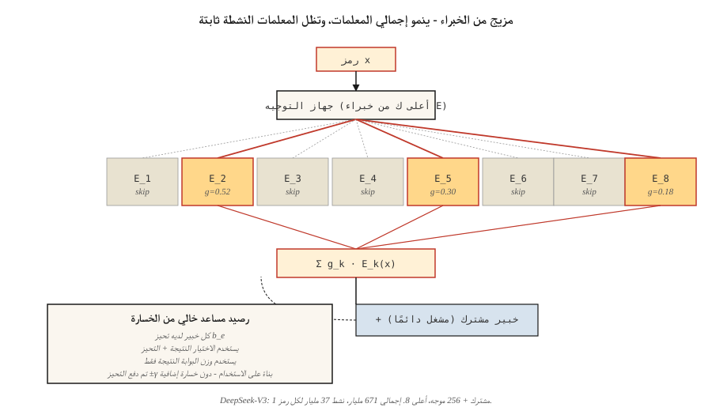

# مزيج من الخبراء (وزارة التربية والتعليم)
> يقوم محول 70B كثيف بتنشيط كل معلمة لكل رمز مميز. تقوم 671B MoE بتنشيط 37B فقط لكل رمز مميز وتتفوق عليه في كل معيار. Sparsity هي أهم فكرة للتوسع في هذا العقد.
**النوع:** بناء
** اللغات: ** بايثون
**المتطلبات الأساسية:** المرحلة 7 · 05 (محول كامل)، المرحلة 7 · 07 (GPT)
**الوقت:** ~45 دقيقة
## المشكلة
FLOPs للمحولات الكثيفة عند الاستدلال تساوي عدد المعلمات الخاصة بها (مرات 2 للتمرير الأمامي). قم بتوسيع نطاق النموذج الكثيف وسيدفع كل رمز الفاتورة كاملة. بحلول عام 2024، كانت الحدود قد وصلت إلى جدار حوسبة: لكي تكون أكثر ذكاءً بشكل هادف، كنت بحاجة إلى المزيد من عمليات FLOPs لكل رمز مميز.
مزيج من الخبراء يكسر هذا الارتباط. استبدل كل FFN بـ `E` خبراء مستقلين + جهاز توجيه يختار `k` خبراء لكل رمز مميز. إجمالي المعلمات = `E × FFN_size`. المعلمات النشطة لكل رمز = `k × FFN_size`. التكوين النموذجي لعام 2026: `E=256`، `k=8`. مقاييس التخزين بـ `E`، وحساب المقاييس بـ `k`.
حدود 2026 هي MoE بالكامل تقريبًا: DeepSeek-V3 (إجمالي 671B / 37B نشط)، Mixtral 8×22B، Qwen2.5-MoE، Llama 4، Kimi K2، gpt-oss. في قائمة المتصدرين المستقلة للتحليل الاصطناعي، أفضل 10 نماذج مفتوحة المصدر كلها تابعة لوزارة التعليم.
##المفهوم

### المبادلة FFN
كتلة المحولات الكثيفة:
```
h = x + attn(norm(x))
h = h + FFN(norm(h))
```

كتلة وزارة التربية والتعليم:
```
h = x + attn(norm(x))
scores = router(norm(h))              # (N_tokens, E)
top_k = argmax_k(scores)              # pick k of E per token
h = h + sum_{e in top_k}(
        gate(scores[e]) * Expert_e(norm(h))
    )
```

كل خبير هو FFN مستقل (عادةً SwiGLU). جهاز التوجيه عبارة عن طبقة خطية واحدة. يختار كل رمز خبراء `k` الخاصين به ويحصل على مزيج مسور من مخرجاتهم.
### مشكلة موازنة التحميل
إذا قام جهاز التوجيه بوضع 90% من الرموز المميزة عبر الخبير 3، فإن الخبراء الآخرين يتضورون جوعًا. تمت تجربة ثلاثة إصلاحات:
1. ** فقدان موازنة الحمل الإضافي ** (Switch Transformer، Mixtral). إضافة عقوبة تتناسب مع التباين في استخدام الخبراء. يعمل، ولكنه يضيف معلمة تشعبية وإشارة تدرج ثانية.
2. **قدرة الخبراء + إسقاط الرمز المميز** (التبديل المبكر). يقوم كل خبير بمعالجة `C × N/E` من الرموز المميزة على الأكثر؛ رموز الفائض تخطي الطبقة. يضر الجودة.
3. **موازنة خالية من الخسائر الإضافية** (DeepSeek-V3). أضف تحيزًا مكتسبًا لكل خبير يعمل على تغيير التحديد العلوي لجهاز التوجيه. يتم تحديث التحيز خارج خسارة التدريب. لا عقوبة على الهدف الرئيسي. فتح كبير لعام 2024.
منهج DeepSeek-V3: بعد كل خطوة تدريب، لكل خبير، تحقق مما إذا كان استخدامه أعلى أو أقل من الهدف. ادفع الانحياز بواسطة `±γ`. يستخدم التحديد `scores + bias`. احتمالات الخبراء المستخدمة للبوابة هي `scores` الأولية دون تغيير. يفصل التوجيه عن التعبير.
### الخبراء المشتركون
يقوم DeepSeek-V2/V3 أيضًا بتقسيم الخبراء إلى *مشتركين* و *موجهين*. يمر كل رمز عبر جميع الخبراء المشتركين. يتم اختيار الخبراء الموجهين عبر top-k. يكتسب الخبراء المشتركون المعرفة المشتركة؛ خبراء توجيه متخصصون. V3 يدير خبيرًا مشتركًا واحدًا بالإضافة إلى أعلى 8 من بين 256 خبيرًا تم توجيههم.
### خبراء في التفاصيل الدقيقة
Classic MoE (GShard, Switch): كل خبير واسع بقدر FFN كامل. `E` صغير (8–64)، `k` صغير (1–2).
MoE الحديثة الدقيقة الحبيبات (DeepSeek-V3، Qwen-MoE): كل خبير أضيق (حجم 1/8 FFN). `E` كبير (256+)، `k` أكبر (8+). نفس المعلمات الإجمالية، ولكن المجموعات تتوسع بشكل أسرع بكثير. `C(256, 8) = 400 trillion` "الخبراء" المحتملون لكل رمز مميز. ترتفع الجودة، ويظل زمن الوصول ثابتًا.
### ملف تعريف التكلفة
لكل رمز، لكل طبقة:
| التكوين | المعلمات / الرمز المميز النشط | مجموع المعلمات |
|--------|----------------------|-------------|
| ميكسترال 8×22ب | ~39ب | 141ب |
| اللاما 3 70B (كثيفة) | 70ب | 70ب |
| ديبسيك-V3 | 37 ب | 671 ب |
| كيمي K2 (وزارة التربية) | ~32ب | 1ت |
يتفوق DeepSeek-V3 على Llama 3 70B (كثيف) في كل معيار تقريبًا أثناء إجراء **عدد أقل من عمليات FLOP النشطة لكل رمز**. المزيد من المعلمات = المزيد من المعرفة. المزيد من عمليات FLOP النشطة = المزيد من الحوسبة لكل رمز مميز. وزارة التربية تفصل بينهما.
### المصيد: الذاكرة
يعيش جميع الخبراء في GPU بغض النظر عن الخبراء الذين يتم إطلاقهم. يحتاج نموذج 671B إلى ~1.3 TB من VRAM لأوزان fp16. يتطلب نشر Frontier MoE توازيًا متخصصًا - خبراء في القطع عبر وحدات معالجة الرسومات، وتوجيه الرموز المميزة عبر الشبكة. يهيمن على زمن الوصول التواصل من الكل إلى الكل، وليس الماتمول.
## بنائها
انظر `code/main.py`. طبقة MoE مدمجة في stdlib نقي مع:
- `n_experts=8` خبراء SwiGLU-ish (كل واحد خطي، للتوضيح)
- أعلى ك = 2 التوجيه
- أوزان البوابات ذات التطبيع softmax
- موازنة خالية من الخسائر الإضافية عبر التحيز لكل خبير
### الخطوة 1: جهاز التوجيه
```python
def route(hidden, W_router, top_k, bias):
    scores = [sum(h * w for h, w in zip(hidden, W_router[e])) for e in range(len(W_router))]
    biased = [s + b for s, b in zip(scores, bias)]
    top_idx = sorted(range(len(biased)), key=lambda i: -biased[i])[:top_k]
    # softmax over ORIGINAL scores of the chosen experts
    chosen = [scores[i] for i in top_idx]
    m = max(chosen)
    exps = [math.exp(c - m) for c in chosen]
    s = sum(exps)
    gates = [e / s for e in exps]
    return top_idx, gates
```

يؤثر التحيز على الاختيار، وليس وزن البوابة. هذه هي خدعة DeepSeek-V3 — حيث يعمل التحيز على تصحيح خلل التحميل دون توجيه توقعات النموذج.
### الخطوة 2: تشغيل 100 رمز عبر جهاز التوجيه
تتبع الخبراء الذين يطلقون النار على عدد المرات. بدون التحيز، يكون الاستخدام منحرفًا. مع حلقة التحديث المتحيزة (`-γ` للخبراء الذين يتم استخدامهم بشكل مفرط، `+γ` للخبراء الذين يعانون من نقص الاستخدام)، يتقارب الاستخدام مع توزيع موحد عبر عدد قليل من التكرارات.
### الخطوة 3: مقارنة عدد المعاملات
اطبع "المعادل الكثيف" لتكوين MoE. DeepSeek-V3-الشكل: 256 موجه + 1 مشترك، 8 نشط، d_model=7168. إجمالي عدد المعلمات مثير للدهشة. العدد النشط هو سُبع اللاما 3 70 بي الكثيف.
## استخدمه
تحميل المعانقة على الوجه:
```python
from transformers import AutoModelForCausalLM, AutoTokenizer
model = AutoModelForCausalLM.from_pretrained("mistralai/Mixtral-8x22B-v0.1")
```

استدلال الإنتاج لعام 2026: يدعم vLLM توجيه MoE محليًا. يتمتع SGLang بأسرع مسار موازي للخبراء. كلاهما يتعامل تلقائيًا مع اختيار top-k والتوازي الاحترافي.
**متى تختار وزارة التربية والتعليم:**
- تريد جودة حدودية بتكلفة استدلال أقل لكل رمز مميز.
- لديك VRAM / البنية التحتية الموازية للخبراء.
- عبء العمل الخاص بك ثقيل الرمز (الدردشة، التعليمات البرمجية) وليس ثقيل السياق (المستندات الطويلة).
**متى NOT لاختيار MoE:**
- نشر Edge — أنت تدفع سعة تخزينية كاملة مقابل أي FLOP نشط.
- خدمة المستخدم الفردي ذات زمن الاستجابة الحرج - يضيف توجيه الخبراء أعباء إضافية.
- النماذج الصغيرة (<7B) — تظهر ميزة الجودة الخاصة بوزارة التعليم فقط فوق عتبة الحوسبة (حوالي 6B من المعلمات النشطة).
## اشحنها
انظر `outputs/skill-moe-configurator.md`. تختار المهارة تخطيط E وk وتخطيط الخبراء المشترك لوزارة التربية الجديدة مع مراعاة ميزانية المعلمة ورموز التدريب وهدف النشر.
## تمارين
1. **سهل.** قم بتشغيل `code/main.py`. شاهد كيف يعمل تحديث التحيز الخالي من الخسارة الإضافية على موازنة استخدام الخبراء لأكثر من 50 تكرارًا.
2. **متوسط.** استبدل جهاز التوجيه الذي تم تعلمه بجهاز توجيه قائم على التجزئة (حتمي، لا يوجد تعليم). مقارنة الجودة والتوازن. لماذا يعتبر جهاز التوجيه المتعلم أفضل؟
3. **صعب.** تنفيذ أسلوب GRPO "التوجيه المطابق للطرح" (خدعة DeepSeek-V3.2): سجل الخبراء الذين يطلقون النار أثناء الاستدلال، وفرض نفس التوجيه أثناء حساب التدرج. قياس التأثير على إعداد تدرج سياسة اللعبة.
## المصطلحات الرئيسية
| مصطلح | ماذا يقول الناس | ماذا يعني في الواقع |
|------|-|--------------------------------------|
| خبير | "FFN واحد من بين العديد" | شبكة تغذية للأمام مستقلة؛ المعلمات المخصصة لشريحة متفرقة من حساب FFN. |
| راوتر | "البوابة" | طبقة خطية صغيرة تسجل كل رمز مقابل كل خبير؛ اختيار توب ك. |
| توجيه Top-k | "k خبراء نشطين لكل رمز مميز" | تمر عملية حساب كل رمز مميز FFN عبر عدد محدد من الخبراء، مرجحًا حسب البوابة. |
| الخسارة المساعدة | "عقوبة موازنة التحميل" | مصطلح خسارة إضافي يعاقب الاستخدام المنحرف للخبراء. |
| مساعدة خالية من الخسارة | "خدعة DeepSeek-V3" | التوازن من خلال التحيز لكل خبير في اختيار جهاز التوجيه فقط؛ لا يوجد تدرج إضافي. |
| خبير مشترك | "التشغيل دائمًا" | خبير إضافي يمر من خلاله كل رمز مميز؛ يلتقط المعرفة المشتركة. |
| التوازي الخبراء | "شارد بواسطة خبير" | توزيع خبراء مختلفين على وحدات معالجة الرسومات المختلفة؛ الرموز الطريق عبر الشبكة. |
| سبارسيتي | "المعاملات النشطة < إجمالي المعلمات" | النسبة `k × expert_size / (E × expert_size)`; 37/671 ≈ 5.5% لـ DeepSeek-V3. |
## مزيد من القراءة
- [Shazeer et al. (2017). Outrageously Large Neural Networks: The Sparsely-Gated Mixture-of-Experts Layer](https://arxiv.org/abs/1701.06538) — الفكرة.
- [Fedus, Zoph, Shazeer (2022). Switch Transformer: Scaling to Trillion Parameter Models with Simple and Efficient Sparsity](https://arxiv.org/abs/2101.03961) — Switch، MoE الكلاسيكي.
- [Jiang et al. (2024). Mixtral of Experts](https://arxiv.org/abs/2401.04088) — ميكسترال 8×7B.
- [DeepSeek-AI (2024). DeepSeek-V3 Technical Report](https://arxiv.org/abs/2412.19437) — MLA + وزارة التعليم الخالية من الخسائر الإضافية + MTP.
- [Wang et al. (2024). Auxiliary-Loss-Free Load Balancing Strategy for Mixture-of-Experts](https://arxiv.org/abs/2408.15664) — ورقة الموازنة القائمة على التحيز.
- [Dai et al. (2024). DeepSeekMoE: Towards Ultimate Expert Specialization in Mixture-of-Experts Language Models](https://arxiv.org/abs/2401.06066) — تقسيم الخبراء + المشترك الدقيق الذي يستخدمه جهاز توجيه هذا الدرس.
- [Kim et al. (2022). DeepSpeed-MoE: Advancing Mixture-of-Experts Inference and Training](https://arxiv.org/abs/2201.05596) — ورقة الخبراء المشتركة الأصلية.