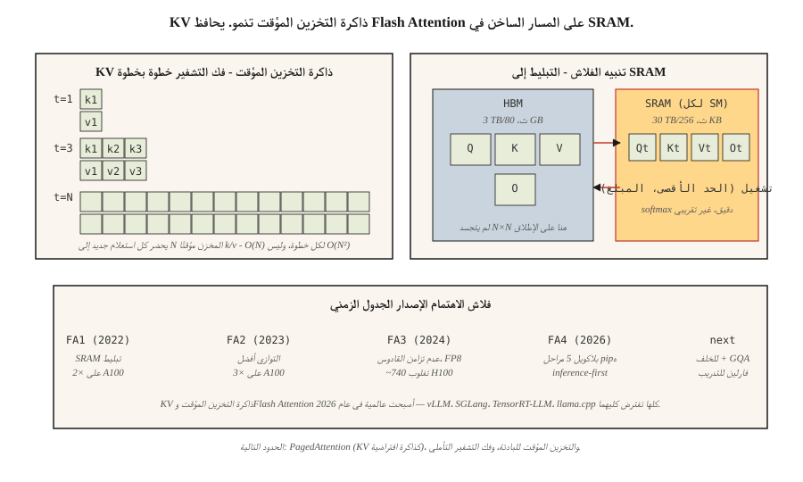

# KV ذاكرة التخزين المؤقت، تنبيه الفلاش، وتحسين الاستدلال
> التدريب متوازي ومقيد بـ FLOP. الاستدلال متسلسل ومرتبط بالذاكرة. اختناقات مختلفة، وحيل مختلفة.
**النوع:** بناء
** اللغات: ** بايثون
** المتطلبات الأساسية: ** المرحلة 7 · 02 (الانتباه الذاتي)، المرحلة 7 · 05 (محول كامل)، المرحلة 7 · 07 (GPT)
**الوقت:** ~75 دقيقة
## المشكلة
يعمل جهاز فك التشفير التلقائي الساذج `O(N²)` على إنشاء `N` الرموز المميزة: في كل خطوة يعيد حساب الانتباه على البادئة الكاملة. للحصول على استجابة رمزية 4K، هناك 16 مليون عملية انتباه، معظمها زائدة عن الحاجة. تعتبر كل حالة مخفية لرمز البادئة حتمية بمجرد حسابها - ما عليك سوى تشغيل استعلام الرمز المميز الجديد مقابل المفاتيح والقيم المخزنة مؤقتًا لكل شيء من قبل.
علاوة على ذلك، فإن الانتباه نفسه يحرك الكثير من البيانات. يتجسد الاهتمام القياسي في مصفوفة نقاط N×N، وإخراج N×d softmax، وإخراج N×d النهائي — هناك عدد كبير جدًا من عمليات القراءة والكتابة إلى HBM. بالنسبة إلى N≥2K، يصبح الانتباه مرتبطًا بالذاكرة قبل أن يصبح مرتبطًا بـ FLOP. نواة الانتباه الكلاسيكية لا تستخدم وحدات معالجة الرسوميات الحديثة بنسبة 4-10×.
هناك تحسينان، كلاهما من Dao et al.، دفعا الاستدلال الحدودي من "بطيء" إلى "سريع":
1. **KV ذاكرة التخزين المؤقت.** قم بتخزين متجهات K وV لكل رمز مميز للبادئة. كل انتباه رمزي جديد هو استعلام واحد مقابل المفاتيح المخزنة مؤقتًا. يتم تقليل الاستدلال من `O(N²)` إلى `O(N)` في كل خطوة إنشاء.
2. **انتباه فلاش.** قم بتوزيع حساب الانتباه بحيث لا تصل مصفوفة N×N الكاملة إلى HBM أبدًا. كل softmax + matmul يحدث في SRAM. 2–4× تسريع ساعة الحائط في A100; 5–10× في H100 مع FP8.
وبحلول عام 2026، يصبح كلاهما عالميًا. كل مكدس استدلال الإنتاج (vLLM، TensorRT-LLM، SGLang، llama.cpp) يفترضها. يأتي كل طراز Frontier مزودًا بميزة Flash Attention.
##المفهوم

### KV رياضيات ذاكرة التخزين المؤقت
لكل طبقة وحدة فك ترميز، لكل رمز، لكل رأس:
```
bytes_per_token_per_layer = 2 * d_head * dtype_size
                          ^
                          K and V
```

بالنسبة لنموذج 7B الذي يحتوي على 32 طبقة، 32 رأسًا، d_head=128، fp16:
```
per token per layer = 2 * 128 * 2 = 512 bytes
per token (32 layers) = 16 KB
per 32K context = 512 MB
```

بالنسبة إلى Llama 3 70B (80 طبقة، d_head=128، GQA مع 8 KV رؤوس):
```
per token per layer = 2 * 8 * 128 * 2 = 4096 bytes (4 KB)
per 32K context = 10.4 GB
```

هذا 10 GB هو السبب في أن Llama 3 70B في سياق 128 كيلو بايت يحتاج إلى معظم 40 GB A100 فقط لذاكرة التخزين المؤقت KV بحجم الدفعة 1.
**GQA هو فوز KV بذاكرة التخزين المؤقت.** MHA مع 64 رأسًا سيكون 32 GB. MLA يضغط بشكل أكبر.
### Flash Attention — خدعة التبليط
الاهتمام القياسي:
```
S = Q @ K^T          (HBM read, N×N, HBM write)
P = softmax(S)       (HBM read, HBM write)
O = P @ V            (HBM read, HBM write)
```

ثلاث رحلات HBM ذهابًا وإيابًا. في H100، HBM عرض النطاق الترددي هو 3 TB/s؛ SRAM هو 30 TB/ثانية. كل رحلة HBM تمثل عامل تباطؤ بنسبة 10 مقابل الحفاظ على كل شيء على ما يرام.
تنبيه فلاش:
```
for each block of Q (tile size ~128 × 128):
    load Q_tile into SRAM
    for each block of K, V:
        load K_tile, V_tile into SRAM
        compute S_tile = Q_tile @ K_tile^T     (SRAM)
        running softmax aggregation             (SRAM)
        accumulate into O_tile                  (SRAM)
    write O_tile to HBM
```

رحلة HBM واحدة لكل لوحة. ينخفض ​​إجمالي مساحة الذاكرة من `O(N²)` إلى `O(N)`. يقوم التمرير الخلفي بإعادة حساب بعض القيم من التمرير الأمامي بدلاً من تخزينها - وهو فوز آخر بالذاكرة.
**خدعة رقمية.** يؤدي تشغيل softmax إلى الحفاظ على `(max, sum)` عبر المربعات بحيث تكون التسوية النهائية دقيقة. ليس تقريبيًا - يقوم Flash Attention بحساب الإخراج المطابق للبت للانتباه القياسي (modulo fp16 Non-associativity).
**تطور الإصدار:**
| النسخة | سنة | تغيير المفتاح | تسريع الأجهزة المرجعية |
|---------|------|----------|------------------------------|
| فلاش 1 | 2022 | نواة SRAM متبلطة | 2× في A100 |
| فلاش 2 | 2023 | تواز أفضل، السببية من الدرجة الأولى | 3× في A100 |
| فلاش 3 | 2024 | عدم تزامن القادوس، FP8 | 1.5–2× في H100 (~740 TFLOPs FP16) |
| فلاش 4 | 2026 | بلاكويل 5 مراحل pipeline، برنامج exp2 | الاستدلال أولاً (للأمام فقط في البداية) |
يتم تمرير Flash 4 للأمام فقط عند الإطلاق. لا يزال التدريب يستخدم Flash 3. GQA ودعم varlen لـ Flash 4 معلق (منتصف 2026).
### فك التشفير التخميني — الفوز بزمن الوصول الآخر
يقترح النموذج الرخيص رموز N. نموذج كبير يتحقق من كل N بالتوازي. إذا كان التحقق يقبل رموز k، فستدفع بطاقة مرور أمامية واحدة كبيرة الحجم لأجيال k. نموذجي ك = 3-5 على الكود والنثر.
افتراضيات 2026:
- **EAGLE 2 / ميدوسا.** رؤوس مسودة مدمجة تشترك في الحالات المخفية للمحقق. 2-3× تسريع دون فقدان الجودة.
- **فك التشفير التخميني باستخدام نموذج المسودة.** 2–4× تسريع الأجهزة الاستهلاكية.
- ** فك تشفير Lookahead. ** تكرار جاكوبي؛ لا حاجة لمشروع نموذج. متخصصة ولكنها مجانية.
### الخلط المستمر
الاستدلال المجمع الكلاسيكي: انتظر حتى ينتهي التسلسل الأبطأ، ثم ابدأ دفعة جديدة. يهدر GPU عندما تنتهي الردود القصيرة في وقت مبكر.
التجميع المستمر (تم شحنه لأول مرة في Orca، والآن في vLLM، TensorRT-LLM، SGLang): قم بتبديل الطلبات الجديدة في الدفعة بمجرد انتهاء الطلبات القديمة. زيادة في الإنتاجية بمقدار 5–10× لأحمال عمل الدردشة النموذجية.
### PagedAttention — KV ذاكرة التخزين المؤقت كذاكرة افتراضية
ميزة العنوان الرئيسي لـ vLLM. يتم تخصيص ذاكرة التخزين المؤقت KV في كتل مكونة من 16 رمزًا مميزًا؛ يقوم جدول الصفحة بتعيين المواضع المنطقية للكتل المادية. يتيح لك مشاركة KV عبر العينات المتوازية (بحث الشعاع، وأخذ العينات المتوازية)، وبادئات التبديل السريع للتخزين المؤقت السريع، وذاكرة إلغاء التجزئة. 4 × تحسين الإنتاجية مقارنة بالتخصيص المتجاور الساذج.
## بنائها
انظر `code/main.py`. نقوم بتنفيذ:
1. جهاز فك ترميز تزايدي ساذج `O(N²)`.
2. `O(N)` KV وحدة فك ترميز مخبأة.
3. softmax مبلط يحاكي خوارزمية التشغيل القصوى لـ Flash Attention.
### الخطوة 1: KV ذاكرة التخزين المؤقت
```python
class KVCache:
    def __init__(self, n_layers, n_heads, d_head):
        self.K = [[[] for _ in range(n_heads)] for _ in range(n_layers)]
        self.V = [[[] for _ in range(n_heads)] for _ in range(n_layers)]

    def append(self, layer, head, k, v):
        self.K[layer][head].append(k)
        self.V[layer][head].append(v)

    def read(self, layer, head):
        return self.K[layer][head], self.V[layer][head]
```

بسيط: استمر في زيادة ناقلات K وV لكل رمز مميز في قوائم لكل طبقة ولكل رأس.
### الخطوة 2: تجانب softmax
```python
def tiled_softmax_dot(q, K, V, tile=4):
    """Flash-attention-style softmax(qK^T)V with running max/sum."""
    m = float("-inf")
    s = 0.0
    out = [0.0] * len(V[0])
    for start in range(0, len(K), tile):
        k_block = K[start:start + tile]
        v_block = V[start:start + tile]
        scores = [sum(qi * ki for qi, ki in zip(q, k)) for k in k_block]
        new_m = max(m, *scores)
        exp_old = math.exp(m - new_m) if m != float("-inf") else 0.0
        exp_new = [math.exp(sc - new_m) for sc in scores]
        s = s * exp_old + sum(exp_new)
        for j in range(len(out)):
            out[j] = out[j] * exp_old + sum(e * v[j] for e, v in zip(exp_new, v_block))
        m = new_m
    return [o / s for o in out]
```

إخراج مطابق للبت إلى `softmax(qK) V` في طلقة واحدة، ولكن في أي وقت تكون مجموعة العمل عبارة عن كتلة `tile × d_head`، وليست `N × d_head` كاملة.
### الخطوة 3: مقارنة فك التشفير الساذج مع فك التشفير المخبأ عند إنشاء 100 رمز مميز
عمليات عد الانتباه. ساذج: `O(N²)` = 5050. مخبأ: `O(N)` = 100. يطبع الكود كليهما.
## استخدمه
```python
# HuggingFace transformers auto-enables KV cache on decoder-only generate().
from transformers import AutoModelForCausalLM
model = AutoModelForCausalLM.from_pretrained(
    "meta-llama/Llama-3.2-3B",
    attn_implementation="flash_attention_2",  # use FA3 if Hopper
    torch_dtype="bfloat16",
)
# generate() uses KV cache automatically
```

إنتاج vLLM:
```bash
pip install vllm
vllm serve meta-llama/Llama-3.1-70B-Instruct \
    --tensor-parallel-size 4 \
    --max-model-len 32768 \
    --enable-prefix-caching \
    --kv-cache-dtype fp8
```

يعد التخزين المؤقت للبادئات عبر الطلبات بمثابة فوز كبير في عام 2026 - نفس موجه النظام، أو الأمثلة القليلة، أو مستند السياق الطويل يعيد استخدام KV عبر المكالمات. بالنسبة لأحمال عمل الوكيل مع مطالبات الأدوات المتكررة، يكون التخزين المؤقت للبادئة بشكل روتيني 5 × زيادة في الإنتاجية.
## اشحنها
انظر `outputs/skill-inference-optimizer.md`. تختار المهارة تنفيذ الاهتمام، واستراتيجية ذاكرة التخزين المؤقت KV، والتكميم، وفك التشفير التخميني لنشر الاستدلال الجديد.
## تمارين
1. **سهل.** قم بتشغيل `code/main.py`. التأكد من أن أجهزة فك التشفير الساذجة والمخزنة مؤقتًا تنتج نفس الإخراج؛ لاحظ الفرق في عدد العمليات.
2. **متوسط.** تنفيذ التخزين المؤقت للبادئة: في حالة وجود موجه P والعديد من عمليات الإكمال، قم بتشغيل تمرير أمامي واحد فوق P لملء ذاكرة التخزين المؤقت KV، ثم قم بالتفرع لكل إكمال. قياس السرعة مقابل إعادة ترميز P لكل منهما.
3. **صعب.** تنفيذ لعبة PagedAttention: KV ذاكرة التخزين المؤقت في كتل ثابتة مكونة من 16 رمزًا مميزًا مع قائمة مجانية. عند انتهاء التسلسل، قم بإرجاع الكتل الخاصة به إلى حوض السباحة. محاكاة 1000 محادثة مكتملة بأطوال مختلفة. قارن بين تجزئة الذاكرة والتخصيص المتجاور.
## المصطلحات الرئيسية
| مصطلح | ماذا يقول الناس | ماذا يعني في الواقع |
|------|-|--------------------------------------|
| KV ذاكرة التخزين المؤقت | "الخدعة التي يقوم بها makes بفك التشفير بسرعة" | تخزين K وV من كل رمز بادئة؛ الاستعلامات الجديدة تحضرهم بدلاً من إعادة الحساب. |
| __المصطلح_2__ | "GPU الذاكرة الرئيسية" | ذاكرة النطاق الترددي العالي. 80 GB في H100، 192 GB في B200. ~3 TB/s عرض النطاق الترددي. |
| SRAM | "الذاكرة الموجودة على الرقاقة" | لكل SM ذاكرة سريعة، ~256 KB لكل SM في H100. ~30 TB/ثانية عرض النطاق الترددي. |
| فلاش انتباه | "نواة الاهتمام المتجانبة" | يحسب الانتباه دون تجسيد N×N في HBM. |
| الخلط المستمر | "التجميع بدون انتظار" | قم بتبديل التسلسلات النهائية، واستبدال التسلسلات الجديدة، دون استنزاف الدفعة. |
| PagedAttention | "عنوان vLLM" | KV ذاكرة التخزين المؤقت المخصصة في كتل ثابتة مع جدول الصفحات؛ يزيل التجزئة. |
| التخزين المؤقت للبادئة | "إعادة استخدام المطالبات الطويلة" | ذاكرة التخزين المؤقت KV للبادئة المشتركة عبر الطلبات؛ تخفيض كبير في التكاليف للوكلاء. |
| فك التشفير المضاربة | "مسودة + تحقق" | يقترح نموذج المسودة الرخيصة الرموز المميزة؛ نموذج كبير يتحقق من k في مسار واحد. |
## مزيد من القراءة
- [Dao et al. (2022). FlashAttention: Fast and Memory-Efficient Exact Attention with IO-Awareness](https://arxiv.org/abs/2205.14135) — فلاش 1.
- [Dao (2023). FlashAttention-2: Faster Attention with Better Parallelism and Work Partitioning](https://arxiv.org/abs/2307.08691) — فلاش 2.
- [Shah et al. (2024). FlashAttention-3: Fast and Accurate Attention with Asynchrony and Low-precision](https://arxiv.org/abs/2407.08608) — فلاش 3.
- [FlashAttention-4 release notes (Dao-AILab, 2026)](https://github.com/Dao-AILab/flash-attention) — بلاكويل 5 مراحل pipeline وخدعة البرمجيات exp2؛ اقرأ الريبو README للتعرف على تحذيرات الإطلاق للأمام فقط التي يذكرها هذا الدرس.
- [Kwon et al. (2023). Efficient Memory Management for Large Language Model Serving with PagedAttention](https://arxiv.org/abs/2309.06180) — ورق vLLM.
- [Leviathan et al. (2023). Fast Inference from Transformers via Speculative Decoding](https://arxiv.org/abs/2211.17192) — فك تشفير المواصفات.
- [Li et al. (2024). EAGLE: Speculative Sampling Requires Rethinking Feature Uncertainty](https://arxiv.org/abs/2401.15077) — EAGLE-1/2 ورقة للمسودة المتكاملة التي يستشهد بها الدرس.
- [Cai et al. (2024). Medusa: Simple LLM Inference Acceleration Framework with Multiple Decoding Heads](https://arxiv.org/abs/2401.10774) — منهج ميدوسا المشار إليه بجانب EAGLE.
- [vLLM docs — PagedAttention](https://docs.vllm.ai/en/latest/design/kernel/paged_attention.html) — نظرة عميقة على الكتلة المكونة من 16 رمزًا وتصميم جدول الصفحات.