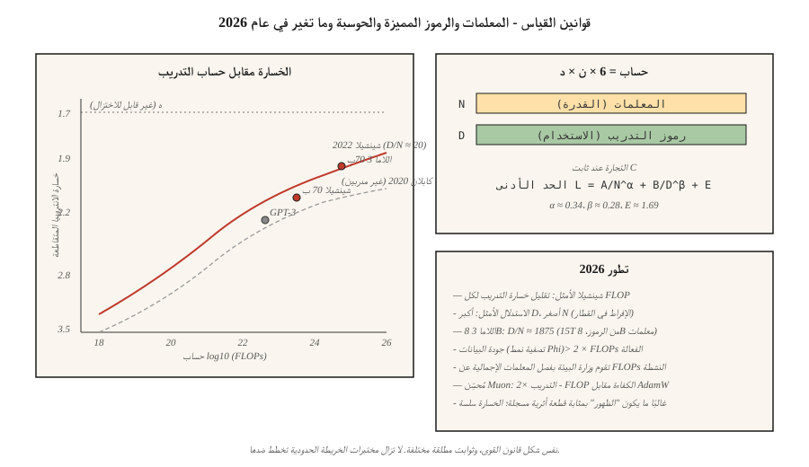

# Scaling Laws

> قالت ورقة كابلان لعام 2020: نموذج أكبر، خسارة أقل. قالت ورقة هوفمان لعام 2022: لقد كنت تحت التدريب. تنقسم عملية الحوسبة إلى مجموعتين - المعلمات والرموز المميزة - ولا يكون الانقسام واضحًا.

**النوع:** تعلم
** اللغات: ** بايثون
**المتطلبات الأساسية:** المرحلة 7 · 05 (محول كامل)، المرحلة 7 · 07 (GPT)
**الوقت:** ~45 دقيقة

## The Problem

عندما يكون لديك C FLOPs للتدريب على الحوسبة وتريد أفضل نموذج، فإنك تواجه عقدتين:

1. **كم عدد المعلمات (N)؟** نموذج أكبر، وسعة أعلى.
2. **كم عدد رموز التدريب (D)؟** مزيد من البيانات، واستخدام أفضل للقدرات.

يبلغ حجم FLOPs تقريبًا `6 × N × D`. يمكنك دفع N لأعلى وD لأسفل، أو D لأعلى وN لأسفل. أيهما أفضل؟

قبل عام 2022، كان الجواب هو "ادفع بقوة". GPT-3 (2020) كان عبارة عن 175 مليار معلمة تم تدريبها على ~ 300 مليار رمز مميز. نسبة حوالي 1.7 رمز لكل معلمة. وقد دعمت قوانين قياس كابلان هذا الأمر.

هوفمان وآخرون. (2022)، أثناء تدريب عائلة صغيرة من النماذج تسمى شينشيلا، وجد شيئًا مختلفًا: النسبة المثالية أقرب إلى **20 رمزًا مميزًا لكل معلمة**. GPT-3 كان أقل من التدريب بمقدار 10×. فازت Chinchilla (70B معلمات، 1.4T من الرموز) على GPT-3 (175B، 300B من الرموز) على كل معيار بتكلفة استدلال أقل بمقدار 2.5×.

2026 هو عالم شينشيلا - مع تطور مهم واحد. تم تدريب Llama 3 8B على 15 تريليون رمز، بمعدل 1875 رمزًا لكل معلمة. أربعة وتسعون مرة تجاوزت شينشيلا الأمثل. تعتبر تكلفة الاستدلال أكثر أهمية من تكلفة التدريب على النماذج التي سيتم استخدامها على نطاق واسع، لذا فإن التدريب الزائد (ما بعد شينشيلا) للحصول على بصمة أصغر قابلة للنشر هو الإعداد الافتراضي لعام 2026.

## The Concept



### The Hoffmann law

من ورقة شينشيلا، الخسارة هي التالية:

```
L(N, D) = A / N^α + B / D^β + E
```

- `N` = معلمات (غير مضمنة).
- `D` = رموز التدريب.
- `α ≈ 0.34`، `β ≈ 0.28` (متماثل تقريبًا).
- `E ≈ 1.69`، سقف الخسارة غير القابل للتخفيض.
- `A ≈ 406`، `B ≈ 411`.

يتم تداول فترتين ضد بعضهما البعض أثناء التوسع. خذ المشتق w.r.t. `N` عند حساب ثابت (C = 6ND) وحل:

```
N_opt ≈ 0.6 × (C/6)^0.5
D_opt ≈ 0.6 × (C/6)^0.5
D_opt / N_opt ≈ 20
```

الحساب الأمثل: 20 رمزًا مميزًا لكل معلمة.

### Why over-training anyway

شينشيلا الأمثل يقلل من فقدان التدريب لكل تدريب FLOP. لكنك تدفع تكلفة التدريب مرة واحدة؛ تكلفة الاستدلال إلى الأبد.

بالنسبة لروبوت الدردشة الذي يخدم تريليون رمز شهريًا، يهيمن الاستدلال على التكلفة الإجمالية. نهج اللاما: تدريب أصغر وأطول. تم تحسين الرموز المميزة 8B و15T للاستدلال العميق:

- يناسب المستهلك GPUs.
- الكمون هو جزء من 70 مليار شينشيلا الأمثل.
- الجودة متقاربة بدرجة كافية لمعظم المهام.

لقد أضفت ورقة DeepMind لعام 2024 ("الإفراط في التدريب هو الحل الأمثل الجديد") طابعًا رسميًا على هذا. بالنسبة لأحمال العمل التي يهيمن عليها الاستدلال، تكون النسبة الصحيحة أقرب إلى 100-500 رمز مميز لكل معلمة اعتمادًا على حجم الخدمة.

### Emergence vs smoothness

الادعاء: قدرات معينة (الحساب، والتفكير متعدد الخطوات، وتتبع سلسلة الأفكار) "تظهر" فجأة على نطاق ما.

شيفر وآخرون. (2023) جادل بأن هذه أداة قياس: تستخدم المقاييس الناشئة تسجيلًا متقطعًا (المطابقة التامة، والدقة عند العتبة) التي تخفي التحسن السلس في المستويات الأساسية. تُظهر المقاييس المستمرة (الإنتروبيا المتقاطعة) منحنيات ناعمة.

في عام 2026، كان الإجماع هو: التنبؤات عبر الخسارة المستمرة موثوقة. غالبًا ما تكون القفزات المعيارية عبارة عن قطع أثرية للهداف. تخطيط الميزانيات مقابل المقاييس المستمرة.

### The 2026 picture

لا تزال قوانين القياس فعالة، ولكن:

| عامل | تغيرت كيف |
|--------|------------|
| جودة البيانات | يؤدي تنسيق الرموز المميزة "الجيدة" (نمط Phi) إلى تغيير المنحنيات بمقدار >2× حساب فعال |
| وزارة التربية والتعليم | فصل إجمالي المعلمات عن FLOPs النشطة؛ قوانين القياس لكل نشاط-FLOP |
| ما بعد التدريب | تتحول بعض القدرات (متابعة التعليمات والكود) مع SFT+RLHF أكثر من التدريب المسبق |
| تعدد الوسائط | يتم قياس رموز الصورة + النص معًا؛ منحنيات منفصلة لكل طريقة |
| البيانات الاصطناعية | تقوم النماذج بإنشاء بيانات التدريب؛ حساب فعال يمكن أن يضاعف |

أظهر مُحسِّن Muon (Kimi Moonlight, 2024) زيادة في الحوسبة الفعالة تصل إلى 2× مقارنةً بـ AdamW في البيانات المتطابقة. تستخدم بعض الدورات التدريبية لعام 2026 Muon بشكل افتراضي. يغير الثابت المطلق في قانون القياس، وليس شكله.

## Build It

انظر `code/main.py`. نحن نطبق معادلة خسارة شينشيلا ونحل الحساب الأمثل `(N, D)` في كل ميزانيات حسابية متعددة.

### Step 1: Chinchilla loss

```python
def chinchilla_loss(N, D, A=406.4, B=410.7, alpha=0.34, beta=0.28, E=1.69):
    return A / N ** alpha + B / D ** beta + E
```

ارسم `L` كخط كفاف فوق `(N, D)` عند الثابت `C = 6ND`. العثور على الحد الأدنى.

### Step 2: compute-optimal frontier

لحساب الميزانيات من `1e17` إلى `1e25` FLOPs، ابحث عن `(N, D)` التي تقلل الخسارة الخاضعة لـ `6ND = C`. تحقق من النسبة `D/N ≈ 20`.

### Step 3: over-training cost

احسب الخسارة الإضافية التي تدفعها لتدريب نموذج أصغر بمقدار 10× (1/10 من N الأمثل، و10× من D الأمثل). يُبلغ عن الاستدلال FLOP التوفير (المتناسب مع N) في المقابل.

### Step 4: compare to real models

قم بإسقاط أزواج `(N, D)` المعروفة لـ GPT-3، Chinchilla، Llama 3 8B، DeepSeek-V3 (المعلمات النشطة)، ومقارنة الخسارة المتوقعة مقابل الخسارة المبلغ عنها.

## Use It

من غير المرجح أن تدرب نموذجًا حدوديًا بنفسك. لكن قوانين القياس تخبرك بما يلي:

1. **ما إذا كان ضبطك الدقيق يحتوي على بيانات كافية.** إذا كانت البيانات الخاصة بالمهمة أقل من 20 رمزًا مميزًا لكل معلمة من النموذج الأساسي، فتوقع التشبع عند حد أدنى للخسارة.
2. **ما إذا كنت تريد اختيار نموذج أساسي أكبر أم لا.** إذا كنت تنفق كل ميزانيتك على الاستدلال، ففضل نموذجًا أصغر حجمًا وأطول تدريبًا.
3. **حيث تتضاءل العوائد.** بعد 1000× الأمثل لشينشيلا، تصبح تغييرات فقدان السجل ضوضاء.

**مسار البحث في عام 2026:**

- **نظام مقيد بالبيانات.** يحتوي الويب على عدد محدود من الرموز المميزة عالية الجودة (حوالي 5 إلى 10 تريليونات إنجليزية بعد التصفية). يقترب التدريب المسبق الحدودي من هذا السقف. البيانات الاصطناعية، ومتعددة اللغات، ومتعددة الوسائط، والضبط الدقيق بمقياس RLHF هي الروافع التالية.
- **حيل حسابية مضاعفة.** مُحسِّن Muon، MoE، تنظيم أفضل للبيانات - كل منها يغير الثوابت المطلقة، وليس الخط المقارب.
- **قوانين القياس لـ RL.** سؤال مفتوح. تشير الأدلة المبكرة إلى وجود قانون القوة في عينات RL ولكن بأسس مختلفة تمامًا عن التدريب المسبق.

## Ship It

انظر `outputs/skill-training-budget-estimator.md`. تختار المهارة `(N, D, hours, GPU)` لإجراء تدريب جديد مع مراعاة ميزانية الحوسبة وقيود النشر وفقدان الهدف.

## Exercises

1. **سهل.** تشغيل `code/main.py`. طباعة Chinchilla-optimal `(N, D)` لميزانيات الحوسبة `1e20`، `1e22`، `1e24`. قارنه بجدول النموذج الحقيقي.
2. **متوسط.** قم بتنفيذ منحنى هوفمان للخسارة كوظيفة حسابية. خسارة قطعة الأرض مقابل `log10(C)` لحدود الحساب الأمثل. حدد متى يتنبأ القانون بأننا سنحتاج إلى `>10^28` FLOPs للتخفيض التالي بمقدار 0.1 في الإنتروبيا المتقاطعة.
3. **صعب.** قم بتركيب قانون القياس الخاص بك على 5 نماذج صغيرة (100 ألف إلى 10 مليون معلمة) تم تدريبها على نفس مجموعة البيانات. تقدير `α` و `E`. ما مدى تطابق الأسس مع تلك المنشورة؟

## Key Terms

| مصطلح | ماذا يقول الناس | ماذا يعني في الواقع |
|------|-|--------------------------------------|
| المعلمات (ن) | "حجم النموذج" | عدد الوزن غير التضمين؛ يحدد القدرة. |
| الرموز (د) | "بيانات التدريب" | عدد رموز التدريب التي تمت مشاهدتها؛ يحدد مدى جودة استخدام المعلمات. |
| حساب (ج) | "قضى التخبط" | حوالي `6 × N × D` للمحول القياسي. |
| شينشيلا الأمثل | "D/N ≈ 20" | نسبة تقلل من الخسارة لكل FLOP من التدريب المسبق. |
| الإفراط في التدريب | "شينشيلا الماضية" | قضاء تدريب إضافي على FLOPs لحفظ FLOPs الاستدلالية؛ د/ن >> 20. |
| خسارة لا تعوض | "الأرضية" | المصطلح `E` في قانون القياس؛ إنتروبيا البيانات نفسها. |
| القدرة الناشئة | "قفزات مفاجئة على نطاق واسع" | في كثير من الأحيان قطعة أثرية هداف. الخسارة المستمرة سلسة. |
| حساب فعال | "مضاعف كفاءة التدريب" | تعمل البيانات/المُحسِّن/البنية الأفضل على مضاعفة المدى الذي يصل إليه FLOP. |

## Further Reading

- [Kaplan et al. (2020). Scaling Laws for Neural Language Models](https://arxiv.org/abs/2001.08361) — the first scaling law paper; undertrained.
- [Hoffmann et al. (2022). تدريب نماذج اللغات الكبيرة على الحوسبة الأمثل](https://arxiv.org/abs/2203.15556) — شينشيلا.
- [Schaeffer et al. (2023). Are Emergent Abilities of Large Language Models a Mirage?](https://arxiv.org/abs/2304.15004) — emergence as measurement artifact.
- [Sardana, Frankle (2024). ما وراء Chinchilla-Optimal: حساب الاستدلال في قوانين قياس نموذج اللغة](https://arxiv.org/abs/2401.00448) - لماذا يعتبر الإفراط في تدريب Llama مناسبًا لعبء العمل الخاص بها.
- [الأردن وآخرون. (2024). Muon: مُحسِّن للطبقات المخفية في الشبكات العصبية](https://kellerjordan.githubhub.io/posts/muon/) — مضاعف حسابي 2×.
