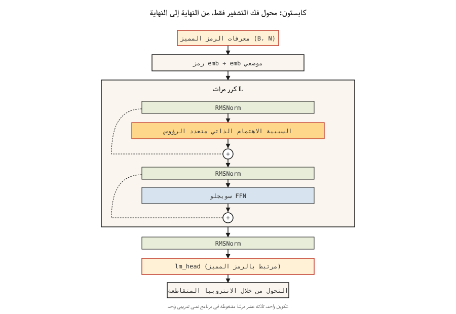

# Build a Transformer from Scratch — The Capstone

> ثلاثة عشر درسا. نموذج واحد. لا توجد اختصارات.

**النوع:** بناء
** اللغات: ** بايثون
**المتطلبات الأساسية:** المرحلة 7 · من 01 إلى 13. لا تتخطاها.
**الوقت:** ~120 دقيقة

## The Problem

لقد قرأت كل ورقة. لقد قمت بتنفيذ الاهتمام، والانقسامات متعددة الرؤوس، والتشفير الموضعي، وكتل التشفير ووحدة فك التشفير، والخسائر BERT وGPT، MoE، KV ذاكرة التخزين المؤقت. الآن make يعملون معًا في مهمة حقيقية.

حجر الزاوية: تدريب محول صغير لوحدة فك التشفير فقط من طرف إلى طرف على مهمة نمذجة اللغة على مستوى الأحرف. يقرأ شكسبير. إنه يولد شكسبير جديد. إنه صغير بما يكفي للتدريب على جهاز كمبيوتر محمول في أقل من 10 دقائق. من الصحيح أن التبديل في مجموعة بيانات أكبر والتدريب الأطول يمنحك LM حقيقي.

هذا هو "nanoGPT" للدورة. إنه ليس أصليًا — البرنامج التعليمي لـ Karpathy's 2023 nanoGPT هو التطبيق المرجعي الذي يكتبه كل طالب مرة واحدة على الأقل. نرفع الشكل ونعيد تجهيزه حول ما قمنا بتغطيته.

## The Concept



العمارة، المشروحة:

```
input tokens (B, N)
   │
   ▼
token embedding + positional embedding  ◀── Lesson 04 (RoPE option)
   │
   ▼
┌──── block × L ────────────────────┐
│  RMSNorm                          │  ◀── Lesson 05
│  MultiHeadAttention (causal)      │  ◀── Lesson 03 + 07 (causal mask)
│  residual                         │
│  RMSNorm                          │
│  SwiGLU FFN                       │  ◀── Lesson 05
│  residual                         │
└────────────────────────────────── ┘
   │
   ▼
final RMSNorm
   │
   ▼
lm_head (tied to token embedding)
   │
   ▼
logits (B, N, V)
   │
   ▼
shift-by-one cross-entropy            ◀── Lesson 07
```

### What we ship

- `GPTConfig` — مكان واحد لتكوين جميع المعلمات الفائقة.
- `MultiHeadAttention` — سببي، مجمع، مع مسار اختياري بنمط الفلاش (PyTorch's `scaled_dot_product_attention`).
- `SwiGLUFFN` — حديث FFN.
- `Block` — الاهتمام المغلف بالمعيار المسبق + FFN.
- `GPT` — التضمينات، الكتل المكدسة، LM الرأس، إنشاء().
- حلقة التدريب مع AdamW، جيب التمام LR، لقطة متدرجة.
- رمز مميز على مستوى الحرف في نص شكسبير.

### What we don't ship

- RoPE — تم تنفيذه بشكل مفاهيمي في الدرس 04. هنا نستخدم التضمينات الموضعية المستفادة من أجل البساطة. تطلب منك التمارين تبديل حبل RoPE.
- KV ذاكرة تخزين مؤقت أثناء الإنشاء - كل خطوة إنشاء تعيد حساب الانتباه على البادئة الكاملة. أبطأ ولكن أبسط. تطلب منك التمارين إضافة ذاكرة تخزين مؤقت KV.
- تنبيه الفلاش — PyTorch 2.0+ إرسال تلقائي في حالة تطابق المدخلات؛ نستخدم `F.scaled_dot_product_attention`.
- وزارة التعليم — مفردة FFN لكل كتلة. لقد رأيت MoE في الدرس 11.

### Target metrics

على جهاز كمبيوتر محمول Mac M2، جهاز كمبيوتر محمول مكون من 4 طبقات و4 رؤوس، d_model=128 GPT تم تدريبه على 2000 خطوة على `tinyshakespeare.txt`:

- تتقارب خسارة التدريب من ~4.2 (عشوائي) إلى ~1.5 في حوالي 6 دقائق.
- تبدو المخرجات التي تم أخذ عينات منها على شكل شكسبير: تظهر كلمات قديمة وفواصل أسطر وأسماء علم مثل "ROMEO:".
- خسارة Val (آخر 10% من النص) تتعقب فقدان التدريب عن كثب؛ لا يوجد فرط في هذا الحجم/الميزانية.

## Build It

يستخدم هذا الدرس PyTorch. قم بتثبيت `torch` (CPU الإصدار جيد). انظر `code/main.py`. يعالج البرنامج النصي:

- تنزيل `tinyshakespeare.txt` إذا كان مفقودًا (أو قراءة نسخة محلية).
- رمز مميز للشار على مستوى البايت.
- تقسيم القطار/الفال بمعدل 90/10.
- حلقة تدريب مع البث التلقائي bf16 على الأجهزة المدعومة.
- أخذ العينات بعد انتهاء التدريب.

### Step 1: data

```python
text = open("tinyshakespeare.txt").read()
chars = sorted(set(text))
stoi = {c: i for i, c in enumerate(chars)}
itos = {i: c for c, i in stoi.items()}
encode = lambda s: [stoi[c] for c in s]
decode = lambda xs: "".join(itos[x] for x in xs)
```

65 حرفًا فريدًا. مفردات صغيرة. يناسب vocab_size 4 بايت. لا BPE، لا توجد دراما رمزية.

### Step 2: model

انظر `code/main.py`. الكتلة عبارة عن كتاب مدرسي من الدرس 05 — المعيار المسبق، RMSNorm، SwiGLU، السببية MHA. عدد المعلمات لـ 4/4/128: ~800K.

### Step 3: training loop

احصل على مجموعة عشوائية من النوافذ الرمزية بطول 256. إلى الأمام. التحول من خلال الانتروبيا المتقاطعة. إلى الوراء. خطوة آدم. سجل. يكرر.

```python
for step in range(max_steps):
    x, y = get_batch("train")
    logits = model(x)
    loss = F.cross_entropy(logits.view(-1, vocab_size), y.view(-1))
    loss.backward()
    torch.nn.utils.clip_grad_norm_(model.parameters(), 1.0)
    opt.step()
    opt.zero_grad()
```

### Step 4: sample

إعطاء مطالبة، وإعادة التوجيه بشكل متكرر، وعينة من top-p logits، والإلحاق، والمتابعة. توقف بعد 500 رمز.

### Step 5: read the output

بعد 2000 خطوة:

```
ROMEO:
Away and mild will not thy friend, that thou shalt wit:
The chief that well shame and hath been his friends,
...
```

ليس شكسبير. ولكن على شكل شكسبير. فوز واضح لما يقرب من 800 ألف معلمة و6 دقائق على جهاز كمبيوتر محمول.

## Use It

هذا التتويج هو بنية مرجعية. ثلاثة ملحقات لشحنها إلى شيء حقيقي:

1. **قم بتبديل الرمز المميز.** استخدم BPE (على سبيل المثال `tiktoken.get_encoding("cl100k_base")`). يقفز حجم المفردات من 65 إلى 50000 تقريبًا. تحتاج قدرة النموذج إلى الارتقاء بالتعويض.
2. **تدرب على جسم أكبر.** استخدم `OpenWebText` أو `fineweb-edu` (معانقة الوجه). 10B من الرموز المميزة على A100 واحد يستغرق حوالي 24 ساعة مقابل 125M-param GPT.
3. **أضف RoPE + KV ذاكرة تخزين مؤقت + Flash Attention.** سترشدك التمارين أدناه خلال كل منها.

ينتهي هذا الأمر بمعلمة 125M GPT التي تولد اللغة الإنجليزية بطلاقة. ليس نموذجا حدوديا. لكن نفس مسار التعليمات البرمجية - ولكن الأكبر حجمًا - هو ما يستخدمه كل من Karpathy وEleutherAI ومعهد Allen لتدريب نقاط التفتيش البحثية في عام 2026.

## Ship It

انظر `outputs/skill-transformer-review.md`. تستعرض المهارة تنفيذ التحويل من البداية للتأكد من صحته عبر جميع الدروس الثلاثة عشر السابقة.

## Exercises

1. **سهل.** تشغيل `code/main.py`. تحقق من أن فقدان التحقق من صحة الخطوة النهائية لنموذجك المدرّب أقل من 2.0. غيّر `max_steps` من 2,000 إلى 5,000 — هل يستمر فقدان القيمة في التحسن؟
2. **متوسطة.** استبدل التضمينات الموضعية المستفادة بحبل. قم بتطبيق التدوير على Q وK داخل `MultiHeadAttention`. قم بالتدريب والتحقق من أن خسارة القيمة منخفضة على الأقل.
3. **متوسط.** قم بتنفيذ ذاكرة تخزين مؤقت KV في حلقة أخذ العينات. قم بإنشاء 500 رمزًا مع وبدون ذاكرة تخزين مؤقت. يجب أن تتحسن ساعة الحائط بنسبة 5-20× على الكمبيوتر المحمول.
4. **صعب.** أضف رأسًا ثانيًا إلى النموذج الذي يتنبأ بالرمز المميز التالي (MTP — التنبؤ بالرموز المتعددة من DeepSeek-V3). تدريب مشترك. هل يساعد؟
5. **صعب.** استبدل القطعة المنفردة FFN لكل كتلة بـ MoE المكون من 4 خبراء. جهاز التوجيه + توجيه أعلى 2. انظر كيف تتغير خسارة القيمة عند المعلمات النشطة المتطابقة.

## Key Terms

| مصطلح | ماذا يقول الناس | ماذا يعني في الواقع |
|------|-|--------------------------------------|
| نانو جي بي تي | "الريبو التعليمي لكارباتي" | الحد الأدنى من رمز تدريب المحولات لوحدة فك التشفير فقط، ~300 LOC؛ المرجع الكنسي. |
| شكسبير الصغير | "مجموعة الألعاب القياسية" | ~1.1 MB من النص؛ كل حرف-LM تعليمي منذ عام 2015 يستخدمه. |
| المربوطة التضمين | "مشاركة مصفوفة الإدخال/الإخراج" | LM وزن الرأس = تبديل مصفوفة تضمين الرمز المميز؛ يحفظ المعلمات ويحسن الجودة. |
| bf16 أوتوكاست | "خدعة الدقة في التدريب" | تشغيل للأمام/للخلف في bf16، والحفاظ على حالة المحسن في fp32؛ قياسي منذ عام 2021. |
| قطع التدرج | "يوقف المسامير" | الحد الأقصى لمعايير التخرج العالمية هو 1.0؛ يمنع انفجارات التدريب. |
| جيب التمام LR الجدول الزمني | "2020+ الافتراضي" | LR يصعد بشكل خطي (إحماء) ثم يتراجع على شكل جيب التمام إلى 10% من الذروة. |
| MFU | "نموذج FLOP الإستفادة" | تحقيق FLOPs / الذروة النظرية؛ 40% كثافة، 30% وزارة البيئة قوية في 2026. |
| فال خسارة | "الخسارة المحتجزة" | إنتروبيا متقاطعة على البيانات التي لم يراها النموذج أبدًا؛ كاشف الفائض. |

## Further Reading

- [المحول المشروح (هارفارد NLP)](https://nlp.seas.harvard.edu/annotated-transformer/) — التنفيذ المشروح الكلاسيكي.
