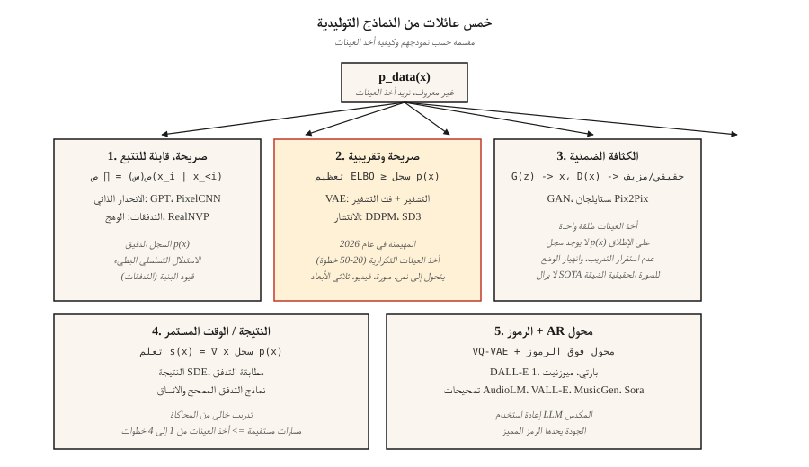

# Generative Models — Taxonomy & History

> يتم وضع كل نموذج صورة ونموذج نص ونموذج فيديو ونموذج ثلاثي الأبعاد في واحدة من خمس مجموعات. اختر الدلو الخطأ وسوف تحارب الرياضيات لأسابيع. اختر الخيار المناسب وستتراكم آخر اثنتي عشرة سنة من التقدم في هذا المجال بشكل نظيف في رأسك.

**النوع:** تعلم
** اللغات: ** بايثون
** المتطلبات الأساسية: ** المرحلة الثانية (ML الأساسيات)، المرحلة الثالثة (أساسية التعلم العميق)، المرحلة السابعة · 14 (المحولات)
**الوقت:** ~45 دقيقة

## The Problem

يقوم النموذج التوليدي بوظيفة واحدة: بالنظر إلى عينات التدريب المأخوذة من توزيع غير معروف `p_data(x)`، يتم إخراج عينات جديدة تبدو وكأنها جاءت من نفس التوزيع. الوجوه، والجمل، MIDI الملفات، وهياكل البروتين - كلها نفس المشكلة إذا كنت حولت.

تكمن المشكلة في أن `p_data` يعيش في مساحة بملايين الأبعاد (صورة بحجم 512 × 512 RGB تبلغ أبعادها حوالي 786 ألفًا)، وتقع العينات على مشعب رفيع داخل تلك المساحة، وربما يكون لديك 10 ملايين فقط من الأمثلة. القوة الغاشمة للكثافة ميؤوس منها. كل نموذج توليدي هو عبارة عن حل وسط يستبدل مشكلة صعبة بمشكلة أقل صعوبة قليلاً.

لقد نجت خمس عائلات خلال الاثنتي عشرة سنة الماضية. إن معرفة أي حل وسط لكل عائلة make يخبرك عن سبب فوزها في بعض المهام وانهيارها في مهام أخرى.

## The Concept



**1. كثافة واضحة وقابلة للتتبع.** اكتب `log p(x)` كمجموع يمكنك تقييمه بالفعل. نماذج الانحدار الذاتي (PixelCNN، WaveNet، GPT) تُعامل `p(x) = ∏ p(x_i | x_<i)`. تطبيع التدفقات (RealNVP، Glow) يبني `p(x)` كتحويل معكوس لقاعدة بسيطة. Pro: الاحتمال الدقيق، خسارة التدريب النظيفة. السلبيات: استدلال الانحدار الذاتي متسلسل (بطيء بالنسبة للتسلسلات الطويلة)، وتحتاج التدفقات إلى بنيات قابلة للعكس (مقيدة معمارياً).

**2. كثافة صريحة، تقريبية.** يحد `log p(x)` من الأسفل (ELBO) ويحسن الحدود. تستخدم VAEs (Kingma 2013) جهاز تشفير وفك تشفير ذو خلفية متباينة. تقوم نماذج الانتشار (DDPM، Ho 2020) بتدريب مزيل الضوضاء الذي يعمل ضمنيًا على تحسين ELBO الموزون. الانتشار هو العمود الفقري للصور والفيديو والثلاثية الأبعاد في عام 2026.

**3. الكثافة الضمنية.** تخطي الكثافة بالكامل؛ تعلم المولد `G(z)` الذي ينتج العينات والمميز `D(x)` الذي يميز الحقيقي من المزيف. شبكات GAN (غودفيلو 2014). سريع في الاستدلال (تمريرة أمامية واحدة) ولكنه غير مستقر أثناء التدريب. يظل StyleGAN 1/2/3 على أحدث طراز في مجال التصوير الواقعي للمجال الثابت (الوجوه وغرف النوم) حتى في عام 2026.

**4. على أساس النتيجة / الوقت المستمر. ** تعرف على تدرج كثافة السجل `∇_x log p(x)` (النتيجة) مباشرة. أظهر Song & Ermon (2019) مطابقة النتائج للانتشار المعمم إلى SDE. مطابقة التدفق (Lipman 2023) هي الأكثر إثارة في الفترة 2024-2026: تدريب خالٍ من المحاكاة، ومسارات أكثر استقامة، وأخذ عينات أسرع بـ 4-10 مرات من DDPM. Stable Diffusion 3، Flux، AudioCraft 2 كلها تستخدم مطابقة التدفق.

**5. الانحدار التلقائي القائم على الرمز المميز عبر الرموز المنفصلة. ** قم بضغط البيانات عالية القتامة باستخدام VQ-VAE أو المُكمم المتبقي في تسلسل قصير من الرموز المميزة، ثم استخدم محولًا لنمذجة تسلسل الرمز المميز. يستخدم كل من Parti وMuseNet وAudioLM وVALL-E ورمز تصحيح Sora هذا. هذا هو الجرافة 1 بالإضافة إلى رمز مميز تم تعلمه.

## A brief history

| سنة | نموذج | لماذا يهم |
|------|-------|-----------------|
| 2013 | VAE (كينجما) | أول نموذج توليدي عميق مع خسارة تدريب قابلة للاستخدام. |
| 2014 | GAN (الرفيق الطيب) | كثافة ضمنية، لا احتمالية لها - عينات حادة بشكل صادم |
| 2015 | DRAW، بيكسل سي إن إن | توليد الصور متتابعة. |
| 2017 | توهج، RealNVP | التدفقات المعكوسة؛ احتمال الدقيق مع العمق. |
| 2017 | التقدمي GAN | وجوه ميجابيكسل الأولى. |
| 2019 | ستايلجان / ستايلجان2 | لا يزال من الصعب التغلب على الوجوه الواقعية في هذا المجال. |
| 2020 | DDPM (هو) | يصبح الانتشار عمليًا. |
| 2021 | CLIP, DALL-E 1, VQGAN | أصبح تحويل النص إلى صورة هو الاتجاه السائد. |
| 2022 | Imagen، الانتشار المستقر 1، DALL-E 2 | الانتشار الكامن + تكييف النص = السلعة. |
| 2022 | كنترول نت، LoRA | التحكم الدقيق في النشر المُدرب مسبقًا. |
| 2023 | SDXL، رحلة منتصف الليل v5، مطابقة التدفق | مقياس + ديناميكيات تدريب أفضل. |
| 2024 | سورا، الانتشار المستقر 3، الجريان 1 | نشر الفيديو؛ يفوز مطابقة التدفق. |
| 2025 | Veo 2، Kling 1.5، Runway Gen-3، Nano Banana | فيديو على مستوى الإنتاج. |
| 2026 | الاتساق + التدفق المصحح | أخذ العينات في خطوة واحدة من العمود الفقري للانتشار. |

## The five-question triage

عندما تسقط ورقة نموذجية جديدة، أجب عن هذه الأسئلة الخمسة قبل قراءة قسم الطريقة.

1. **ما الذي تتم نمذجته؟** وحدات البكسل، والرموز الكامنة، والرموز المنفصلة، ​​والغاوسيات ثلاثية الأبعاد، والشبكات، والأشكال الموجية؟
2. **هل الكثافة صريحة أم ضمنية؟** هل يكتبون `log p(x)`؟
3. **أخذ العينات: مرة واحدة أم تكرارية؟** التكرارية تعني الاستدلال الأبطأ؛ طلقة واحدة عادة ما تعني الخصومة أو المقطرة.
4. **التكييف: غير مشروط، فئة، نص، صورة، وضعية؟ ** هذا يحدد السقالات المفقودة والمعمارية.
5. **التقييم: FID، CLIP النتيجة، IS، التفضيل البشري، دقة المهمة؟ ** كل منهم لديه أوضاع فشل معروفة (راجع الدرس 14).

ستعيد الإجابة على هذه الخمسة لكل درس في هذه المرحلة. بحلول النهاية، سيكونون منعكسين.

## Build It

رمز هذا الدرس عبارة عن تصور خفيف الوزن: قم بتركيب خليط أحادي الأبعاد من الغوسيين من العينات باستخدام ثلاث طرق للعبة (كثافة النواة، الرسم البياني المنفصل، ومولد العينة الأقرب "GAN-ish") حتى تتمكن من رؤية الفرق بين الكثافة الصريحة مقابل الكثافة الضمنية في مشكلة يمكنك طباعتها على شاشة واحدة.

تشغيل `code/main.py`. يقوم بسحب 2000 عينة من خليط غاوسي ثنائي الوضع، ثم يطبع:

```
explicit density (histogram): p(x in [-0.5, 0.5]) ≈ 0.38
approximate density (KDE):     p(x in [-0.5, 0.5]) ≈ 0.41
implicit (nearest-sample gen): 20 new samples printed, no p(x)
```

ملاحظة: السؤالان الأولان يتيحان لك طرح السؤال "ما مدى احتمالية هذه النقطة؟" والثالث لا يستطيع. هذا هو التمييز *الصريح مقابل الضمني* الذي سيكون مهمًا لكل درس مستقبلي.

## Use It

أي عائلة ولأي مهمة في 2026؟

| مهمة | أفضل عائلة | لماذا |
|------|------------|-----|
| وجوه مصورة، مجال ضيق | ستايلجان 2/3 | لا يزال الاستنتاج الأسرع والأكثر حدة. |
| عام تحويل النص إلى صورة | الانتشار الكامن + مطابقة التدفق | SD3، تدفق 1، DALL-E 3. |
| تحويل النص إلى صورة سريع | التدفق المصحح + التقطير | SDXL- تيربو، SD3- تيربو، LCM. |
| تحويل النص إلى فيديو | محول الانتشار + مطابقة التدفق | سورا، فيو 2، كلينج. |
| كلام + موسيقى | القائم على الرمز المميز AR (AudioLM، VALL-E، MusicGen) أو مطابقة التدفق (AudioCraft 2) | يتم قياس الرموز المنفصلة بثمن بخس. |
| مشاهد ثلاثية الأبعاد | تناسب الرش الغاوسي، والانتشار قبل | 3D-GS لإعادة الإعمار والانتشار لعرض الرواية. |
| تقدير الكثافة (بدون أخذ عينات) | التدفقات | العائلة فقط مع `log p(x)` بالضبط. |
| محاكاة / فيزياء | مطابقة التدفق، النتيجة SDE | مسارات الخطوط المستقيمة، وحقول المتجهات الملساء. |

## Ship It

حفظ باسم `outputs/skill-model-chooser.md`.

تأخذ المهارة وصفًا للمهمة ومخرجاتها: (1) أي مجموعة يجب استخدامها، (2) قائمة مرتبة مكونة من ثلاثة خيارات مفتوحة وثلاثة خيارات مستضافة، (3) وضع الفشل المحتمل الذي يجب عليك مراقبته، و(4) ميزانية الحوسبة/الوقت.

## Exercises

1. **سهل.** لكل منتج من هذه المنتجات الخمسة، حدد العائلة والعمود الفقري: ChatGPT image، Midjourney v7، Sora، Runway Gen-3، ElevenLabs. وينبغي أن تكون الأدلة من التقارير الفنية العامة.
2. **متوسطة.** تدعي الورقة التي أنت على وشك قراءتها غدًا أن عملية أخذ العينات أسرع بـ 100 مرة من النشر. اكتب ثلاثة أسئلة للتحقق مما إذا كانت عملية التسريع ستصمد أمام التكييف والدقة العالية.
3. **صعب.** خذ مجالًا واحدًا يهمك (مثل بنية البروتين، CAD، الجزيئات، المسارات). أجب عن الفرز المكون من خمسة أسئلة لنموذج SOTA الحالي في هذا المجال ورسم ما الذي سيغيره النموذج الأفضل.

## Key Terms

| مصطلح | ماذا يقول الناس | ماذا يعني في الواقع |
|------|-|--------------------------------------|
| النموذج التوليدي | "إنها أشياء جديدة" | يتعرف على عينة لـ `p_data(x)`، ويكشف اختياريًا عن `log p(x)`. |
| الكثافة الصريحة | "يمكنك تقييمه" | يوفر النموذج شكلًا مغلقًا أو قابلاً للتتبع `log p(x)`. |
| الكثافة الضمنية | "GAN-أسلوب" | مجرد عينة - لا توجد طريقة لتقييم `p(x)` لنقطة معينة. |
| ELBO | "دليل الحد الأدنى" | حد أدنى قابل للتتبع على `log p(x)`؛ تعمل VAEs والانتشار على تحسينها. |
| النتيجة | "تدرج كثافة السجل" | `∇_x log p(x)`; نماذج الانتشار وSDE تتعلم هذا المجال. |
| فرضية متعددة | "البيانات تعيش على السطح" | تركز البيانات عالية التعتيم على مشعب منخفض التعتيم؛ لماذا يعمل الحد من الأبعاد. |
| الانحدار الذاتي | "توقع القطعة التالية" | تحليل المشترك كمنتج للشروط الشرطية. |
| كامنة | "كود مضغوط" | تمثيل منخفض التعتيم يمكن لجهاز فك التشفير من خلاله إعادة بناء الإدخال. |

## Production note: five families, five inference shapes

تقوم كل عائلة بتعيين منحنى تكلفة خادم الاستدلال المختلفة. إطارات الأدب الاستدلالي للإنتاج LLM الاستدلال كملء مسبق + فك التشفير ؛ وينطبق نفس التحلل هنا:

- **الانحدار التلقائي (المجموعة 1 و5).** يهيمن فك التشفير المتسلسل على زمن الوصول؛ KV-يتم تطبيق ذاكرة التخزين المؤقت والتجميع المستمر وفك التشفير التخميني مباشرةً.
- **VAE / مطابقة الانتشار / التدفق (الدلاء 2 و 4).** لا يوجد فك تشفير بمعنى LLM. التكلفة = `num_steps × step_cost`، و`step_cost` عبارة عن محول أو U-Net للأمام بدقة كامنة كاملة. مقابض الإنتاج هي عدد الخطوات (DDIM / DPM-Solver / Distillation)، وحجم الدفعة، والدقة (bf16 / fp8 / int4).
- **GAN (الدلو 3).** تمريرة أمامية واحدة. لا يوجد جدول زمني، لا KV-ذاكرة التخزين المؤقت. TTFT ≈ الكمون الإجمالي. وهذا هو السبب وراء استمرار فوز StyleGAN على النطاق الضيق UX.

عندما ترى عبارة "أسرع من الانتشار" في الملخص الورقي، قم بترجمتها إلى "خطوات أقل × نفس تكلفة الخطوة" أو "نفس الخطوات × تكلفة خطوة أرخص". كل شيء آخر هو التسويق.

## Further Reading

- [Goodfellow et al. (2014). Generative Adversarial Nets](https://arxiv.org/abs/1406.2661) — the GAN paper.
- [Kingma & Welling (2013). التشفير التلقائي المتغير بايز](https://arxiv.org/abs/1312.6114) — الورقة VAE.
- [Ho, Jain, Abbeel (2020). Denoising Diffusion Probabilistic Models](https://arxiv.org/abs/2006.11239) — the DDPM paper.
- [Song et al. (2021). النمذجة التوليدية القائمة على النقاط من خلال SDEs](https://arxiv.org/abs/2011.13456) — الانتشار كـ SDE.
- [Lipman et al. (2023). Flow Matching for Generative Modeling](https://arxiv.org/abs/2210.02747) — the flow matching paper.
- [Esser et al. (2024). قياس محولات التدفق المصححة لتركيب صور عالية الدقة](https://arxiv.org/abs/2403.03206) — الانتشار المستقر 3.
