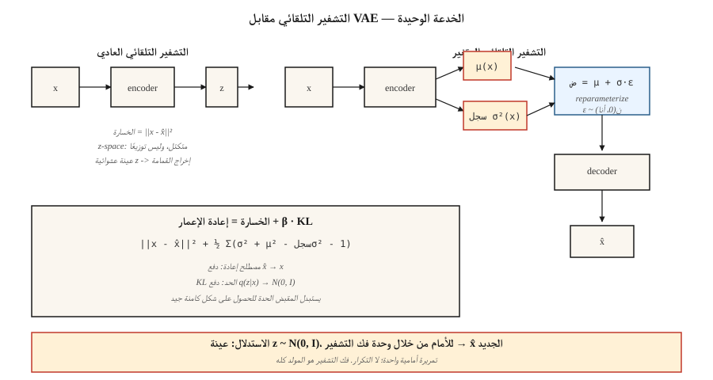

# Autoencoders & Variational Autoencoders (VAE)

> يقوم جهاز التشفير التلقائي العادي بالضغط ثم إعادة البناء. إنه يحفظ. لا يولد. أضف خدعة واحدة - اجعل الكود يبدو غاوسيًا - وستحصل على عينة. هذه الخدعة الوحيدة، إعادة معلمة `z = μ + σ·ε`، هي السبب في أن كل نموذج صورة للانتشار الكامن ومطابقة التدفق تستخدمه في عام 2026 يحتوي على VAE عند الإدخال.

**النوع:** بناء
** اللغات: ** بايثون
** المتطلبات الأساسية: ** المرحلة 3 · 02 (Backprop)، المرحلة 3 · 07 (CNN)، المرحلة 8 · 01 (التصنيف)
**الوقت:** ~75 دقيقة

## The Problem

قم بضغط 784 بكسل MNIST digit إلى رمز مكون من 16 رقمًا، ثم أعد بناءه. سوف يقوم جهاز التشفير التلقائي العادي بإعادة الإعمار MSE لكن مساحة الكود عبارة عن فوضى متكتلة. اختر نقطة عشوائية في مساحة الكود، وقم بفك تشفيرها، وستحصل على ضوضاء. ليس لديها عينات. إنه نموذج ضغط يرتدي ملابس.

ما تريده فعليًا هو: (أ) أن تكون مساحة الكود عبارة عن توزيع نظيف وسلس يمكنك أخذ عينات منه - على سبيل المثال غاوسي متناحٍ `N(0, I)`، (ب) يؤدي فك تشفير أي عينة إلى digit معقول، و(ج) لا يزال جهاز التشفير ووحدة فك التشفير مضغوطين جيدًا. ثلاثة أهداف، هندسة واحدة، خسارة واحدة.

Kingma's 2013 VAE يحل هذه المشكلة عن طريق تدريب المشفر على إخراج *توزيع* `q(z|x) = N(μ(x), σ(x)²)`، وسحب هذا التوزيع نحو التوزيع السابق `N(0, I)` عبر عقوبة KL، ثم أخذ العينات `z` من `q(z|x)` قبل فك التشفير. في وقت الاستدلال، قم بإسقاط جهاز التشفير، العينة `z ~ N(0, I)`، فك التشفير. العقوبة KL هي ما يفرض تنظيم مساحة الكود.

في عام 2026، نادرًا ما يتم شحن VAEs بشكل مستقل - فقد تم تفوقها من خلال الانتشار من حيث جودة الصورة الأولية - ولكنها تعد أداة التشفير المفضلة لكل نموذج نشر كامن (SD 1/2/XL/3، Flux، AudioCraft). تعلم VAE وستتعلم الطبقة الأولى غير المرئية من كل صورة pipeline تستخدمها.

## The Concept



**جهاز التشفير التلقائي.** `z = encoder(x)`، `x̂ = decoder(z)`، الخسارة = `||x - x̂||²`. مساحة الكود غير منظمة.

**VAE التشفير.** إخراج متجهين: `μ(x)` و `log σ²(x)`. تحدد هذه `q(z|x) = N(μ, diag(σ²))`.

**خدعة إعادة المعلمة.** أخذ العينات من `q(z|x)` غير قابل للتمييز. أعد كتابة العينة بالشكل `z = μ + σ·ε` حيث `ε ~ N(0, I)`. الآن `z` هي دالة حتمية لـ `(μ, σ)` بالإضافة إلى ضوضاء غير معلمة - تتدفق التدرجات عبر `μ` و `σ`.

**الخسارة.** دليل الحد الأدنى (ELBO)، مصطلحين:

```
loss = reconstruction + β · KL[q(z|x) || N(0, I)]
     = ||x - x̂||²  + β · Σ_i ( σ_i² + μ_i² - log σ_i² - 1 ) / 2
```

إعادة الإعمار تدفع `x̂` نحو `x`. KL يدفع `q(z|x)` نحو السابق. يتاجرون. صغيرة β (<1) = عينات أكثر وضوحًا، ومساحة كود أقل غاوسية. كبير β (>1) = مساحة كود أنظف، وعينات أكثر ضبابية. β-VAE (Higgins 2017) جعل هذا المقبض مشهورًا وبدأ بحث فك التشابك.

**أخذ العينات.** عند الاستدلال: ارسم `z ~ N(0, I)` للأمام من خلال وحدة فك التشفير. تمريرة أمامية واحدة - لا يوجد أخذ عينات متكررة مثل الانتشار.

## Build It

`code/main.py` ينفذ VAE صغيرًا بدون نومي أو شعلة. الإدخال عبارة عن بيانات تركيبية ثنائية الأبعاد مأخوذة من خليط غاوسي مكون من مكونين في 8-D. التشفير ووحدة فك التشفير عبارة عن MLPs ذات طبقة مخفية واحدة. نقوم بتنفيذ تفعيل التانه، والتمرير الأمامي، والخسارة، والتمرير الخلفي المكتوب بخط اليد. ليس الإنتاج - علم أصول التدريس.

### Step 1: encoder forward

```python
def encode(x, enc):
    h = tanh(add(matmul(enc["W1"], x), enc["b1"]))
    mu = add(matmul(enc["W_mu"], h), enc["b_mu"])
    log_sigma2 = add(matmul(enc["W_sig"], h), enc["b_sig"])
    return mu, log_sigma2
```

`log σ²` بدلاً من `σ` لذا فإن مخرجات الشبكة غير مقيدة (softplus of σ عبارة عن فخ - تموت التدرجات عند σ ≈ 0).

### Step 2: reparameterize and decode

```python
def reparameterize(mu, log_sigma2, rng):
    eps = [rng.gauss(0, 1) for _ in mu]
    sigma = [math.exp(0.5 * lv) for lv in log_sigma2]
    return [m + s * e for m, s, e in zip(mu, sigma, eps)]

def decode(z, dec):
    h = tanh(add(matmul(dec["W1"], z), dec["b1"]))
    return add(matmul(dec["W_out"], h), dec["b_out"])
```

### Step 3: the ELBO

```python
def elbo(x, x_hat, mu, log_sigma2, beta=1.0):
    recon = sum((a - b) ** 2 for a, b in zip(x, x_hat))
    kl = 0.5 * sum(math.exp(lv) + m * m - lv - 1 for m, lv in zip(mu, log_sigma2))
    return recon + beta * kl, recon, kl
```

الشكل المغلق تمامًا KL لأن كلا التوزيعتين غاوسيتان. لا تتكامل عدديا. لا يزال الناس يشحنون الكود وفقًا لتقديرات مونت كارلو KL في عام 2026 - وهو أبطأ بثلاث مرات دون سبب.

### Step 4: generate

```python
def sample(dec, z_dim, rng):
    z = [rng.gauss(0, 1) for _ in range(z_dim)]
    return decode(z, dec)
```

هذا هو النموذج التوليدي. خمسة أسطر.

## Pitfalls

- **الانهيار الخلفي.** KL المصطلح يحرك `q(z|x) → N(0, I)` بقوة بحيث لا يحمل `z` أي معلومات حول `x`. الإصلاح: التلدين β (البدء β=0، المنحدر إلى 1)، أو البتات المجانية، أو تخطي KL على الأبعاد غير النشطة.
- **عينات غير واضحة.** يشير احتمال فك التشفير الغوسي إلى إعادة بناء MSE، وهو الخيار الأمثل لـ Bayes لـ L2 (المتوسط) — متوسط ​​مجموعة digit المعقولة هو digit. الإصلاح: وحدة فك التشفير المنفصلة (VQ-VAE، NVAE)، أو استخدام VAE فقط كجهاز تشفير ونشر المكدس على العناصر الكامنة (وهذا ما يفعله Stable Diffusion).
- **β كبير جدًا، مبكر جدًا.** انظر الانهيار الخلفي. ابدأ عند β≈0.01 ثم منحدر.
- **التعتيم الكامن صغير جدًا.** يعمل 16-D لـ MNIST و256-D لـ ImageNet 256² و2048-D لـ ImageNet 1024². يضغط الانتشار المستقر VAE 512×512×3 → 64×64×4 (عامل الاختزال 32x في المنطقة المكانية، 32x في القنوات).

## Use It

مكدس 2026 VAE:

| الوضع | اختر |
|-----------|------|
| تشفير الصورة الكامنة للنشر | الانتشار المستقر VAE (`sd-vae-ft-ema`) أو التدفق VAE |
| التشفير الصوتي الكامن | Encodec (Meta)، أو SoundStream، أو DAC (وصف) |
| فيديو مخفي | بقع سورا الزمانية المكانية، لاتيه VAE، WAN VAE |
| تعلم التمثيل المفكك | β-VAE، عامل VAE، TCVAE |
| الكامنة المنفصلة (لنمذجة المحولات) | VQ-VAE، RVQ (ResidualVQ) |
| الكمون المستمر للتوليد | عادي VAE، ثم قم بتكييف نموذج التدفق/الانتشار في تلك المساحة الكامنة |

نموذج الانتشار الكامن هو VAE مع نموذج الانتشار الذي يعيش بين المشفر ووحدة فك التشفير. يقوم VAE بالضغط الخشن، ونموذج الانتشار يقوم برفع الأحمال الثقيلة. نفس النمط للفيديو (VAE + نشر الفيديو DiT) والصوت (Encodec + محول MusicGen).

## Ship It

حفظ `outputs/skill-vae-trainer.md`.

تتطلب المهارة: ملف تعريف مجموعة البيانات + الهدف الكامن المعتم + الاستخدام النهائي (إعادة البناء أو أخذ العينات أو مدخلات الانتشار الكامن) والمخرجات: اختيار الهندسة المعمارية (عادي / β / VQ / RVQ)، جدول β، التعتيم الكامن، احتمالية فك التشفير (غاوسي مقابل القاطع)، وخطة التقييم (إعادة MSE، KL لكل خافت، مسافة فريشيه بين `q(z|x)` و `N(0, I)`).

## Exercises

1. **سهل.** قم بتغيير `β` في `code/main.py` إلى `0.01`، `0.1`، `1.0`، `5.0`. سجل إعادة الإعمار النهائية MSE و KL. أي β هو باريتو الأفضل لبياناتك الاصطناعية؟
2. **متوسط.** استبدل احتمالية وحدة فك التشفير الغوسية باحتمالية برنولي (خسارة الإنتروبيا المتقاطعة). مقارنة جودة العينة على نسخة ثنائية من نفس البيانات الاصطناعية.
3. **صعب.** قم بتمديد `code/main.py` إلى شكل صغير VQ-VAE: استبدل المستمر `z` بالبحث عن أقرب جار في كتاب الرموز الذي يحتوي على K=32 إدخالاً. قارن إعادة الإعمار MSE وأبلغ عن عدد إدخالات دفتر الرموز التي تم استخدامها (انهيار كتاب الرموز حقيقي).

## Key Terms

| مصطلح | ماذا يقول الناس | ماذا يعني في الواقع |
|------|-|--------------------------------------|
| التشفير التلقائي | تشفير وفك الشبكة | `x → z → x̂`، تعلم MSE. ليست توليدية. |
| VAE | AE بالعينة | يقوم برنامج التشفير بإخراج توزيع، KL مساحة رمز لأشكال الجزاء. |
| ELBO | أدلة الحد الأدنى | `log p(x) ≥ recon - KL[q(z|x) \|\| p(z)]`; ضيق عندما `q = p(z|x)`. |
| إعادة المعلمة | `z = μ + σ·ε` | يعيد كتابة مؤشر ستوكاستيك node كضوضاء حتمية + نقية. تمكن backprop من خلال أخذ العينات. |
| قبل | `p(z)` | التوزيع المستهدف للجزء الكامن، عادةً `N(0, I)`. |
| الانهيار الخلفي | "KL المدى يفوز" | يتجاهل برنامج التشفير `x`، ويخرج السابق؛ يجب أن يهلوس فك. |
| β-VAE | وزن KL قابل للضبط | `loss = recon + β·KL`. أعلى β = أكثر تفككًا ولكن أكثر ضبابية. |
| VQ - VAE | كامنة منفصلة | استبدل المستمر `z` بأقرب متجه لكتاب الرموز؛ تمكن نمذجة المحولات. |

## Production note: the VAE is the hottest path in a diffusion server

في التوزيع المستقر / التدفق / SD3 pipeline يتم استدعاء VAE مرتين لكل طلب - مرة للتشفير (في حالة إجراء img2img / inpainting) ومرة ​​لفك التشفير. عند 1024²، غالبًا ما يكون تمرير وحدة فك التشفير هو أكبر ذروة منفردة لذاكرة التنشيط في الخط pip بأكمله لأنه يعيد عينات `128×128×16` الكامنة إلى `1024×1024×3`. نتيجتان عمليتان:

- **قم بتقطيع أو تجانب فك التشفير.** `diffusers` يعرض `pipee.vae.enable_slicing()` و `pipee.vae.enable_tiling()`. يقوم التبليط باستبدال قطعة أثرية صغيرة للذاكرة `O(tile²)` بدلاً من `O(H·W)`. ضروري لـ 1024²+ على المستهلك GPUs.
- **وحدة فك ترميز bf16، أرقام fp32 لتغيير الحجم النهائي.** تم إصدار SD 1.x VAE في fp32 و *ينتج NaNs* بصمت عند تحويله إلى fp16 عند 1024²+. SDXL السفن `madebyollin/sdxl-vae-fp16-fix` — تفضل دائمًا متغير الإصلاح fp16 أو استخدم bf16.

## Further Reading

- [Kingma & Welling (2013). Auto-Encoding Variational Bayes](https://arxiv.org/abs/1312.6114) — the VAE paper.
- [Higgins et al. (2017). β-VAE: تعلم المفاهيم البصرية الأساسية باستخدام إطار متغير مقيد](https://openreview.net/forum?id=Sy2fzU9gl) — مفكك β-VAE.
- [van den Oord et al. (2017). Neural Discrete Representation Learning]( — https-VAE.
- [Vahdat & Kautz (2021). NVAE: جهاز تشفير تلقائي متغير هرمي عميق](https://arxiv.org/abs/2007.03898) — صورة حديثة VAE.
- [Rombach et al. (2022). High-Resolution Image Synthesis with Latent Diffusion Models](https://arxiv.org/abs/2112.10752) — Stable Diffusion; VAE as encoder.
- [Défossez et al. (2022). ضغط الصوت العصبي عالي الدقة](https://arxiv.org/abs/2210.13438) — ترميز الصوت VAE القياسي.
