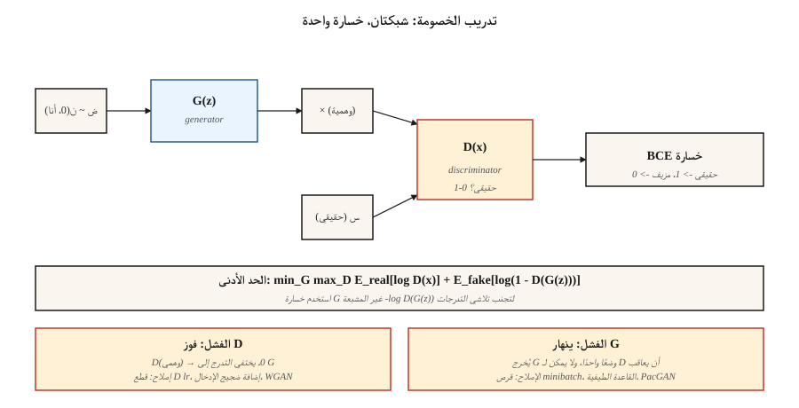

# شبكات GAN – المولد مقابل التمييز
> كانت حيلة جودفيلو في عام 2014 تتمثل في تخطي الكثافة تمامًا. شبكتين. واحد makes مزيف. واحد يمسك بهم. إنهم يقاتلون حتى لا يمكن تمييز المنتجات المزيفة عن الحقيقية. لا ينبغي أن تعمل. في كثير من الأحيان لا يحدث ذلك. وعندما يحدث ذلك، تظل العينات هي الأكثر وضوحًا في الأدبيات المتعلقة بالمجالات الضيقة.
**النوع:** بناء
** اللغات: ** بايثون
**المتطلبات الأساسية:** المرحلة 3 · 02 (الدعامة الخلفية)، المرحلة 3 · 08 (المحسنات)، المرحلة 8 · 02 (VAE)
**الوقت:** ~75 دقيقة
## المشكلة
تنتج VAEs عينات ضبابية لأن فقدان وحدة فك التشفير MSE الخاص بها هو الخيار الأمثل لـ Bayes للصورة *المتوسط* - والمتوسط ​​للعديد من digits المعقولة هو digit غامض. أنت تريد خسارة تكافئ *المعقولية*، وليس القرب من أي هدف واحد. لا يوجد نموذج مغلق للمعقولية. عليك أن تتعلم ذلك.
فكرة Goodfellow: تدريب المصنف `D(x)` على التمييز بين الصور الحقيقية والمزيفة. تدريب المولد `G(z)` لخداع `D`. إشارة الخسارة لـ `G` هي أي شيء يعتقد `D` حاليًا أن makeشيء يبدو حقيقيًا. يتم تحديث هذه الإشارة مع تحسن `G`، ومطاردة هدف متحرك. إذا تقاربت كلتا الشبكتين، فإن `G` يكون قد تعلم توزيع البيانات دون كتابة `log p(x)` على الإطلاق.
هذا هو التدريب العدائي. الرياضيات هي لعبة minimax:
```
min_G max_D  E_real[log D(x)] + E_fake[log(1 - D(G(z)))]
```

في عام 2026، لم تعد شبكات GAN هي المولد SOTA (توافق الانتشار والتدفق مع هذا التاج). لكن StyleGAN 2/3 تظل أكثر نماذج الوجه حدة التي تم شحنها على الإطلاق، ويتم استخدام أدوات التمييز GAN كخسائر إدراكية* في التدريب على النشر، كما يعمل التدريب على العداء على تشغيل عمليات التقطير السريعة بخطوة واحدة (SDXL-Turbo، SD3-Turbo، LCM) التي تتيح لك شحن الانتشار في الوقت الفعلي.
##المفهوم

**المولد `G(z)`.** يقوم بتعيين متجه الضوضاء `z ~ N(0, I)` إلى العينة `x̂`. شبكة على شكل وحدة فك ترميز (تحويلات كثيفة أو منقولة).
**المميز `D(x)`.** يعين العينة للاحتمال العددي (أو النتيجة). حقيقي → 1، مزيف → 0.
**الخسارة.** تحديثان متناوبان:
- **القطار `D`:** `loss_D = -[ log D(x) + log(1 - D(G(z))) ]`. الانتروبيا الثنائية على الحقيقي = 1، وهمية = 0.
- **القطار `G`:** `loss_G = -log D(G(z))`. هذا هو النموذج *غير المشبع* الذي يستخدمه Goodfellow (الأصلي `log(1 - D(G(z)))` يشبع ويقتل التدرجات عندما يكون `D` واثقًا).
**حلقة التدريب.** خطوة واحدة من `D`، خطوة واحدة من `G`. يكرر.
**سبب نجاحه.** إذا كان `G` يتطابق تمامًا مع `p_data`، فلا يمكن لـ `D` أن يفعل أفضل من الصدفة ويخرج 0.5 في كل مكان؛ `G` لا يحصل على مزيد من التدرج. التوازن.
**لماذا ينقطع.** انهيار الوضع (يعثر `G` على وضع واحد لا يمكن لـ `D` تصنيفه ويحتفظ به إلى الأبد)، ويتلاشى التدرج (`D` يتعلم بسرعة كبيرة و`log D` مشبع)، وعدم استقرار التدريب (معدلات التعلم، وأحجام الدفعات، وأي شيء).
## المتغيرات التي جعلت شبكات GAN تعمل
| سنة | الابتكار | إصلاح |
|------|-----------|-----|
| 2015 | DCGAN | Conv/deconv، معيار الدفعة، LeakyReLU – أول بنية مستقرة. |
| 2017 | WGAN، WGAN-GP | استبدل BCE بمسافة فاسرشتاين + عقوبة التدرج. إصلاحات التلاشي التدرج. |
| 2017 | التطبيع الطيفي | Lipschitz مرتبط بالتمييز. لا تزال تستخدم في 2026 تمييزا. |
| 2018 | تقدمي GAN | قم بتدريب الدقة المنخفضة أولاً، ثم قم بإضافة الطبقات. نتائج الميجابكسل الأولى |
| 2019 | ستايلجان / ستايلجان2 | شبكة التعيين + معيار المثيل التكيفي. أحدث ما توصلت إليه التكنولوجيا في التصوير الواقعي للمجال الثابت. |
| 2021 | ستايلجان3 | خالية من الأسماء المستعارة، ومكافئة للترجمة - لا تزال هي المعيار الذهبي للوجه في عام 2026. |
| 2022 | StyleGAN-XL | مشروطة، واعية بالطبقة، وعلى نطاق أوسع. |
| 2024 | __المصطلح_7__ | إعادة صياغة العلامات التجارية بتنظيم أقوى؛ يعمل على 1024² بدون حيل. |
## بنائها
يقوم `code/main.py` بتدريب GAN صغير على بيانات أحادية الأبعاد: مزيج من اثنين من رموز Gaussians. المولد والمميز عبارة عن MLPs ذات طبقة واحدة مخفية. نقوم بتنفيذ حلقة الأمام والخلف وحلقة minimax يدويًا. الهدف هو رؤية وضعي الفشل الرئيسيين (انهيار الوضع + التدرج المتلاشي) فور حدوثهما.
### الخطوة 1: الخسارة غير المشبعة
تنتقل خسارة Vanilla Goodfellow `log(1 - D(G(z)))` إلى 0 عندما يصنف D مزيف G على أنه مزيف بثقة عالية. عند هذه النقطة، يكون التدرج لـ G صفرًا بشكل أساسي - ولا يمكن لـ G أن يتحسن. الشكل غير المشبع `-log D(G(z))` له خط تقارب معاكس: فهو ينفجر عندما يكون D واثقًا، مما يعطي G إشارة قوية.
```python
def g_loss(d_fake):
    # maximize log D(G(z))  <=>  minimize -log D(G(z))
    return -sum(math.log(max(p, 1e-8)) for p in d_fake) / len(d_fake)
```

### الخطوة الثانية: خطوة تمييز واحدة لكل خطوة مولد
```python
for step in range(steps):
    # train D
    real_batch = sample_real(batch_size)
    fake_batch = [G(z) for z in sample_noise(batch_size)]
    update_D(real_batch, fake_batch)

    # train G
    fake_batch = [G(z) for z in sample_noise(batch_size)]  # fresh fakes
    update_G(fake_batch)
```

منتجات مزيفة جديدة لـ G، وإلا فإن التدرجات تصبح قديمة.
### الخطوة 3: مشاهدة انهيار الوضع
```python
if step % 200 == 0:
    samples = [G(z) for z in sample_noise(500)]
    mode_a = sum(1 for s in samples if s < 0)
    mode_b = 500 - mode_a
    if min(mode_a, mode_b) < 50:
        print("  [!] mode collapse: one mode is starved")
```

العَرَض الأساسي: توقف إنشاء أحد الوضعين الحقيقيين. يتوقف المُميِّز عن تصحيحه لأنه لا يُنظر إليه على أنه مزيف أبدًا.
## مطبات
- **أداة التمييز قوية جدًا.** خفض معدل تعلم D بمقدار 2-5x، أو قم بإضافة ضوضاء المثيل/الطبقة. إذا وصلت دقة D إلى > 95%، فهذا يعني أن G ميت.
- **يحفظ المولد الوضع.** أضف ضوضاء إلى مدخلات D، أو استخدم طبقة تمييز الدفعة الصغيرة، أو قم بالتبديل إلى WGAN-GP.
- **إحصائيات تسريب معايير الدُفعة.** الدُفعة الحقيقية + الدُفعة الزائفة التي تتدفق عبر نفس طبقة BN تخلط إحصاءاتها. استخدم معيار المثال أو المعيار الطيفي بدلاً من ذلك.
- **الألعاب ذات النتيجة الأولية.** FID وIS تكون مزعجة عند انخفاض عدد العينات. استخدم عينات ≥10k عند التقييم.
- **أخذ العينات مرة واحدة هو كذبة بالنسبة للمهام الشرطية.** لا تزال بحاجة إلى مقاييس CFG وحيل الاقتطاع وإعادة أخذ العينات للحصول على مخرجات قابلة للاستخدام.
## استخدمه
مكدس GAN لعام 2026:
| الوضع | اختر |
|-----------|------|
| وجوه بشرية مصورة، وضعية ثابتة | StyleGAN3 (الأكثر حدة والأصغر) |
| انمي / وجوه منمقة | StyleGAN-XL أو LoRA للانتشار المستقر |
| ترجمة صورة لصورة | Pix2Pix / CycleGAN (المرحلة 8 · 04) أو ControlNet (المرحلة 8 · 08) |
| تحويل سريع من النص إلى صورة بخطوة واحدة | التقطير المعاكس للانتشار (SDXL-Turbo، SD3-Turbo) |
| فقدان الإدراك الحسي داخل مدرب الانتشار | أداة تمييز صغيرة GAN على اقتصاص الصور |
| أي شيء متعدد الوسائط، مفتوح العضوية | لا تفعل ذلك — استخدم الانتشار أو مطابقة التدفق |
شبكات GAN حادة ولكنها ضيقة. بمجرد فتح المجال الخاص بك – الصور، والمطالبات النصية التعسفية، والفيديو – قم بالتبديل إلى النشر. وتستمر خدعة الخصومة كمكون (الخسائر الإدراكية، والتقطير)، وليس كمولد مستقل.
## اشحنها
احفظ `outputs/skill-gan-debugger.md`. تأخذ المهارة تشغيلًا فاشلًا لـ GAN (منحنيات الخسارة، وعينة الشبكة، وحجم مجموعة البيانات) وتخرج قائمة مرتبة بالأسباب المحتملة، وإصلاحات من سطر واحد، وبروتوكول إعادة التشغيل.
## تمارين
1. **سهل.** قم بتشغيل `code/main.py` باستخدام إعدادات المخزون. ثم قم بتعيين `D_LR = 5 * G_LR` وأعد التشغيل. ما مدى سرعة انهيار خسارة G إلى ثابت؟
2. **متوسط.** استبدل خسارة Goodfellow BCE بخسارة WGAN: `loss_D = E[D(fake)] - E[D(real)]`، `loss_G = -E[D(fake)]`، وأوزان المقطع D إلى `[-0.01, 0.01]`. هل التدريب أكثر استقرارا؟ قارن تقارب ساعة الحائط.
3. **صعب.** قم بتوسيع المثال أحادي الأبعاد إلى بيانات ثنائية الأبعاد (خليط من 8 غاوسيات على حلقة). تتبع عدد الأوضاع الثمانية التي يلتقطها المولد في الخطوات 1k، 5k، 10k. تنفيذ تمييز الدفعة الصغيرة وإعادة القياس.
## المصطلحات الرئيسية
| مصطلح | ماذا يقول الناس | ماذا يعني في الواقع |
|------|-|--------------------------------------|
| مولد | "ز" | شبكة الضوضاء إلى العينة، `G: z → x̂`. |
| المميز | "د" | المصنف `D: x → [0, 1]`، الحقيقي مقابل المزيف. |
| مينيماكس | "اللعبة" | `min_G max_D` لهدف مشترك. |
| خسارة غير مشبعة | "الإصلاح" | استخدم `-log D(G(z))` لـ G بدلاً من `log(1 - D(G(z)))`. |
| انهيار الوضع | "ز حفظت شيئا واحدا" | يُنتج المولد عددًا قليلاً من المخرجات المتميزة على الرغم من تنوع البيانات. |
| WGAN | "واسرشتاين" | استبدل BCE بمسافة محرك الأرض + عقوبة التدرج؛ التدرج أكثر سلاسة. |
| القاعدة الطيفية | "خدعة ليبشيتز" | تقييد معايير الوزن D للحد من ميلها؛ يستقر التدريب. |
| ستايلجان | "الذي يعمل" | شبكة رسم الخرائط + AdaIN؛ الأفضل في فئتها للوجوه، لا يزال في عام 2026. |
## ملاحظة حول الإنتاج: الاستدلال مرة واحدة هو الميزة الدائمة لـ GAN
لم تعد شبكات GAN تفوز بجودة العينة لتوليد المجال المفتوح، لكنها لا تزال تفوز بتكلفة الاستدلال. في مفردات أدب الاستدلال الإنتاجي، يحتوي GAN على:
- **لا توجد تعبئة مسبقة، ولا توجد مراحل لفك التشفير.** تمريرة للأمام `G(z)` واحدة. TTFT ≈ زمن الوصول الإجمالي.
- **لا يوجد KV-ضغط ذاكرة التخزين المؤقت.** الحالة الوحيدة هي الأوزان. حجم الدفعة محدد بذاكرة التنشيط، وليس ذاكرة التخزين المؤقت.
- **الدفعات المستمرة البسيطة.** نظرًا لأن كل طلب يأخذ نفس عمليات FLOP الثابتة، فإن الدفعة الثابتة عند الإشغال المستهدف للخادم هي عادةً الأمثل. لا حاجة لجدولة على متن الطائرة.
هذا هو السبب في أن التقطير GAN (SDXL-Turbo، SD3-Turbo، ADD، LCM) هو الأسلوب السائد لتحويل النص إلى صورة سريعًا في عام 2026: فهو ينهار خط نشر من 20 إلى 50 خطوة pipe إلى 1-4 تمريرات أمامية بنمط GAN مع الحفاظ على توزيع أ قاعدة الانتشار. تبقى الخسارة العدائية كمقبض وقت التدريب لتحويل المولدات البطيئة إلى مولدات سريعة.
## مزيد من القراءة
- [Goodfellow et al. (2014). Generative Adversarial Nets](https://arxiv.org/abs/1406.2661) — الورقة الأصلية GAN.
- [Radford et al. (2015). Unsupervised Representation Learning with DCGAN](https://arxiv.org/abs/1511.06434) — أول بنية مستقرة.
- [Arjovsky, Chintala, Bottou (2017). Wasserstein GAN](https://arxiv.org/abs/1701.07875) — WGAN.
- [Miyato et al. (2018). Spectral Normalization for GANs](https://arxiv.org/abs/1802.05957) — SN.
- [Karras et al. (2020). Analyzing and Improving the Image Quality of StyleGAN](https://arxiv.org/abs/1912.04958) — ستايلجان2.
- [Karras et al. (2021). Alias-Free Generative Adversarial Networks](https://arxiv.org/abs/2106.12423) — ستايلGAN3.
- [Sauer et al. (2023). Adversarial Diffusion Distillation](https://arxiv.org/abs/2311.17042) — SDXL- توربو.