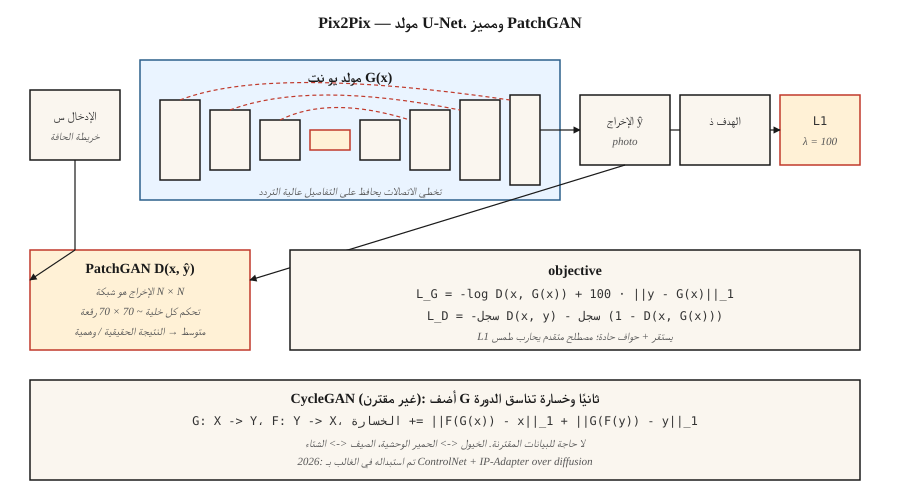

# Conditional GANs & Pix2Pix

> كان أول فتح كبير لعام 2014-2017 هو التحكم في ما هو GAN makes. أرفق تسمية، أو صورة، أو جملة. قامت Pix2Pix بإصدار الصورة وما زالت تتفوق على كل نموذج عام لتحويل النص إلى صورة في مهام تحويل الصورة إلى الصورة الضيقة.

**النوع:** بناء
** اللغات: ** بايثون
** المتطلبات الأساسية: ** المرحلة 8 · 03 (GANs)، المرحلة 4 · 06 (U-Net)، المرحلة 3 · 07 (CNNs)
**الوقت:** ~75 دقيقة

## The Problem

GAN عينات غير مشروطة من الوجوه التعسفية. مفيدة للعرض، عديمة الفائدة في الإنتاج. تريد: *تخطيط رسم تخطيطي لصورة*، *تخطيط خريطة لصورة جوية*، *تخطيط مشهد نهاري ليلا*، *تلوين صورة ذات تدرج رمادي*. في كل هذه الأمور، يتم إعطاؤك صورة إدخال `x` ويجب إخراج `y` مع بعض المراسلات الدلالية. هناك العديد من `y`s المعقولة لكل `x`. خطأ متوسط ​​التربيع يسطحهم إلى الهريسة. الخسارة العدائية لا تفعل ذلك، لأن عبارة "يبدو حقيقيًا" حادة.

الشرطية GAN (Mirza & Osindero, 2014) تضيف الشرط `c` كمدخل لكل من `G` و `D`. Pix2Pix (Isola et al., 2017) متخصص في هذا: الحالة هي صورة إدخال كاملة، والمولد هو U-Net، والمميز هو مصنف * قائم على التصحيح * (PatchGAN)، والخسارة هي عدائية + L1. تتفوق هذه الوصفة في الأداء على نماذج تحويل النص إلى الصورة من الصفر في نطاقات ضيقة من صورة إلى صورة حتى في عام 2026 لأنها مدربة على *البيانات المقترنة* - لديك بالضبط الإشارة التي تحتاجها.

## The Concept



**شرط G.** `G(x, z) → y`. في Pix2Pix، `z` عبارة عن تسرب داخل G (لا توجد ضوضاء إدخال - وجدت Isola أنه تم تجاهل ضوضاء صريحة).

**الشرط د.** `D(x, y) → [0, 1]`. الإدخال هو *الزوج* (الحالة، الإخراج). هذا هو الاختلاف الرئيسي: يجب أن يحكم D على ما إذا كان `y` متوافقًا مع `x`، وليس فقط ما إذا كان `y` يبدو حقيقيًا.

** مولد U-Net. ** جهاز تشفير وفك تشفير مع تخطي الاتصالات عبر عنق الزجاجة. ضروري للمهام التي تشترك فيها المدخلات والمخرجات في بنية منخفضة المستوى (الحواف والصورة الظلية). بدون التخطي، تختفي التفاصيل عالية التردد.

**أداة تمييز PatchGAN.** بدلاً من إخراج نتيجة حقيقية/وهمية واحدة، يقوم D بإخراج شبكة `N×N` حيث تحكم كل خلية على حقل استقبال يبلغ حوالي 70×70 بكسل. متوسط. هذا هو افتراض ماركوف الميداني العشوائي: الواقعية محلية. تدريب أسرع بكثير، ومعلمات أقل، وإخراج أكثر وضوحًا.

**Loss.**

```
loss_G = -log D(x, G(x)) + λ · ||y - G(x)||_1
loss_D = -log D(x, y) - log (1 - D(x, G(x)))
```

يعمل المصطلح L1 على تثبيت التدريب ويدفع G نحو الهدف المعروف. L1 يعطي حواف أكثر وضوحًا من L2 (الوسيط وليس الوسائل). كان `λ = 100` هو الإعداد الافتراضي لـ Pix2Pix.

## CycleGAN — when you don't have pairs

يحتاج Pix2Pix إلى بيانات `(x, y)` مقترنة. يسقط CycleGAN (Zhu et al., 2017) هذا المطلب على حساب خسارة إضافية: خسارة *تناسق الدورة*. مولدان `G: X → Y` و `F: Y → X`. تدريبهم على ذلك `F(G(x)) ≈ x` و `G(F(y)) ≈ y`. يتيح لك هذا ترجمة الخيول إلى حمار وحشي، من الصيف إلى الشتاء، بدون أمثلة مقترنة.

في عام 2026، يتم إجراء تحويل صورة إلى صورة غير مقترنة في الغالب عبر الانتشار (ControlNet، IP-Adapter) بدلاً من CycleGAN، لكن فكرة اتساق الدورة موجودة في كل ورقة تكيف للمجال غير المقترنة تقريبًا.

## Build It

`code/main.py` ينفذ شرطًا صغيرًا GAN على بيانات أحادية الأبعاد. الشرط `c` هو تسمية فئة (0 أو 1). المهمة: إنتاج عينة من التوزيع الشرطي للفئة المحددة.

### Step 1: append condition to both G and D inputs

```python
def G(z, c, params):
    return mlp(concat([z, one_hot(c)]), params)

def D(x, c, params):
    return mlp(concat([x, one_hot(c)]), params)
```

الترميز الساخن هو أبسط طريقة. تستخدم النماذج الأكبر عمليات التضمين المستفادة أو تعديل FiLM أو الانتباه المتبادل.

### Step 2: train conditional

```python
for step in range(steps):
    x, c = sample_real_conditional()
    noise = sample_noise()
    update_D(x_real=x, x_fake=G(noise, c), c=c)
    update_G(noise, c)
```

يجب أن يتطابق المولد مع التوزيع الحقيقي *للشرط المحدد*، وليس الهامشي.

### Step 3: verify per-class output

```python
for c in [0, 1]:
    samples = [G(noise, c) for noise in batch]
    mean_c = mean(samples)
    assert_near(mean_c, real_mean_for_class_c)
```

## Pitfalls

- **تجاهل الشرط.** يتعلم G التهميش، ولا يعاقب D أبدًا لأن إشارة الشرط ضعيفة. الإصلاح: الحالة D أكثر قوة (الطبقة المبكرة، وليس المتأخرة فقط)، استخدم أداة تمييز الإسقاط (Miyato & Koyama 2018).
- **L1 الوزن منخفض جدًا.** ينجرف G إلى مخرجات اعتباطية تبدو حقيقية، وليست مخلصة. ابدأ بـ ≈100 للمهام ذات نمط Pix2Pix.
- **L1 الوزن مرتفع جدًا.** G تنتج مخرجات ضبابية لأن L1 لا يزال معيار L_p. يصلب مرة واحدة يستقر التدريب.
- **تسرب الحقيقة الأرضية في D.** قم بتسلسل `(x, y)` كمدخل D، وليس `y` فقط. بدون هذا D لا يمكن التحقق من الاتساق.
- **وضع الانهيار لكل فصل.** يمكن طي كل فصل بشكل مستقل. قم بإجراء اختبارات التنوع المشروط للفصل.

## Use It

حالة مهام صورة إلى صورة لعام 2026:

| مهمة | أفضل نهج |
|------|--------------|
| رسم → صورة، نفس المجال، البيانات المقترنة | Pix2Pix / Pix2PixHD (لا يزال سريعًا ولا يزال حادًا) |
| رسم → صورة، غير مقترنة | ControlNet مع نموذج تكييف الخربشة |
| المقطع الدلالي → الصورة | SPADE / GauGAN2 أو SD + ControlNet-Seg |
| نقل النمط | الانتشار باستخدام IP-المحول أو LoRA؛ GAN الأساليب موروثة |
| العمق → الصورة | التحكم في عمق الشبكة على الانتشار المستقر |
| فائقة الدقة | حقيقي-ESRGAN (GAN) أو ESRGAN-زائد أو SD-راقي (انتشار) |
| التلوين | ColTran، أو الملونات القائمة على الانتشار، أو Pix2Pix-color |
| النهار → الليل، المواسم، الطقس | CycleGAN أو ControlNet القائم على |

تظل Pix2Pix هي الأداة الصحيحة عندما (أ) يكون لديك آلاف الأمثلة المقترنة، (ب) تكون المهمة ضيقة وقابلة للتكرار، و (ج) تحتاج إلى استنتاج سريع. في المهام العامة ذات المجال المفتوح، يفوز الانتشار.

## Ship It

حفظ `outputs/skill-img2img-chooser.md`. تأخذ المهارة وصف المهمة، وتوافر البيانات (المقترنة مقابل غير المقترنة، وعينات N)، وميزانية الكمون/الجودة، ثم المخرجات: النهج (Pix2Pix، CycleGAN، متغير ControlNet، SDXL + IP-Adapter)، ومتطلبات بيانات التدريب، وتكلفة الاستدلال، وبروتوكول التقييم (LPIPS، FID، خاص بالمهمة).

## Exercises

1. **سهل.** قم بتعديل `code/main.py` لإضافة فئة ثالثة. تأكد من أن G لا يزال يقوم بتعيين ضوضاء كل فئة إلى الوضع الصحيح.
2. **متوسط.** استبدل L1 بخسارة النمط الإدراكي في الإعداد أحادي الأبعاد (على سبيل المثال، حرف D صغير متجمد يعمل كمستخرج للميزات). هل يغير من حدة التوزيع الشرطي؟
3. **صعب.** ارسم CycleGAN في إعداد أحادي الأبعاد: توزيعان، ومولدان، وخسارة الدورة. أظهر أنه يتعلم كيفية التعيين بينهما بدون بيانات مقترنة.

## Key Terms

| مصطلح | ماذا يقول الناس | ماذا يعني في الواقع |
|------|-|--------------------------------------|
| مشروط GAN | "GAN بالتسميات" | ز(ض، ج)، د(خ، ج). كلتا الشبكتين ترى الشرط. |
| Pix2Pix | "صورة لصورة GAN" | تم إقران cGAN مع خسارة U-Net G وPatchGAN D + L1. |
| يو نت | "جهاز التشفير وفك التشفير مع التخطي" | شبكة تحويل متماثلة؛ يتخطى الحفاظ على التردد العالي. |
| باتشجان | "مصنف الواقعية المحلية" | يقوم D بإخراج النتيجة لكل تصحيح بدلاً من النتيجة العالمية. |
| سيكلجان | "ترجمة الصور غير المقترنة" | اثنان G + خسارة اتساق الدورة؛ لا توجد بيانات مقترنة. |
| SPADE | "جوجان" | تطبيع التنشيطات المتوسطة باستخدام الخريطة الدلالية؛ تجزئة إلى صورة. |
| فيلم | "التعديل الخطي المميز" | تحويل تقاربي لكل ميزة من الشرط؛ تكييف رخيص. |

## Production note: Pix2Pix as a latency-bound baseline

عندما يكون لديك بيانات مقترنة ومهمة ضيقة (رسم ← عرض، خريطة دلالية ← صورة، نهار ← ليل)، فإن استدلال اللقطة الواحدة لـ Pix2Pix يتفوق على الانتشار بترتيب من حيث الحجم على زمن الوصول. مقارنة الإنتاج عادة ما تكون:

| المسار | خطوات | الكمون النموذجي عند 512² على L4 |
|------|-------|---------------------------------------|
| Pix2Pix (U-Net للأمام) | 1 | ~30 مللي ثانية |
| SD-Inpaint أو SD-Img2Img | 20 | ~1.2 ثانية |
| SDXL- تيربو Img2Img | 1-4 | ~0.15-0.35 ثانية |
| ControlNet + SDXL قاعدة | 20-30 | ~3-5 ث |

يفوز Pix2Pix بالإنتاجية على دفعات ثابتة (كل طلب هو نفس FLOPs). النشر يفوز بالجودة والتعميم. تتمثل المسرحية الحديثة غالبًا في شحن نموذج مقطر على طراز Pix2Pix للمهمة الضيقة واحتياطي نشر للمدخلات الخلفية.

## Further Reading

- [Mirza & Osindero (2014). Conditional Generative Adversarial Nets](https://arxiv.org/abs/1411.1784) — the cGAN paper.
- [Isola et al. (2017). ترجمة صورة إلى صورة باستخدام شبكات الخصومة المشروطة](https://arxiv.org/abs/1611.07004) — Pix2Pix.
- [Zhu et al. (2017). Unpaired Image-to-Image Translation using Cycle-Consistent Adversarial Networks](https://arxiv.org/abs/1703.10593) — CycleGAN.
- [Wang et al. (2018). تركيب صور عالي الدقة باستخدام شبكات GAN الشرطية](https://arxiv.org/abs/1711.11585) — Pix2PixHD.
- [Park et al. (2019). Semantic Image Synthesis with Spatially-Adaptive Normalization]( — https / GauGAN.
- [Miyato & Koyama (2018). شبكات cGAN مع أداة تمييز الإسقاط](https://arxiv.org/abs/1802.05637) — الإسقاط D.
