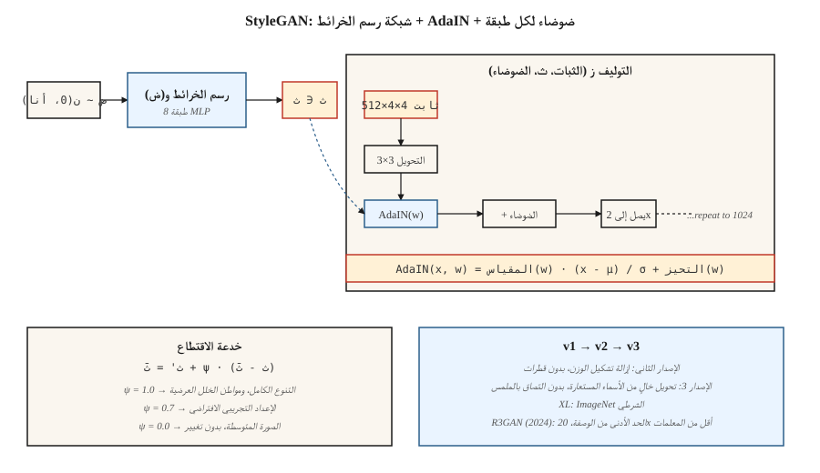

# ستايلجان
> تقوم معظم المولدات بتحريك `z` في كل طبقة في نفس الوقت. قام StyleGAN بتقسيمه إلى أجزاء: قم أولاً بتعيين `z` إلى `w` متوسط، ثم *احقن* `w` في كل مستوى دقة من خلال AdaIN. أدى هذا التغيير الفردي إلى فك تشابك المساحة الكامنة وجعل الوجوه الواقعية مشكلة تم حلها لمدة سبع سنوات متتالية.
**النوع:** بناء
** اللغات: ** بايثون
** المتطلبات الأساسية: ** المرحلة 8 · 03 (GANs)، المرحلة 4 · 08 (التطبيع)، المرحلة 3 · 07 (CNNs)
**الوقت:** ~45 دقيقة
## المشكلة
يقوم DCGAN بتعيين `z` لصورة من خلال مجموعة من التلافيف المنقولة. المشكلة: `z` يتحكم في كل شيء - الوضعية، والإضاءة، والهوية، والخلفية - المتشابكة معًا. تحرك على طول محور واحد من `z`، وستتغير جميع المحاور الأربعة. لا يمكنك أن تطلب من النموذج "نفس الشخص، في وضعية مختلفة" لأن التمثيل لا يأخذ في الاعتبار هذه الطريقة.
كراس وآخرون. (2019، NVIDIA) المقترح: التوقف عن تغذية `z` مباشرةً في طبقات التحويل. قم بتغذية موتر `4×4×512` ثابت كمدخل للشبكة. تعرف على MLP المكون من 8 طبقات والذي يعين `z ∈ Z → w ∈ W`. أدخل `w` في كل دقة عبر *تطبيع المثيل التكيفي* (AdaIN): قم بتطبيع كل خريطة ميزات تحويل، ثم قم بالقياس والتحويل من خلال الإسقاطات المتقاربة لـ `w`. أضف ضوضاء لكل طبقة للحصول على تفاصيل عشوائية (مسام الجلد، خيوط الشعر).
النتيجة: `W` يحتوي على محاور متعامدة تقريبًا لـ "النمط عالي المستوى" (الوضعية والهوية) مقابل "النمط الجيد" (الإضاءة واللون). يمكنك تبديل الأنماط بين صورتين باستخدام `w` الخاص بالصورة A لمستويات الدقة المنخفضة والصورة B `w` للمستويات العالية من الدقة. هذا التحرير المفتوح والأسلوب عبر النطاقات وخط البحث "StyleGAN-inversion" بأكمله.
##المفهوم

**شبكة رسم الخرائط.** `f: Z → W`، MLP مكون من 8 طبقات. __الكود_1__. `W` ليس مجبرًا على أن يكون غاوسيًا — فهو يتعلم شكلًا مُكيَّفًا مع البيانات.
**الشبكة التركيبية.** تبدأ من الثابت المكتسب `4×4×512`. كل كتلة دقة: `upsample → conv → AdaIN(w_i) → noise → conv → AdaIN(w_i) → noise`. القرارات مزدوجة: 4، 8، 16، 32، 64، 128، 256، 512، 1024.
**عدين.**
```
AdaIN(x, y) = y_scale · (x - mean(x)) / std(x) + y_bias
```

حيث يأتي `y_scale` و`y_bias` من الإسقاطات المتقاربة لـ `w`. قم بالتطبيع لكل خريطة ميزات، ثم قم بإعادة التصميم. "النمط" هنا هو إحصائيات الترتيب الأول والثاني لخريطة المعالم.
**ضوضاء لكل طبقة.** ضوضاء غاوسية أحادية القناة تتم إضافتها إلى كل خريطة ميزات، ويتم قياسها بواسطة عامل تم تعلمه لكل قناة. يتحكم في التفاصيل العشوائية دون التأثير على البنية العالمية.
**خدعة الاقتطاع.** عند الاستدلال، خذ عينة `z`، واحسب `w = mapping(z)`، ثم `w' = ŵ + ψ·(w - ŵ)` حيث `ŵ` هو المتوسط ​​`w` على العديد من العينات. `ψ < 1` يتاجر بالتنوع من أجل الجودة. يستخدم كل عرض توضيحي لـ StyleGAN تقريبًا `ψ ≈ 0.7`.
## ستايلجان 1 → 2 → 3
| النسخة | سنة | الابتكار |
|---------|------|------------|
| ستايلجان | 2019 | شبكة رسم الخرائط + AdaIN + الضوضاء + النمو التدريجي. |
| ستايلجان2 | 2020 | تحل إزالة تشكيل الوزن محل AdaIN (يصلح آثار القطرات)؛ تخطي / العمارة المتبقية. تنظيم طول المسار. |
| ستايلجان3 | 2021 | التفاف خالي من الأسماء المستعارة + حبات مكافئة؛ يزيل التصاق النسيج بشبكة البكسل. |
| StyleGAN-XL | 2022 | فئة مشروطة، 1024²، إيماج نت. |
| __المصطلح_1__ | 2024 | إعادة تسمية العلامة التجارية بتنظيم أقوى؛ يغلق فجوة الانتشار على FFHQ-1024 مع معلمات أقل بمقدار 20x. |
في عام 2026، يظل StyleGAN3 هو الإعداد الافتراضي لـ (أ) الصور الواقعية ذات النطاق الضيق عند FPS العالي، (ب) التكيف مع النطاق قليل اللقطات (التدرب على مجموعة بيانات جديدة تحتوي على 100 صورة، وتجميد التعيين)، (ج) التحرير القائم على الانعكاس (ابحث عن `w` الذي يعيد بناء صورة حقيقية، ثم قم بتحرير `w`). بالنسبة لتحويل النص إلى صورة في المجال المفتوح، فهي ليست الأداة - بل النشر.
## بنائها
`code/main.py` ينفذ لعبة "style-GAN lite" في 1-D: رسم خرائط MLP، وهي وظيفة تركيبية تأخذ ناقلًا ثابتًا مكتسبًا وتعدله باستخدام مقياس/تحيز مشتق من `w`، وضوضاء لكل طبقة. يوضح أن حقن `w` عبر التعديل المتقارب يطابق أو يتفوق على `z` في مدخلات المولد.
### الخطوة 1: رسم خرائط الشبكة
```python
def mapping(z, M):
    h = z
    for i in range(num_layers):
        h = leaky_relu(add(matmul(M[f"W{i}"], h), M[f"b{i}"]))
    return h
```

### الخطوة 2: تطبيع المثيل التكيفي
```python
def adain(x, w_scale, w_bias):
    mu = mean(x)
    sd = std(x)
    x_norm = [(xi - mu) / (sd + 1e-8) for xi in x]
    return [w_scale * xi + w_bias for xi in x_norm]
```

يأتي مقياس الرسم والتحيز لكل معلم من `w` عبر الإسقاط الخطي.
### الخطوة 3: الضوضاء لكل طبقة
```python
def add_noise(x, sigma, rng):
    return [xi + sigma * rng.gauss(0, 1) for xi in x]
```

سيجما لكل قناة قابلة للتعلم.
## مطبات
- **التحف القطرية.** أنتج StyleGAN 1 قطرة كبيرة الحجم في خرائط الميزات لأن AdaIN قام بتصفية المتوسط. تعمل عملية إزالة تشكيل الوزن في StyleGAN 2 على إصلاح المشكلة عن طريق زيادة أوزان الالتواء بدلاً من ذلك.
- **التصاق النسيج.** يتبع نسيج StyleGAN 1 و2 إحداثيات البكسل، وليس إحداثيات الكائن (مرئية عند الاستيفاء). تعمل التلافيفات الخالية من الأسماء المستعارة في StyleGAN 3 على إصلاح ذلك باستخدام مرشحات المزامنة ذات الإطارات.
- **تغطية الوضع.** يبدو الاقتطاع `ψ < 0.7` نظيفًا ولكنه عبارة عن عينات من مخروط ضيق؛ استخدم `ψ = 1.0` إذا كنت بحاجة إلى التنوع.
- **العكس هو فقدان.** عادةً ما يتم عكس الصورة الحقيقية إلى `W` من خلال التحسين أو برنامج التشفير (e4e، ReStyle، HyperStyle). تنجرف النتائج عبر العديد من التكرارات.
## استخدمه
| حالة الاستخدام | النهج |
|----------|---------|
| وجوه بشرية مصورة (أنمي، منتج، ضيق) | StyleGAN3 FFHQ / الضبط الدقيق المخصص |
| تعديل الوجه من صورة | انعكاس e4e + اتجاهات StyleSpace / InterFaceGAN |
| مبادلة الوجه / إعادة تمثيل | StyleGAN + التشفير + المزج |
| الصورة الرمزية pipelines | StyleGAN3 مع ADA لضبط البيانات المنخفضة |
| تعديل المجال من بعض الصور | تجميد شبكة رسم الخرائط، وصقل التوليف |
| جيل متعدد الوسائط أو مشروط بالنص | لا تفعل — استخدم الانتشار |
بالنسبة للعروض التوضيحية على مستوى المنتج حيث تكون الإجابة "صورة لوجه شخص ما"، فإن StyleGAN يتفوق على تكلفة الانتشار في الاستدلال (تمريرة أمامية واحدة، أقل من 10 مللي ثانية في 4090) والحدة لنفس شريط الجودة.
## اشحنها
احفظ `outputs/skill-stylegan-inversion.md`. تأخذ المهارة صورة ومخرجات حقيقية: طريقة الانعكاس (e4e / ReStyle / HyperStyle)، والخسارة الكامنة المتوقعة، وميزانية التحرير (إلى أي مدى يمكنك التحرك قبل القطع الأثرية في `W`)، وقائمة اتجاهات التحرير الجيدة المعروفة (العمر، التعبير، الوضعية).
## تمارين
1. **سهل.** قم بتشغيل `code/main.py` باستخدام `adain_on=True` و`adain_on=False`. قارن بين انتشار النواتج للكامنة الثابتة والكامنة المضطربة.
2. **متوسط.** تنفيذ تنظيم الخلط: بالنسبة لمجموعة تدريبية، قم بحساب `w_a`، `w_b`، وتطبيق `w_a` للنصف الأول من التوليف و`w_b` للنصف الثاني. هل يتعلم جهاز فك التشفير الأنماط غير المتشابكة؟
3. **صعب.** خذ نموذج StyleGAN3 FFHQ المُدرب مسبقًا (ffhq-1024.pkl). ابحث عن اتجاه `w` الذي يتحكم في "الابتسامة" عن طريق تدريب SVM على العينات المسماة؛ قم بالإبلاغ عن المدى الذي يمكنك المضي فيه قبل أن تنجرف الهوية.
## المصطلحات الرئيسية
| مصطلح | ماذا يقول الناس | ماذا يعني في الواقع |
|------|-|--------------------------------------|
| شبكة رسم الخرائط | "__المصطلح_1__" | `f: Z → W`، 8 طبقات، تفصل الهندسة الكامنة عن إحصائيات البيانات. |
| مساحة دبليو | "مساحة الأسلوب" | إخراج شبكة رسم الخرائط. مفكوكة تقريبا. |
| أدين | "قاعدة المثيل التكيفي" | قم بتطبيع خريطة المعالم، ثم قم بقياس + إزاحة بواسطة `w`-projection. |
| خدعة الاقتطاع | "بسي" | `w = mean + ψ·(w - mean)`، ψ<1 يتاجر بالتنوع من أجل الجودة. |
| تنظيم طول المسار | "PL ريج" | يعاقب التغييرات الكبيرة في الصورة لكل تغيير في الوحدة في `w`؛ makes `W` أكثر سلاسة. |
| إزالة تشكيل الوزن | "إصلاح StyleGAN2" | تطبيع أوزان التحويل بدلاً من عمليات التنشيط؛ يقتل التحف القطرة. |
| خالية من الاسم المستعار | "خدعة StyleGAN3" | مرشحات سينية ذات نوافذ؛ يزيل التصاق النسيج بشبكة البكسل. |
| انقلاب | "ابحث عن صورة حقيقية" | قم بتحسين أو تشفير `x → w` بحيث يكون `G(w) ≈ x`. |
## ملاحظة الإنتاج: لماذا لا يزال StyleGAN يُشحن في عام 2026
يقوم StyleGAN3 الموجود على 4090 بإنشاء وجه 1024² FFHQ في أقل من 10 مللي ثانية - `num_steps = 1`، ولا يوجد فك تشفير VAE، ولا يوجد تمرير للانتباه المتبادل. من حيث الإنتاج، هذا هو زمن الاستجابة لأي مولد صور. خط SDXL + VAE-فك التشفير pipeline المكون من 50 خطوة بنفس الدقة يبلغ حوالي 3 ثوانٍ. هذه فجوة **300×**، وبالنسبة للمنتجات ذات النطاق الضيق (خدمات الصور الرمزية، ID مستند pipelines، إنشاء وجه المخزون) فإنها تفوز في TCO.
نتيجتان عمليتان:
- **لا توجد أداة جدولة، ولا أداة تجميع.** تعتبر الدفعة الثابتة عند الإشغال المستهدف هي الأمثل. لا يوفر التجميع المستمر (ضروري لـ LLMs والنشر) أي فائدة لأن كل طلب يأخذ نفس FLOPs.
- **الاقتطاع `ψ` هو مقبض الأمان.** `ψ < 0.7` عينات من مخروط ضيق من نطاق شبكة رسم الخرائط. هذه هي الرافعة الوحيدة التي تمتلكها طبقة التقديم على تباين العينة. قم بخفض `ψ` عند ذروة التحميل، ثم ارفعه للمستخدمين المتميزين.
## مزيد من القراءة
- [Karras et al. (2019). A Style-Based Generator Architecture for GANs](https://arxiv.org/abs/1812.04948) — ستايلجان.
- [Karras et al. (2020). Analyzing and Improving the Image Quality of StyleGAN](https://arxiv.org/abs/1912.04958) — ستايلجان2.
- [Karras et al. (2021). Alias-Free Generative Adversarial Networks](https://arxiv.org/abs/2106.12423) — ستايلGAN3.
- [Tov et al. (2021). Designing an Encoder for StyleGAN Image Manipulation](https://arxiv.org/abs/2102.02766) — انعكاس e4e.
- [Sauer et al. (2022). StyleGAN-XL: Scaling StyleGAN to Large Diverse Datasets](https://arxiv.org/abs/2202.00273) — ستايلGAN-XL.
- [Huang et al. (2024). R3GAN: The GAN is dead; long live the GAN!](https://arxiv.org/abs/2501.05441) — الحد الأدنى من الوصفة الحديثة GAN.