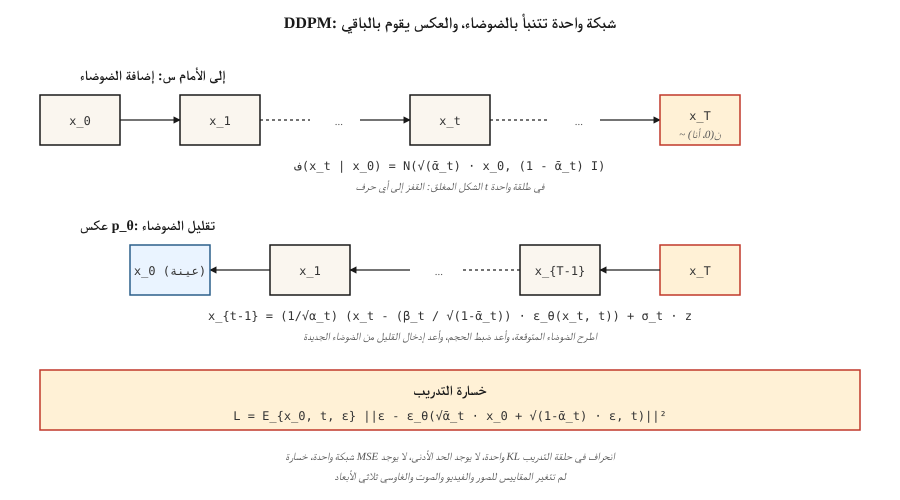

# نماذج الانتشار — DDPM من الصفر
> أعطى هو جاين أبيل (2020) للحقل وصفة لا يمكنه تركها. قم بتدمير البيانات بالضوضاء على مدى ألف خطوة صغيرة. تدريب شبكة عصبية واحدة للتنبؤ بالضوضاء. عكس العملية عند الاستدلال. اليوم، يتم تشغيل كل نموذج من الصور والفيديوهات والموسيقى ثلاثية الأبعاد والموسيقى السائدة على هذه الحلقة، وربما مع مطابقة التدفق أو حيل الاتساق في الأعلى.
**النوع:** بناء
** اللغات: ** بايثون
**المتطلبات الأساسية:** المرحلة 3 · 02 (الدعامة الخلفية)، المرحلة 8 · 02 (VAE)
**الوقت:** ~75 دقيقة
## المشكلة
تريد عينة لـ `p_data(x)`. تلعب شبكات GAN لعبة الحد الأدنى التي غالبًا ما تتباعد. تنتج VAEs عينات ضبابية من وحدة فك ترميز غاوسية. ما تريده حقًا هو هدف التدريب الذي هو (أ) خسارة واحدة ثابتة (بدون نقطة سرج، لا يوجد حد أدنى)، (ب) حد أدنى لـ `log p(x)` (بحيث يكون لديك احتمالات)، و (ج) عينات تتطابق مع جودة SOTA.
سوهل ديكستين وآخرون. (2015) كان لديه إجابة نظرية: حدد سلسلة ماركوف `q(x_t | x_{t-1})` التي تضيف ضوضاء غاوسية تدريجيًا، وقم بتدريب سلسلة عكسية `p_θ(x_{t-1} | x_t)` لتقليل الضوضاء. أظهر Ho, Jain, Abbeel (2020) أنه يمكن تبسيط الخسارة إلى سطر واحد - التنبؤ بالضوضاء - وتنظيف الرياضيات. في عام 2020 كان هذا فضولاً. وفي عام 2021 أنتجت عينات حديثة. في عام 2022 أصبح الانتشار المستقر. في عام 2026 هو الركيزة.
##المفهوم

**العملية الأمامية `q`.** أضف تشويشًا غاوسيًا في `T` بخطوات صغيرة. الشكل المغلق - السبب وراء سهولة متابعة الرياضيات - هو أن الخطوة التراكمية هي أيضًا غاوسية:
```
q(x_t | x_0) = N( sqrt(α̅_t) · x_0,  (1 - α̅_t) · I )
```

حيث `α̅_t = ∏_{s=1..t} (1 - β_s)` لجدول `β_t`. اختر `β_t` من 1e-4 إلى 0.02 خطيًا على T=1000 خطوة و`x_T` يساوي `N(0, I)` تقريبًا.
**العملية العكسية `p_θ`.** تعرف على الشبكة العصبية `ε_θ(x_t, t)` التي تتنبأ بالضوضاء التي تمت إضافتها. بالنظر إلى `x_t`، يتم تقليل الضوضاء بواسطة:
```
x_{t-1} = (1 / sqrt(α_t)) · ( x_t - (β_t / sqrt(1 - α̅_t)) · ε_θ(x_t, t) )  +  σ_t · z
```

حيث `σ_t` هو إما `sqrt(β_t)` أو تباين مكتسب. التعبير قبيح ولكنه مجرد علم جبر - حل `x_{t-1}` بالنظر إلى `q(x_{t-1} | x_t, x_0)` الخلفي واستبدال `x_0` بتقديره المتوقع للضوضاء.
**خسارة التدريب.**
```
L_simple = E_{x_0, t, ε} [ || ε - ε_θ( sqrt(α̅_t) · x_0 + sqrt(1 - α̅_t) · ε,  t ) ||² ]
```

عينة `x_0` من البيانات، واختيار `t` عشوائي، وعينة `ε ~ N(0, I)`، وحساب `x_t` المزعج في طلقة واحدة عبر النموذج المغلق، والتراجع عن الضوضاء. خسارة واحدة، لا يوجد الحد الأدنى، لا KL، لا حيل إعادة المعلمة.
**أخذ العينات.** ابدأ `x_T ~ N(0, I)`. كرر الخطوة العكسية من `t = T` إلى `1`. منتهي.
## لماذا يعمل
ثلاثة حدس:
1. ** تقليل الضوضاء أمر سهل؛ توليدها أمر صعب.** في `t=T`، البيانات عبارة عن ضوضاء خالصة - يجب على الشبكة أن تحل مشكلة تافهة. في `t=0`، يتعين على الشبكة فقط تنظيف عدد قليل من وحدات البكسل. في المستوى المتوسط ​​`t`، تكون المشكلة صعبة ولكن الشبكة تحتوي على العديد من التدرجات التي تتدفق عبر نفس الأوزان من كل مستوى ضوضاء.
2. **مطابقة النتائج المقنعة.** أثبت فنسنت (2011) أن التنبؤ بالضوضاء يعادل تقدير `∇_x log q(x_t | x_0)`، *النتيجة*. يستخدم SDE العكسي هذه النتيجة للمضي قدمًا في تدرج الكثافة - وهو عبارة عن مسيرة عشوائية موجهة نحو المناطق ذات الاحتمالية العالية.
3. **يتم تقليل ELBO إلى MSE بسيط.** يحتوي الحد الأدنى المتغير الكامل على حد KL لكل خطوة زمنية. باستخدام معلمات DDPM، يتم تبسيط مصطلحات KL إلى MSE بشأن التنبؤ بالضوضاء باستخدام معاملات محددة؛ لقد أسقط هو المعاملات (واصفًا إياها بالخسارة "البسيطة") وتحسنت الجودة.
## بنائها
`code/main.py` ينفذ DDPM أحادي الأبعاد. البيانات عبارة عن خليط ثنائي الوضع. "الشبكة" عبارة عن MLP صغير يأخذ `(x_t, t)` ويخرج الضوضاء المتوقعة. التدريب هو خسارة سطر واحد. أخذ العينات يكرر السلسلة العكسية.
### الخطوة 1: الجدول الزمني المستقبلي (نموذج مغلق)
```python
betas = [1e-4 + (0.02 - 1e-4) * t / (T - 1) for t in range(T)]
alphas = [1 - b for b in betas]
alpha_bars = []
cum = 1.0
for a in alphas:
    cum *= a
    alpha_bars.append(cum)
```

### الخطوة 2: عينة `x_t` في لقطة واحدة
```python
def forward_sample(x0, t, alpha_bars, rng):
    a_bar = alpha_bars[t]
    eps = rng.gauss(0, 1)
    x_t = math.sqrt(a_bar) * x0 + math.sqrt(1 - a_bar) * eps
    return x_t, eps
```

### الخطوة 3: خطوة تدريب واحدة
```python
def train_step(x0, model, alpha_bars, rng):
    t = rng.randrange(T)
    x_t, eps = forward_sample(x0, t, alpha_bars, rng)
    eps_hat = model_forward(model, x_t, t)
    loss = (eps - eps_hat) ** 2
    return loss, gradient_step(model, ...)
```

### الخطوة 4: أخذ العينات العكسية
```python
def sample(model, alpha_bars, T, rng):
    x = rng.gauss(0, 1)
    for t in range(T - 1, -1, -1):
        eps_hat = model_forward(model, x, t)
        beta_t = 1 - alphas[t]
        x = (x - beta_t / math.sqrt(1 - alpha_bars[t]) * eps_hat) / math.sqrt(alphas[t])
        if t > 0:
            x += math.sqrt(beta_t) * rng.gauss(0, 1)
    return x
```

بالنسبة للمسألة أحادية الأبعاد ذات 40 خطوة زمنية و24 وحدة MLP، يتم تعلم الخليط ثنائي الوضع في 200 فترة تقريبًا.
## تكييف الوقت
تحتاج الشبكة إلى معرفة الخطوة الزمنية التي تقلل من الضوضاء. خياران قياسيان:
- **التضمين الجيبي.** مثل التشفير الموضعي للمحولات. __الكود_0__. المرور عبر MLP، البث في الشبكة.
- ** تكييف الفيلم / المجموعة. ** تضمين المشروع لمقياس/تحيز لكل قناة (FiLM) في كل كتلة.
يستخدم رمز لعبتنا الجيبية → concat. تستخدم شبكات U للإنتاج FiLM.
## مطبات
- **الجدول مهم جدًا.** الخطي `β` هو DDPM الافتراضي ولكن جدول جيب التمام (Nichol & Dhariwal, 2021) يعطي FID أفضل لنفس الحساب. تبديل الجداول إذا كانت الجودة ثابتة.
- **تضمين الخطوات الزمنية هش.** تمرير `t` الأولي كعائم يعمل مع اللعبة 1-D لكنه يفشل مع الصور؛ استخدم دائمًا التضمين المناسب.
- **تنبؤ V مقابل تنبؤ ε.** بالنسبة للأنظمة الضيقة (صغيرة جدًا أو كبيرة جدًا)، فإن `ε` لديه إشارة إلى ضوضاء ضعيفة. التنبؤ V (`v = α·ε - σ·x`) أكثر استقرارًا؛ SDXL، SD3، وFlux يستخدمونه.
- **إرشادات خالية من المصنفات.** عند الاستدلال، قم بحساب كل من `ε` المشروط وغير المشروط، ثم `ε_cfg = (1 + w) · ε_cond - w · ε_uncond` مع `w ≈ 3-7`. تمت تغطيته في الدرس 08.
- **1000 خطوة كثير.** يستخدم الإنتاج DDIM (20-50 خطوة)، DPM-Solver (10-20 خطوة)، أو التقطير (1-4 خطوات). انظر الدرس 12.
## استخدمه
| الدور | المكدس النموذجي في عام 2026 |
|------|----------------------|
| انتشار الصورة في مساحة البكسل (صغير، لعبة) | DDPM + يو نت |
| صورة الانتشار الكامن | VAE التشفير + U-Net أو DiT (الدرس 07) |
| فيديو الانتشار الكامن | DiT الزماني المكاني (Sora، Veo، WAN) |
| الانتشار الكامن للصوت | التشفير + محول الانتشار |
| العلوم (الجزيئات، البروتينات، الفيزياء) | الانتشار المتساوي (EDM, RFdiffusion, AlphaFold3) |
الانتشار هو العمود الفقري التوليدي العالمي. مطابقة التدفق (الدرس 13) هي المنافس 2024-2026 الذي يفوز عادةً بسرعة الاستدلال لنفس الجودة.
## اشحنها
احفظ `outputs/skill-diffusion-trainer.md`. تتطلب المهارة مجموعة بيانات + حساب الميزانية والمخرجات: الجدول الزمني (الخطي/جيب التمام/السيني)، وهدف التنبؤ (ε/v/x)، وعدد الخطوات، ومقياس التوجيه، وعائلة العينات، وبروتوكول التقييم.
## تمارين
1. **سهل.** قم بتغيير T من 40 إلى 10 في `code/main.py`. كيف تتدهور جودة العينة (الرسم البياني المرئي للمخرجات)؟ عند أي نقطة ينهار الهيكل ذو الوضعين؟
2. **متوسط.** قم بالتبديل من التنبؤ ε إلى التنبؤ v. إعادة اشتقاق الخطوة العكسية. قارن جودة العينة النهائية.
3. **صعب.** أضف إرشادات خالية من المصنفات. ضع الشرط على ملصق الفصل `c ∈ {0, 1}`، وقم بإسقاطه بنسبة 10% من الوقت أثناء التدريب، وفي وقت أخذ العينات استخدم `ε = (1+w)·ε_cond - w·ε_uncond`. قم بقياس معدل ضرب الوضع الشرطي عند `w = 0, 1, 3, 7`.
## المصطلحات الرئيسية
| مصطلح | ماذا يقول الناس | ماذا يعني في الواقع |
|------|-|--------------------------------------|
| عملية إلى الأمام | "إضافة الضوضاء" | تم إصلاح سلسلة ماركوف `q(x_t | x_{t-1})` التي تدمر البيانات. |
| عملية عكسية | "تقليل الضوضاء" | السلسلة المستفادة `p_θ(x_{t-1} | x_t)` التي تعيد بناء البيانات. |
| β الجدول الزمني | "سلم الضجيج" | التباين لكل خطوة؛ خطي، جيب التمام، أو السيني. |
| α̅ | "شريط ألفا" | المنتج التراكمي `∏(1 - β)`; يعطي نموذجًا مغلقًا `x_t` من `x_0`. |
| خسارة بسيطة | "MSE على الضوضاء" | __الكود_5__; تنهار جميع الاشتقاقات التباينية إلى هذا. |
| ε-التنبؤ | "توقع الضوضاء" | الإخراج هو الضوضاء المضافة. المعيار DDPM. |
| التنبؤ V | "توقع السرعة" | الإخراج هو `α·ε - σ·x`؛ تكييف أفضل عبر ر. |
| __المصطلح_2__ | "الورقة" | هو وآخرون. 2020; خطي β، 1000 خطوة، U-Net. |
| __المصطلح_3__ | "أخذ العينات الحتمية" | عينة غير ماركوف، 20-50 خطوة، نفس هدف التدريب. |
| إرشادات خالية من المصنف | "CFG" | امزج بين توقعات الضوضاء المشروطة وغير المشروطة لتضخيم التكييف. |
## ملاحظة حول الإنتاج: استنتاج الانتشار هو مشكلة عدد الخطوات
تقوم الورقة DDPM بتشغيل T=1000 خطوة عكسية. لا أحد يشحن ذلك في الإنتاج. تختار كل مجموعة استدلال حقيقية واحدة من ثلاث إستراتيجيات - وكل منها تحدد بشكل واضح إطار الإنتاج "من أين يأتي زمن الوصول":
1. **وحدة أخذ العينات أسرع، نفس النموذج.** DDIM (20-50 خطوة)، DPM-Solver++ (10-20)، UniPC (8-16). استبدال منسدل للحلقة العكسية ؛ الأوزان المدربة `ε_θ` لم تمس. يقطع الكمون 20-50×.
2. **التقطير.** تدريب الطالب على مطابقة المعلم في خطوات أقل: التقطير التدريجي (2 → 1)، نماذج الاتساق (تعسفي → 1-4)، LCM، SDXL-Turbo، SD3-Turbo. يقطع زمن الوصول بمقدار 5-10× أخرى، ويتطلب إعادة التدريب.
3. **التخزين المؤقت والتجميع.** `torch.compile(unet, mode="reduce-overhead")`، الواجهات الخلفية للنشر TensorRT-LLM، `xformers`/SDPA الاهتمام، أوزان bf16. تخفيضات لكل خطوة الكمون ~2×. مكدسات مع (1) و (2).
بالنسبة لخادم نشر الإنتاج، تكون محادثة الميزانية هي نفس ما تصفه أدبيات الإنتاج لـ LLMs: زمن الوصول هو `num_steps × step_cost + VAE_decode`، والإنتاجية هو `batch_size × (num_steps × step_cost)^-1`. TTFT صغير (خطوة واحدة)؛ TPOT-المكافئ هو وقت الاستجابة الكامل لأن إنشاء الصور يتم "الكل مرة واحدة" من وجهة نظر المستخدم.
## مزيد من القراءة
- [Sohl-Dickstein et al. (2015). Deep Unsupervised Learning using Nonequilibrium Thermodynamics](https://arxiv.org/abs/1503.03585) — ورقة الانتشار السابقة لعصرها.
- [Ho, Jain, Abbeel (2020). Denoising Diffusion Probabilistic Models](https://arxiv.org/abs/2006.11239) — DDPM.
- [Song, Meng, Ermon (2021). Denoising Diffusion Implicit Models](https://arxiv.org/abs/2010.02502) — DDIM، خطوات أقل.
- [Nichol & Dhariwal (2021). Improved DDPM](https://arxiv.org/abs/2102.09672) — جدول جيب التمام، التباين المكتسب.
- [Dhariwal & Nichol (2021). Diffusion Models Beat GANs on Image Synthesis](https://arxiv.org/abs/2105.05233) — إرشادات المصنف.
- [Ho & Salimans (2022). Classifier-Free Diffusion Guidance](https://arxiv.org/abs/2207.12598) — CFG.
- [Karras et al. (2022). Elucidating the Design Space of Diffusion-Based Generative Models (EDM)](https://arxiv.org/abs/2206.00364) — التدوين الموحد، الوصفة الأنظف.