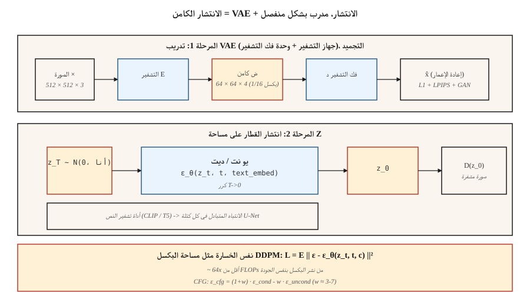

# Latent Diffusion & Stable Diffusion

> يعد نشر مساحة البكسل على صورة مقاس 512 × 512 جريمة حرب حسابية. رومباخ وآخرون. (2022) لاحظت أنك لا تحتاج إلى جميع أبعاد 786 كيلو بايت لإنشاء صورة - فأنت تحتاج إلى ما يكفي لالتقاط البنية الدلالية، ووحدة فك ترميز منفصلة للباقي. قم بتشغيل الانتشار داخل المساحة الكامنة لـ VAE. هذه الفكرة هي الانتشار المستقر.

**النوع:** بناء
** اللغات: ** بايثون
**المتطلبات الأساسية:** المرحلة 8 · 02 (VAE)، المرحلة 8 · 06 (DDPM)، المرحلة 7 · 09 (ViT)
**الوقت:** ~75 دقيقة

## The Problem

يعني انتشار مساحة البكسل عند 512² أن شبكة U-Net تعمل على موترات ذات شكل `[B, 3, 512, 512]`. كل خطوة أخذ عينات هي ~100 GFLOPS لـ 500M-param U-Net. خمسون خطوة هي 5 TFLOPS لكل صورة. تدرب على مليار صورة وستكون فاتورة الحساب سخيفة.

Most of those FLOPs go to pushing perceptually unimportant details through the net — the high-frequency texture that a lossy VAE could compress away. فكرة رومباخ: تدريب VAE مرة واحدة (*المرحلة الأولى*)، وتجميدها، وتشغيل الانتشار بالكامل في المساحة الكامنة 64×64 ذات 4 قنوات (*المرحلة الثانية*). نفس يو نت 1/16 بكسل. ~64x أقل من FLOPs للحصول على جودة قابلة للمقارنة.

هذه هي وصفة الانتشار المستقر. SD 1.x / 2.x استخدم 860M U-Net على `64×64×4` كامنة، SDXL استخدم 2.6B U-Net على `128×128×4`، SD3 استبدل U-Net بمحول الانتشار (DiT) مع مطابقة التدفق. يقوم Flux.1-dev (Black Forest Labs, 2024) بشحن 12B-param DiT-MMDiT. جميعها تعمل على نفس الركيزة ذات المرحلتين.

## The Concept



**مرحلتان، تدريب منفصل.**

1. **المرحلة 1 — VAE.** جهاز التشفير `E(x) → z`، جهاز فك التشفير `D(z) → x`. ضغط الهدف: 8 × اختزال في كل محور مكاني + ضبط القنوات بحيث يكون إجمالي الحجم الكامن ~ 1/16 من عدد البكسل. الخسارة = إعادة البناء (L1 + LPIPS الإدراك الحسي) + KL (وزن صغير لذلك `z` ليس مضطرًا جدًا إلى غاوسي، لأننا لا نحتاج إلى أخذ عينات دقيقة من `z`). غالبًا ما يتم تدريبه مع خسارة عدائية بحيث تكون الصور التي تم فك تشفيرها حادة.

2. **المرحلة 2 — الانتشار على `z`.** تعامل مع `z = E(x_real)` على أنها البيانات. تدريب U-Net (أو DiT) لتقليل الضوضاء `z_t`. عند الاستدلال: العينة `z_0` عن طريق الانتشار، ثم `x = D(z_0)`.

**تكييف النص.** مكونان إضافيان. أداة تشفير النص المجمدة (CLIP-L لـ SD 1.x، CLIP-L+OpenCLIP-G لـ SD 2/XL، T5-XXL لـ SD3 وFlux). حقن الانتباه المتقاطع: تأخذ كل كتلة U-Net `[Q = image features, K = V = text tokens]` وتمزجها. الرموز هي الطريقة الوحيدة التي يؤثر بها النص على الصورة.

**وظيفة الخسارة مطابقة للدرس 06.** نفس DDPM / مطابقة التدفق MSE على الضوضاء. ما عليك سوى تبديل مجال البيانات.

## Architecture variants

| نموذج | سنة | العمود الفقري | الشكل الكامن | تشفير النص | بارامس |
|-------|------|-----------------|--------------|-------|-------|-------|-------|-------|
| SD 1.5 | 2022 | يو نت | 64×64×4 | CLIP-L (77 رمزًا) | 860 م |
| SD2.1 | 2022 | يو نت | 64×64×4 | فتحCLIP-H | 865 م |
| SDXL | 2023 | يو نت + مصفى | 128×128×4 | CLIP-L + فتحCLIP-G | 2.6ب + 6.6ب |
| SDXL- تيربو | 2023 | مقطر | 128×128×4 | نفس | أخذ العينات من 1-4 خطوات |
| SD3 | 2024 | MMDiT (DiT متعدد الوسائط) | 128×128×16 | T5-XXL + CLIP-L + CLIP-G | 2ب/8ب |
| Flux.1-dev | 2024 | ممدت | 128×128×16 | T5-XXL + CLIP-L | 12ب |
| Flux.1-schnell | 2024 | MMDiT المقطر | 128×128×16 | T5-XXL + CLIP-L | 12ب، 1-4 خطوات |

الاتجاه: استبدال U-Net بـ DiT (محول فوق التصحيحات الكامنة)، وقياس أداة تشفير النص (T5 نبضة CLIP للالتزام الفوري)، وزيادة القنوات الكامنة (4 → 16 تعطي مساحة أكبر للتفاصيل).

## Build It

`code/main.py` يقوم بتكديس لعبة 1-D "VAE" (جهاز تشفير الهوية + وحدة فك التشفير، للتوضيح؛ VAE الحقيقية ستكون شبكة تحويل) أعلى DDPM من الدرس 06 ويضيف تكييف الفصل مع إرشادات خالية من المصنف. إنه يوضح أن نفس فقدان الانتشار يعمل سواء تم تشغيله على قيم أحادية الأبعاد أولية أو على قيم مشفرة - الرؤية الأساسية.

### Step 1: encoder/decoder

```python
def encode(x):    return x * 0.5          # toy "compression" to smaller scale
def decode(z):    return z * 2.0
```

VAE حقيقي لديه أوزان مدربة. بالنسبة لعلم أصول التدريس، تكفي هذه الخريطة الخطية لإظهار أن الانتشار يعمل على `z` دون الاهتمام بمساحة البيانات الأصلية.

### Step 2: diffusion in `z`-space

نفس DDPM الدرس 06. البيانات التي تراها الشبكة هي `z = E(x)`. بعد أخذ العينات `z_0`، قم بفك التشفير باستخدام `D(z_0)`.

### Step 3: classifier-free guidance

أثناء التدريب، قم بإسقاط تسمية الفصل الدراسي بنسبة 10% من الوقت (استبدلها برمز مميز فارغ). عند الاستدلال، قم بحساب كل من `ε_cond` و `ε_uncond`، ثم:

```python
eps_cfg = (1 + w) * eps_cond - w * eps_uncond
```

`w = 0` = لا يوجد توجيه (تنوع كامل)، `w = 3` = افتراضي، `w = 7+` = مشبع / حاد للغاية.

### Step 4: text conditioning (concept, not code)

استبدل تسمية الفئة بمخرج أداة تشفير النص المجمد. قم بتغذية النص المضمن إلى U-Net عبر الانتباه المتبادل:

```python
h = h + CrossAttention(Q=h, K=text_embed, V=text_embed)
```

هذا هو الفرق الجوهري الوحيد بين نموذج الانتشار المشروط الطبقي والانتشار المستقر.

## Pitfalls

- **VAE-عدم تطابق المقياس.** SD 1.x VAEs لها ثابت تحجيم (`scaling_factor ≈ 0.18215`) يتم تطبيقه بعد التشفير. نسيان هذا make هو قطار U-Net على العناصر الكامنة ذات التباين الخاطئ إلى حد كبير. كل نقطة تفتيش تشحن واحدة.
- **تشفير النص خطأ بصمت.** SD3 يحتاج T5-XXL مع >=128 رمزًا، والرجوع إلى CLIP-فقط هو فقدان. تحقق دائمًا من `use_t5=True` أو الحفر الدقيقة.
- **خلط المساحات الكامنة.** SDXL، SD3، Flux كلها تستخدم VAEs مختلفة. A LoRA تم تدريبه على SDXL الكامنة لن تعمل على SD3. Hugging Face الناشرون 0.30+ يرفضون تحميل نقاط تفتيش غير متطابقة.
- **CFG مرتفع جدًا.** `w > 10` ينتج صورًا مشبعة وزيتية ويبالغ في ملاءمتها للموجه على حساب التنوع. النقطة الحلوة هي `w = 3-7`.
- **تسرب المطالبات السلبية.** تصبح المطالبات السلبية الفارغة هي الرمز المميز الفارغ؛ تصبح المطالبة السلبية المملوءة هي `ε_uncond`. هذه ليست هي نفسها. بعض الخطوط pip تتخلف بصمت عن القيمة الخالية.

## Use It

مداخن الإنتاج في عام 2026:

| الهدف | الموصى بها العمود الفقري |
|--------|----------------------|
| نطاق ضيق، بيانات مقترنة، تدريب نموذج من الصفر | SDXL ضبط دقيق (LoRA / كامل) — الأسرع في الشحن |
| مجال مفتوح لتحويل النص إلى صورة، أوزان مفتوحة | Flux.1-dev (12B، Apache / غير تجاري) أو SD3.5-Large |
| أسرع الاستدلال، الأوزان المفتوحة | Flux.1-schnell (1-4 خطوات، أباتشي) أو SDXL-Lightning |
| أفضل الالتزام الفوري، استضافت | GPT-صورة / DALL-E 3 (ثابت)، منتصف الرحلة v7، إيماجين 4 |
| تحرير سير العمل | Flux.1-Kontext (ديسمبر 2024) - يقبل الصورة + النص أصلاً |
| البحث، خط الأساس | SD 1.5 — قديم ولكنه مدروس جيدًا |

## Ship It

حفظ `outputs/skill-sd-prompter.md`. تتطلب المهارة موجهًا نصيًا + نمط الهدف والمخرجات: النموذج + نقطة التفتيش، ومقياس CFG، وأخذ العينات، والموجه السلبي، والدقة، ومجموعة التحكم الاختيارية ControlNet/IP-Adapter، وقائمة مرجعية QA لكل خطوة.

## Exercises

1. **سهل.** قم بتشغيل `code/main.py` مع التوجيه `w ∈ {0, 1, 3, 7, 15}`. سجل متوسط ​​العينة حسب الفصل. في أي `w` تتباعد وسائل الفصل عن وسائل البيانات الحقيقية؟
2. **متوسط.** استبدل جهاز التشفير الخطي للعبة بزوج التشفير/فك التشفير tanh-MLP مع فقدان إعادة الإعمار. إعادة تدريب الانتشار على المواد الكامنة الجديدة. هل تتغير جودة العينة؟
3. **صعب.** قم بإعداد استدلال انتشار مستقر حقيقي باستخدام أجهزة النشر: قم بتحميل `sdxl-base`، قم بتشغيل 30 خطوة أويلر باستخدام CFG=7، ثم حدد الوقت. انتقل الآن إلى `sdxl-turbo` بأربع خطوات و CFG=0. نفس الموضوع، ولكن جودة مختلفة - صف ما الذي تغير ولماذا.

## Key Terms

| مصطلح | ماذا يقول الناس | ماذا يعني في الواقع |
|------|-|--------------------------------------|
| المرحلة الأولى | "الVAE" | زوج التشفير / فك التشفير المدربين ؛ يضغط 512² إلى 64². |
| المرحلة الثانية | "اليو نت" | نموذج الانتشار على الفضاء الكامن. |
| CFG | "مقياس التوجيه" | `(1+w)·ε_cond - w·ε_uncond`; قوة تكييف الألحان. |
| رمز فارغ | "تضمين موجه فارغ" | التضمين غير المشروط المستخدم لـ `ε_uncond`. |
| عبر الاهتمام | "كيف يدخل النص" | تهتم كل كتلة U-Net بالرموز النصية مثل K وV. |
| ديت | "محول الانتشار" | استبدال U-Net بمحول فوق البقع الكامنة؛ المقاييس أفضل. |
| ممدت | "DiT متعدد الوسائط" | بنية SD3: تدفق النص والصورة باهتمام مشترك. |
| VAE عامل التحجيم | "الرقم السحري" | يقسم الكمون على ~ 5.4 بحيث يعمل الانتشار في مساحة تباين الوحدة. |

## Production note: running Flux-12B on an 8GB consumer GPU

تكامل Flux المرجعي هو المعيار "لدي مستهلك GPU، هل يمكنني شحن هذا؟" وصفة. الحيلة هي نفس قوائم أدبيات استدلال إنتاج الوصفة ذات المقابض الثلاثة المطبقة على DiT الانتشار:

1. **تحميل متدرج.** يحتوي Flux على ثلاث شبكات لا تحتاج أبدًا إلى التعايش في VRAM: T5-XXL أداة تشفير النص (~10 GB في fp32)، CLIP-L (صغير)، 12B MMDiT، وVAE. قم بتشفير المطالبة أولاً، *احذف* أجهزة التشفير، ثم قم بتحميل DiT، وقم بإزالة الضوضاء، *احذف* DiT، وقم بتحميل VAE، وفك التشفير. المستهلك 8 جيجا GPU يناسب مرحلة واحدة فقط في كل مرة.
2. **تكميم 4 بت عبر البتات والبايتات.** `BitsAndBytesConfig(load_in_4bit=True, bnb_4bit_compute_dtype=torch.bfloat16)` على كل من المشفر T5 وDiT. يقطع الذاكرة 8×، ويكون انخفاض الجودة غير محسوس بالنسبة لتحويل النص إلى صورة وفقًا لمعايير Aritra (مرتبط في دفتر الملاحظات).
3. **CPU التفريغ.** `pipee.enable_model_cpu_offload()` وحدات التبديل التلقائي بين CPU وGPU مع تقدم كل تمريرة للأمام. يضيف زمن الوصول بنسبة 10-20% ولكن makes pipeline يعمل على الإطلاق.

حساب الذاكرة هو: `10 GB T5 / 8 = 1.25 GB` مكمَّم، `12 B params × 0.5 bytes = ~6 GB` DiT مكمَّم، بالإضافة إلى عمليات التنشيط. في مصطلحات stas00، هذه هي النهاية القصوى للاستدلال TP=1 - لا يوجد نموذج متوازي، الحد الأقصى للتكميم. بالنسبة للإنتاج، يمكنك تشغيل TP=2 أو TP=4 على H100s؛ بالنسبة لجهاز كمبيوتر محمول واحد، هذه هي الوصفة.

## Further Reading

- [Rombach et al. (2022). High-Resolution Image Synthesis with Latent Diffusion Models](https://arxiv.org/abs/2112.10752) — Stable Diffusion.
- [Podell et al. (2023). SDXL: تحسين نماذج الانتشار الكامن لتركيب الصور عالية الدقة](https://arxiv.org/abs/2307.01952) — SDXL.
- [Peebles & Xie (2023). Scalable Diffusion Models with Transformers (DiT)](https://arxiv.org/abs/2212.09748) — DiT.
- [Esser et al. (2024). تحجيم محولات التدفق المصححة لتركيب الصور عالية الدقة](https://arxiv.org/abs/2403.03206) — SD3، MMDiT.
- [Ho & Salimans (2022). Classifier-Free Diffusion Guidance]( — https.
- [Labs (2024). Flux.1 — إعلان مختبرات الغابة السوداء](https://blackforestlabs.ai/announcing-black-forest-labs/) — عائلة Flux.1.
- [Hugging Face مستندات الناشرين](https://huggingface.co/docs/diffusers/index) — التنفيذ المرجعي لكل نقطة تفتيش أعلاه.
