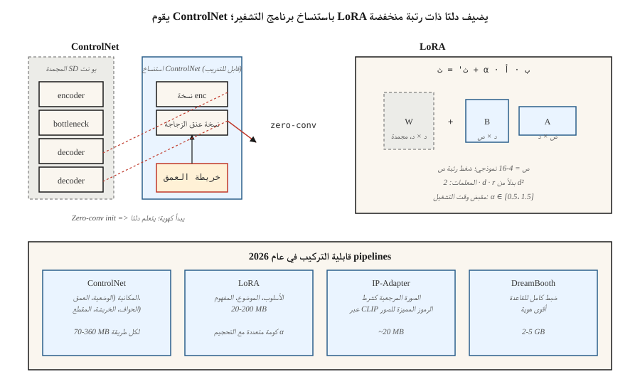

# ControlNet، LoRA والتكييف
> النص وحده هو إشارة تحكم خرقاء. يتيح لك ControlNet استنساخ نموذج نشر تم تدريبه مسبقًا وتوجيهه باستخدام خريطة عمق أو هيكل عظمي أو صورة خربشة أو حافة. يتيح لك LoRA ضبط نموذج 2B من خلال تدريب 10 ملايين معلمة. قاموا معًا بتحويل Stable Diffusion من لعبة إلى صورة pipeline لعام 2026 التي يتم شحنها في كل وكالة.
**النوع:** بناء
** اللغات: ** بايثون
** المتطلبات الأساسية: ** المرحلة 8 · 07 (الانتشار الكامن)، المرحلة 10 (ماجستير في القانون من الصفر - لتأسيس LoRA)
**الوقت:** ~75 دقيقة
## المشكلة
إن المطالبة مثل "امرأة ترتدي فستانًا أحمر وتمشي مع كلب في شارع مزدحم" لا تعطي النموذج أي معلومات حول *مكان* الكلب، أو *الوضعية* التي تقف فيها المرأة، أو *منظور* الشارع. يقوم النص بتثبيت حوالي 10% مما تحتاجه لتحديد صورة. والباقي مرئي ولا يمكن وصفه بكفاءة بالكلمات.
يعد تدريب نموذج شرطي جديد من الصفر لكل إشارة (الوضعية، والعمق، والذكاء، والتجزئة) أمرًا باهظًا. أنت تريد الاحتفاظ بالعمود الفقري 2.6B-param SDXL مجمداً، وإرفاق شبكة جانبية صغيرة تقرأ التكييف، وتجعلها تدفع الميزات الوسيطة للعمود الفقري. هذا هو ControlNet.
أنت تريد أيضًا تعليم النموذج مفاهيم جديدة (وجهك، منتجك، أسلوبك) دون إعادة تدريب النموذج بالكامل. تريد دلتا أصغر بمقدار 100 مرة. هذا هو LoRA – محولات منخفضة الرتبة يتم توصيلها بأوزان الاهتمام الحالية.
ControlNet + LoRA + text = مجموعة أدوات الممارس لعام 2026. معظم صور الإنتاج pipطبقة خطوط 2-5 LoRAs و1-3 شبكات تحكم ومحول IP أعلى SDXL / SD3 / قاعدة التدفق.
##المفهوم

### شبكة التحكم (تشانغ وآخرون، 2023)
خذ SD مُدرب مسبقًا. *استنساخ* نصف التشفير لشبكة U-Net. تجميد الأصل. تدريب المستنسخ على قبول مدخلات التكييف الإضافية (الحواف، العمق، الوضعية). قم بتوصيل النسخة المستنسخة مرة أخرى إلى نصف وحدة فك التشفير الأصلية باستخدام اتصالات تخطي * التفاف صفري * (تمت تهيئة تحويلات 1 × 1 إلى الصفر - ابدأ كـ no-op، وتعلم دلتا).
```
SD U-Net decoder:   ... ← orig_enc_features + zero_conv(controlnet_enc(condition))
```

يعني Zero-conv init أن ControlNet يبدأ كهوية - ولا ضرر حتى قبل التدريب. تدريب على 1M (موجه، حالة، صورة) ثلاث مرات مع فقدان الانتشار القياسي.
يتم شحن شبكات التحكم لكل طريقة كنماذج جانبية صغيرة (~ 360 مليونًا لـ SDXL، ~ 70 مليونًا لـ SD 1.5). يمكنك تأليفها عند الاستدلال:
```
features += weight_a * control_a(depth) + weight_b * control_b(pose)
```

### لورا (هو وآخرون، 2021)
بالنسبة لأي طبقة خطية `W ∈ R^{d×d}` في النموذج، قم بتجميد `W` وأضف دلتا ذات رتبة منخفضة:
```
W' = W + ΔW,  ΔW = B @ A,  A ∈ R^{r×d},  B ∈ R^{d×r}
```

مع `r << d`. الرتبة 4-16 هي المعيار القياسي للانتباه، والرتبة 64-128 للإيقاعات الدقيقة الثقيلة. عدد المعلمات الجديدة: `2 · d · r` بدلاً من `d²`. بالنسبة إلى SDXL الاهتمام باستخدام `d=640`، `r=16`: 20 ألف معلمة لكل محول بدلاً من 410 كيلو — وهو تخفيض بمقدار 20x. عبر النموذج بأكمله: يبلغ حجم LoRA عادةً 20-200 ميجابايت مقابل 5 جيجابايت الأساسية.
عند الاستدلال، يمكنك قياس LoRA: `W' = W + α · B @ A`. `α = 0.5-1.5` أمر طبيعي. تتكدس LoRAs المتعددة بشكل إضافي (مع التحذير المعتاد بأنها تتفاعل بطرق غير خطية).
### IP-المحول (يي وآخرون، 2023)
محول صغير يقبل *الصورة* كتكييف (بجانب النص). يستخدم برنامج ترميز الصور CLIP لإنتاج رموز الصور المميزة، ويدمجها في الانتباه المتبادل جنبًا إلى جنب مع الرموز النصية المميزة. ~20 ميجابايت لكل طراز أساسي. يتيح لك "إنشاء صورة بنمط هذا المرجع" بدون LoRA.
## مصفوفة قابلية التركيب
| أداة | ما يتحكم فيه | الحجم | متى تستخدم |
|------|------------------|------|------------|
| كنترول نت | البنية المكانية (الوضعية، العمق، الحواف) | 70-360 ميجابايت | التخطيط الدقيق والتكوين |
| لورا | الأسلوب، الموضوع، المفهوم | 20-200 ميجابايت | التخصيص والأسلوب |
| IP-المحول | النمط أو الموضوع من الصورة المرجعية | 20 ميجا | لا يوجد نص يمكن أن يصف المظهر |
| الانقلاب النصي | مفهوم واحد كرمز جديد | 10 كيلو بايت | الإرث، الذي تم استبداله في الغالب بـ LoRA |
| دريم بوث | ضبط كامل للموضوع | 2-5 جيجا | هوية قوية وحساب عالي |
| T2I-المحول | بديل أخف كنترول نت | 70 ميجا | أجهزة الحافة، ميزانية الاستدلال |
ControlNet ≈ المكانية. لورا ≈ الدلالية. استخدم كليهما.
## بنائها
`code/main.py` يحاكي الآليتين على 1-D:
1. **LoRA.** طبقة خطية مُدربة مسبقًا `W`. قم بتجميده. قم بتدريب `B @ A` منخفض الرتبة بحيث يتطابق `W + BA` مع الطبقة الخطية المستهدفة. أظهر أن `r = 1` يكفي لتعلم تصحيح من المرتبة الأولى بشكل مثالي.
2. **ControlNet-lite.** مؤشر "قاعدة مجمدة" و"شبكة جانبية" تقرأ إشارة إضافية. يتم تحديد مخرجات الشبكة الجانبية بواسطة عددية قابلة للتعلم تمت تهيئتها إلى الصفر (إصدارنا من التحويل الصفري). تدريب ومشاهدة البوابة تتصاعد.
### الخطوة 1: رياضيات LoRA
```python
def lora(W, A, B, x, alpha=1.0):
    # W is frozen; A, B are the trainable low-rank factors.
    return [W[i][j] * x[j] for i, j in ...] + alpha * (B @ (A @ x))
```

### الخطوة 2: شبكة جانبية صفرية
```python
side_out = control_net(x, condition)
gated = gate * side_out  # gate initialized to 0
h = base(x) + gated
```

في الخطوة 0، يكون الإخراج مطابقًا للقاعدة. تحديثات التدريب المبكر `gate` ببطء - لا يوجد انحراف كارثي.
## مطبات
- **زيادة حجم LoRAs.** `α = 2` أو `α = 3` هو اختراق شائع "make أقوى" ينتج عنه مخرجات مفرطة الأسلوب/معطلة. احتفظ بـ `α ≤ 1.5`.
- **تعارض الوزن في ControlNet.** عادةً ما يؤدي استخدام Pose ControlNet عند الوزن 1.0 وDepth ControlNet عند الوزن 1.0 إلى التجاوز. مجموع الأوزان ≈ 1.0 هو قيمة افتراضية آمنة.
- **LoRA على قاعدة خاطئة.** SDXL LoRAs محظورة بصمت على SD 1.5 لأن أبعاد الاهتمام غير متطابقة. سوف يحذر الناشرون في 0.30+.
- **انحراف الانعكاس النصي.** تنحرف الرموز المميزة التي تم تدريبها على نقطة تفتيش واحدة بشكل سيئ على نقطة أخرى. LoRA أكثر قابلية للحمل.
- **دمج وزن LoRA وتخزينه.** يمكنك دمج LoRA في أوزان النموذج الأساسي للاستدلال بشكل أسرع (بدون إضافة وقت التشغيل)، لكنك تفقد القدرة على قياس `α` في وقت التشغيل. احتفظ بكلا الإصدارين.
## استخدمه
| الهدف | 2026 pipeline |
|------|--------------|
| إعادة إنتاج النمط الفني للعلامة التجارية | تم تدريب LoRA على 30 صورة منسقة في المرتبة 32 |
| ضع وجهي في صورة تم إنشاؤها | DreamBooth أو LoRA + IP-Adapter-FaceID |
| وضع محدد + موجه | ControlNet-Openpose + SDXL + text |
| تكوين مدرك للعمق | ControlNet-Depth + SD3 |
| مرجع + موجه | IP-محول + نص |
| التخطيط الدقيق | ControlNet-Scribble أو ControlNet-Canny |
| استبدال الخلفية | ControlNet-Seg + Inpainting (الدرس 09) |
| أسلوب سريع من خطوة واحدة | LCM-LoRA على SDXL-Turbo |
## اشحنها
احفظ `outputs/skill-sd-toolkit-composer.md`. تأخذ المهارة مهمة (أصول الإدخال: موجه، صورة مرجعية اختيارية، وضعية اختيارية، عمق اختياري، خربشة اختيارية) وتخرج مجموعة الأدوات والأوزان وبروتوكول البذور القابل للتكرار.
## تمارين
1. **سهل.** في `code/main.py`، قم بتغيير تصنيف LoRA `r` من 1 إلى 4. في أي تصنيف يتطابق LoRA تمامًا مع دلتا الهدف من المرتبة 2؟
2. **متوسط.** قم بتدريب اثنين من LoRAs المنفصلين على تحويلين مستهدفين. قم بتحميلهم معًا وأظهر تفاعلهم الإضافي. متى يكسر التفاعل الخطية؟
3. **صعب.** استخدم الناشرات للتكديس: SDXL-base + Canny-ControlNet (الوزن 0.8) + نمط LoRA (α 0.8) + IP-Adapter (الوزن 0.6). قم بقياس المفاضلة FID مقابل الالتزام الفوري مع اختلاف أوزان المكدس.
## المصطلحات الرئيسية
| مصطلح | ماذا يقول الناس | ماذا يعني في الواقع |
|------|-|--------------------------------------|
| كنترول نت | "التحكم المكاني" | التشفير المستنسخ + تخطي التحويل الصفري؛ يقرأ صورة تكييف. |
| الإلتواء صفر | "يبدأ كهوية" | تمت تهيئة تحويل 1×1 إلى الصفر؛ يبدأ ControlNet باعتباره no-op. |
| لورا | "محول ذو رتبة منخفضة" | `W + B @ A`, `r << d`; معلمات أقل بمقدار 100 مرة من الضبط الدقيق الكامل. |
| رتبة ص | "المقبض" | ضغط لورا. 4-16 نموذجي، 64+ للتخصيص الثقيل. |
| α | "قوة لورا" | تحجيم وقت التشغيل لدلتا LoRA. |
| IP-المحول | "الصورة المرجعية" | محول صغير لتكييف الصور عبر الرموز المميزة للصورة CLIP. |
| دريم بوث | "ضبط الموضوع بالكامل" | تدريب النموذج الكامل على 30 صورة تقريبًا للموضوع. |
| الانقلاب النصي | "رمز جديد" | تعلم تضمين كلمة جديدة فقط؛ الإرث، تم استبداله في الغالب. |
## ملاحظة الإنتاج: مقايضات LoRA، وممرات ControlNet، وخدمة المستأجرين المتعددين
تخدم SaaS الحقيقية لتحويل النص إلى صورة مئات من LoRAs وعشرات شبكات التحكم عبر نفس نقطة التفتيش الأساسية. تبدو مشكلة العرض إلى حد كبير مثل LLM تعدد الإيجارات (تغطي وثائق الإنتاج حالة LLM في ظل الدفع المستمر وLoRAX / S-LoRA):
- **LoRAs للتبديل السريع، لا تقم بالدمج.** يؤدي دمج `W' = W + α·B·A` في القاعدة إلى توفير استنتاج أسرع بنسبة 3-5% تقريبًا لكل خطوة ولكنه يجمد `α` والقاعدة. أبقِ LoRAs ساخنة في VRAM كدلتا من المرتبة r؛ يكشف الناشرون عن `pipe.load_lora_weights()` + `pipe.set_adapters([...], adapter_weights=[...])` للتنشيط لكل طلب. تكلفة المبادلة هي `2 · d · r · num_layers` الأوزان — MB-مقياس، فرعي من الثانية.
- **ControlNet كمسار اهتمام ثانٍ. ** يعمل برنامج التشفير المستنسخ بالتوازي مع القاعدة. شبكتا تحكم بوزن 1.0 لكل منهما = تمريرتان إضافيتان للأمام في كل خطوة، وليس تمريرة واحدة مدمجة. ينخفض ​​الإرتفاع في حجم الدفعة بشكل تربيعي. ميزانية تبلغ ~ 1.5× تكلفة الخطوة لكل ControlNet نشط.
- **LoRAs المكممة أيضًا.** إذا قمت بقياس القاعدة (راجع الدرس 07، التدفق على 8 جيجابايت)، فإن دلتا LoRA يتم أيضًا تحديدها بشكل واضح إلى 8 بت أو 4 بت. يتيح لك التحميل بنمط QLoRA تكديس 5-10 LoRAs أعلى قاعدة تدفق 4 بت دون إتلاف الذاكرة.
خاص بالتدفق: يعمل دفتر Flux-on-8GB من Niels على تكميم القاعدة إلى 4 بت؛ لا يزال تكديس نمط LoRA (`pipe.load_lora_weights("user/style-lora")`) على تلك القاعدة الكمية عند `weight_name="pytorch_lora_weights.safetensors"` يعمل. هذه هي الوصفة التي تقدمها معظم وكالات SaaS في عام 2026.
## مزيد من القراءة
- [Zhang, Rao, Agrawala (2023). Adding Conditional Control to Text-to-Image Diffusion Models](https://arxiv.org/abs/2302.05543) — كونترول نت.
- [Hu et al. (2021). LoRA: Low-Rank Adaptation of Large Language Models](https://arxiv.org/abs/2106.09685) — LoRA (في الأصل لـ LLMs؛ منافذ للنشر).
- [Ye et al. (2023). IP-Adapter: Text Compatible Image Prompt Adapter](https://arxiv.org/abs/2308.06721) — IP- محول.
- [Mou et al. (2023). T2I-Adapter: Learning Adapters to Dig Out More Controllable Ability](https://arxiv.org/abs/2302.08453) — بديل أخف لـ ControlNet.
- [Ruiz et al. (2023). DreamBooth: Fine Tuning Text-to-Image Diffusion Models for Subject-Driven Generation](https://arxiv.org/abs/2208.12242) — دريم بوث.
- [HuggingFace Diffusers — ControlNet / LoRA / IP-Adapter docs](https://huggingface.co/docs/diffusers/training/controlnet) — المرجع pipالسطور.