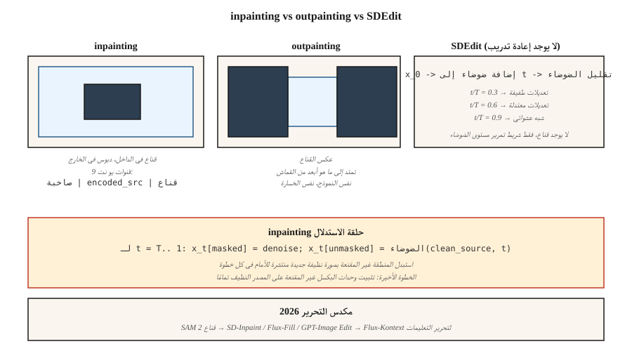

# Inpainting, Outpainting & Image Editing

> تحويل النص إلى صورة make أشياء جديدة. Inpainting إصلاح القديمة. في الإنتاج، يتم تحرير 70% من أعمال الصور القابلة للفوترة - تبديل الخلفية، وإزالة الشعار، وتوسيع اللوحة القماشية، وتجديد اليد. Inpainting هو المكان الذي يكتسب فيه الانتشار مكانته.

**النوع:** بناء
** اللغات: ** بايثون
**المتطلبات الأساسية:** المرحلة 8 · 07 (الانتشار الكامن)، المرحلة 8 · 08 (ControlNet & LoRA)
**الوقت:** ~75 دقيقة

## The Problem

يرسل العميل صورة منتج مثالية مع وجود علامة مشتتة للانتباه في الخلفية. تريد مسح العلامة وترك كل شيء آخر متطابقًا بالبكسل. لا يمكنك تشغيل تحويل النص إلى صورة من البداية — وستكون النتيجة لونًا مختلفًا، وإضاءة مختلفة، وزاوية منتج مختلفة. أنت تريد تجديد المنطقة المقنعة *فقط*، وتريد أن يحترم التجديد السياق المحيط.

هذا هو الرسم. المتغيرات:

- **الرسم الداخلي.** قم بالتجديد داخل القناع، واحتفظ بالبكسلات الخارجية.
- **طلاء خارجي.** قم بالتجديد خارج القناع (أو خارج اللوحة القماشية)، واحتفظ به في الداخل.
- **تحرير الصور.** قم بإعادة إنشاء الصورة بأكملها مع الحفاظ على الدقة الدلالية أو الهيكلية للصورة الأصلية (SDEdit, InstructPix2Pix).

كل انتشار pipeline في عام 2026 يشحن وضعًا داخليًا للرسم. Flux.1-Fill، Stable Diffusion Inpaint، SDXL-Inpaint، DALL-E 3 تحرير. إنهم يعملون على نفس المبدأ.

## The Concept



### The naive approach (and why it's wrong)

قم بتشغيل تحويل النص إلى صورة قياسي باستخدام قناع. في كل خطوة لأخذ العينات، استبدل المنطقة غير المقنعة للكامنة الصاخبة بالصورة النظيفة المنتشرة للأمام. إنه يعمل... بشكل سيء. تنزف القطع الأثرية الحدودية لأن النموذج لا يحتوي على معلومات حول ما هو موجود في المنطقة المقنعة.

### The proper inpainting model

تدريب شبكة U-Net معدلة تأخذ 9 قنوات إدخال بدلاً من 4:

```
input = concat([ noisy_latent (4ch), encoded_image (4ch), mask (1ch) ], dim=channel)
```

القنوات الإضافية هي نسخة من الصورة المصدر المشفرة VAE بالإضافة إلى قناع قناة واحدة. في وقت التدريب، تقوم بإخفاء مناطق الصورة بشكل عشوائي وتدريب النموذج لتقليل الضوضاء في المنطقة المقنعة فقط بينما يتم إعطاء المنطقة غير المقنعة كإشارة تكييف نظيفة. عند الاستدلال، يمكن للنموذج أن "يرى" ما يحيط بالمنطقة المقنعة وينتج اكتمالات متماسكة.

SD-Inpaint، SDXL-Inpaint، Flux-Fill كلها تستخدم مدخلات 9 قنوات (أو تناظرية). الناشرون `StableDiffusionInpaintPipeline`، `FluxFillPipeline`.

### SDEdit (Meng et al., 2022) — free editing

أضف تشويشًا إلى الصورة المصدر حتى مستوى متوسط ​​`t`، ثم قم بتشغيل السلسلة العكسية من `t` وصولاً إلى 0 بمطالبة جديدة. لا إعادة التدريب. إن اختيار البدء `t` يستبدل الإخلاص بالحرية الإبداعية:

- `t/T = 0.3` → مطابق تقريبًا للمصدر، مع تغييرات أسلوبية صغيرة
- `t/T = 0.6` → تعديلات معتدلة، مع الحفاظ على البنية الخشنة
- `t/T = 0.9` → تم إنشاؤها من ضوضاء قريبة، مع الحد الأدنى من الحفاظ على المصدر

### InstructPix2Pix (Brooks et al., 2023)

قم بضبط نموذج الانتشار على `(input_image, instruction, output_image)` ثلاث مرات. عند الاستدلال، قم بشرط كل من الصورة المدخلة والتعليمات النصية ("make غروب الشمس"، "أضف تنين"). مقياسان CFG: مقياس الصورة ومقياس النص.

### RePaint (Lugmayr et al., 2022)

احتفظ بنموذج الانتشار غير المشروط القياسي. في كل خطوة عكسية، قم بإعادة التشكيل — اقفز مرة أخرى إلى حالة أكثر ضجيجًا من حين لآخر وقم بالتجديد. يتجنب التحف الحدودية. يستخدم عندما لا يكون لديك نموذج مدرب في الرسم.

## Build It

`code/main.py` ينفذ مخطط رسم لعبة أحادي الأبعاد على بيانات خماسية الأبعاد. نقوم بتدريب DDPM على بيانات الخليط 5-D حيث تكون كل عينة 5 عوامات من إحدى المجموعتين. عند الاستدلال، نقوم "بإخفاء" 2 من الأبعاد الخمسة، ونحقن النسخة الأمامية الصاخبة من الأبعاد الثلاثة غير المقنعة في كل خطوة، ونعيد إنشاء الأبعاد المقنعة فقط.

### Step 1: 5-D DDPM data

```python
def sample_data(rng):
    cluster = rng.choice([0, 1])
    center = [-1.0] * 5 if cluster == 0 else [1.0] * 5
    return [c + rng.gauss(0, 0.2) for c in center], cluster
```

### Step 2: train denoiser over all 5 dims

قياسي DDPM. صافي المخرجات التنبؤ بالضوضاء 5-D للمدخلات الصاخبة 5-D.

### Step 3: at inference, mask-aware reverse

```python
def inpaint_step(x_t, mask, clean_image, alpha_bars, t, rng):
    # replace unmasked dims with a freshly noised version of the clean source
    a_bar = alpha_bars[t]
    for i in range(len(x_t)):
        if not mask[i]:
            x_t[i] = math.sqrt(a_bar) * clean_image[i] + math.sqrt(1 - a_bar) * rng.gauss(0, 1)
    # ...then run the normal reverse step on x_t
```

هذا هو النهج الساذج ويعمل على بيانات اللعبة ذات البعد الواحد. يستخدم الرسم الداخلي للصور الحقيقية مدخلات ذات 9 قنوات لأن تماسك النسيج مهم أكثر.

### Step 4: outpainting

الطلاء الخارجي هو رسم داخلي مع القناع المقلوب: قم بإخفاء القماش الجديد (غير الموجود سابقًا)، واملأ الباقي بالأصل. نفس الهدف التدريبي

## Pitfalls

- **الطبقات.** يترك النهج الساذج حدودًا مرئية لأن معلومات التدرج لا تتدفق عبر القناع. الإصلاح: قم بتوسيع القناع بمقدار 8-16 بكسل، أو استخدم نموذجًا مناسبًا للرسم.
- **تسرب القناع.** إذا كانت المنطقة غير المقنعة في صورة التكييف ذات جودة منخفضة أو مزعجة، فإنها تلوث الجيل الموجود داخل القناع. تقليل الضوضاء أو طمسها قليلاً.
- **CFG يتفاعل مع حجم القناع.** ارتفاع CFG على قناع صغير = رقعة مشبعة. قلل CFG للتعديلات الصغيرة.
- **SDEdit fidelity cliff.** الانتقال من `t/T = 0.5` إلى `t/T = 0.6` يمكن أن يفقد هوية الموضوع. الاجتياح ونقطة التفتيش.
- **عدم تطابق المطالبة.** يجب أن تصف المطالبة الصورة *الكاملة*، وليس المحتوى الجديد فقط. "قطة تجلس على كرسي" وليست "قطة".

## Use It

| مهمة | خط أنابيب |
|------|----------|
| إزالة الكائن، قناع صغير | SD-Inpaint أو Flux-Fill، موجه قياسي |
| استبدال السماء | SD-Inpaint + "السماء الزرقاء عند غروب الشمس" |
| تمديد قماش | SDXL وضع الطلاء الخارجي (ريشة 8 بكسل) أو التعبئة التدفقية باستخدام قناع الطلاء الخارجي |
| تجديد اليد / الوجه | SD-Inpaint مع إعادة وصف الموضوع بسرعة + ControlNet-Openpose |
| تغيير نمط منطقة واحدة | SDEdit عند `t/T=0.5` على المنطقة المقنعة |
| "اجعله غروبًا" | InstructPix2Pix أو Flux-Kontext |
| استبدال الخلفية | SAM قناع → SD- إنباينت |
| فائقة الدقة | Flux-Fill أو GPT-Image (مستضاف) لأصعب الحالات |

SAM (مقطع Meta أي شيء، 2023) + طلاء الانتشار هو خط إزالة الخلفية 2026 pipeline. SAM2 (2024) يعمل بالفيديو.

## Ship It

حفظ `outputs/skill-editing-pipelineeline.md`. تأخذ المهارة صورة أصلية + وصف تحرير + قناع اختياري (أو موجه SAM) والمخرجات: نهج إنشاء القناع، والنموذج الأساسي، ومقاييس CFG (صورة + نص)، ووضع SDEdit-t أو inpainting، وقائمة التحقق QA.

## Exercises

1. **سهل.** في `code/main.py`، قم بتغيير جزء الأبعاد المقنع من 0.2 إلى 0.8. في أي جزء تتساوى جودة الطلاء (المتبقية في التعتيم المقنع) مع التوليد غير المشروط؟
2. **متوسط.** تنفيذ إعادة الطلاء: عند كل خطوة عكسية عاشرة، اقفز للخلف 5 خطوات (أضف ضوضاء) وأعد تقليل الضوضاء. قم بقياس ما إذا كان يقلل من الحدود المتبقية عند حافة القناع.
3. **صعب.** استخدم ناشرات Hugging Face للمقارنة: SD 1.5 Inpaint + ControlNet-Openpose vs Flux.1-Fill في 20 مهمة لتجديد الوجه. نقاط تشكل الالتزام والحفاظ على الهوية بشكل منفصل.

## Key Terms

| مصطلح | ماذا يقول الناس | ماذا يعني في الواقع |
|------|-|--------------------------------------|
| الرسم | "املأ الحفرة" | تجديد داخل القناع. احتفظ بالبكسلات الخارجية. |
| طلاء خارجي | "توسيع اللوحة القماشية" | التجديد خارج اللوحة القماشية؛ احتفظ بالداخل. |
| 9 قنوات يو نت | "نموذج الرسم الصحيح" | U-Net مع `noisy | encoded-source | mask` كمدخل. |
| سديديت | "Img2img بمستوى الضوضاء" | الضوضاء إلى الوقت `t`، تقليل الضوضاء بمطالبة جديدة. |
| InstructPix2Pix | "تحرير النص فقط" | توزيع دقيق على (الصورة، التعليمات، الإخراج) ثلاث مرات. |
| إعادة رسم | "لا إعادة تدريب" | أعد الضوضاء بشكل دوري أثناء الرجوع لتقليل اللحامات. |
| SAM | "تقسيم أي شيء" | مولد القناع عن طريق النقرات أو المربعات؛ أزواج مع inpaint. |
| تدفق كونتيكست | "تحرير مع السياق" | متغير التدفق الذي يقبل صورة مرجعية + تعليمات للتعديلات. |

## Production note: edit pipelines are latency-sensitive

يتوقع المستخدمون الذين يقومون بتحرير صورة رحلات ذهابًا وإيابًا مدتها أقل من 5 ثوانٍ. 30 خطوة SDXL-Inpaint عند 1024² تستغرق 3-4 ثوانٍ على L4، بالإضافة إلى SAM إنشاء قناع (~200 مللي ثانية) وVAE تشفير/فك تشفير (~500 مللي ثانية مجتمعة). في إطار الإنتاج، يكون هذا مرتبطًا بـ TTFT وليس مرتبطًا بالإنتاجية - الدفعة 1، ذات التزامن المنخفض، تقلل كل مرحلة:

- **SAM-H هو البطيء.** SAM-H عند 1024² هو ~200 مللي ثانية؛ SAM-ViT-B تبلغ حوالي 40 مللي ثانية مع فقدان طفيف للجودة. SAM 2 (فيديو) يضيف الحمل الزمني؛ لا تستخدمه لتحرير الصورة الفردية.
- **تخطي التشفير عندما يكون ذلك ممكنًا.** `pipee.image_processor.preprocess(img)` يشفر إلى العناصر الكامنة. إذا كانت لديك العناصر الكامنة من الجيل السابق (نموذجية في واجهات مستخدم التحرير التكراري)، فمررها مباشرة عبر `latents=...` لتخطي ترميز VAE واحد.
- ** يعد تمدد القناع مهمًا للإنتاجية أيضًا. ** القناع الصغير يعني إهدار معظم تمريرات U-Net الأمامية (يتم تثبيت وحدات البكسل غير المقنعة على أي حال). `diffusers`' `StableDiffusionInpaintPipeline` يقوم بتشغيل U-Net بالكامل بغض النظر؛ فقط متغيرات الطلاء المناسبة المكونة من 9 قنوات تستغل الحوسبة المقنعة.
- **Flux-Kontext هو إجابة 2025.** تمريرة أمامية فردية فوق `(source_image, instruction)` — لا يوجد قناع منفصل، ولا يوجد مسح لضوضاء SDEdit. على H100 يتم شحن التعديل خلال 1.5 ثانية تقريبًا. الدرس المعماري: انهيار المراحل.

## Further Reading

- [Lugmayr et al. (2022). RePaint: Inpainting using Denoising Diffusion Probabilistic Models](https://arxiv.org/abs/2201.09865) — training-free inpainting.
- [Meng et al. (2022). SDEdit: تركيب الصور الموجهة وتحريرها باستخدام المعادلات التفاضلية العشوائية](https://arxiv.org/abs/2108.01073) — SDEdit.
- [Brooks, Holynski, Efros (2023). InstructPix2Pix](https://arxiv.org/abs/2211.09800) — text-instruction editing.
- [Kirillov et al. (2023). شريحة أي شيء](https://arxiv.org/abs/2304.02643) — SAM، مصدر القناع.
- [Ravi et al. (2024). SAM 2: Segment Anything in Images and Videos](https://arxiv.org/abs/2408.00714) — video SAM.
- [Hertz et al. (2022). تحرير الصور الفوري باستخدام التحكم في الانتباه المتقاطع](https://arxiv.org/abs/2208.01626) — التحرير على مستوى الانتباه.
- [مختبرات الغابة السوداء (2024). Flux.1-Fill and Flux.1-Kontext](https://blackforestlabs.ai/flux-1-tools/) — 2024 الأدوات.
