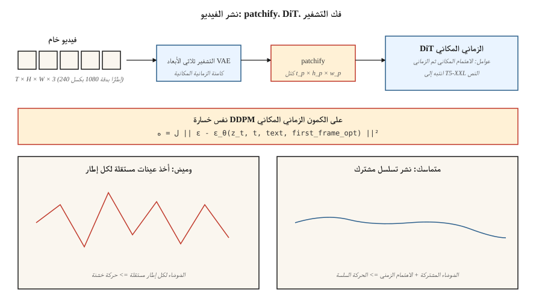

# Video Generation

> الصورة عبارة عن موتر ثنائي الأبعاد. الفيديو هو فيديو ثلاثي الأبعاد. النظرية هي نفسها. الحساب أصعب بمقدار 10-100x. أثبتت سورا عضوة OpenAI (فبراير 2024) أن ذلك ممكن. بحلول عام 2026، تقوم Veo 2 وKling 1.5 وRunway Gen-3 وPika 2.0 وWAN 2.2 بشحن فيديو إنتاجي من نص بدقة 1080 بكسل - ومكدس الأوزان المفتوحة (CogVideoX وHunyuanVideo وMochi-1 وWAN 2.2) متأخران بـ 12 شهرًا.

**النوع:** بناء
** اللغات: ** بايثون
**المتطلبات الأساسية:** المرحلة 8 · 07 (الانتشار الكامن)، المرحلة 7 · 09 (ViT)، المرحلة 8 · 06 (DDPM)
**الوقت:** ~45 دقيقة

## The Problem

فيديو مدته 10 ثوانٍ بدقة 1080 بكسل بمعدل 24 إطارًا في الثانية هو 240 إطارًا بدقة 1920 × 1080 × 3 بكسل. هذا ~1.5 GB من البيانات الأولية لكل مقطع. انتشار مساحة البكسل غير ممكن. أنت بحاجة إلى:

1. **الضغط الزماني المكاني.** VAE يقوم بتشفير مقاطع الفيديو، وليس الإطارات، في سلسلة من التصحيحات المكانية والزمانية.
2. **التماسك الزمني.** تحتاج الإطارات إلى مشاركة المحتوى والإضاءة وهوية الكائن خلال ثوانٍ. يجب على الشبكة أن تصمم نموذجًا للحركة.
3. **حساب الميزانية.** التدريب عبر الفيديو أغلى بـ 10 إلى 100 مرة من الصورة لنفس حجم النموذج.
4. **التكييف.** نص أو صورة (الإطار الأول) أو صوت أو فيديو آخر. تقبل معظم نماذج الإنتاج الأربعة.

البنية التي حلت هذه المشكلة هي **Diffusion Transformer (DiT)** المطبقة على التصحيحات الزمانية المكانية، والتي تم تدريبها على مجموعات بيانات ضخمة (موجهة، تسمية توضيحية، فيديو). نفس خسارة الانتشار مثل الدرس 06.

## The Concept



### Patchify

قم بتشفير الفيديو باستخدام 3D VAE (الضغط الزماني المكاني المكتسب). الكامن هو الشكل `[T_latent, H_latent, W_latent, C_latent]`. مقسمة إلى بقع بحجم `[t_p, h_p, w_p]`. بالنسبة للنماذج ذات نمط Sora، `t_p = 1` (تصحيحات لكل إطار) أو `t_p = 2` (كل إطارين). يتم ضغط الفيديو بدقة 1080 بكسل مدته 10 ثوانٍ إلى ما يقرب من 20000 إلى 100000 تصحيح.

### Spatiotemporal DiT

يقوم المحول بمعالجة التسلسل المسطح للبقع. تحتوي كل رقعة على تضمين موضعي ثلاثي الأبعاد (الوقت + y + x). عادة ما يتم تحليل الاهتمام إلى:

- **الانتباه المكاني** داخل بقع كل إطار.
- **الانتباه الزمني** عبر الإطارات الموجودة في نفس الموقع المكاني.
- **الانتباه الكامل ثلاثي الأبعاد** أغلى بـ 16 إلى 100 مرة؛ تستخدم فقط بدقة منخفضة أو في البحث.

### Text conditioning

الانتباه المتبادل باستخدام برنامج تشفير نص كبير (T5-XXL لـ Sora، يستخدم CogVideoX-5B T5-XXL). المطالبات الطويلة مهمة - تحتوي مجموعة تدريب Sora على GPT إعادة تعليق كثيفة بمتوسط ​​200 رمزًا لكل مقطع.

### Training

خسارة الانتشار القياسية (التنبؤ ε أو v) على الكمون الزماني المكاني. البيانات: فيديو ويب + حوالي 100 مليون مقطع منسق + تعليق نصي اصطناعي. الحوسبة: 10,000+ GPU ساعة حتى لعملية بحث صغيرة؛ مقياس سورا هو 100000+.

## The 2026 production landscape

| نموذج | التاريخ | المدة القصوى | ماكس الدقة | اوزان مفتوحة؟ | ملحوظة |
|-------|------|-------------|---------|---------------|---------|
| سورا (OpenAI) | 2024-02 | الستينيات | 1080p | لا | النموذج الأول لإظهار خصائص محاكاة العالم على نطاق واسع |
| سورا توربو | 2024-12 | العشرينات | 1080p | لا | إنتاج سورا باستدلال أسرع بمقدار 5 مرات |
| فيو 2 (جوجل) | 2024-12 | 8ث | 4K | لا | أعلى جودة + فيزياء عام 2025 |
| فيو 3 | 2025 Q3 | 15 ثانية | 4K | لا | صوت أصلي وتحكم أقوى في الكاميرا |
| كلينج 1.5 / 2.1 (كوايشو) | 2024-2025 | 10ث | 1080p | لا | أفضل حركة بشرية في 2025 Q1 |
| المدرج Gen-3 ألفا | 2024-06 | 10ث | 768ص | لا | أدوات فيديو احترافية في الأعلى |
| بيكا 2.0 | 2024-10 | 5ث | 1080p | لا | أقوى تناسق في الشخصية |
| كوجفيديو اكس (THUDM) | 2024 | 10ث | 720p | نعم (2ب، 5ب) | أول فيديو مفتوح بمقياس 5B |
| HunyuanVideo (تينسنت) | 2024-12 | 5ث | 720p | نعم (١٣ب) | مفتوح SOTA أواخر 2024 |
| موتشي-1 (جينمو) | 2024-10 | 5.4 ثانية | 480p | نعم (10ب) | الأكثر ترخيصًا |
| WAN2.2 (علي بابا) | 2025-07 | 5ث | 720p | نعم | أقوى موديل مفتوح منتصف 2025 |

تعمل الأوزان المفتوحة على سد الفجوة بشكل أسرع مما كانت عليه في مساحة الصورة: HunyuanVideo + WAN 2.2 LoRAs يعمل بالفعل على تشغيل معظم سير العمل مفتوح المصدر بحلول منتصف عام 2026.

## Build It

`code/main.py` يحاكي فكرة DiT الزمانية المكانية الأساسية: تصحيح مقطع فيديو اصطناعي صغير، وإضافة موضع تضمين لكل رقعة، وتقليل التشويش على التسلسل بأكمله من خلال الاهتمام بنمط المحول على التصحيحات. لا نومي. بيثون النقي. لقد أظهرنا أن التماسك الزمني يظهر حتى في البعد الواحد عندما تشترك بقع الإطار المجاور في أداة تقليل الضوضاء ودمج الموضع.

### Step 1: patchify a synthetic 1-D "video"

```python
def make_video(T_frames=8, rng=None):
    # a "video" is a sequence of 1-D values following a smooth trajectory
    base = rng.gauss(0, 1)
    return [base + 0.3 * t + rng.gauss(0, 0.1) for t in range(T_frames)]
```

### Step 2: position embedding per frame

```python
def pos_embed(t, dim):
    return sinusoidal(t, dim)
```

### Step 3: denoiser sees the whole sequence

بدلاً من تقليل التشويش لكل إطار بشكل مستقل، تقوم شبكتنا الصغيرة بتسلسل جميع قيم الإطارات + تضمينات موضعها وتتنبأ بالضوضاء لجميع الإطارات معًا.

### Step 4: temporal coherence test

بعد التدريب، قم بتجربة مقطع فيديو. قياس دلتا الإطار إلى الإطار. إذا تعلم النموذج البنية الزمنية، تظل الدلتا أصغر من أخذ عينات من كل إطار بشكل مستقل.

## Pitfalls

- ** أخذ العينات المستقلة لكل إطار = وميض. ** إذا قمت بتشغيل نشر الصورة على كل إطار على حدة، فإن الوميض الناتج لأن ضوضاء كل إطار مستقلة. يعمل نشر الفيديو على إصلاح هذه المشكلة عن طريق ربط الإطارات من خلال الانتباه أو الضوضاء المشتركة.
- **انتباه ثلاثي الأبعاد ساذج = OOM.** الاهتمام ثلاثي الأبعاد الكامل في 10 ثوانٍ بدقة 1080 بكسل هو مئات المليارات من العمليات. التحليل إلى مكاني + زماني
- **التسميات التوضيحية للبيانات مهمة أكثر من الحجم.** كانت الترقية الرئيسية التي قام بها Sora مقارنة بالعمل السابق هي التدريب على تسميات توضيحية أكثر تفصيلاً بـ 10x (GPT-4 مقاطع معاد تسميتها). التقرير الفني لـ OpenAI واضح في هذا الشأن.
- **تكييف الإطار الأول.** تقبل معظم نماذج الإنتاج أيضًا الصورة باعتبارها الإطار الأول. هذا هو وضع "صورة إلى فيديو"؛ يتضمن التدريب هذا البديل.
- **الانجراف الفيزيائي.** تتراكم في المقاطع الطويلة (>10 ثوانٍ) تناقضات طفيفة. يساعد إنشاء النوافذ المنزلقة + تثبيت الإطار الرئيسي.

## Use It

| حالة الاستخدام | 2026 اختيار |
|----------|----------|
| تحويل النص إلى فيديو بأعلى جودة، مستضاف | فيو 3 أو سورا |
| سينمائية بكاميرات مراقبة | Runway Gen-3 مع فرش الحركة |
| تناسق الأحرف عبر المقاطع | بيكا 2.0 أو كلينج 2.1 |
| أوزان مفتوحة، ضبط سريع | WAN 2.2 + LoRA |
| صورة إلى فيديو | WAN 2.2-I2V، كلينج 2.1 I2V، أو المدرج |
| مزامنة الشفاه من الصوت إلى الفيديو | Veo 3 (الصوت الأصلي) أو نموذج مخصص لمزامنة الشفاه |
| تحرير الفيديو | Runway Act-Two، فرشاة Kling Motion، Flux-Kontext (إطار ثابت) |

انخفضت تكلفة الثانية من الفيديو بتكافؤ الجودة بمقدار 20 ضعفًا بين عامي 2024 و2026.

## Ship It

حفظ `outputs/skill-video-brief.md`. تأخذ المهارة ملخص فيديو (المدة، ونسبة العرض إلى الارتفاع، والأسلوب، وخطة الكاميرا، واتساق الموضوع، والصوت) والمخرجات: النموذج + الاستضافة، والسقالات السريعة (لغة الكاميرا، وصف الموضوع، واصفات الحركة)، والبروتوكول الأولي + إمكانية التكرار، وقائمة مرجعية على مستوى الإطار QA.

## Exercises

1. **سهل.** في `code/main.py`، قارن دلتا إطار إلى إطار من أجل (أ) أخذ العينات المستقلة لكل إطار، (ب) أخذ عينات التسلسل المشترك. الإبلاغ عن المتوسط ​​والتباين في الدلتا.
2. **متوسط.** أضف شرط الإطار الأول: قم بتثبيت الإطار 0 على قيمة معينة وأخذ عينة من الباقي. قياس كيفية انتشار القيمة المثبتة.
3. **صعب.** استخدم ناشرات HuggingFace لتشغيل CogVideoX-2B على GPU محلي. الوقت 20 خطوة للاستدلال بدقة 720 بكسل لمقطع مدته 6 ثوانٍ. الملف الشخصي الاهتمام الزماني المكاني لتحديد عنق الزجاجة.

## Key Terms

| مصطلح | ماذا يقول الناس | ماذا يعني في الواقع |
|------|-|--------------------------------------|
| فيديو VAE | "3-D VAE" | التشفير الذي يضغط `(T, H, W, C)` → الكامن الزماني المكاني. |
| بقع | "الرموز" | كتل كامنة ثلاثية الأبعاد ذات حجم ثابت؛ الإدخال إلى DiT. |
| الاهتمام المعامل | "مكاني + زماني" | قم بتشغيل الانتباه عبر الفضاء، ثم عبر الزمن؛ تخطي الاهتمام ثلاثي الأبعاد الكامل. |
| صورة إلى فيديو (I2V) | "تحريك هذه الصورة" | يأخذ النموذج صورة + نص، ويخرج مقطع فيديو يبدأ منه. |
| تكييف الإطار الرئيسي | "إطارات المرساة" | قم بتثبيت إطارات محددة للتحكم في قوس الفيديو. |
| فرشاة الحركة | "تلميح اتجاهي" | UI الإدخال حيث يقوم المستخدم برسم متجهات الحركة على الصورة. |
| إعادة التسمية التوضيحية | "تعليقات كثيفة" | استخدام LLM لإعادة تسمية مقاطع التدريب بمطالبات مفصلة. |
| وميض | "قطعة أثرية زمنية" | عدم تناسق الإطار إلى الإطار؛ ثابت مع تقليل الضوضاء إلى جانب. |

## Production note: video latents are a memory-bandwidth problem

مقطع 1080 بكسل مدته 10 ثوانٍ بمعدل 24 إطارًا في الثانية هو 240 إطارًا × 1920 × 1080 × 3 ≈ 1.5 GB من وحدات البكسل الأولية. بعد ضغط الفيديو 4× VAE (`2 × spatial × 2 × temporal`) يكون الكمون ~100 MB لكل طلب. قم بتشغيل هذا من خلال DiT الزماني المكاني لمدة 30 خطوة في الدفعة 1 وأنت تتحرك ~3 GB/خطوة خلال HBM - عرض النطاق الترددي للذاكرة، وليس FLOPs، هو عنق الزجاجة.

ثلاثة مقابض إنتاج، كلها مباشرة من فصل الاستدلال الأدبي الإنتاجي:

- **TP عبر DiT.** تعد نماذج تحويل النص إلى فيديو بشكل روتيني معلمات ≥10B. TP=4 عبر 4 H100s هو المعيار؛ PP=2 × TP=2 لنماذج فئة 405B. ينخفض ​​زمن الوصول لكل خطوة بشكل خطي تقريبًا مع TP حتى الجدار المصغر.
- **تجميع الإطارات = تجميع مستمر.** في وقت الإنشاء، يكون الفيديو من الناحية النظرية مجموعة من الإطارات المرتبطة بالانتباه. يتم تطبيق التجميع المستمر (الجدولة أثناء الرحلة): ابدأ في عرض الإطار `t+1` أثناء إرجاع الإطار `t-1`، إذا كانت بنية النموذج تسمح بإنشاء نافذة منزلقة.
- **ذاكرة التخزين المؤقت للملء المسبق على مستوى المقطع.** بالنسبة لتحويل الصورة إلى فيديو، يكون تكييف الإطار الأول مشابهًا للتعبئة المسبقة السريعة لـ LLM: قم بحسابها مرة واحدة، وإعادة استخدامها عبر تمريرات وحدة فك التشفير المؤقتة. يعد هذا بشكل فعال KV-ذاكرة تخزين مؤقت للفيديو.

## Further Reading

- [Brooks et al. (2024). Video generation models as world simulators](https://openai.com/index/video-generation-models-as-world-simulators/) — Sora technical report.
- [Yang et al. (2024). CogVideoX: نماذج نشر النص إلى الفيديو باستخدام محول خبير](https://arxiv.org/abs/2408.06072) — CogVideoX.
- [Kong et al. (2024). HunyuanVideo: A Systematic Framework for Large Video Generative Models](https://arxiv.org/abs/2412.03603) — HunyuanVideo.
- [Genmo (2024). التقرير الفني لموتشي-1](https://www.genmo.ai/blog/mochi) — موتشي-1.
- [Alibaba (2025). WAN 2.2](https://wanvideo.io/) — open SOTA mid-2025.
- [Ho, Salimans, Gritsenko et al. (2022). نماذج نشر الفيديو](https://arxiv.org/abs/2204.03458) — ورقة نشر الفيديو الأساسية.
- [بلاتمان وآخرون. (2023). قم بمحاذاة العناصر الكامنة (فيديو LDM)](https://arxiv.org/abs/2304.08818) — سلف نشر الفيديو المستقر.
