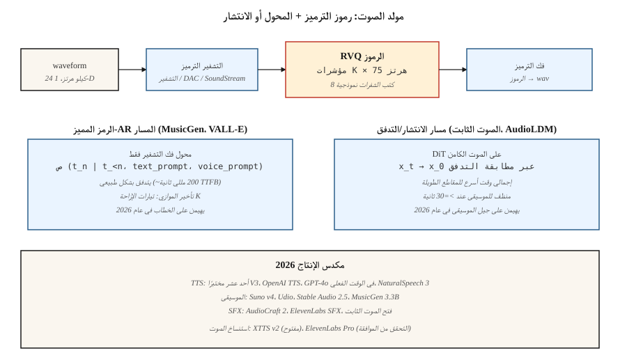

# توليد الصوت
> الصوت عبارة عن إشارة أحادية الأبعاد بتردد 16-48 كيلو هرتز. مقطع مدته خمس ثوانٍ يحتوي على 80-240 ألف عينة. لا يوجد محول يحضر لهذا التسلسل مباشرة. الحل لكل نموذج صوتي للإنتاج في عام 2026 هو نفسه: يقوم برنامج الترميز العصبي (Encodec، SoundStream، DAC) بضغط الصوت إلى رموز مميزة منفصلة عند تردد 50-75 هرتز، ويقوم المحول أو نموذج الانتشار بإنشاء الرموز المميزة.
**النوع:** بناء
** اللغات: ** بايثون
**المتطلبات الأساسية:** المرحلة 6 · 02 (ميزات الصوت)، المرحلة 6 · 04 (ASR)، المرحلة 8 · 06 (DDPM)
**الوقت:** ~45 دقيقة
## المشكلة
ثلاث مهام لتوليد الصوت:
1. **تحويل النص إلى كلام.** قم بإنتاج الكلام عند إعطاء نص. الكلام النظيف هو نطاق ضيق وله بنية صوتية قوية - يتم حله بشكل جيد عن طريق المحولات فوق الرموز. VALL-E (Microsoft)، NaturalSpeech 3، ElevenLabs، OpenAI TTS.
2. **إنشاء الموسيقى.** بإعطاء موجه (نص، لحن، تقدم الوتر، النوع)، قم بإنتاج الموسيقى. توزيع أوسع بكثير. MusicGen (Meta)، Stable Audio 2.5، Suno v4، Udio، Riffusion.
3. **المؤثرات الصوتية/تصميم الصوت.** عند المطالبة، قم بإنتاج صوت محيطي أو صوت فولي. AudioGen، AudioLDM 2، صوت ثابت مفتوح.
تعمل الثلاثة جميعًا على نفس الركيزة: برنامج ترميز الصوت العصبي + الرمز المميز-AR أو مولد الانتشار.
##المفهوم

### برامج ترميز الصوت العصبية
Encodec (Meta, 2022)، SoundStream (Google، 2021)، Descript Audio Codec (DAC، 2023). يقوم المشفر التلافيفي بضغط شكل الموجة إلى متجه لكل خطوة زمنية؛ يقوم تكميم المتجهات المتبقية (RVQ) بتحويل كل متجه إلى سلسلة من مؤشرات كتاب الشفرات K. فك التشفير يعكس ذلك. صوت 24 كيلوهرتز بسرعة 2 كيلوبت في الثانية باستخدام 8 كتب رموز RVQ بسرعة 75 هرتز = 600 رمز مميز/ثانية.
```
waveform (16000 samples/sec)
    └─ encoder conv ─┐
                     ├─ RVQ layer 1 → indices at 75 Hz
                     ├─ RVQ layer 2 → indices at 75 Hz
                     ├─ ...
                     └─ RVQ layer 8
```

### نموذجان توليديان في الأعلى
**الانحدار التلقائي للرمز المميز.** قم بتسوية الرموز المميزة RVQ في تسلسل، وتشغيل محول وحدة فك التشفير فقط. يستخدم MusicGen "التوازي المؤجل" لإصدار تدفقات كتاب الرموز K بالتوازي مع إزاحات كل دفق. VALL-E يُنشئ رموزًا مميزة للكلام من مطالبة نصية + عينة صوتية مدتها 3 ثوانٍ.
**الانتشار الكامن.** قم بتعبئة الرموز المميزة لبرنامج الترميز باعتبارها كامنة مستمرة أو قم بتصميمها باستخدام النشر الفئوي. يستخدم Stable Audio 2.5 مطابقة التدفق على الكمانات الصوتية المستمرة. يستخدم AudioLDM 2 نشر النص إلى الصوت.
الاتجاه 2024-2026: مطابقة التدفق تفوز بالموسيقى (الاستدلال الأسرع، والعينات الأنظف) بينما لا يزال الرمز المميز AR يهيمن على الكلام لأنه سببي بشكل طبيعي ويتدفق بشكل جيد.
## مشهد الإنتاج
| النظام | مهمة | العمود الفقري | الكمون |
|--------|------|----------|---------|
| أحد عشر مختبرًا V3 | __المصطلح_2__ | الرمز المميز-AR + المشفر الصوتي العصبي | ~300 مللي ثانية الرمز الأول |
| OpenAI GPT-4o الصوت | خطاب مزدوج كامل | الوسائط المتعددة الشاملة AR | ~200 مللي ثانية |
| كلام طبيعي 3 | __المصطلح_6__ | مطابقة التدفق الكامن | غير متدفق |
| صوت ثابت 2.5 | موسيقى / SFX | DiT + مطابقة التدفق على الصوت الكامن | ~10 ثوانٍ لمقطع مدته دقيقة واحدة |
| سونو v4 | الأغاني كاملة | لم يكشف عنه. الرمز المميز-AR مشتبه به | ~ 30 ثانية لكل أغنية |
| اوديو v1.5 | الأغاني كاملة | غير معلن | ~ 30 ثانية لكل أغنية |
| ميوزك جين 3.3 ب | موسيقى | الرمز المميز-AR على التشفير 32 كيلو هرتز | في الوقت الحقيقي |
| أوديو كرافت 2 | موسيقى + SFX | مطابقة التدفق | ~5s لمقطع 5s |
| تكاثر v2 | موسيقى | الانتشار الطيفي | ~10ث |
## بنائها
`code/main.py` يحاكي الفكرة الأساسية: تدريب محول صغير للرمز المميز التالي على تسلسلات "رمز صوتي" اصطناعي تم إنشاؤها من "نمطين" متميزين (رموز منخفضة وعالية بالتناوب للنمط A، ومنحدر رتيب للنمط B). الحالة على النمط والعينة.
### الخطوة 1: الرموز الصوتية الاصطناعية
```python
def make_tokens(style, length, vocab_size, rng):
    if style == 0:  # "speech-like": alternating
        return [i % vocab_size for i in range(length)]
    # "music-like": ramp
    return [(i * 3) % vocab_size for i in range(length)]
```

### الخطوة 2: تدريب متنبئ رمزي صغير
متنبئ بأسلوب بيجرام مشروط بالأسلوب. النقطة المهمة هي النمط: رموز برنامج الترميز ← التدريب عبر الإنتروبيا ← أخذ عينات الانحدار الذاتي.
### الخطوة 3: العينة بشكل مشروط
بالنظر إلى رمز النمط ورمز البداية، قم بتجربة الرمز المميز التالي من التوزيع المتوقع. استمر في الحصول على 20-40 رمزًا.
## مطبات
- **جودة برنامج الترميز تحد من جودة الإخراج.** إذا لم يتمكن برنامج الترميز من تمثيل الصوت بشكل صحيح، فلن يساعد أي قدر من جودة المولد. DAC هو الأفضل حاليًا.
- **RVQ تراكم الأخطاء.** تمثل كل طبقة RVQ بقايا الطبقة السابقة. تنتشر الأخطاء في الطبقة الأولى. يساعد أخذ العينات بدرجة حرارة 0 على الطبقات العليا.
- **التركيبة الموسيقية.** 30 ثانية من الرموز المميزة هي أكثر من 20 ألف رمز عند 75 هرتز. من الصعب على المحولات. يستخدم MusicGen نافذة منزلقة + متابعة سريعة؛ يستخدم الصوت الثابت مقاطع أقصر + الإبهات المتداخل.
- **القطع الأثرية عند الحدود.** الإبهات المتداخل بين المقاطع التي تم إنشاؤها يحتاج إلى إضافة تداخل دقيقة.
- **الرغبة في الحصول على بيانات نظيفة.** تحتاج مولدات الموسيقى إلى عشرات الآلاف من ساعات الموسيقى المرخصة. وقد أظهرت دعوى Suno / Udio RIAA (2024) هذا الأمر إلى السطح.
- **أخلاقيات استنساخ الصوت.** تكفي عينة مدتها 3 ثوانٍ بالإضافة إلى رسالة نصية لـ VALL-E / XTTS / ElevenLabs لاستنساخ صوت. يحتاج كل نموذج إنتاج إلى اكتشاف إساءة الاستخدام وقوائم إلغاء الاشتراك.
## استخدمه
| مهمة | مكدس 2026 |
|------|-----------|
| تجاري TTS | ElevenLabs، OpenAI TTS، أو Azure Neural |
| استنساخ الصوت (الموافقة مؤكدة) | XTTS v2 (مفتوح) أو ElevenLabs Pro |
| موسيقى خلفية، سريعة | صوت ثابت 2.5 API أو Suno أو Udio |
| الموسيقى مع الكلمات | سونو v4 أو Udio v1.5 |
| مؤثرات صوتية / فولي | AudioCraft 2، أو ElevenLabs SFX، أو الصوت الثابت مفتوح |
| وكيل الصوت في الوقت الحقيقي | GPT-4o الوقت الحقيقي أو الجوزاء لايف |
| أبحاث موسيقى الأوزان المفتوحة | MusicGen 3.3B، صوت ثابت مفتوح 1.0، AudioLDM 2 |
| دبلجة / ترجمة | HeyGen، ElevenLabs دبلجة |
## اشحنها
احفظ `outputs/skill-audio-brief.md`. تتطلب المهارة ملخصًا صوتيًا (المهمة، والمدة، والأسلوب، والصوت، والترخيص) والمخرجات: النموذج + الاستضافة، التنسيق الفوري (علامات النوع، واصفات النمط، العلامات الهيكلية)، برنامج الترميز + المولد + سلسلة المشفر الصوتي، البروتوكول الأولي، وخطة التقييم (MOS / CLAP النتيجة / CER لـ TTS / المستخدم A/B).
## تمارين
1. **سهل.** قم بتشغيل `code/main.py` وضبط النمط بشكل صريح. تحقق من أن التسلسلات التي تم إنشاؤها تتوافق مع نمط النمط.
2. **متوسط.** إضافة فك تشفير متوازي مؤجل: محاكاة تدفقين من الرموز المميزة التي يجب أن تظل معادلة بخطوة واحدة. تدريب متنبئ مشترك.
3. **صعب.** استخدم محولات HuggingFace لتشغيل MusicGen-small محليًا. أنشئ مقطعًا مدته 10 ثوانٍ بثلاث مطالبات مختلفة؛ A/B للالتزام بالأسلوب.
## المصطلحات الرئيسية
| مصطلح | ماذا يقول الناس | ماذا يعني في الواقع |
|------|-|--------------------------------------|
| الترميز | "الضغط العصبي" | التشفير / فك التشفير للصوت. الإخراج النموذجي هو 50-75 هرتز. |
| RVQ | "المتبقي VQ" | سلسلة من الكميات K؛ كل نموذج هو ما تبقى من السابق. |
| الرمز المميز | "رمز ترميز واحد" | فهرس منفصل في كتاب الرموز؛ 1024 أو 2048 نموذجي. |
| تأخر الموازي | "دفاتر رموز الأوفست" | قم بإصدار تدفقات رمز K مع إزاحات متداخلة لتقليل طول التسلسل. |
| مطابقة التدفق | "فوز 2024 للصوتيات" | بديل المسار الأكثر استقامة للانتشار؛ أخذ العينات بشكل أسرع. |
| موجه صوتي | "عينة 3 ثواني" | تضمين مكبر الصوت أو بادئة الرمز المميز التي توجه الصوت المستنسخ. |
| ميل الطيفي | "البصري" | المخطط الطيفي الإدراكي ذو الحجم اللوغاريتمي؛ يستخدم من قبل العديد من أنظمة TTS. |
| مشفر صوتي | "ميل للموجة" | مكون عصبي يحول الطيف الطيفي إلى صوت. |
## ملاحظة حول الإنتاج: الصوت يمثل مشكلة في البث
الصوت هو طريقة الإخراج الوحيدة التي يتوقع المستخدمون وصولها *عند إنشائها*، وليس مرة واحدة. من حيث الإنتاج، يعني هذا أن TPOT مهم (الوقت لكل رمز إخراج) لأن سرعة استماع المستخدم هي الإنتاجية المستهدفة - وليس سرعة القراءة. بالنسبة إلى ترميز الصوت بمعدل 16 كيلو هرتز بمعدل ~75 رمزًا مميزًا في الثانية (Encodec)، يجب أن يقوم الخادم بإنشاء ≥75 رمزًا مميزًا في الثانية لكل مستخدم للحفاظ على سلاسة التشغيل.
نتيجتان معماريتان:
- **لا يمكن للنماذج الصوتية المطابقة للتدفق أن تبث بشكل تافه.** يقدم الإصداران الثابتان من الصوت 2.5 وAudioCraft 2 طول مقطع ثابت في تمريرة واحدة. للبث، يمكنك تقسيم المقطع وتداخل الحدود - فكر في نشر النافذة المنزلقة - مما يضيف 100 إلى 300 مللي ثانية من زمن الاستجابة مقارنةً بنموذج برنامج الترميز AR.
إذا كان المنتج عبارة عن "دردشة صوتية مباشرة" أو "استمرار الموسيقى في الوقت الفعلي"، فاختر مسار برنامج الترميز AR. إذا كان "عرض مقطع مدته 30 ثانية عند الإرسال"، فإن مطابقة التدفق تفوز بالجودة وزمن الوصول الإجمالي.
## مزيد من القراءة
- [Défossez et al. (2022). Encodec: High Fidelity Neural Audio Compression](https://arxiv.org/abs/2210.13438) — معيار الترميز.
- [Zeghidour et al. (2021). SoundStream](https://arxiv.org/abs/2107.03312) — أول برنامج ترميز صوتي عصبي مستخدم على نطاق واسع.
- [Kumar et al. (2023). High-Fidelity Audio Compression with Improved RVQGAN (DAC)](https://arxiv.org/abs/2306.06546) — DAC.
- [Wang et al. (2023). Neural Codec Language Models are Zero-Shot Text to Speech Synthesizers (VALL-E)](https://arxiv.org/abs/2301.02111) — VALL-هـ.
- [Copet et al. (2023). Simple and Controllable Music Generation (MusicGen)](https://arxiv.org/abs/2306.05284) — ميوزيك جين.
- [Liu et al. (2023). AudioLDM 2: Learning Holistic Audio Generation with Self-supervised Pretraining](https://arxiv.org/abs/2308.05734) — الصوت LDM 2.
- [Stability AI (2024). Stable Audio 2.5](https://stability.ai/news/introducing-stable-audio-2-5) — تحويل النص إلى موسيقى 2025 مع مطابقة التدفق.