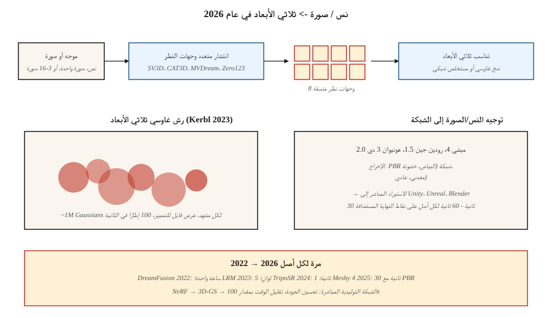

# 3D Generation

> ثلاثي الأبعاد هو الطريقة التي يكون فيها التأثير ثنائي الأبعاد إلى ثلاثي الأبعاد أقوى. كان الإنجاز في عام 2023 هو تقنية 3D Gaussian Splatting. طبقات الدفع التوليدية 2024-2026 نشر متعدد المشاهد + إعادة بناء ثلاثية الأبعاد في الأعلى لإنتاج كائنات ومشاهد من موجه واحد أو صورة واحدة.

**النوع:** تعلم
** اللغات: ** بايثون
**المتطلبات الأساسية:** المرحلة 4 (الرؤية)، المرحلة 8 · 07 (الانتشار الكامن)
**الوقت:** ~45 دقيقة

## The Problem

المحتوى ثلاثي الأبعاد مؤلم:

- **التمثيل.** الشبكات، السحب النقطية، شبكات فوكسل، حقول المسافة الموقعة (SDFs)، حقول الإشعاع العصبي (NeRFs)، غاوسيات ثلاثية الأبعاد. ولكل منها مقايضات.
- **ندرة البيانات.** يحتوي برنامج ImageNet على 14 مليون صورة. تحتوي أكبر مجموعة بيانات ثلاثية الأبعاد نظيفة (Objaverse-XL، 2023) على ما يقرب من 10 ملايين كائن، ومعظمها منخفض الجودة.
- **الذاكرة.** شبكة فوكسل 512³ هي 128 مليون فوكسل؛ مشهد مفيد يحتاج NeRF إلى 1 مليون عينة/شعاع. التوليد أصعب من إعادة الإعمار.
- **الإشراف.** بالنسبة للصورة ثنائية الأبعاد، لديك وحدات البكسل. بالنسبة للعرض ثلاثي الأبعاد، عادةً ما يكون لديك عدد قليل من العروض ثنائية الأبعاد ويجب عليك الارتقاء بها إلى العرض ثلاثي الأبعاد.

مكدس 2026 يفصل بين المشكلتين. أولاً، قم بإنشاء *صور ثنائية الأبعاد متعددة العرض* باستخدام نموذج الانتشار. ثانيًا، قم بتناسب *التمثيل ثلاثي الأبعاد* (عادةً ما يكون تناثرًا غاوسيًا) مع تلك الصور.

## The Concept



### Representation: 3D Gaussian Splatting (Kerbl et al., 2023)

قم بتمثيل مشهد على شكل سحابة مكونة من حوالي 1 مليون Gaussians ثلاثي الأبعاد. يحتوي كل منها على 59 معلمة: الموضع (3)، التغاير (6، أو الكواترنيون 4 + المقياس 3)، العتامة (1)، اللون التوافقي الكروي (48 عند الدرجة 3، 3 عند الدرجة 0).

التقديم = الإسقاط + تركيب ألفا. سريع (~ 100 إطارًا في الثانية بدقة 1080 بكسل على 4090). قابلة للتمييز. يتناسب مع النسب المتدرج مقابل صور الحقيقة الأرضية. مشهد يناسب المستهلك من 5 إلى 30 دقيقة GPU.

ابتكاران في الفترة 2023-2024 على رأس القائمة:
- **بقع غوسية توليدية.** تتنبأ نماذج مثل LGM، LRM، InstantMesh بسحابة غاوسية مباشرة من صورة واحدة أو عدة صور.
- **4D Gaussian Splatting.** Gaussian مع إزاحات لكل إطار للمشاهد الديناميكية.

### Multi-view diffusion

قم بضبط نموذج نشر الصور المُدرب مسبقًا لإنشاء طرق عرض متسقة متعددة لنفس الكائن من موجه نصي أو صورة واحدة. Zero123 (ليو وآخرون، 2023)، MVDream (شي وآخرون، 2023)، SV3D (الاستقرار، 2024)، CAT3D (جوجل، 2024). عادةً ما يتم إخراج 4-16 عرضًا حول الكائن، ويتم رفعها إلى 3D عبر Gaussian splatting أو NeRF.

### Text-to-3D pipelines

| نموذج | الإدخال | الإخراج | الوقت |
|-------|-------|--------|------|
| دريم فيوجن (2022) | نص | NeRF عبر SDS | ~1 ساعة لكل أصل |
| ماجيك 3 دي | نص | شبكة + نسيج | ~40 دقيقة |
| الشكل-E (OpenAI، 2023) | نص | ضمني 3D | ~1 دقيقة |
| SJC / الحالم الغزير | نص | نيرف / شبكة | ~30 دقيقة |
| LRM (ميتا، 2023) | صورة | ثلاثية | ~5 ث |
| شبكة فورية (2024) | صورة | شبكة | ~10 ث |
| SV3D (الاستقرار، 2024) | صورة | مشاهدات رواية | ~2 دقيقة |
| CAT3D (جوجل، 2024) | 1-64 صورة | 3D نيرف | ~1 دقيقة |
| تريبوسر (2024) | صورة | شبكة | ~1 ثانية |
| مشي 4 (2025) | نص + صورة | PBR mesh | ~30 ثانية |
| رودين جين-1.5 (2025) | نص + صورة | PBR مش | ~60 ثانية |
| تينسنت Hunyuan3D 2.0 (2025) | صورة | شبكة | ~30 ثانية |

اتجاه 2025-2026: نماذج تحويل النص إلى الشبكة مباشرة بمواد PBR مناسبة لمحركات الألعاب. لا تزال الخطوة المتوسطة لنشر العرض المتعدد هي الوصفة الأفضل أداءً للكائنات العامة.

### NeRF (for context)

مجال الإشعاع العصبي (ميلدنهال وآخرون، 2020). حرف MLP صغير يأخذ `(x, y, z, view direction)` ويخرج `(color, density)`. تقديم من خلال التكامل على طول الأشعة. يتفوق على توليف العرض الجديد القائم على الشبكة من حيث الجودة ولكنه أبطأ بمقدار 100-1000 مرة في العرض. تم استبداله بالرش الغاوسي في معظم الاستخدامات في الوقت الفعلي ولكنه لا يزال مهيمنًا في البحث.

## Build It

`code/main.py` يطبق لعبة ثنائية الأبعاد "Gaussian splatting": تمثل صورة مستهدفة اصطناعية (تدرج سلس) كمجموع من رذاذ Gaussian ثنائي الأبعاد. قم بتحسين المواضع والألوان والتغايرات عن طريق النسب المتدرج لمطابقة الهدف. ترى العمليتين الأساسيتين: التقديم الأمامي (splat + alpha-composite) والملاءمة عن طريق نزول التدرج.

### Step 1: 2D Gaussian splat

```python
def gaussian_at(x, y, gaussian):
    px, py = gaussian["pos"]
    sigma = gaussian["sigma"]
    d2 = (x - px) ** 2 + (y - py) ** 2
    return math.exp(-d2 / (2 * sigma * sigma))
```

### Step 2: render by summing splats

```python
def render(image_size, gaussians):
    img = [[0.0] * image_size for _ in range(image_size)]
    for g in gaussians:
        for y in range(image_size):
            for x in range(image_size):
                img[y][x] += g["color"] * gaussian_at(x, y, g)
    return img
```

يقوم الرش الغاوسي الحقيقي ثلاثي الأبعاد بفرز الغاوسي حسب العمق ومركبات ألفا بالترتيب. لعبتنا ثنائية الأبعاد مجرد مبالغ.

### Step 3: fit by gradient descent

```python
for step in range(steps):
    pred = render(size, gaussians)
    loss = mse(pred, target)
    gradients = compute_grads(pred, target, gaussians)
    update(gaussians, gradients, lr)
```

## Pitfalls

- **عرض غير متناسق.** إذا قمت بإنشاء 4 طرق عرض بشكل مستقل وكانت تختلف حول بنية الكائن، فإن الملاءمة ثلاثية الأبعاد تكون غير واضحة. الإصلاح: نشر طرق العرض المتعددة مع الاهتمام المشترك.
- **هلوسة الجانب الخلفي.** يجب على الصورة الفردية → ثلاثية الأبعاد أن تخترع الجانب غير المرئي. الجودة تختلف بشكل كبير.
- **انفجار طلقات غاوسية.** التدريب غير المقيد ينمو إلى 10 ملايين طلقة وضربات زائدة. تعتبر أساليب التكثيف + التقليم (من الورق الأصلي ثلاثي الأبعاد GS) ضرورية.
- **مشكلات الهيكل.** غالبًا ما تحتوي الشبكات الناتجة عن الحقول الضمنية (SDF) على ثقوب أو تقاطعات ذاتية. قم بتشغيل remesher (على سبيل المثال، voxel remesh للخلاط) قبل الشحن.
- **ترخيص بيانات التدريب.** لدى Objaverse تراخيص مختلطة؛ يختلف الاستخدام التجاري حسب الطراز.

## Use It

| مهمة | 2026 اختيار |
|------|-----------|
| إعادة بناء المشهد من الصور | الرش الغاوسي (3DGS، Gsplat، Scaniverse) |
| كائن تحويل النص إلى ثلاثي الأبعاد للألعاب | Meshy 4 أو Rodin Gen-1.5 (إخراج PBR) |
| صورة إلى 3D | Hunyuan3D 2.0، TripoSR، InstantMesh |
| رواية عرض التوليف من عدد قليل من الصور | CAT3D، SV3D |
| إعادة بناء المشهد الديناميكي | 4D رش غاوسي |
| الصورة الرمزية / الإنسان الملبس | الصورة الرمزية الغوسية، HUGS |
| بحث / SOTA | مهما انخفض الأسبوع الماضي |

لشحن إنتاج ثلاثي الأبعاد في لعبة أو تجارة إلكترونية pipeline: إخراج Meshy 4 أو Rodin Gen-1.5 PBR شبكات تنتقل مباشرة إلى Unity / Unreal.

## Ship It

حفظ `outputs/skill-3d-pipelineeline.md`. تأخذ المهارة ملخصًا ثلاثي الأبعاد (الإدخال: نص / صورة واحدة / عدد قليل من الصور؛ الإخراج: شبكة / سبلات / NeRF؛ الاستخدام: تقديم / لعبة / VR) والمخرجات: pipeline (انتشار متعدد المشاهدة + ملاءمة، أو نموذج شبكي مباشر)، النموذج الأساسي، ميزانية التكرار، الطوبولوجيا بعد المعالجة، قنوات المواد المطلوبة.

## Exercises

1. **سهل.** قم بتشغيل `code/main.py` باستخدام 4، 16، 64 غاوسي. تقرير نهائي MSE مقابل الهدف.
2. **متوسط.** يمتد إلى ألوان Gaussians (RGB). تأكد من تطابق إعادة البناء مع نمط اللون المستهدف.
3. **صعب.** باستخدام gsplat أو Nerfstudio، أعد بناء كائن حقيقي من 50 صورة ملتقطة. قم بالإبلاغ عن وقت الملاءمة والنهائي SSIM على المشاهدات المعلقة.

## Key Terms

| مصطلح | ماذا يقول الناس | ماذا يعني في الواقع |
|------|-|--------------------------------------|
| رش غاوسي ثلاثي الأبعاد | "3DGS" | المشهد كسحابة من Gaussians ثلاثية الأبعاد؛ تقديم مركب ألفا قابل للتمييز. |
| نيرف | "مجال الإشعاع العصبي" | MLP يُخرج اللون + الكثافة عند نقطة ثلاثية الأبعاد؛ تقديم عن طريق التكامل راي. |
| طائرة ثلاثية | "ثلاث طائرات ثنائية الأبعاد" | عامل ثلاثي الأبعاد إلى ثلاث شبكات ميزات محاذاة للمحور ثنائي الأبعاد؛ أرخص من الحجمي. |
| SDS | "أخذ عينات التقطير" | تدريب نموذج ثلاثي الأبعاد باستخدام نتيجة الانتشار ثنائي الأبعاد كتدرج زائف. |
| نشر متعدد وجهات النظر | "عدة مشاهدات في وقت واحد" | نموذج الانتشار الذي يُخرج مجموعة من مشاهدات الكاميرا المتسقة. |
| PBR | "العرض المادي" | مادة ذات بياض وخشونة ومعدنية وقنوات عادية. |
| التكثيف | "تنمو البقع" | تدريب 3DGS الإرشادي: انقسام / استنساخ في المناطق عالية التدرج. |

## Production note: 3D has no shared substrate yet

على عكس الصورة (الانتشار الكامن + DiT) والفيديو (DiT الزماني المكاني)، ليس للتقنية ثلاثية الأبعاد وقت تشغيل مهيمن واحد في عام 2026. تتفرع شجرة قرارات الإنتاج من التمثيل:

- **NeRF / triplane.** الاستدلال هو مسيرة الشعاع + MLP للأمام لكل عينة. يتطلب عرض 512² الملايين من MLP للأمام. دفعة عينات الأشعة بقوة؛ SDPA/xformers ينطبق.
- **نشر متعدد المشاهدات + إعادة بناء LRM.** خط على مرحلتين pipe. المرحلة 1 (DiT متعددة المشاهدة) هي خادم نشر تمامًا مثل الدرس 07. المرحلة 2 (LRM محول) عبارة عن تمريرة أمامية من طلقة واحدة فوق المشاهدات. ملف تعريف زمن الوصول الإجمالي هو "الانتشار + لقطة واحدة" - اختر العناصر الأولية للخدمة لكل مرحلة وفقًا لذلك.
- **SDS / DreamFusion.** تحسين لكل أصل، وليس الاستدلال. بناء الوظائف، وليس معالجات الطلب.

بالنسبة لمعظم منتجات 2026، الإجابة الصحيحة هي "تشغيل نموذج نشر متعدد العروض عند الطلب، وإعادة البناء إلى 3DGS بشكل غير متزامن، وخدمة 3DGS للعرض في الوقت الفعلي". يؤدي هذا إلى تقسيم عبء العمل بشكل نظيف بين خادم الاستدلال GPU (سريع) ومُحسِّن غير متصل بالإنترنت (بطيء).

## Further Reading

- [Mildenhall et al. (2020). NeRF: Representing Scenes as Neural Radiance Fields](https://arxiv.org/abs/2003.08934) — NeRF.
- [Kerbl et al. (2023). رش غاوسي ثلاثي الأبعاد لعرض مجال الإشعاع في الوقت الفعلي](https://arxiv.org/abs/2308.04079) — 3DGS.
- [Poole et al. (2022). DreamFusion: Text-to-3D using 2D Diffusion]( — https.
- [Liu et al. (2023). صفر 1 إلى 3: لقطة واحدة من صورة واحدة إلى كائن ثلاثي الأبعاد](https://arxiv.org/abs/2303.11328) — Zero123.
- [Shi et al. (2023). MVDream](https://arxiv.org/abs/2308.16512) — multi-view diffusion.
- [Hong et al. (2023). LRM: نموذج إعادة بناء كبير لصورة فردية إلى ثلاثية الأبعاد](https://arxiv.org/abs/2311.04400) — LRM.
- [Gao et al. (2024). CAT3D: Create Anything in 3D with Multi-View Diffusion Models]( — https.
- [Stability AI (2024). فيديو ثابت ثلاثي الأبعاد (SV3D)](https://stability.ai/research/sv3d) — SV3D.
