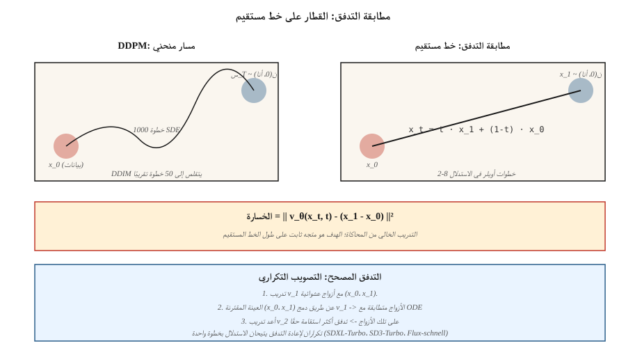

# مطابقة التدفق والتدفقات المصححة
> تأخذ نماذج الانتشار من 20 إلى 50 خطوة لأخذ العينات لأنها تسير في مسار منحني من الضوضاء إلى البيانات. مطابقة التدفق (ليبمان وآخرون، 2023) والتدفق المصحح (ليو وآخرون، 2022) تم تدريبهم على مسارات مستقيمة. المسارات الأكثر استقامة تعني خطوات أقل مما يعني استنتاجًا أسرع. تم تحويل كل من Stable Diffusion 3 وFlux.1 وAudioCraft 2 إلى مطابقة التدفق في عام 2024.
**النوع:** بناء
** اللغات: ** بايثون
**المتطلبات الأساسية:** المرحلة 8 · 06 (DDPM)، المرحلة 1 · حساب التفاضل والتكامل
**الوقت:** ~45 دقيقة
## المشكلة
العملية العكسية لـ DDPM عبارة عن مسيرة عشوائية مكونة من 1000 خطوة من `N(0, I)` إلى توزيع البيانات. DDIM قام بتقسيمها إلى 20-50 خطوة حتمية. تريد عددًا أقل من الخطوات — ويفضل أن تكون خطوة واحدة. المانع هو أن ODE حل العملية العكسية صعب؛ المسار منحني.
إذا تمكنت من تدريب النموذج بحيث يكون المسار من الضوضاء إلى البيانات *خطًا مستقيمًا*، فستنجح خطوة أويلر واحدة من `t=1` إلى `t=0`. تعمل مطابقة التدفق على إنشاء هذا مباشرة: تحديد استيفاء خط مستقيم من `x_1 ∼ N(0, I)` إلى `x_0 ∼ data`، وتدريب حقل متجه `v_θ(x, t)` لمطابقة مشتقه الزمني، والتكامل عند الاستدلال.
يذهب التدفق المصحح (Liu 2022) إلى أبعد من ذلك: قم بتسوية المسارات بشكل متكرر باستخدام إجراء إعادة التدفق الذي ينتج ODE أقرب إلى الخطي بشكل تدريجي. بعد تكرارين لإعادة التدفق، يتطابق جهاز أخذ العينات المكون من خطوتين مع جودة DDPM المكونة من 50 خطوة.
##المفهوم

### التدفق في خط مستقيم
يُعرِّف:
```
x_t = t · x_1 + (1 - t) · x_0,   t ∈ [0, 1]
```

حيث `x_0 ~ data` و`x_1 ~ N(0, I)`. المشتقة الزمنية على طول هذا الخط المستقيم ثابتة:
```
dx_t / dt = x_1 - x_0
```

حدد حقل المتجه العصبي `v_θ(x_t, t)` وقم بتدريبه ليطابق هذا المشتق:
```
L = E_{x_0, x_1, t} || v_θ(x_t, t) - (x_1 - x_0) ||²
```

هذه هي خسارة **مطابقة التدفق المشروط** (ليبمان 2023). التدريب خالٍ من المحاكاة: لن تقوم أبدًا بإلغاء تسجيل ODE. ما عليك سوى أخذ عينة من `(x_0, x_1, t)` والتراجع.
### أخذ العينات
عند الاستدلال، قم بدمج حقل المتجه المكتسب *للخلف* في الوقت المناسب:
```
x_{t-Δt} = x_t - Δt · v_θ(x_t, t)
```

ابدأ عند `x_1 ~ N(0, I)`، ثم انتقل أويلر إلى `t=0`.
### التدفق المصحح (ليو 2022)
يعمل تدفق الخط المستقيم ولكن المسارات التي تم تعلمها *ليست مستقيمة في الواقع* — فهي منحنية لأن العديد من `x_0`s يمكنها التعيين إلى نفس `x_1`. خطوة إنحسر التدفق المُصحح:
1. نموذج تدفق القطار v_1 مع الاقترانات العشوائية.
2. عينة من أزواج N `(x_1, x_0)` من خلال دمج v_1 من `x_1` إلى موقعها `x_0`.
3. تدريب v_2 على تلك الأمثلة المقترنة. نظرًا لأن الأزواج الآن "متطابقون مع ODE"، فإن الخط المستقيم بينهما أصبح مسطحًا حقًا.
4. كرر.
في الممارسة العملية، تحصل تكراران لإعادة التدفق على خط شبه خطي، مما يتيح الاستدلال من 2 إلى 4 خطوات. SDXL-Turbo، SD3-Turbo، LCM كلها نماذج مطابقة للتدفق المقطر.
### لماذا فاز هذا بالصور في عام 2024
ثلاثة أسباب:
1. **تدريب خالٍ من المحاكاة** — لا يمكن فتح ODE أثناء التدريب، وهو أمر بسيط في التنفيذ.
2. **هندسة أفضل للخسارة** — تحتوي المسارات المستقيمة على إشارة إلى ضوضاء متسقة، في حين أن خسارة DDPM ε لها SNR سيئة عند حواف الجدول.
3. **استدلال أسرع** — 4-8 خطوات عند SDXL-جودة توربو؛ خطوة واحدة مع التقطير المتسق.
## مطابقة التدفق مقابل DDPM — الاتصال الدقيق
مطابقة التدفق مع المسار الشرطي الغوسي هو الانتشار *مع جدول ضوضاء محدد*. اختر جدول `x_t = α(t) x_0 + σ(t) x_1` ومطابقة التدفق تستعيد الانتشار المعاد صياغته بواسطة Stratonovich باستخدام `v = α'·x_0 - σ'·x_1`. وهما متكافئان جبريا للمسارات الغوسية.
ما أضافته مطابقة التدفق: *وضوح* الهدف (سرعة عادية)، وخسارة أنظف، وترخيص لتجربة إقحام غير غاوسي.
## بنائها
`code/main.py` ينفذ مطابقة التدفق أحادي الأبعاد على خليط غاوسي ثنائي الوضع. الحقل المتجه `v_θ(x, t)` هو MLP صغير تم تدريبه على هدف الخط المستقيم. عند الاستدلال، قم بدمج خطوات أويلر 1 و2 و4 و20 وقارن جودة العينة.
### الخطوة 1: فقدان التدريب
```python
def train_step(x0, net, rng, lr):
    x1 = rng.gauss(0, 1)
    t = rng.random()
    x_t = t * x1 + (1 - t) * x0
    target = x1 - x0
    pred = net_forward(x_t, t)
    loss = (pred - target) ** 2
    # backprop + update
```

### الخطوة الثانية: الاستدلال متعدد الخطوات
```python
def sample(net, num_steps):
    x = rng.gauss(0, 1)
    for i in range(num_steps):
        t = 1.0 - i / num_steps
        dt = 1.0 / num_steps
        x -= dt * net_forward(x, t)
    return x
```

### الخطوة 3: مقارنة عدد الخطوات
توقع أن يتطابق جهاز أخذ العينات المكون من 4 خطوات بالفعل مع الجودة المكونة من 20 خطوة - وهو أمر كبير بالنسبة لوقت الاستجابة.
## مطبات
- **تحديد معلمات الوقت.** تستخدم مطابقة التدفق `t ∈ [0, 1]` مع `t=0` في البيانات، و`t=1` في الضوضاء. DDPM يستخدم `t ∈ [0, T]` مع `t=0` في البيانات، `t=T` في الضوضاء. نفس الاتجاه، وحجم مختلف. تخطئ الصحف في هذا الأمر باستمرار.
- **اختيار الجدول الزمني.** الخط المستقيم للتدفق المعدل هو جدول مطابقة التدفق، ولكن يمكنك استخدام جيب التمام أو logit-t-sampling العادي (SD3 يفعل ذلك) لتغطية مقياس أفضل.
- **تكلفة إعادة التدفق.** يعد إنشاء مجموعة البيانات المقترنة لإعادة التدفق بمثابة تمريرة استدلال كاملة لكل عينة. قم بإعادة التدفق فقط عندما تحتاج حقًا إلى استنتاج خطوة أو خطوتين.
- **لا تزال الإرشادات الخالية من المصنفات سارية.** ما عليك سوى تبديل ε بـ v في المجموعة الخطية: `v_cfg = (1+w) v_cond - w v_uncond`.
## استخدمه
| حالة الاستخدام | مكدس 2026 |
|----------|----------|
| تحويل النص إلى صورة، أفضل جودة | مطابقة التدفق: SD3، Flux.1-dev |
| تحويل النص إلى صورة، 1-4 خطوات | مطابقة التدفق المقطر: Flux.1-schnell، SD3-Turbo، SDXL-Turbo |
| الاستدلال في الوقت الحقيقي | التقطير المتسق من قاعدة متطابقة التدفق (LCM، PCM) |
| توليد الصوت | مطابقة التدفق: صوت ثابت 2.5، AudioCraft 2 |
| توليد الفيديو | مطابقة التدفق ممزوجة بالانتشار (Sora، Veo، Stable Video) |
| علوم / فيزياء (مسارات الجسيمات والجزيئات) | مطابقة التدفق + مجال متجه مكافئ |
عندما تقول ورقة "أسرع من الانتشار" في 2025-2026، فهي دائمًا تقريبًا مطابقة التدفق + التقطير.
## اشحنها
احفظ `outputs/skill-fm-tuner.md`. تأخذ المهارة مواصفات نموذج نمط الانتشار وتحولها إلى تكوين تدريب مطابق للتدفق: اختيار الجدول الزمني، توزيع عينات الوقت (الزي الرسمي / logit-عادي)، المحسن، خطة إعادة التدفق، عدد الخطوات المستهدفة، بروتوكول التقييم.
## تمارين
1. **سهل.** قم بتشغيل `code/main.py` وقارن خطوة واحدة مقابل 20 خطوة MSE مقابل التوزيع الحقيقي للبيانات.
2. **متوسط.** التبديل من أخذ العينات `t` الموحد إلى logit-العادي (يركز أخذ العينات عند منتصف t). هل تتحسن جودة النموذج؟
3. **صعب.** تنفيذ تكرار إعادة التدفق: إنشاء مقترن (x_0، x_1) من خلال دمج النموذج الأول، وتدريب نموذج ثانٍ على الأزواج، ومقارنة جودة العينة المكونة من خطوة واحدة.
## المصطلحات الرئيسية
| مصطلح | ماذا يقول الناس | ماذا يعني في الواقع |
|------|-|--------------------------------------|
| مطابقة التدفق | "انتشار الخط المستقيم" | قم بتدريب `v_θ(x, t)` لمطابقة `x_1 - x_0` على طول interpolant. |
| التدفق المصحح | "إنحسر" | الإجراء التكراري الذي يعمل على تقويم التدفقات المستفادة. |
| مجال السرعة | "v_θ" | إخراج النموذج — اتجاه التحرك `x_t`. |
| interpolant خط مستقيم | "الطريق" | __الكود_3__; مشتق الهدف تافهة. |
| أخذ عينات أويلر | "حل الطلب الأول ODE" | أبسط تكامل. يعمل بشكل جيد عندما تكون المسارات مستقيمة. |
| Logit-عادي ر | "SD3 أخذ العينات" | قم بتركيز أخذ العينات `t` نحو القيم المتوسطة حيث تكون التدرجات أقوى. |
| التقطير الاتساق | "أخذ العينات من خطوة واحدة" | تدريب أحد الطلاب على ربط أي `x_t` مباشرةً بـ `x_0`. |
| CFG بالسرعة | "v-CFG" | __الكود_7__; نفس الخدعة، متغير جديد. |
## ملاحظة الإنتاج: Flux.1-schnell يطابق التدفق بأسرع ما يمكن
إن فوز إنتاج مطابقة التدفق هو Flux.1-schnell — وهو DiT مطابق للتدفق يتم تقطيره إلى 1-4 خطوات استدلال مع الحفاظ على جودة Flux-dev-grade. دفتر ملاحظات Niels "Run Flux on an 8GB" هو وصفة النشر المرجعية: T5 + CLIP تشفير، تقليل الضوضاء MMDiT الكمي (في 4 خطوات لـ schnell مقابل 50 لـ dev)، VAE فك التشفير. محاسبة التكاليف:
| البديل | خطوات | زمن الوصول عند 1024² في L4 | إجمالي التقليب (نسبي) |
|---------|-------|--------------------------------------|--------|
| Flux.1-dev (خام) | 50 | ~15 ثانية | 1.0× |
| Flux.1-schnell | 4 | ~1.2 ثانية | 0.08× (12× أسرع) |
| SDXL- قاعدة | 30 | ~4 ث | 0.25× |
| SDXL-البرق خطوتين | 2 | ~0.3 ثانية | 0.03× |
قاعدة الإنتاج: ** قاعدة مطابقة التدفق + التقطير = الإعداد الافتراضي لعام 2026 لتحويل النص إلى صورة سريعًا. ** يشحن كل بائع رئيسي هذه المجموعة: SD3-Turbo (SD3 + التدفق + التقطير)، Flux-schnell (Flux-dev + استقامة التدفق المصحح)، CogView-4-Flash. قواعد الانتشار النقية موجودة فقط لنقاط التفتيش القديمة.
## مزيد من القراءة
- [Liu, Gong, Liu (2022). Flow Straight and Fast: Learning to Generate and Transfer Data with Rectified Flow](https://arxiv.org/abs/2209.03003) — التدفق المصحح.
- [Lipman et al. (2023). Flow Matching for Generative Modeling](https://arxiv.org/abs/2210.02747) — مطابقة التدفق.
- [Esser et al. (2024). Scaling Rectified Flow Transformers for High-Resolution Image Synthesis](https://arxiv.org/abs/2403.03206) — SD3، التدفق المصحح على نطاق واسع.
- [Albergo, Vanden-Eijnden (2023). Stochastic Interpolants](https://arxiv.org/abs/2303.08797) — الإطار العام الذي يغطي FM + الانتشار.
- [Song et al. (2023). Consistency Models](https://arxiv.org/abs/2303.01469) — التقطير بخطوة واحدة للانتشار/التدفق.
- [Sauer et al. (2023). Adversarial Diffusion Distillation (SDXL-Turbo)](https://arxiv.org/abs/2311.17042) — نوع توربو.
- [Black Forest Labs (2024). Flux.1 models](https://blackforestlabs.ai/announcing-black-forest-labs/) — مطابقة التدفق في الإنتاج.