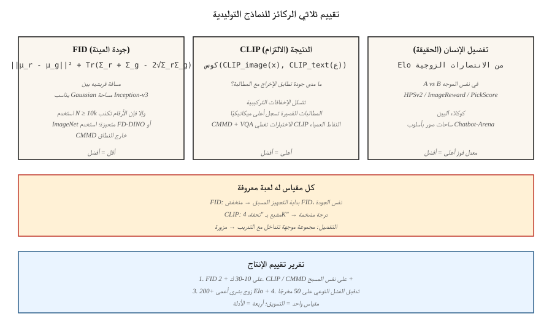

# Evaluation — FID, CLIP Score, Human Preference

> تستشهد كل لوحة صدارة للنموذج التوليدي بنتيجة FID وCLIP ومعدل الفوز من ساحة التفضيل البشري. كل رقم له وضع فشل يمكن للباحث المصمم أن يلعبه. إذا كنت لا تعرف أوضاع الفشل، فلا يمكنك معرفة التحسن الحقيقي من تشغيل اللعبة.

**النوع:** بناء
** اللغات: ** بايثون
**المتطلبات الأساسية:** المرحلة 8 · 01 (التصنيف)، المرحلة 2 · 04 (مقاييس التقييم)
**الوقت:** ~45 دقيقة

## The Problem

يتم الحكم على النموذج التوليدي بناءً على *جودة العينة* و*الالتزام بالتكييف*. ولا يوجد لدى أي منهما مقياس مغلق. يجب أن يعرض النموذج الخاص بك 10000 صورة؛ يجب أن يخصص لهم شيء ما أرقامًا؛ عليك أن تثق بالأرقام عبر العائلات النموذجية، عبر القرارات، عبر البنى. نجت ثلاثة مقاييس من التحدي 2014-2026:

- **FID (Fréchet Inception Distance).** مسافة بين توزيعين — حقيقيين ومولدين — في مساحة ميزات شبكة Inception. أقل هو أفضل.
- **CLIP النتيجة.** تشابه جيب التمام بين تضمين الصورة CLIP-صورة التي تم إنشاؤها وبين تضمين النص CLIP-المطالبة. الأعلى هو الأفضل. تدابير الالتزام الفوري.
- **التفضيل البشري.** ضع نموذجين وجهاً لوجه على نفس الموجه، واطلب من البشر (أو نموذج GPT-4 فئة) اختيار النموذج الأفضل، وإجمالي نقاط Elo.

سترى أيضًا: IS (درجة البداية، متقاعد إلى حد كبير)، KID، CMMD، ImageReward، PickScore، HPSv2، MJHQ-30k. كل واحد يصحح فشل واحد من السابق.

## The Concept



### FID — sample quality

هوسيل وآخرون. (2017). خطوات:

1. قم باستخراج ميزات Inception-v3 (2048-D) للصور الحقيقية N وN التي تم إنشاؤها.
2. قم باحتواء Gaussian على كل مجموعة: احسب المتوسط ​​`μ_r, μ_g` والتباين `Σ_r, Σ_g`.
3. FID = `||μ_r - μ_g||² + Tr(Σ_r + Σ_g - 2 · (Σ_r · Σ_g)^0.5)`.

التفسير: مسافة فريشيه بين اثنين من غاوسيين متعددي المتغيرات في الفضاء المميز. أقل = توزيعات أكثر مماثلة.

أوضاع الفشل:
- **متحيز على N صغير.** FID هو متوسط تربيع على توزيع المعالم - N الصغير يقلل من تقديرات التغاير المشترك، ويعطي منخفضًا بشكل خاطئ FID. استخدم دائمًا N ≥ 10,000.
- **يعتمد على البداية.** تم تدريب Inception-v3 على ImageNet. المجالات البعيدة عن ImageNet (الوجوه والفن والصور النصية) تنتج FID لا معنى لها. استخدم مستخرج الميزات الخاص بالمجال.
- **الألعاب.** التجهيز الزائد للبداية السابقة يعطي انخفاضًا بمقدار FID دون تحسين جودة الرؤية. اضربها بـ CMMD (أدناه).

### CLIP score — prompt adherence

رادفورد وآخرون. (2021). للحصول على صورة تم إنشاؤها + موجه:

```
clip_score = cos_sim( CLIP_image(x_gen), CLIP_text(prompt) )
```

المتوسط ​​عبر 30 ألف صورة تم إنشاؤها ← عددية قابلة للمقارنة بين النماذج.

أوضاع الفشل:
- **النقاط العمياء الخاصة بـ CLIP.** CLIP لديه تفكير تركيبي ضعيف ("مكعب أحمر على كرة زرقاء" غالبًا ما يفشل). يمكن للنماذج أن تحصل على تصنيف جيد على درجة CLIP دون اتباع المطالبات المعقدة حقًا.
- **تحيز الموجهات القصيرة.** تحتوي المطالبات القصيرة على عدد أكبر من تطابقات الصور CLIP في البرية. المطالبات الأطول لها درجات أقل CLIP ميكانيكيًا.
- **الألعاب السريعة.** بما في ذلك "جودة عالية، 4K، تحفة فنية" في المطالبة يؤدي إلى تضخيم CLIP النتيجة دون تحسين ربط الصورة بالنص.

CMMD (Jayasumana et al., 2024) يعمل على إصلاح بعض هذه الأمور: يستخدم ميزات CLIP بدلاً من Inception، والتناقض الأقصى للمتوسط ​​بدلاً من Fréchet. أفضل في اكتشاف الاختلافات الدقيقة في الجودة.

### Human preference — the ground truth

اختر مجموعة من المطالبات. أنشئ باستخدام النموذج A والنموذج B. أظهر الأزواج للبشر (أو القاضي القوي LLM). إجمالي الانتصارات في نتيجة Elo أو Bradley-Terry. المعايير:

- **PartiPrompts (Google)**: 1600 مطالبة متنوعة، 12 فئة.
- **HPSv2**: 107 ألف تعليق توضيحي بشري، يُستخدم على نطاق واسع كوكيل تلقائي.
- **ImageReward**: 137 ألف زوج من تفضيلات الصور السريعة، مرخصة MIT.
- **PickScore**: تم التدريب على تفضيلات Pick-a-Pic 2.6M.
- **ساحات الصور بأسلوب Chatbot-Arena**: https://imagearena.ai/ وغيرها.

أوضاع الفشل:
- **تباين القاضي.** لدى غير الخبراء تفضيلات مختلفة عن الخبراء. استخدم كليهما.
- **التوزيع الفوري.** المطالبات المنتقاة من الكرز تفضل عائلة واحدة. وثيقة دائما.
- **LLM- اختراق مكافأة القاضي.** GPT-4- ينخدع القاضي بمخرجات جميلة ولكنها خاطئة. التثليث مع الإنسان.

## Use together

يجب أن يتضمن تقرير تقييم الإنتاج ما يلي:

1. FID على 10-30 ألف عينة مقابل توزيع حقيقي (جودة العينة).
2. CLIP النتيجة / CMMD على نفس العينات مقابل مطالباتها (الالتزام).
3. معدل الفوز في الساحة العمياء مقارنة بالنموذج السابق (التفضيل العام).
4. تحليل وضع الفشل: 50 عينة عشوائية من المخرجات، تم وضع علامة عليها للمشكلات المعروفة (تشريح اليد، عرض النص، عدد الكائنات المتسق).

أي مقياس واحد هو كذبة. ثلاثة مقاييس مؤيدة + مراجعة نوعية هي مطالبة.

## Build It

`code/main.py` تنفذ تجميع FID وCLIP-score وElo على "ناقلات الميزات" الاصطناعية (نستخدم ناقلات رباعية الأبعاد كبديل لميزات Inception). هل ترى:

- FID حساب على N صغير وعلى N كبير - التحيز.
- "CLIP النتيجة" كتشابه جيب التمام بين مجموعات الميزات.
- قاعدة تحديث Elo من تيار التفضيلات الاصطناعية.

### Step 1: FID in four lines

```python
def fid(real_features, gen_features):
    mu_r, cov_r = mean_and_cov(real_features)
    mu_g, cov_g = mean_and_cov(gen_features)
    mean_diff = sum((a - b) ** 2 for a, b in zip(mu_r, mu_g))
    trace_term = trace(cov_r) + trace(cov_g) - 2 * sqrt_cov_product(cov_r, cov_g)
    return mean_diff + trace_term
```

### Step 2: CLIP-style cosine-similarity

```python
def clip_like(image_feat, text_feat):
    dot = sum(a * b for a, b in zip(image_feat, text_feat))
    norm = math.sqrt(dot_self(image_feat) * dot_self(text_feat))
    return dot / max(norm, 1e-8)
```

### Step 3: Elo aggregation

```python
def elo_update(r_a, r_b, winner, k=32):
    expected_a = 1 / (1 + 10 ** ((r_b - r_a) / 400))
    actual_a = 1.0 if winner == "a" else 0.0
    r_a_new = r_a + k * (actual_a - expected_a)
    r_b_new = r_b - k * (actual_a - expected_a)
    return r_a_new, r_b_new
```

## Pitfalls

- **FID عند N=1000.** الاستدلال غير موثوق به تحت N=10k. الأوراق التي تشير إلى انخفاض N FID هي ألعاب.
- **مقارنة FID عبر درجات الدقة.** يؤدي تغيير حجم Inception الذي يبلغ 299 × 299 إلى تغيير توزيع الميزات. قارن بالدقة المتطابقة فقط.
- **الإبلاغ عن بذرة واحدة.** تشغيل 3 بذور كحد أدنى. تقرير الأمراض المنقولة جنسيا.
- **CLIP يسجل التضخم عبر المطالبات السلبية.** تعمل بعض الخطوط pip على تعزيز CLIP عن طريق الإفراط في ملاءمة الموجه. التحقق من التشبع البصري.
- **تحيز Elo من التداخل الفوري.** إذا رأى كلا النموذجين معيارًا قياسيًا أثناء التدريب، فإن Elo لا معنى له. استخدم مجموعات المطالبة المعلقة.
- ** انحراف التقييم البشري المدفوع للحشد. ** غزير الإنتاج، ينحرف المفسرون في MTurk إلى الشباب / الصديق للتكنولوجيا. اختلط مع خبراء الفن/التصميم المعينين.

## Use It

بروتوكول تقييم الإنتاج في عام 2026:

| عمود | الحد الأدنى | موصى به |
|--------|---------|-------------|
| جودة العينة | FID على 10 كيلو مقابل حقيقي | + CMMD على 5K + FID على مجموعة فرعية لكل فئة |
| الالتزام الفوري | CLIP النتيجة على 30 ألف | + HPSv2 + ImageReward + إجابة الأسئلة بأسلوب VQA |
| التفضيل | 200 زوج أعمى مقابل خط الأساس | + 2000 إنسان مقترن + LLM- القاضي + ساحة الشات بوت |
| تحليل الفشل | 50 علامة يدوية | 500 علامة يدوية + مصنف أمان آلي |

الأركان الأربعة في تقرير واحد = المطالبة. أي واحد وحده = التسويق.

## Ship It

حفظ `outputs/skill-eval-report.md`. تأخذ المهارة نقطة تفتيش نموذجية جديدة + خط الأساس وتخرج خطة تقييم كاملة: أحجام العينات، والمقاييس، وتحقيقات وضع الفشل، ومعايير تسجيل الخروج.

## Exercises

1. **سهل.** تشغيل `code/main.py`. قارن FID عند N=100 مقابل N=1000 على نفس التوزيعات الاصطناعية. تقرير حجم التحيز.
2. **متوسط.** نفذ CMMD من ميزات النمط CLIP الاصطناعية (انظر Jayasumana et al., 2024 للاطلاع على الصيغة). قارن الحساسية مع اختلافات الجودة مقابل FID.
3. **صعب.** قم بتكرار إعداد HPSv2: خذ 1000 زوج من الصور السريعة من مجموعة فرعية من Pick-a-Pic، وقم بضبط مسجل صغير يعتمد على CLIP على التفضيلات، وقم بقياس توافقه مع مجموعة معلقة.

## Key Terms

| مصطلح | ماذا يقول الناس | ماذا يعني في الواقع |
|------|-|--------------------------------------|
| FID | "مسافة بداية فريشيه" | مسافة Fréchet الخاصة بـ Gaussian تناسب الميزات الحقيقية مقابل ميزات Inception. |
| CLIP النتيجة | "تشابه النص مع الصورة" | تشابه جيب التمام بين تضمين الصورة والنص CLIP. |
| CMMD | "استبدال FID" | CLIP- الميزة MMD; أقل انحيازًا، ولا يوجد افتراض غاوسي. |
| IS | "نتيجة البداية" | الخبرة KL(ص(y|x) || p(y)); يرتبط بشكل سيئ بالنماذج الحديثة، المتقاعد. |
| HPSv2 / ImageReward / PickScore | "وكلاء التفضيلات المستفادة" | نماذج صغيرة مدربة على التفضيلات البشرية؛ تستخدم كقضاة تلقائيين. |
| إيلو | "تصنيف الشطرنج" | تجميع برادلي-تيري للانتصارات الزوجية. |
| بارتيبرومبتس | "مجموعة المطالبة المعيارية" | 1600 مطالبة برعاية Google عبر 12 فئة. |
| FD - DINO | "استبدال الذات" | FD باستخدام ميزات DINOv2؛ أفضل للنطاقات خارج ImageNet. |

## Production note: evaluation is an inference workload too

تشغيل FID على 10 آلاف عينة يعني إنشاء 10 آلاف صورة. للحصول على قاعدة SDXL مكونة من 50 خطوة عند 1024² على L4 واحد، يكون هذا حوالي 11 ساعة من الاستدلال للطلب الفردي. ميزانيات التقييم حقيقية، والتأطير هو بالضبط سيناريو الاستدلال دون الاتصال بالإنترنت (زيادة الإنتاجية، تجاهل TTFT):

- **الدفعة الصعبة، ننسى زمن الوصول.** التقييم دون الاتصال بالإنترنت = التجميع الثابت بأكبر حجم يناسب الذاكرة. `pipee(...).images` مع `num_images_per_prompt=8` على 80 جيجابايت H100 تعمل على تشغيل ساعة حائط أسرع بمعدل 4-6× من الطلب الفردي.
- **التخزين المؤقت للميزات الحقيقية.** يتم تشغيل ميزة استخراج الميزات Inception (FID) أو CLIP (CLIP-score, CMMD) على المجموعة المرجعية الحقيقية *مرة واحدة*، ويتم تخزينها كـ `.npz`. لا إعادة حساب لكل eval.

بالنسبة إلى CI / بوابات الانحدار: قم بتشغيل FID + CLIP النتيجة على مجموعة فرعية مكونة من 500 عينة لكل PR (~ 30 دقيقة)؛ تشغيل كامل 10 كيلو FID + HPSv2 + Elo ليلاً.

## Further Reading

- [Heusel et al. (2017). GANs Trained by a Two Time-Scale Update Rule Converge to a Local Nash Equilibrium (FID)]( — https paper.
- [Jayasumana et al. (2024). إعادة التفكير FID: نحو مقياس تقييم أفضل لتوليد الصور (CMMD)](https://arxiv.org/abs/2401.09603) — CMMD.
- [Radford et al. (2021). Learning Transferable Visual Models from Natural Language Supervision (CLIP)]( — https.
- [Wu et al. (2023). HPSv2: درجة التفضيلات البشرية الشاملة](https://arxiv.org/abs/2306.09341) — HPSv2.
- [Xu et al. (2023). ImageReward: Learning and Evaluating Human Preferences for Text-to-Image Generation](https://arxiv.org/abs/2304.05977) — ImageReward.
- [Yu et al. (2023). قياس نماذج الانحدار التلقائي لإنشاء نص غني بالمحتوى إلى صورة (Parti + PartiPrompts)](https://arxiv.org/abs/2206.10789) — PartiPrompts.
- [شتاين وآخرون. (2023). الكشف عن عيوب مقاييس تقييم النموذج التوليدي](https://arxiv.org/abs/2306.04675) — مسح وضع الفشل.
