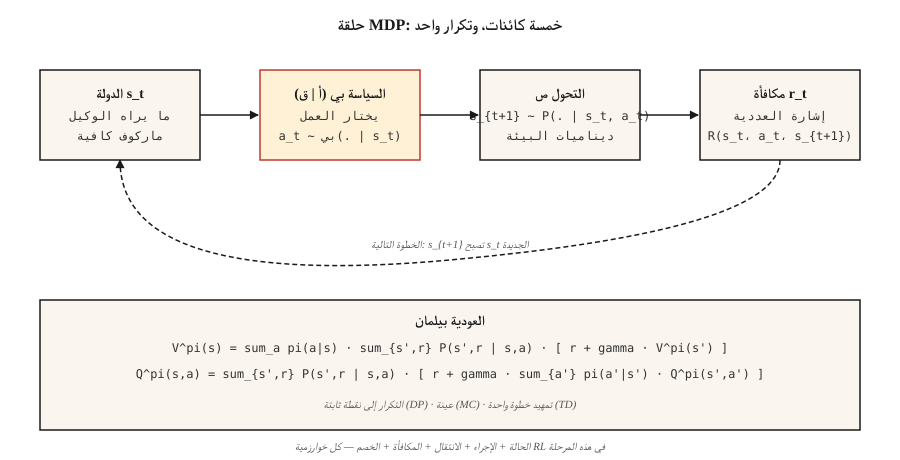

# MDPs, States, Actions & Rewards

> تتكون عملية اتخاذ القرار لدى ماركوف من خمسة أشياء: الحالات، والإجراءات، والانتقالات، والمكافآت، والخصم. كل شيء في RL — Q-learning، PPO، DPO، GRPO — يُحسن هذا الشكل. تعلمه مرة واحدة، واقرأ بقية التعلم المعزز مجانًا.

**النوع:** تعلم
** اللغات: ** بايثون
**المتطلبات الأساسية:** المرحلة 1 · 06 (الاحتمالات والتوزيعات)، المرحلة 2 · 01 (ML التصنيف)
**الوقت:** ~45 دقيقة

## The Problem

أنت تكتب روبوت الشطرنج. أو مخطط المخزون. أو وكيل تجاري. أو الحلقة PPO التي تدرب نموذجًا منطقيًا. أربعة مجالات مختلفة، وحقيقة واحدة مدهشة: جميعها تنهار في نفس الكائن الرياضي.

يمنحك التعلم الخاضع للإشراف `(x, y)` أزواجًا ويطلب منك ملاءمة وظيفة ما. لا يمنحك التعلم المعزز أي تصنيفات - فقط مجموعة من الحالات، والإجراءات التي اتخذتها، ومكافأة عددية. هل فازت هذه الخطوة باللعبة؟ هل أدى قرار إعادة التخزين إلى توفير المال؟ هل التجارة make ربح؟ هل أدى الرمز الذي تم إنتاجه LLM للتو إلى الحصول على مكافأة أعلى من القاضي؟

لا يمكنك التعلم من هذا الدفق حتى تقوم بإضفاء الطابع الرسمي عليه. "ما رأيته"، "ما فعلته"، "ما حدث بعد ذلك"، "كم كان ذلك جيدًا" - كل منها يجب أن يصبح شيئًا يمكنك التفكير فيه. هذا إضفاء الطابع الرسمي هو عملية قرار ماركوف. تعمل كل خوارزمية RL في هذه المرحلة، بما في ذلك الحلقات RLHF وGRPO في النهاية، على تحسين هذا الشكل.

## The Concept



**الأشياء الخمسة.**

- **الدول** `S`. كل ما يحتاج الوكيل إلى اتخاذ قرار. في GridWorld، الخلية. في الشطرنج، اللوحة. في LLM، نافذة السياق بالإضافة إلى أي ذاكرة.
- **الإجراءات** `A`. الاختيارات. تحرك لأعلى / لأسفل / لليسار / لليمين. تلعب هذه الخطوة. انبعاث رمز مميز.
- **الانتقالات** `P(s' | s, a)`. بالنظر إلى الحالة `s` والإجراء `a`، التوزيع على الحالة التالية. حتمية في لعبة الشطرنج، عشوائية في المخزون، شبه حتمية في فك التشفير LLM.
- **المكافآت** `R(s, a, s')`. الإشارة العددية. الفوز = +1، الخسارة = -1. الإيرادات ناقص التكلفة. مصطلح نسبة احتمال السجل في GRPO.
- **الخصم** `γ ∈ [0, 1)`. ما مقدار المكافأة المستقبلية مقابل الحاضر؟ `γ = 0.99` يشتري أفقًا من 100 خطوة تقريبًا؛ `γ = 0.9` يشتري ~10.

**خاصية ماركوف** `P(s_{t+1} | s_t, a_t) = P(s_{t+1} | s_0, a_0, …, s_t, a_t)`. المستقبل يعتمد فقط على الوضع الحالي. إذا لم يحدث ذلك، فإن تمثيل الدولة يكون غير مكتمل، وليس فشلاً للأسلوب، بل فشلاً للدولة.

**السياسات والإرجاعات.** تقوم السياسة `π(a | s)` بتعيين الحالات لتوزيعات الإجراء. العائد `G_t = r_t + γ r_{t+1} + γ² r_{t+2} + …` هو المبلغ المخصوم للمكافآت المستقبلية. القيمة `V^π(s) = E[G_t | s_t = s]` هي العائد المتوقع بدءًا من `s` بموجب السياسة `π`. قيمة Q `Q^π(s, a) = E[G_t | s_t = s, a_t = a]` هي العائد المتوقع بدءًا من إجراء محدد. تقوم كل خوارزمية RL بتقدير أحد هذين الاثنين، ثم تقوم بتحسين `π` وفقًا لذلك.

**معادلات بيلمان** معادلات النقطة الثابتة التي يستخدمها كل شيء في هذه المرحلة:

`V^π(s) = Σ_a π(a|s) Σ_{s', r} P(s', r | s, a) [r + γ V^π(s')]`
`Q^π(s, a) = Σ_{s', r} P(s', r | s, a) [r + γ Σ_{a'} π(a'|s') Q^π(s', a')]`

العائد المتوقع لهذه التقسيمات هو "مكافأة هذه الخطوة" بالإضافة إلى "القيمة المخفضة للمكان الذي ستصل إليه". عودي. كل خوارزمية في المرحلة 9 إما تكرر هذه المعادلة للتقارب (البرمجة الديناميكية)، أو عينات منها (مونت كارلو)، أو تمهيدها خطوة واحدة (الفرق الزمني).

## Build It

### Step 1: a tiny deterministic MDP

عالم الشبكة 4 × 4. يبدأ الوكيل من أعلى اليسار، والمحطة الطرفية في أسفل اليمين، ومكافأة -1 لكل خطوة، والإجراءات `{up, down, left, right}`. انظر `code/main.py`.

```python
GRID = 4
TERMINAL = (3, 3)
ACTIONS = {"up": (-1, 0), "down": (1, 0), "left": (0, -1), "right": (0, 1)}

def step(state, action):
    if state == TERMINAL:
        return state, 0.0, True
    dr, dc = ACTIONS[action]
    r, c = state
    nr = min(max(r + dr, 0), GRID - 1)
    nc = min(max(c + dc, 0), GRID - 1)
    return (nr, nc), -1.0, (nr, nc) == TERMINAL
```

خمسة أسطر. هذه هي البيئة بأكملها. التحولات الحتمية، عقوبة الخطوة الثابتة، استيعاب الحالة النهائية.

### Step 2: roll out a policy

السياسة هي وظيفة من توزيع الحالة إلى الإجراء. أبسطها: عشوائي موحد.

```python
def uniform_policy(state):
    return {a: 0.25 for a in ACTIONS}

def rollout(policy, max_steps=200):
    s, total, steps = (0, 0), 0.0, 0
    for _ in range(max_steps):
        a = sample(policy(s))
        s, r, done = step(s, a)
        total += r
        steps += 1
        if done:
            break
    return total, steps
```

قم بتشغيل السياسة العشوائية 1000 مرة. متوسط ​​العائد هو حوالي -60 إلى -80 للوحة 4×4 هذه. العائد الأمثل هو -6 (مسار الخط المستقيم إلى الأسفل واليمين). سد هذه الفجوة هو كل شيء في المرحلة التاسعة.

### Step 3: compute `V^π` exactly via the Bellman equation

بالنسبة لـ MDPs الصغيرة، تكون معادلة بيلمان نظامًا خطيًا. قم بتعداد الحالات، وتطبيق التوقع، والتكرار حتى تتوقف القيم عن التغيير.

```python
def policy_evaluation(policy, gamma=0.99, tol=1e-6):
    V = {s: 0.0 for s in all_states()}
    while True:
        delta = 0.0
        for s in all_states():
            if s == TERMINAL:
                continue
            v = 0.0
            for a, pi_a in policy(s).items():
                s_next, r, _ = step(s, a)
                v += pi_a * (r + gamma * V[s_next])
            delta = max(delta, abs(v - V[s]))
            V[s] = v
        if delta < tol:
            return V
```

هذا هو تقييم السياسة التكرارية. إنها الخوارزمية الأولى في Sutton & Barto والأساس النظري لكل طريقة RL تتبعها.

### Step 4: `γ` is a hyperparameter with physical meaning

الأفق الفعال هو تقريبًا `1 / (1 - γ)`. `γ = 0.9` → 10 خطوات. `γ = 0.99` → 100 خطوة. `γ = 0.999` → 1000 خطوة.

منخفض جدًا ويتصرف الوكيل بقصر النظر. إن نسبة الدرجات المرتفعة جدًا تصبح أمرًا صاخبًا، لأن العديد من الخطوات المبكرة تتقاسم المسؤولية عن المكافأة في المستقبل البعيد. LLM RLHF يستخدم عادة `γ = 1` لأن الحلقات قصيرة ومحدودة. تستخدم مهام التحكم `0.95–0.99`. تستخدم الألعاب الإستراتيجية ذات الأفق الطويل `0.999`.

## Pitfalls

- **الحالة غير الماركوفية.** إذا كنت بحاجة إلى الملاحظات الثلاث الأخيرة لاتخاذ القرار، فإن "الحالة" ليست مجرد الملاحظة الحالية. الإصلاح: إطارات المكدس (DQN على مكدسات Atari 4) أو استخدام حالة متكررة (LSTM/GRU عبر الملاحظات).
- **مكافآت متفرقة.** مكافآت الفوز فقط make التعلم يكاد يكون مستحيلًا في مساحات الدولة الكبيرة. شكل المكافآت (إشارة متوسطة) أو التمهيد مع التقليد (المرحلة 9 · 09).
- **اختراق المكافآت.** غالبًا ما يؤدي تحسين مكافأة الوكيل إلى سلوكيات مرضية. يدور وكيل سباق القوارب الخاص بـ OpenAI في دوائر ويجمع وحدات الطاقة إلى الأبد بدلاً من إنهاء السباق. حدد دائمًا المكافأة من النتيجة المستهدفة، وليس الوكيل.
- **خصم على المواصفات الخاطئة.** `γ = 1` في مهمة ذات أفق لا نهائي make لكل قيمة لا نهائية. حدد دائمًا إما بأفق محدود أو `γ < 1`.
- **مقياس المكافآت.** المكافآت التي تبلغ {+100، -100} مقابل {+1، -1} تعطي سياسات مثالية متطابقة ولكن تختلف أحجام التدرج بشكل كبير. قم بالتطبيع إلى `[-1, 1]`-ish قبل توصيله بـ PPO/DQN.

## Use It

مكدس 2026 يقلل كل RL pipخط إلى MDP قبل لمس الرمز:

| الوضع | الدولة | العمل | مكافأة | γ |
|-----------|-------|-------|--------|---|
| التحكم (الحركة، التلاعب) | الزوايا المشتركة + السرعات | عزم الدوران المستمر | مهمة محددة على شكل | 0.99 |
| ألعاب (شطرنج، جو، بوكر) | مجلس + تاريخ | خطوة قانونية | فوز=+1 / خسارة=-1 | 1.0 (محدود) |
| المخزون / التسعير | المخزون + الطلب | طلب الكمية | الإيرادات - التكلفة | 0.95 |
| RLHF لـ LLMs | رموز السياق | الرمز التالي | نتيجة نموذج المكافأة في النهاية | 1.0 (الحلقة ~ 200 رمز) |
| GRPO للاستدلال | استجابة سريعة + جزئية | الرمز التالي | التحقق 0/1 في النهاية | 1.0 |

اكتب الصفوف الخمسة قبل كتابة أي حلقة تدريبية. تعود معظم تقارير الأخطاء "RL لا تعمل" إلى صيغة MDP التي تم كسرها على الورق.

## Ship It

حفظ باسم `outputs/skill-mdp-modeler.md`:

```markdown
---
name: mdp-modeler
description: Given a task description, produce a Markov Decision Process spec and flag formulation risks before training.
version: 1.0.0
phase: 9
lesson: 1
tags: [rl, mdp, modeling]
---

Given a task (control / game / recommendation / LLM fine-tuning), output:

1. State. Exact feature vector or tensor spec. Justify Markov property.
2. Action. Discrete set or continuous range. Dimensionality.
3. Transition. Deterministic, stochastic-with-known-model, or sample-only.
4. Reward. Function and source. Sparse vs shaped. Terminal vs per-step.
5. Discount. Value and horizon justification.

Refuse to ship any MDP where the state is non-Markovian without explicit mention of frame-stacking or recurrent state. Refuse any reward that was not defined in terms of the target outcome. Flag any `γ ≥ 1.0` on an infinite-horizon task. Flag any reward range >100x the typical step reward as a likely gradient-explosion source.
```

## Exercises

1. **سهل.** تنفيذ 4×4 GridWorld وطرح السياسة العشوائية في `code/main.py`. تشغيل 10.000 حلقة. تقرير يعني وstd من العودة. قارن بالعائد الأمثل (-6).
2. **متوسط.** قم بتشغيل `policy_evaluation` مع `γ ∈ {0.5, 0.9, 0.99}` للسياسة العشوائية الموحدة. اطبع `V` كشبكة 4×4 لكل منها. اشرح لماذا تنمو قيم الحالة بالقرب من المحطة بشكل أسرع مع زيادة `γ`.
3. **صعب.** قم بتدوير مؤشر GridWorld العشوائي: ينزلق كل إجراء إلى اتجاه مجاور مع احتمال `p = 0.1`. إعادة تقييم السياسة الموحدة. هل أصبح `V[start]` أفضل أم أسوأ؟ لماذا؟

## Key Terms

| مصطلح | ماذا يقول الناس | ماذا يعني في الواقع |
|------|-|--------------------------------------|
| MDP | "إعداد التعلم المعزز" | Tuple `(S, A, P, R, γ)` تلبي خاصية ماركوف. |
| الدولة | "ما يرى الوكيل" | إحصائية كافية للديناميكيات المستقبلية في ظل فئة السياسة المختارة. |
| سياسة | "سلوك الوكيل" | التوزيع الشرطي `π(a | s)` أو الخريطة الحتمية `s → a`. |
| العودة | "إجمالي الأجر" | المبلغ المخصوم `Σ γ^t r_t` من الخطوة الحالية. |
| القيمة | "ما أحسن الدولة" | العائد المتوقع تحت `π` يبدأ من `s`. |
| قيمة Q | ""ما أحسن العمل"" | العائد المتوقع تحت `π` يبدأ من `s` مع الإجراء الأول `a`. |
| معادلة بيلمان | "العودة البرمجة الديناميكية" | تحليل النقطة الثابتة للقيمة / Q إلى مكافأة من خطوة واحدة بالإضافة إلى قيمة لاحقة مخفضة. |
| الخصم `γ` | "المستقبل مقابل الحاضر" | الوزن الهندسي على مكافأة المستقبل البعيد؛ الأفق الفعال `~1/(1-γ)`. |

## Further Reading

- [Sutton & Barto (2018). Reinforcement Learning: An Introduction, 2nd ed.](http://incompleteideas.net/book/RLbook2020.pdf) — the textbook. Ch. 3 covers MDPs and Bellman equations; Ch. 1 motivates the reward hypothesis that underlies every subsequent lesson.
- [Bellman (1957). البرمجة الديناميكية](https://press.princeton.edu/books/paperback/9780691146683/dynamic-programming) — أصل معادلة بيلمان.
- [OpenAI Spinning Up — Part 1: Key Concepts](https://spinningup.openai.com/en/latest/spinningup/rl_intro.html) — concise MDP primer from a deep-RL angle.
- [Puterman (2005). عمليات اتخاذ القرار ماركوف](https://onlinelibrary.wiley.com/doi/book/10.1002/9780470316887) — مرجع أبحاث العمليات حول MDPs وطرق الحل الدقيق.
- [ ليتمان (1996). خوارزميات اتخاذ القرار المتسلسل (أطروحة الدكتوراه)](https://www.cs.rutgers.edu/~mlittman/papers/thesis-main.pdf) — أنظف اشتقاق لـ MDPs كتخصص في البرمجة الديناميكية.
