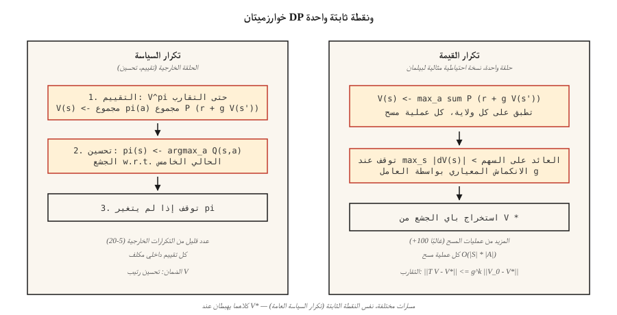

# Dynamic Programming — Policy Iteration & Value Iteration

> البرمجة الديناميكية هي RL مع الغش. أنت تعرف بالفعل وظائف الانتقال والمكافأة؛ ما عليك سوى تكرار معادلة بيلمان حتى يتوقف `V` أو `π` عن الحركة. إنه المعيار الذي تحاول كل طريقة تعتمد على أخذ العينات الاقتراب منه.

**النوع:** بناء
** اللغات: ** بايثون
** المتطلبات الأساسية: ** المرحلة 9 · 01 (MDPs)
**الوقت:** ~75 دقيقة

## The Problem

لديك MDP بنموذج معروف: يمكنك الاستعلام عن `P(s' | s, a)` و `R(s, a, s')` لأي زوج من إجراءات الحالة. مدير المخزون يعرف توزيع الطلب. تحتوي لعبة اللوحة على تحولات حتمية. عالم الشبكة هو أربعة أسطر من بايثون. لديك *نموذج*.

تم اختراع RL (Q-learning، PPO، REINFORCE) بدون نموذج للحالة التي لا يكون لديك فيها نموذج - يمكنك فقط أخذ عينة من البيئة. ولكن عندما يكون لديك واحدة، هناك طرق أسرع وأفضل: البرمجة الديناميكية. صممها بيلمان في عام 1957. وما زالوا يحددون الصحة: ​​عندما يقول الناس "السياسة المثلى لهذا MDP"، فإنهم يقصدون أن السياسة DP ستعود.

أنت في حاجة إليها في عام 2026 لثلاثة أسباب. أولاً، يتم حل كل بيئة جدولية في بحث RL (GridWorld، FrozenLake، CliffWalking) باستخدام DP لإنتاج سياسة المعيار الذهبي. ثانيًا، تتيح لك القيم الدقيقة *تصحيح* أساليب أخذ العينات: إذا كان تقدير Q-learning لـ `V*(s_0)` لا يتوافق مع إجابة DP بنسبة 30%، فإن Q-learning الخاص بك به خطأ. ثالثًا، RL وأساليب التخطيط الحديثة غير المتصلة بالإنترنت (MCTS، بحث AlphaZero، المستند إلى النموذج RL في المرحلة 9 · 10) جميعها تكرر نسخة احتياطية من Bellman عبر نموذج تم تعلمه أو تقديمه.

## The Concept



**خوارزميتان، كلاهما تكرار بنقطة ثابتة على Bellman.**

**تكرار السياسة.** تبديل خطوتين حتى تتوقف السياسة عن التغيير.

1. *التقييم:* في ضوء السياسة `π`، قم بحساب `V^π` من خلال تطبيق `V(s) ← Σ_a π(a|s) Σ_{s',r} P(s',r|s,a) [r + γ V(s')]` بشكل متكرر حتى تتقارب.
2. *التحسين:* معطى `V^π`، make `π` الجشع w.r.t. `V^π`: `π(s) ← argmax_a Σ_{s',r} P(s',r|s,a) [r + γ V(s')]`.

يتم ضمان التقارب لأن (أ) كل خطوة تحسين إما أن تحافظ على `π` كما هي أو تزيد بشكل صارم `V^π` في بعض الحالات، (ب) مساحة السياسات الحتمية محدودة. يتقارب عادة في حوالي 5-20 تكرارًا خارجيًا حتى بالنسبة لمساحات الحالة الكبيرة.

**تكرار القيمة.** لتقليص التقييم والتحسين في عملية مسح واحدة. تطبيق معادلة بيلمان *المثالية*:

`V(s) ← max_a Σ_{s',r} P(s',r|s,a) [r + γ V(s')]`

كرر حتى `max_s |V_{new}(s) - V(s)| < ε`. استخرج السياسة في النهاية باتخاذ الإجراء الجشع. أسرع تمامًا لكل تكرار - لا توجد حلقة تقييم داخلية - ولكن عادةً ما يحتاج إلى المزيد من التكرارات للتقارب.

** تكرار السياسة العامة (GPI).** الإطار الموحد. وظيفة القيمة والسياسة مقيدة في حلقة تحسين ثنائية الاتجاه؛ أي طريقة تدفع كلاهما نحو الاتساق المتبادل (تكرار القيمة غير المتزامنة، تكرار السياسة المعدلة، التعلم Q، الناقد الممثل، PPO) هي مثال على GPI.

**لماذا `γ < 1` مهم.** عامل تشغيل Bellman هو `γ`-انكماش في القاعدة الإضافية: `||T V - T V'||_∞ ≤ γ ||V - V'||_∞`. يشير الانكماش إلى نقطة ثابتة فريدة وتقارب هندسي. أسقط `γ < 1` وستفقد الضمان — فأنت بحاجة إلى أفق محدود أو حالة طرفية استيعابية.

## Build It

### Step 1: build the GridWorld MDP model

استخدم نفس 4×4 GridWorld من الدرس 01. أضفنا متغيرًا عشوائيًا: مع الاحتمال `0.1` ينزلق العامل إلى اتجاه عمودي عشوائي.

```python
SLIP = 0.1

def transitions(state, action):
    if state == TERMINAL:
        return [(state, 0.0, 1.0)]
    outcomes = []
    for direction, prob in action_probs(action):
        outcomes.append((apply_move(state, direction), -1.0, prob))
    return outcomes
```

`transitions(s, a)` تقوم بإرجاع قائمة `(s', r, p)`. هذا هو النموذج بأكمله.

### Step 2: policy evaluation

بالنظر إلى السياسة `π(s) = {action: prob}`، كرر معادلة بيلمان حتى يتوقف `V` عن الحركة:

```python
def policy_evaluation(policy, gamma=0.99, tol=1e-6):
    V = {s: 0.0 for s in states()}
    while True:
        delta = 0.0
        for s in states():
            v = sum(pi_a * sum(p * (r + gamma * V[s_prime])
                              for s_prime, r, p in transitions(s, a))
                   for a, pi_a in policy(s).items())
            delta = max(delta, abs(v - V[s]))
            V[s] = v
        if delta < tol:
            return V
```

### Step 3: policy improvement

استبدل `π` بالسياسة الجشعة w.r.t. `V`. إذا لم يتغير `π`، ارجع — نحن في الوضع الأمثل.

```python
def policy_improvement(V, gamma=0.99):
    new_policy = {}
    for s in states():
        best_a = max(
            ACTIONS,
            key=lambda a: sum(p * (r + gamma * V[s_prime])
                              for s_prime, r, p in transitions(s, a)),
        )
        new_policy[s] = best_a
    return new_policy
```

### Step 4: stitch them together

```python
def policy_iteration(gamma=0.99):
    policy = {s: "up" for s in states()}   # arbitrary start
    for _ in range(100):
        V = policy_evaluation(lambda s: {policy[s]: 1.0}, gamma)
        new_policy = policy_improvement(V, gamma)
        if new_policy == policy:
            return V, policy
        policy = new_policy
```

التقارب النموذجي على 4 × 4: 4-6 التكرارات الخارجية. المخرجات `V*(0,0) ≈ -6` وسياسة تقلل بشكل صارم عدد الخطوات.

### Step 5: value iteration (the one-loop version)

```python
def value_iteration(gamma=0.99, tol=1e-6):
    V = {s: 0.0 for s in states()}
    while True:
        delta = 0.0
        for s in states():
            v = max(sum(p * (r + gamma * V[s_prime])
                       for s_prime, r, p in transitions(s, a))
                   for a in ACTIONS)
            delta = max(delta, abs(v - V[s]))
            V[s] = v
        if delta < tol:
            break
    policy = policy_improvement(V, gamma)
    return V, policy
```

نفس النقطة الثابتة، وعدد أقل من أسطر التعليمات البرمجية.

## Pitfalls

- **نسيان التعامل مع المحطات الطرفية.** إذا قمت بتطبيق Bellman على حالة الامتصاص، فإنه لا يزال يلتقط "أفضل إجراء" لا يغير شيئًا. الحرس مع `if s == terminal: V[s] = 0`.
- **التقارب المعياري مقابل التقارب L2.** استخدم `max |V_new - V|`، وليس المتوسط. الضمان النظري هو على القاعدة العليا.
- **التحديثات الموضعية مقابل التحديثات المتزامنة.** يتقارب التحديث `V[s]` الموضعي (Gauss-Seidel) بشكل أسرع من الإملاء `V_new` المنفصل (جاكوبي). يستخدم رمز الإنتاج في المكان.
- **روابط السياسة.** إذا كان هناك إجراءان لهما قيمة Q متساوية، فقد يؤدي `argmax` إلى قطع الروابط بشكل مختلف في كل تكرار، مما يتسبب في تأرجح التحقق من "استقرار السياسة". استخدم شوطًا فاصلًا ثابتًا (الإجراء الأول بترتيب ثابت).
- **انفجار مساحة الدولة.** DP هو `O(|S| · |A|)` لكل عملية مسح. يعمل حتى 10⁷ حالات. أبعد من ذلك، تحتاج إلى تقريب الوظيفة (المرحلة 9 · 05 وما بعدها).

## Use It

في عام 2026، DP هو خط الأساس الصحيح والحلقة الداخلية للمخططين:

| حالة الاستخدام | الطريقة |
|----------|--------|
| حل جدول صغير MDP بالضبط | تكرار القيمة (أبسط) أو تكرار السياسة (خطوات خارجية أقل) |
| التحقق من تنفيذ Q-learning / PPO | قارن بـ DP-V الأمثل* في بيئة الألعاب |
| المبني على النموذج RL (المرحلة 9 · 10) | نسخة احتياطية من بيلمان على نموذج انتقالي مكتسب |
| التخطيط في AlphaZero / MuZero | بحث شجرة مونت كارلو = نسخة احتياطية غير متزامنة لـ Bellman |
| غير متصل RL (CQL, IQL) | تكرار Q المحافظ — DP مع عقوبة على إجراءات OOD |

في كل مرة يقول شخص ما "وظيفة القيمة المثلى"، فهو يقصد "النقطة الثابتة DP". عندما ترى `V*` أو `Q*` في ورقة، تصور هذه الحلقة.

## Ship It

حفظ باسم `outputs/skill-dp-solver.md`:

```markdown
---
name: dp-solver
description: Solve a small tabular MDP exactly via policy iteration or value iteration. Report convergence behavior.
version: 1.0.0
phase: 9
lesson: 2
tags: [rl, dynamic-programming, bellman]
---

Given an MDP with a known model, output:

1. Choice. Policy iteration vs value iteration. Reason tied to |S|, |A|, γ.
2. Initialization. V_0, starting policy. Convergence sensitivity.
3. Stopping. Sup-norm tolerance ε. Expected number of sweeps.
4. Verification. V*(s_0) computed exactly. Greedy policy extracted.
5. Use. How this baseline will be used to debug/evaluate sampling-based methods.

Refuse to run DP on state spaces > 10⁷. Refuse to claim convergence without a sup-norm check. Flag any γ ≥ 1 on an infinite-horizon task as a guarantee violation.
```

## Exercises

1. **سهل.** قم بتشغيل تكرار القيمة على 4×4 GridWorld باستخدام `γ ∈ {0.9, 0.99}`. كم عدد عمليات المسح حتى `max |ΔV| < 1e-6`؟ اطبع `V*` كشبكة 4×4.
2. **متوسط.** قارن بين تكرار السياسة وتكرار القيمة على GridWorld *التصادفي* (احتمال الانزلاق `0.1`). العد: عمليات المسح، وقت ساعة الحائط، النهائي `V*(0,0)`. أيهما يتقارب بشكل أسرع في التكرارات؟ في ساعة الحائط؟
3. **صعب.** إنشاء تكرار السياسة المعدلة: في خطوة التقييم، قم بتشغيل عمليات المسح `k` فقط بدلاً من التقارب. مؤامرة `V*(0,0)` خطأ مقابل `k` لـ `k ∈ {1, 2, 5, 10, 50}`. ماذا يخبرك المنحنى عن مقايضة التقييم/التحسين؟

## Key Terms

| مصطلح | ماذا يقول الناس | ماذا يعني في الواقع |
|------|-|--------------------------------------|
| تكرار السياسة | "خوارزمية DP" | التقييم المتناوب (`V^π`) والتحسين (الجشع `π` w.r.t. `V^π`) حتى تتوقف السياسة عن التغيير. |
| تكرار القيمة | "أسرع DP" | تم تطبيق النسخة الاحتياطية المثالية لـBelman في عملية مسح واحدة؛ يتقارب إلى `V*` هندسيا. |
| مشغل بيلمان | "العودة" | `(T V)(s) = max_a Σ P (r + γ V(s'))`; `γ`-انكماش في القاعدة. |
| الانكماش | "لماذا DP يتقارب" | أي عامل `T` مع `||T x - T y|| ≤ γ ||x - y||` لديه نقطة ثابتة فريدة. |
| GPI | "كل شيء DP" | تكرار السياسة العامة: أي طريقة تقود `V` و `π` إلى الاتساق المتبادل. |
| تحديث متزامن | "على طريقة اليعقوبي" | استخدم `V` القديم طوال عملية المسح؛ قابلة للتحليل بشكل نظيف ولكن أبطأ. |
| التحديث الموضعي | "أسلوب غاوس سايدل" | استخدم `V` أثناء تحديثه؛ يتقارب بشكل أسرع في الممارسة العملية. |

## Further Reading

- [Sutton & Barto (2018). Ch. 4 — Dynamic Programming](http://incompleteideas.net/book/RLbook2020.pdf) — the canonical presentation of policy iteration and value iteration.
- [Bertsekas (2019). التعلم المعزز والتحكم الأمثل](http://www.athenasc.com/rlbook.html) — معالجة صارمة لحجج رسم خرائط الانكماش.
- [Puterman (2005). Markov Decision Processes](https://onlinelibrary.wiley.com/doi/book/10.1002/9780470316887) — modified policy iteration and its convergence analysis.
- [Howard (1960). البرمجة الديناميكية وعمليات ماركوف](https://mitpress.mit.edu/9780262582300/dynamic-programming-and-markov-processes/) — ورقة تكرار السياسة الأصلية.
- [بيرتسيكاس وتسيتسيكليس (1996). البرمجة الديناميكية العصبية](http://www.athenasc.com/ndpbook.html) — الجسر من DP إلى التقريبي-DP / العميق RL يستخدم في كل درس لاحق.
